---
lab:
  title: Preparación de datos en Power BI Desktop
  module: Module 2 - Get Data in Power BI
ms.openlocfilehash: c44eb33136e3d429a44f6e091897388f4eed4135
ms.sourcegitcommit: 6853b027da7f5e739951c3eef54f4cd458854c66
ms.translationtype: HT
ms.contentlocale: es-ES
ms.lasthandoff: 06/12/2022
ms.locfileid: "146274818"
---
# **Preparación de datos en Power BI Desktop**

**El tiempo estimado para completar el laboratorio es de 45 minutos.**

En este laboratorio, empezará a desarrollar una solución de Power BI Desktop para la empresa Adventure Works. A lo largo del proceso, conectará con datos de origen, obtendrá una vista previa de los datos y usará técnicas de vista previa de datos para comprender las características y la calidad de los datos de origen.

En este laboratorio, aprenderá a:

- Abrir Power BI Desktop

- Establecer las opciones de Power BI Desktop

- Conectar con datos de origen

- Obtener una vista previa de los datos de origen

- Usar técnicas de vista previa de datos para entender mejor los datos

### **Caso de laboratorio**

Este laboratorio es una de las muchas series de laboratorios que se diseñaron como una historia completa sobre la preparación de datos para publicarlos como informes y paneles. Puede completar los laboratorios en cualquier orden. Sin embargo, si piensa trabajar en varios de ellos, para los diez primeros le recomendamos que siga el orden siguiente:

1. **Preparación de datos en Power BI Desktop**

2. Carga de datos en Power BI Desktop

3. Modelado de datos en Power BI Desktop

5. Creación de cálculos DAX en Power BI Desktop, parte 1

6. Creación de cálculos DAX en Power BI Desktop, parte 2

7. Diseño de un informe en Power BI Desktop, parte 1

8. Diseño de un informe en Power BI Desktop, parte 2

9. Creación de un panel de Power BI

10. Análisis de datos en Power BI Desktop

11. Aplicación de seguridad de nivel de fila

## **Ejercicio 1: Preparación de los datos**

En este ejercicio, creará ocho consultas de Power BI Desktop. Seis de ellas obtendrán datos de SQL Server y dos, de archivos CSV.

### **Tarea 1: Guardado del archivo de Power BI Desktop**

En esta tarea, primero guardará el archivo de Power BI Desktop.

1. Para abrir Power BI Desktop, en la barra de tareas, haga clic en el acceso directo de Microsoft Power BI Desktop.

    

1. Para cerrar la ventana de introducción, en la parte superior izquierda de la ventana, haga clic en la **X**.

    

1. Para guardar el archivo, haga clic en la ficha de cinta **Archivo** a fin de abrir la vista Backstage.

1. Seleccione **Guardar**.

    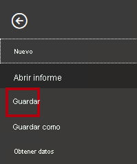

1. En la ventana **Guardar como**, vaya a la carpeta **D:\PL300\MySolution**.

1. En el cuadro **Nombre de archivo**, escriba **Sales Analysis** (Análisis de ventas).

    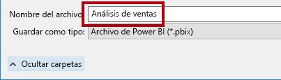

1. Haga clic en **Guardar**.

    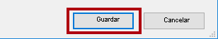

    Sugerencia: Para guardar el archivo, también puede hacer clic en el icono **Guardar** situado en la parte superior izquierda.

    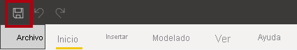

### **Tarea 2: Establecimiento de las opciones de Power BI Desktop**

En esta tarea, establecerá las opciones de Power BI Desktop.

1. En Power BI Desktop, haga clic en la ficha de cinta **Archivo** para abrir la vista Backstage.

1. A la izquierda, elija **Opciones y configuración** y seleccione **Opciones**.

    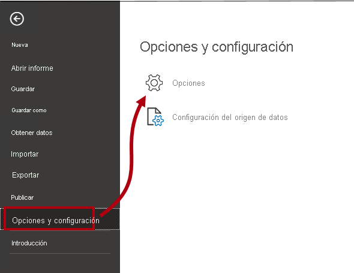

1. En la ventana **Opciones**, a la izquierda, en el grupo **Archivo actual**, seleccione **Carga de datos**.

    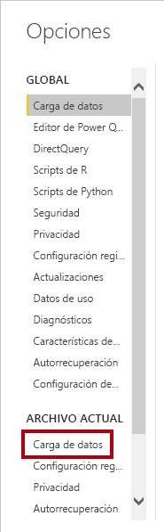

    La configuración de **Carga de datos** para el archivo actual permite una serie de opciones que determinan los comportamientos predeterminados del modelado.

1. En el grupo **Relaciones**, desactive las dos opciones que están activadas.

    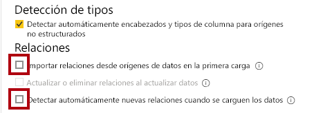

    Aunque tener estas dos opciones habilitadas puede resultar útil a la hora de desarrollar un modelo de datos, las ha deshabilitado anteriormente para admitir la experiencia de laboratorio. Al crear relaciones en el laboratorio **Carga de datos en Power BI Desktop**, descubrirá por qué va a agregar cada uno de ellos.

1. Haga clic en **Aceptar**.

    

1. Guarde el archivo de Power BI Desktop.

### **Tarea 3: Obtención de datos de SQL Server**

En esta tarea, creará consultas basadas en tablas de SQL Server.

1. En la ficha de cinta **Inicio**, en el grupo **Datos**, haga clic en **SQL Server**.

    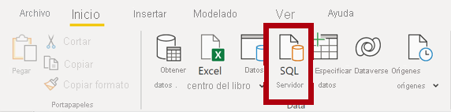

2. En la ventana **Base de datos de SQL Server**, en el cuadro **Servidor**, escriba **localhost**.

    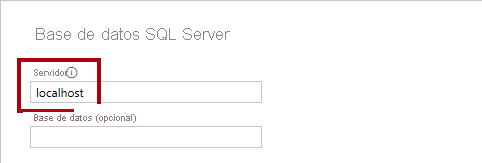

    En este laboratorio, se conectará a la base de datos de SQL Server mediante **localhost**. Esto no es una práctica recomendada cuando cree sus propias soluciones. simplemente se debe a que los orígenes de datos de la puerta de enlace no pueden resolver **localhost**.

3. Haga clic en **Aceptar**.

    

4. Si se le solicitan las credenciales, en la ventana **Base de datos de SQL Server**, seleccione **Usar mis credenciales actuales**. A continuación, **conéctese**.

4. En la ventana **Navegador**, a la izquierda, expanda la base de datos **AdventureWorksDW2020**.

    La base de datos **AdventureWorksDW2020** está basada en la base de datos de ejemplo **AdventureWorksDW2017**. Se ha modificado para admitir los objetivos de aprendizaje de los laboratorios del curso.

    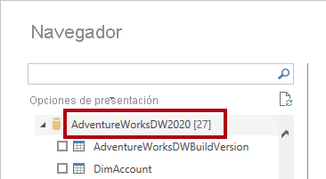

5. Seleccione la tabla **DimEmployee**, pero no active su casilla.

    

6. En el panel de la derecha, fíjese en que hay una vista previa de los datos de la tabla.

    Los datos de la vista previa permiten determinar las columnas y un ejemplo de filas.

7. Para crear consultas, active la casilla situada junto a las seis tablas siguientes:

    - DimEmployee

    - DimEmployeeSalesTerritory

    - DimProduct

    - DimReseller

    - DimSalesTerritory

    - FactResellerSales

8. Para aplicar transformaciones a los datos de las tablas seleccionadas, haga clic en **Transformar datos**.

    En este laboratorio, no transformará los datos. Los objetivos de este laboratorio se centran en explorar y generar perfiles de los datos en la ventana **Editor de Power Query**.

    

### **Tarea 4: Vista previa de las consultas de SQL Server**

En esta tarea, obtendrá una vista previa de los datos de las consultas de SQL Server. En primer lugar, descubrirá información importante sobre los datos. Además, usará herramientas de calidad, distribución y perfil de las columnas para entender los datos y evaluar su calidad.

1. En la ventana del **Editor de Power Query**, a la izquierda, observe el panel **Consultas**.

    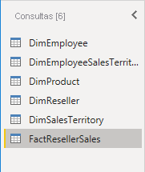

    El panel **Consultas** contiene una consulta para cada tabla seleccionada.

2. Seleccione la primera consulta **DimEmployee**.

    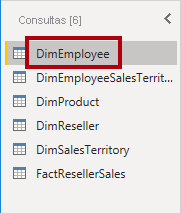

    La tabla **DimEmployee** de la base de datos de SQL Server almacena una fila por cada empleado. Un subconjunto de las filas de esta tabla representa a los vendedores, que será pertinente para el modelo que va a desarrollar.

3. En la barra de estado de la parte inferior izquierda, observe las estadísticas de la tabla: 33 columnas y 296 filas.

    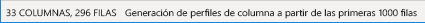

4. En el panel de vista previa de los datos, desplácese horizontalmente para revisar todas las columnas.

5. Observe que las cinco últimas columnas contienen vínculos de tipo **Tabla** o **Valor**.

    Estas cinco columnas representan relaciones con otras tablas de la base de datos y pueden usarse para combinar tablas. Combinará tablas en el laboratorio **Carga de datos en Power BI Desktop**.

6. Para evaluar la calidad de las columnas, en la ficha de cinta **Vista**, en el grupo **Vista previa de los datos**, consulte **Calidad de columnas**.

    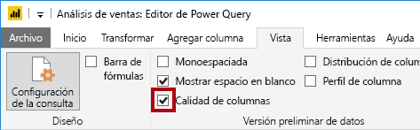

    La característica calidad de las columnas permite determinar fácilmente el porcentaje de valores válidos, errores o valores vacíos encontrados en las columnas.

7. En la columna **Position** (sexta columna desde el final), observe que el 94 % de las filas están vacías (NULL).

    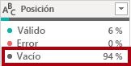

8. Para evaluar la distribución de las columnas, en la ficha de cinta **Vista**, en el grupo **Vista previa de los datos**, consulte **Distribución de columnas**.

    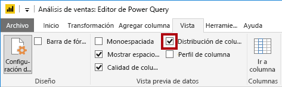

9. Revise de nuevo la columna **Position** y observe que hay cuatro valores distintos y uno único.

10. Revise la distribución de la columna **EmployeeKey** (la primera): 296 valores distintos y 296 únicos.

    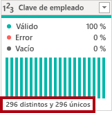

    Cuando los recuentos distintos y únicos son iguales, significa que la columna contiene valores únicos. Al realizar el modelado, es importante que algunas tablas del modelo tengan columnas únicas, Estas columnas únicas se pueden usar para crear relaciones de uno a varios, que se realizarán en el laboratorio **Modelado de datos en Power BI Desktop**.

11. En el panel **Consultas**, seleccione la consulta **DimEmployeeSalesTerritory**.

    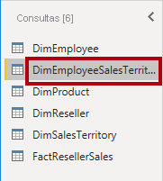

    La tabla **DimEmployeeSalesTerritory** almacena una fila para cada uno de los empleados y las regiones del territorio de ventas que administran. La tabla permite relacionar varias regiones con un solo empleado. Algunos empleados administran una, dos o posiblemente más regiones. Cuando realice el modelado de estos datos, tendrá que definir una relación de varios a varios.

12. En el panel **Consultas**, seleccione la consulta **DimProduct**.

    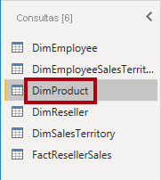

    La tabla **DimProduct** contiene una fila por producto vendido por la empresa.

13. Desplácese horizontalmente para mostrar las últimas columnas.

14. Observe la columna **DimProductSubcategory**.

    Al agregar transformaciones a esta consulta en el laboratorio **Carga de datos en Power BI Desktop**, usará la columna **DimProductSubcategory** para combinar tablas.

15. En el panel **Consultas**, seleccione la consulta **DimReseller**.

    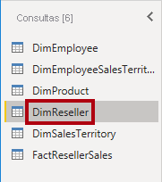

    La tabla **DimReseller** contiene una fila por distribuidor. Los revendedores venden, distribuyen o agregan valor a los productos de Adventure Works.

16. Para ver los valores de las columnas, en la ficha de cinta **Vista**, en el grupo **Vista previa de los datos**, consulte **Perfil de columna**.

    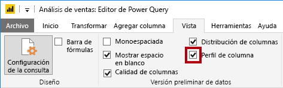

17. Seleccione el encabezado de columna **BusinessType**.

18. Observe el nuevo panel que hay debajo del panel de vista previa de los datos.

19. Revise las estadísticas de columna y la distribución de valores en el panel de vista previa de los datos.

20. Observe el problema en la calidad de los datos: hay dos etiquetas para el almacén (**Warehouse** y **Ware House**, este último mal escrito).

    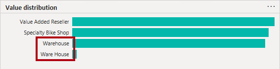

21. Si mantiene el puntero sobre la barra de **Ware House**, verá que hay cinco filas con este valor.

    Aplicará una transformación para cambiar la etiqueta de estas cinco filas en el laboratorio **Carga de datos en Power BI Desktop**.

22. En el panel **Consultas**, seleccione la consulta **DimSalesTerritory**.

    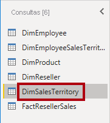

    La tabla **DimSalesTerritory** contiene una fila por región de ventas, que incluye **Corporate HQ** (Sede corporativa). Las regiones se asignan a un país y los países se asignan a los grupos. En el laboratorio **Modelado de datos de Power BI Desktop**, creará una jerarquía para admitir el análisis en el nivel de región, país o grupo.

23. En el panel **Consultas**, seleccione la consulta **FactResellerSales**.

    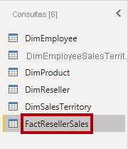

    La tabla **FactResellerSales** contiene una fila por línea de pedido de venta. Un pedido de venta contiene uno o varios elementos de línea.

24. Revise la calidad de la columna **TotalProductCost** y observe que el 8 % de las filas están vacías.

    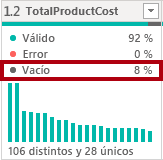

    El hecho de que falten valores en la columna **TotalProductCost** supone un problema de calidad de los datos. Para solucionarlo en el laboratorio **Carga de datos en Power BI Desktop**, aplicará transformaciones a fin de rellenar los valores que faltan con el costo estándar del producto, que se almacena en la tabla relacionada **DimProduct**.

### **Tarea 5: Obtención de datos de un archivo CSV**

En esta tarea, creará una consulta basada en un archivo CSV.

1. Para agregar una nueva consulta, vaya a la ventana **Editor de Power Query**. En la ficha de cinta **Inicio**, en el grupo **Nueva consulta**, haga clic en la flecha desplegable de **Nuevo origen** y luego seleccione **Texto o CSV**.

    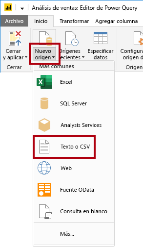

2. En la ventana **Abrir**, vaya a la carpeta **D:\PL300\Resources** y seleccione el archivo **ResellerSalesTargets.csv**.

3. Haga clic en **Abrir**.

4. En la ventana **ResellerSalesTargets.csv**, revise la vista previa de los datos.

5. Haga clic en **Aceptar**.

    
 

6. En el panel **Consultas**, observe la adición de la consulta **ResellerSalesTargets**.

    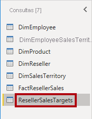

    El archivo CSV **ResellerSalesTargets** contiene una fila por vendedor y al año. Cada fila registra 12 objetivos de ventas mensuales (expresados en miles). Tenga en cuenta que el año comercial de la empresa Adventure Works empieza el 1 de julio.

7. Observe que ninguna columna contiene valores vacíos.

    Cuando no hay un objetivo de ventas mensual, se almacena un carácter de guion.

8. Revise los iconos de cada encabezado de columna, a la izquierda del nombre de columna.

    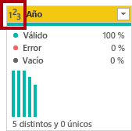

    Los iconos representan el tipo de datos de la columna. **123** es un número entero y **ABC** es texto.

    Aplicará muchas transformaciones para lograr un resultado con forma diferente que solo conste de tres columnas (**Date**, **EmployeeKey** y **TargetAmount**) en el laboratorio **Carga de datos de Power BI Desktop**.

### **Tarea 6: Obtención de datos adicionales de un archivo CSV**

En esta tarea, creará una consulta adicional basada en un archivo CSV diferente.

1. Siga los pasos de la tarea anterior para crear una consulta basada en el archivo **D:\PL300\Resources\ColorFormats.csv**.

    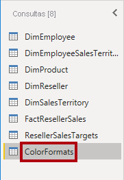

    El archivo CSV **ColorFormats** contiene una fila por color de producto. Cada fila registra los códigos hexadecimales para dar formato a los colores de fondo y de fuente. Integrará estos datos en los de la consulta de **DimProduct** en el laboratorio **Carga de datos en Power BI Desktop**.

### **Tarea 7: Finalización**

En esta tarea, completará el laboratorio.

1. En la ficha de cinta **Vista**, en el grupo **Vista previa de los datos**, desactive las tres opciones de vista previa de los datos que se habilitaron previamente en este laboratorio:

    - Calidad de columnas

    - Distribución de columnas

    - Perfil de columna

    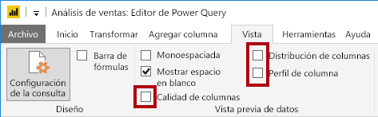

2. Para guardar el archivo de Power BI Desktop, en la ventana del **Editor de Power Query**, en la vista Backstage de **Archivo**, seleccione **Guardar**.

    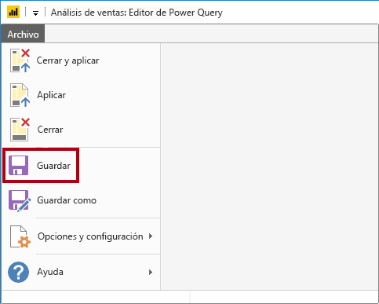

3. Cuando se le pida que aplique las consultas, haga clic en **Aplicar más tarde**.

    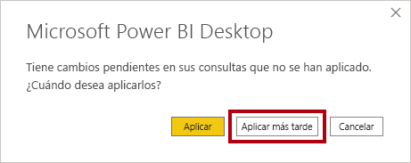

    Cuando se aplican las consultas, los datos se cargan en el modelo de datos. Todavía no está listo para hacerlo, ya que primero hay que aplicar muchas transformaciones.

4. Si quiere iniciar el siguiente laboratorio, deje Power BI Desktop abierto.

    Aplicará varias transformaciones a las consultas y, después, aplicará las consultas para cargarlas en el modelo de datos en el laboratorio **Carga de datos en Power BI Desktop**.
