---
lab:
  title: Carga de datos en Power BI Desktop
  module: Module 3 - Clean, Transform, and Load Data in Power BI
ms.openlocfilehash: 8e8373127cbc8023c0c299e3b2c75b4a82986308
ms.sourcegitcommit: d88b7941fe3805f0bc2979ea864c5483ec289c75
ms.translationtype: HT
ms.contentlocale: es-ES
ms.lasthandoff: 06/04/2022
ms.locfileid: "146071894"
---
# <a name="load-data-in-power-bi-desktop"></a>**Carga de datos en Power BI Desktop**

**El tiempo estimado para completar el laboratorio es de 45 minutos.**

En este laboratorio, se empezarán a aplicar transformaciones a cada una de las consultas creadas en el laboratorio anterior. Después, se aplicarán las consultas para que se cargue cada una de ellas como una tabla en el modelo de datos.

En este laboratorio, aprenderá a:

- Aplicar varias transformaciones

- Aplicar consultas para cargarlas en el modelo de datos

### <a name="lab-story"></a>**Caso de laboratorio**

Este laboratorio es una de las muchas series de laboratorios que se diseñaron como una historia completa sobre la preparación de datos para publicarlos como informes y paneles. Puede completar los laboratorios en cualquier orden. Sin embargo, si piensa trabajar en varios de ellos, para los diez primeros le recomendamos que siga el orden siguiente:

1. Preparación de datos en Power BI Desktop

2. **Carga de datos en Power BI Desktop**

3. Modelado de datos en Power BI Desktop


5. Creación de cálculos DAX en Power BI Desktop, parte 1

6. Creación de cálculos DAX en Power BI Desktop, parte 2

7. Diseño de un informe en Power BI Desktop, parte 1

8. Diseño de un informe en Power BI Desktop, parte 2

9. Creación de un panel de Power BI

10. Análisis de datos en Power BI Desktop

11. Aplicación de seguridad de nivel de fila

## <a name="exercise-1-load-data"></a>**Ejercicio 1: Carga de datos**

En este ejercicio, aplicará transformaciones a cada una de las consultas creadas en el laboratorio anterior.

### <a name="task-1-get-started"></a>**Tarea 1: Primeros pasos**

En esta tarea configurará el entorno para el laboratorio.

*Importante: Si viene de realizar el laboratorio anterior (y lo completó correctamente) no realice esta tarea; en su lugar, continúe con la siguiente.*

1. Para abrir Power BI Desktop, en la barra de tareas, haga clic en el acceso directo de Microsoft Power BI Desktop.

    

1. Para cerrar la ventana de introducción, en la parte superior izquierda de la ventana, haga clic en **X**.

    

1. Para abrir el archivo de inicio de Power BI Desktop, haga clic en la ficha de cinta **Archivo** a fin de abrir la vista Backstage.

1. Seleccione **Abrir informe**.

    

1. Haga clic en **Examinar informes**.

    

1. En la ventana **Abrir**, vaya a la carpeta **D:\PL300\Labs\02-load-data-with-power-query-in-power-bi-desktop\Starter**.

1. Seleccione el archivo **Sales Analysis**.

1. Haga clic en **Abrir**.

    

1. Cierre todas las ventanas informativas que se abran.

1. Fíjese en el mensaje de advertencia amarillo bajo la cinta.

    *El mensaje le avisa de que las consultas no se han aplicado para cargarse como tablas de modelo. Las consultas se aplicarán más adelante en este laboratorio.*

1. Para descartar el mensaje de advertencia, a la derecha del mensaje de advertencia amarillo, haga clic en la **X**.

    

1. Para crear una copia del archivo, haga clic en la ficha de cinta **Archivo** para abrir la vista Backstage.

1. Seleccione **Guardar como**.

    

1. Si se le pide que aplique los cambios, haga clic en **Aplicar más tarde**.

    

1. En la ventana **Guardar como**, vaya a la carpeta **D:\PL300\MySolution**.

1. Haga clic en **Guardar**.

    

1. Para abrir la ventana **Editor de Power Query**, en la ficha de cinta **Inicio**, dentro del grupo **Consultas**, haga clic en el icono **Transformar datos**.

    

### <a name="task-2-configure-the-salesperson-query"></a>**Tarea 2: Configuración de la consulta Salesperson**

En esta tarea, se configurará la consulta **Salesperson**.

1. En la ventana del **Editor de Power Query**, seleccione la consulta **DimEmployee** en el panel **Consultas**.

    

2. Para cambiar el nombre de la consulta, en el panel **Configuración de la consulta** (situado a la derecha), en el cuadro **Nombre**, reemplace el texto por **SalesPerson** y luego presione **Entrar**.

    *El nombre de la consulta determinará el nombre de la tabla del modelo. Se recomienda definir nombres concisos a la vez que descriptivos.*

3. En el panel **Consultas**, compruebe que el nombre de la consulta se ha actualizado.

    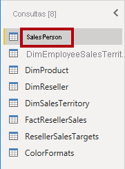

    *Ahora filtrará las filas de la consulta para recuperar solo los empleados que son vendedores.*

4. Para ubicar una columna específica, en la ficha de cinta **Inicio**, haga clic en la flecha hacia abajo **Administrar columnas**, haga clic en la flecha hacia abajo **Elegir columnas** y luego seleccione **Ir a columna**.

    

    *Sugerencia: Esta técnica es útil cuando una consulta contiene muchas columnas. Si no hay demasiadas columnas, simplemente puede desplazarse horizontalmente para localizar la columna que busque.*

5. En la ventana **Ir a columna**, para ordenar la lista por nombre de columna, haga clic en el botón de ordenar **AZ** y, después, seleccione **Nombre**.

    

6. Seleccione la columna **SalesPersonFlag** y luego haga clic en **Aceptar**.

7. Para filtrar la consulta, en el encabezado de columna **SalesPersonFlag**, haga clic en la flecha hacia abajo y, después, desactive **FALSE**.

    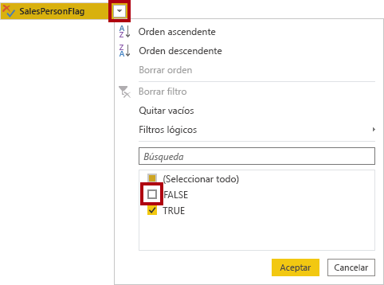

8. Haga clic en **OK**.

    

9. En el panel **Configuración de la consulta**, en la lista **Pasos aplicados**, fíjese en la incorporación del paso **Filas filtradas**.

    

    *Cada transformación que se cree tiene como resultado una lógica de paso adicional. Es posible editar o eliminar pasos. También es posible seleccionar un paso para obtener una vista previa de los resultados de la consulta en esa fase de transformación.*

10. Para quitar columnas, en la pestaña **Inicio**, haga clic en el grupo **Administrar columnas** y, luego, en el icono **Elegir columnas**.

    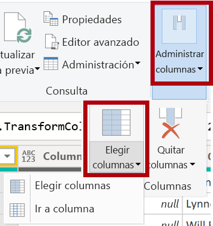

11. En la ventana **Elegir columnas**, para desactivar todas las columnas, desactive el elemento **(Seleccionar todas las columnas)** .

    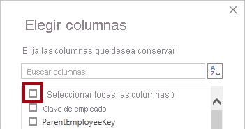

12. Para incluir columnas, compruebe las seis columnas siguientes:

    - EmployeeKey

    - EmployeeNationalIDAlternateKey

    - FirstName

    - LastName

    - Title

    - EmailAddress

13. Haga clic en **Aceptar**.

    

14. En la lista **Pasos aplicados**, fíjese en la incorporación de otro paso de consulta.

    

15. Para crear una columna de nombre único, en primer lugar seleccione el encabezado de columna **FirstName**.

16. Mientras presiona la tecla **Ctrl**, seleccione la columna **LastName**.

    

17. Haga clic con el botón secundario en cualquiera de los encabezados de columna seleccionados y, después, en el menú contextual, seleccione **Combinar columnas**.

    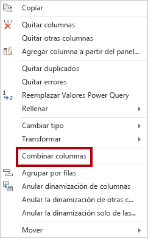

    *Muchas transformaciones comunes se pueden aplicar haciendo clic con el botón secundario en el encabezado de columna y, posteriormente, eligiendo en el menú contextual. Sin embargo, hay más transformaciones disponibles en la cinta de opciones.*

18. En la ventana **Combinar columnas**, en la lista desplegable **Separador** seleccione **Espacio**.

19. En el cuadro **Nuevo nombre de columna**, reemplace el texto por **Salesperson**.

    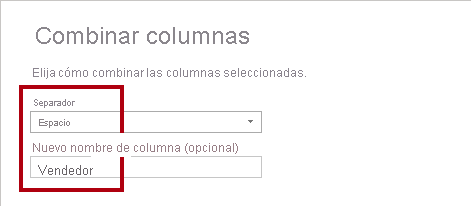

20. Haga clic en **OK**.

    

21. Para cambiar el nombre de la columna **EmployeeNationalIDAlternateKey**, haga doble clic en el encabezado de columna **EmployeeNationalIDAlternateKey**.

22. Reemplace el texto por **EmployeeID** y luego presione **Entrar**.

    *Importante: Cuando se le indique que cambie el nombre de las columnas, es importante que las cambie de nombre tal como se describe.*

23. Use los pasos anteriores para cambiar el nombre de la columna **EmailAddress** a **UPN**.

    *UPN es un acrónimo para el nombre principal de usuario.*

24. En la parte inferior izquierda, en la barra de estado, compruebe que la consulta tiene cinco columnas y 18 filas.

    

    *Importante: Es importante que no continúe si la consulta no genera el resultado correcto, ya que no será posible completar los laboratorios posteriores. Si las columnas o filas de consulta no coinciden, consulte los pasos de esta tarea para solucionar los problemas.*

### <a name="task-3-configure-the-salespersonregion-query"></a>**Tarea 3: Configuración de la consulta SalespersonRegion**

En esta tarea se configurará la consulta **SalespersonRegion**.

1. En el panel **Consultas**, seleccione la consulta **DimEmployeeSalesTerritory**.

    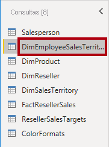

2. En el panel **Configuración de la consulta**, cambie el nombre de la consulta a **SalespersonRegion**.

3. Para quitar las dos últimas columnas, seleccione primero el encabezado de columna **DimEmployee**.

4. Mientras presiona la tecla **Ctrl**, seleccione el encabezado de columna **DimSalesTerritory**.

5. Haga clic con el botón secundario en cualquiera de los encabezados de selección de columna y, después, en el menú contextual, seleccione **Quitar columnas**.

    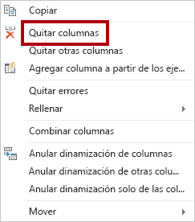

6. En la barra de estado, compruebe que la consulta tiene dos columnas y 39 filas.

    

### <a name="task-4-configure-the-product-query"></a>**Tarea 4: Configuración de la consulta Product**

En esta tarea, configurará la consulta **Product**.

*Importante: Cuando ya se hayan proporcionado instrucciones detalladas, los pasos de laboratorio proporcionarán instrucciones más concisas. Si necesita instrucciones detalladas, puede volver a consultar los pasos de tareas anteriores.*

1. Seleccione la consulta **DimProduct**.

    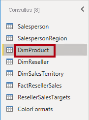

2. Cambie el nombre de la consulta a **Product**.

3. Busque la columna **FinishedGoodsFlag** y, después, filtre la columna para recuperar los productos que son productos acabados (es decir, TRUE).

4. Quite todas las columnas, excepto las siguientes:

    - ProductKey

    - EnglishProductName

    - StandardCost

    - Color

    - DimProductSubcategory

5. Observe que la columna **DimProductSubcategory** representa una tabla relacionada (contiene vínculos de **Valores**).

6. En el encabezado de columna **DimProductSubcategory**, a la derecha del nombre de la columna, haga clic en el botón expandir.

    

7. Para desactivar todas las columnas, desactive el elemento **(Seleccionar todas las columnas)**.

8. Compruebe las columnas **EnglishProductSubcategoryName** y **DimProductCategory**.

    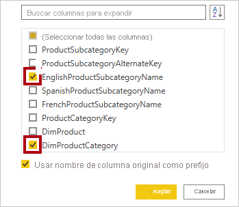

    *Al seleccionar estas dos columnas, se aplicará una transformación para combinar con la tabla **DimProductSubcategory** y, después, incluir estas columnas. La columna **DimProductCategory** es, de hecho, otra tabla relacionada en el origen de datos.*

9. Desactive la casilla **Usar nombre de columna original como prefijo**.

    

    *Los nombres de columna de la consulta deben ser siempre únicos. Cuando está activada, esta casilla prefijaría cada columna con el nombre de columna expandido (en este caso, **DimProductSubcategory**). Como se sabe que los nombres de columna seleccionados no entran en conflicto con los de la consulta **Product**, se anula la selección de la opción.*

10. Haga clic en **OK**.

    

11. Tenga en cuenta que la transformación dio como resultado la adición de dos columnas y que se ha quitado la columna **DimProductSubcategory**.

12. Expanda la columna **DimProductCategory** y, después, introduzca únicamente la columna **EnglishProductCategoryName**.

13. Cambie el nombre de las cuatro columnas siguientes:

    - **EnglishProductName** por **Product**

    - **StandardCost** por **Standard Cost** (incluir un espacio)

    - **EnglishProductSubcategoryName** por **Subcategory**

    - **EnglishProductCategoryName** por **Category**

14. En la barra de estado, compruebe que la consulta tiene 6 columnas y 397 filas.

    

### <a name="task-5-configure-the-reseller-query"></a>**Tarea 5: Configuración de la consulta Reseller**

En esta tarea, se configurará la consulta **Reseller**.

1. Seleccione la consulta **DimReseller**.

    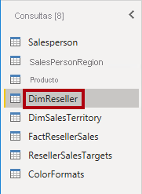

2. Cambie el nombre de la consulta a **Reseller**.

3. Quite todas las columnas, excepto las siguientes:

    - ResellerKey

    - BusinessType

    - ResellerName

    - DimGeography

4. Expanda la columna **DimGeography** para incluir solo las tres columnas siguientes:

    - City

    - StateProvinceName

    - EnglishCountryRegionName

    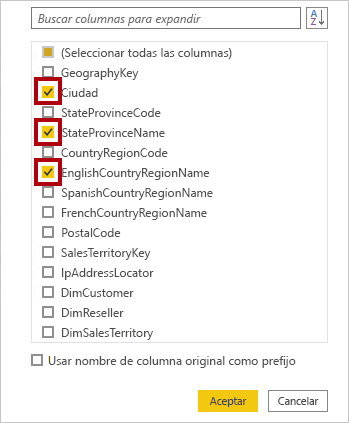

5. En el encabezado de la columna **Business Type**, haga clic en la flecha hacia abajo y luego revise los distintos valores de columna; observe también la ortografía incorrecta del término "warehouse".

    

  

6. Haga clic con el botón secundario en el encabezado de columna **Business Type** y, después, seleccione **Reemplazar valores**.

    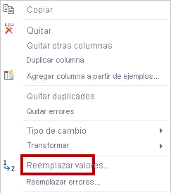

7. En la ventana **Reemplazar valores**, configure los valores siguientes:

    - En el cuadro **Valor que buscar**, escriba **Ware House**.

    - En el cuadro **Reemplazar por**, escriba **Warehouse**.

    

8. Haga clic en **OK**.

    

9. Cambie el nombre de las cuatro columnas siguientes:

    - **BusinessType** por **Business Type** (incluir un espacio)

    - **ResellerName** por **Reseller**

    - **StateProvinceName** por **State-Province**

    - **EnglishCountryRegionName** por **Country-Region**

10. En la barra de estado, compruebe que la consulta tiene 6 columnas y 701 filas.

    

### <a name="task-6-configure-the-region-query"></a>**Tarea 6: Configuración de la consulta Region**

En esta tarea, se configurará la consulta **Region**.

1. Seleccione la consulta **DimSalesTerritory**.

    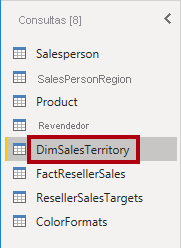

2. Cambie el nombre de la consulta a **Region**.

3. Aplique un filtro a la columna **SalesTerritoryAlternateKey** para quitar el valor 0 (cero).

    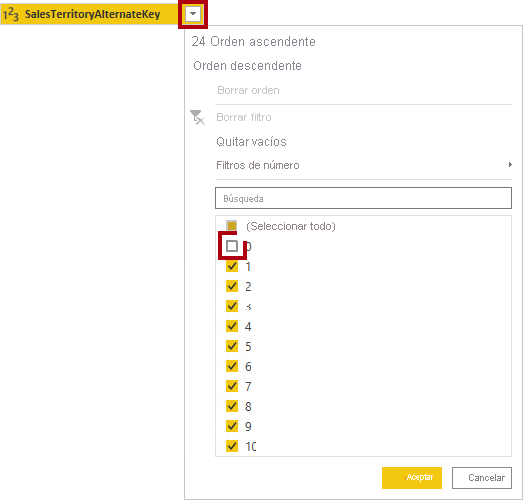

4. Quite todas las columnas, excepto las siguientes:

    - SalesTerritoryKey

    - SalesTerritoryRegion

    - SalesTerritoryCountry

    - SalesTerritoryGroup

5. Cambie el nombre de las tres columnas siguientes:

    - **SalesTerritoryRegion** por **Region**

    - **SalesTerritoryCountry** por **Country**

    - **SalesTerritoryGroup** por **Group**

6. En la barra de estado, compruebe que la consulta tiene cuatro columnas y 10 filas.

    

### <a name="task-7-configure-the-sales-query"></a>**Tarea 7: Configuración de la consulta Sales**

En esta tarea, se configurará la consulta **Sales**.

1. Seleccione la consulta **FactResellerSales**.

    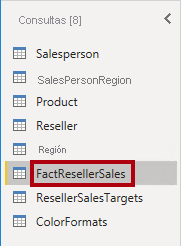

2. Cambie el nombre de la consulta a **Sales**.

3. Quite todas las columnas, excepto las siguientes:

    - SalesOrderNumber

    - OrderDate

    - ProductKey

    - ResellerKey

    - EmployeeKey

    - SalesTerritoryKey

    - OrderQuantity

    - UnitPrice

    - TotalProductCost

    - SalesAmount

    - DimProduct

    *Puede que recuerde que, en el laboratorio **Preparación de datos en Power BI Desktop**, a un pequeño porcentaje de las filas **FactResellerSales** le faltaban valores de **TotalProductCost**. La columna **DimProduct** se ha incluido a fin de recuperar la columna del costo estándar del producto, para ayudar a corregir los valores que faltan.*

4. Expanda la columna **DimProduct**, desactive todas las columnas y, después, incluya únicamente la columna **StandardCost**.

5. Para crear una columna personalizada, en la pestaña **Agregar columna** de la cinta de opciones, desde el grupo **General** haga clic en **Columna personalizada**.

    

6. En la ventana **Columna personalizada**, en el cuadro **Nuevo nombre de columna**, reemplace el texto por **Cost**.

    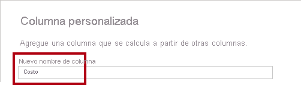

7. En el cuadro **Fórmula de columna personalizada**, escriba la siguiente expresión (después del símbolo igual):

8. Para su comodidad, puede copiar la expresión desde el archivo **D:\PL300\Labs\02-load-data-with-power-query-in-power-bi-desktop\Assets\Snippets.txt**.


   **Power Query**
   ```
   if [TotalProductCost] = null then [OrderQuantity] * [StandardCost] else [TotalProductCost]
   ```


*Esta expresión comprueba si falta el valor **TotalProductCost**. De ser así, genere un valor multiplicando el valor de **OrderQuantity** por el de **StandardCost**; de lo contrario, utiliza el valor existente de **TotalProductCost**.*

9. Haga clic en **Aceptar**.

    

10. Quite las dos columnas siguientes:

    - TotalProductCost

    - StandardCost

11. Cambie el nombre de las tres columnas siguientes:

    - **OrderQuantity** por **Quantity**

    - **UnitPrice** por **Unit Price** (incluir un espacio)

    - **SalesAmount** por **Sales**

12. Para modificar el tipo de datos de la columna, en el encabezado de columna **Quantity**, a la izquierda del nombre de la columna, haga clic en el icono **1.2** y luego seleccione **Número entero**.

    

    *Es importante configurar el tipo de datos correcto. Cuando la columna contiene un valor numérico, también es importante elegir el tipo correcto si espera realizar cálculos de matemáticos.*

13. Modifique los tipos de datos siguientes de tres columnas a **Número decimal fijo**.

    - Unit Price

    - Ventas

    - Costo

    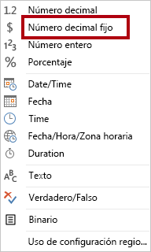

    *El tipo de datos número decimal fijo almacena valores con precisión completa, por lo que requiere más espacio de almacenamiento que el tipo número decimal. Es importante usar el tipo número decimal fijo para valores financieros o tipos (como los tipos de cambio).*

14. En la barra de estado, compruebe que la consulta tiene 10 columnas y más de 999 filas.

    

    *Se cargarán un máximo de 1000 filas como datos de vista previa para cada consulta.*

### <a name="task-8-configure-the-targets-query"></a>**Tarea 8: Configuración de la consulta Targets**

En esta tarea se configurará la consulta **Targets**.

1. Seleccione la consulta **ResellerSalesTargets**.

    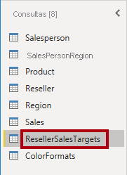

2. Cambie el nombre de la consulta a **Targets**.

3. Para anular la dinamización de las columnas de 12 meses (**M01**-**M12**), en primer lugar seleccione varias opciones encabezados de columna **Year** y **EmployeeID**.

    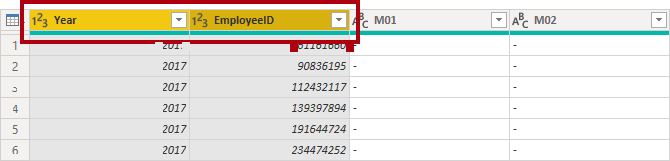

4. Haga clic con el botón secundario en cualquiera de los encabezados de selección de columna y, después, en el menú contextual, seleccione **Anular dinamización de otras columnas**.

    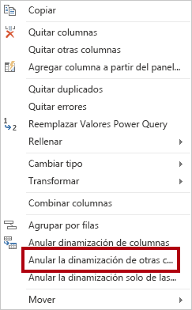

5. Observe que los nombres de columna aparecen ahora en la columna **Attribute** y los valores aparecen en la columna **Value**.

6. Aplique un filtro a la columna **Value** para quitar los valores de guion (-).

    *Puede que recuerde que el carácter de guion se usó en el archivo CSV de origen para representar cero (0).*

7. Cambie el nombre de las dos columnas siguientes:

    - **Attribute** por **MonthNumber** (no hay espacio entre las dos palabras; se quitará más adelante).

    - **Value** por **Target**.

    *Ahora se aplicarán transformaciones para generar una columna de fecha. La fecha se derivará de las columnas **Year** y **MonthNumber**. Creará la columna mediante la característica **Columnas a partir de ejemplos**.*

8. Para preparar los valores de la columna **MonthNumber**, haga clic con el botón secundario en el encabezado de columna **MonthNumber** y, después, seleccione **Reemplazar valores**.

    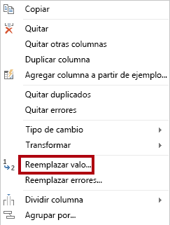

9. En la ventana **Reemplazar valores**, en el cuadro **Valor que buscar** escriba **M**.

    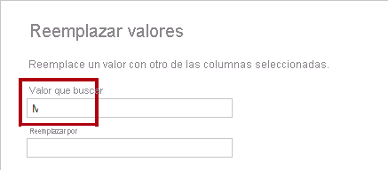

10. Haga clic en **OK**.

11. Modifique el tipo de datos de la columna **MonthNumber** a **Número entero**.

    

12. En la pestaña **Agregar columna** de la cinta de opciones, desde el grupo **General** haga clic en el icono **Columna a partir de ejemplos**.

    

13. Observe que la primera fila es para el año **2017** y el número de mes **7**.

14. En la columna **Column1**, en la primera celda de la cuadrícula, empiece a escribir **1/7/2017** y luego presione **Entrar**.

    *La máquina virtual usa la configuración regional de EE. UU., por lo que esta fecha es el 1 de julio de 2017.*

15. Observe que las celdas de la cuadrícula se actualizan con valores previstos.

    *La característica ha previsto con precisión que se están combinando valores de las columnas **Year** y **MonthNumber**.*

16. Observe también la fórmula presentada sobre la cuadrícula de consulta.

    

17. Para cambiar el nombre de la columna nueva, haga doble clic en el encabezado de columna **Merged**.

18. Cambie el nombre de la columna por **TargetMonth**.

    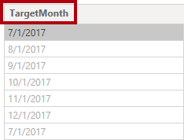

19. Para agregar la nueva columna, haga clic en **Aceptar**.

    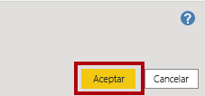

20. Quite las columnas siguientes:

    - Year

    - MonthNumber

21. Modifique los siguientes tipos de datos de la columna:

    - **Target** por número decimal fijo

    - **TargetMonth** por fecha

22. Para multiplicar los valores de **Target** por 1000, seleccione el encabezado de columna **Target** y, después, en la pestaña **Transformar** de la cinta de opciones, desde el grupo **Columna de número**, haga clic en **, Estándar** y luego seleccione **Multiplicar**.

    *Puede que recuerde que los valores de destino se almacenaron como miles.*

    

23. En la ventana **Multiplicar**, en el cuadro **Valor** escriba **1000**.

    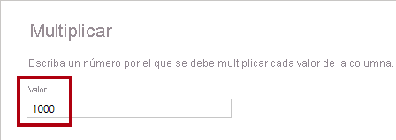

24. Haga clic en **OK**.

    

25. En la barra de estado, compruebe que la consulta tiene tres columnas y 809 filas.

    

### <a name="task-9-configure-the-colorformats-query"></a>**Tarea 9: Configuración de la consulta ColorFormats**

En esta tarea se configurará la consulta **ColorFormats**.

1. Seleccione la consulta **ColorFormats**.

    

2. Observe que la primera fila contiene los nombres de columna.

3. En la pestaña **Inicio** de la cinta de opciones, desde el grupo **Transformar**, haga clic en **Usar la primera fila como encabezado**.

    

4. En la barra de estado, compruebe que la consulta tiene tres columnas y 10 filas.

    

### <a name="task-10-update-the-product-query"></a>**Tarea 10: Actualización de la consulta Product**

En esta tarea se actualizará la consulta **Product** mediante la combinación de la consulta **ColorFormats**.

1. Seleccione la consulta **Product**.

    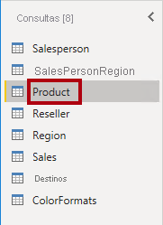

2. Para combinar la consulta **ColorFormats**, en la ficha de cinta **Inicio**, haga clic en la flecha hacia abajo **Combinar** y, luego, en **Combinar consultas**.

    

    *La combinación de consultas permite la integración de datos, en este caso a partir de orígenes de datos diferentes (SQL Server y un archivo CSV).*

3. En la ventana **Combinar**, en la cuadrícula de consulta **Product**, seleccione el encabezado de columna **Color**.

    

4. Debajo de la cuadrícula de consulta **Product**, en la lista desplegable, seleccione la consulta **ColorFormats**.

    

5. En la cuadrícula de consulta **ColorFormats**, seleccione el encabezado de columna **Color**.

6. Cuando se abra la ventana **Niveles de privacidad**, para cada uno de los dos orígenes de datos, en la lista desplegable correspondiente seleccione **Organizativo**.

    

    *Los niveles de privacidad se pueden configurar para que el origen de datos determine si los datos se pueden compartir entre orígenes. Establecer cada origen de datos como **Organizativo** les permite compartir datos, en caso necesario. Tenga en cuenta que los orígenes de datos privados nunca se pueden compartir con otros orígenes de datos. Esto no significa que los datos privados no se puedan compartir, sino que el motor de Power Query no puede compartir datos entre los orígenes.*

7. Haga clic en **Guardar**.

    

8. En la ventana **Combinar**, use el **Tipo de combinación** predeterminado: mantener la selección de Externa izquierda y hacer clic en **Aceptar**.

    

9. Expanda la columna **ColorFormats** para incluir las dos columnas siguientes:

    - Background Color Format

    - Font Color Format

    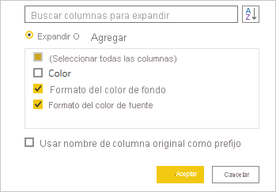

10. En la barra de estado, compruebe que la consulta tiene 8 columnas y 397 filas.

    

### <a name="task-11-update-the-colorformats-query"></a>**Tarea 11: Actualización de la consulta ColorFormats**

En esta tarea, se actualizará la consulta **ColorFormats** para deshabilitar su carga.

1. Seleccione la consulta **ColorFormats**.

    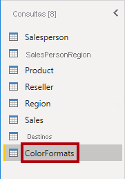

2. En el panel **Configuración de la consulta**, haga clic en el vínculo **Todas las propiedades**.

    

3. En la ventana **Propiedades de la consulta**, desactive la casilla **Habilitar carga para el informe**.

    

    Deshabilitar la carga significa que no se cargará como una tabla en el modelo de datos. Esto se hace porque la consulta se ha combinado con la consulta **Product**, que está habilitada para cargar en el modelo de datos.

4. Haga clic en **OK**.

    

### <a name="task-12-finish-up"></a>**Tarea 12: Finalización**

En esta tarea, completará el laboratorio.

1. Compruebe que tiene ocho consultas, con el nombre correcto de la siguiente forma:

    - SalesPerson

    - SalesPersonRegion

    - Product

    - Reseller

    - Region

    - Sales

    - Targets

    - ColorFormats (que no se cargará en el modelo de datos)

2. Para cargar el modelo de datos, en la vista Backstage de **Archivo**, seleccione **Cerrar y aplicar**.

    

    *Todas las consultas habilitadas para carga se cargan ahora en el modelo de datos.*

3. En el panel **Campos** (que se encuentra a la derecha), observe las siete tablas que se cargan en el modelo de datos.

    

4. Guarde el archivo de Power BI Desktop.

5. Si quiere iniciar el siguiente laboratorio, deje Power BI Desktop abierto.

    *Configurará tablas y relaciones de modelos de datos en el laboratorio **Modelado de datos en Power BI Desktop**.*
