---
lab:
  title: "Carga de datos en Power\_BI Desktop"
  module: '3 - Clean, Transform, and Load Data in Power BI'
---

# Carga de datos en Power BI Desktop

**El tiempo estimado para completar el laboratorio es de 45 minutos.**

En este laboratorio, empezará a aplicar transformaciones a cada una de las consultas creadas en el laboratorio anterior. Después, se aplicarán las consultas para que se cargue cada una de ellas como una tabla en el modelo de datos.

En este laboratorio, aprenderá a:

- Aplicar varias transformaciones
- Aplicar consultas para cargarlas en el modelo de datos

## **Caso de laboratorio**

Este laboratorio es una de las muchas series de laboratorios que se diseñaron como una historia completa sobre la preparación de datos para publicarlos como informes y paneles. Puede completar los laboratorios en cualquier orden. Sin embargo, si piensa trabajar en varios de ellos, le recomendamos que siga el orden siguiente:

1. Preparación de datos en Power BI Desktop
1. **Carga de datos en Power BI Desktop**
1. Diseño de un modelo de datos en Power BI
1. Creación de cálculos DAX en Power BI Desktop
1. Creación de cálculos DAX avanzados en Power BI Desktop
1. Diseño de un informe en Power BI Desktop
1. Mejora de un informe en Power BI Desktop
1. Análisis de datos en Power BI
1. Creación de un panel de Power BI
1. Aplicación de seguridad de nivel de fila

## **Ejercicio 1: Carga de datos**

En este ejercicio, empezará a aplicar transformaciones a cada una de las consultas creadas en el laboratorio anterior.

### **Tarea 1: Primeros pasos**

En esta tarea, configurará el entorno para el laboratorio.

*Importante: Si completó el laboratorio anterior en la misma VM, vaya a la siguiente tarea.*

1. Abra Power BI Desktop.
    
    *Sugerencia: De forma predeterminada, se abre el cuadro de diálogo Introducción delante de Power BI Desktop. Puede optar por iniciar sesión y, a continuación, cerrar la ventana emergente.*

    

1. Para abrir el archivo de inicio de Power BI Desktop, seleccione **Archivo > Abrir informe > Examinar informes**.

1. En la ventana **Abrir**, vaya a la carpeta **D:\PL300\Labs\02-load-data-with-power-query-in-power-bi-desktop\Starter** y abra el archivo **Análisis de ventas**.

1. Cierre todas las ventanas informativas que se abran.

1. Fíjese en el mensaje de advertencia amarillo bajo la cinta. 

    *Este mensaje le avisa de que no se han aplicado consultas para cargar el archivo como tablas de modelo. Aplicará consultas más adelante en este laboratorio.*
    
    Para descartar el mensaje de advertencia, a la derecha del mensaje de advertencia amarillo, haga clic en la **X**.

1. Para crear una copia del archivo, vaya a **Archivo > Guardar como** y guárdelo en la carpeta **D:\PL300\MySolution**.

1. Si se le pide que aplique los cambios, seleccione **Aplicar más tarde**.

### **Tarea 2: Configuración de la consulta Salesperson**

En esta tarea, usará el Editor de Power Query para configurar la consulta **Vendedor**.

*Importante: Cuando se le indique que cambie el nombre de las columnas, es importante que las cambie de nombre tal como se describe.*

1. Para abrir la ventana **Editor de Power Query**, en la ficha de cinta **Inicio**, dentro del grupo **Consultas**, seleccione el icono **Transformar datos**.

     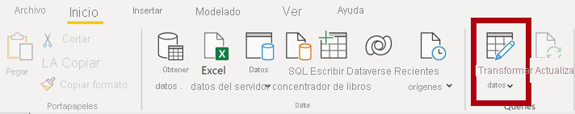

1. En la ventana del **Editor de Power Query**, seleccione la consulta **DimEmployee** en el panel **Consultas**.

     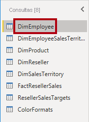

1. Para cambiar el nombre de la consulta, en el panel **Configuración de la consulta** (situado a la derecha), en el cuadro **Nombre**, reemplace el texto por **SalesPerson** y luego presione **Entrar**. A continuación, compruebe que el nombre se ha actualizado en el panel **Consultas**.
    
    *El nombre de la consulta determina el nombre de la tabla del modelo. Se recomienda definir nombres concisos a la vez que descriptivos.*

1. Para ubicar una columna específica, en la ficha de cinta **Inicio**, seleccione la flecha hacia abajo **Administrar columnas**, seleccione la flecha hacia abajo **Elegir columnas** y luego seleccione **Ir a columna**.
    
    *Ir a Columna es una característica útil con muchas columnas. De lo contrario, puede desplazar horizontalmente las columnas de búsqueda.*

     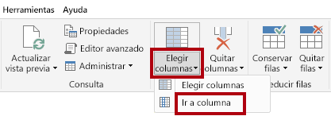

1. En la ventana **Ir a columna**, para ordenar la lista por nombre de columna, seleccione el botón de ordenar **AZ** y, después, **Nombre** y **SalesPersonFlag**. Haga clic en **OK**.

     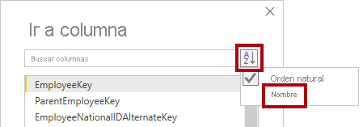

1. Seleccione el encabezado de columna **SalesPersonFlag** y, a continuación, seleccione la flecha abajo, **FALSE** y haga clic en **Aceptar**.
    
    *Esta acción filtra las filas para recuperar solo los empleados que son vendedores.*

1. En el panel **Configuración de la consulta**, en la lista **Pasos aplicados**, fíjese en la incorporación del paso **Filas filtradas**.
    
    *Cada transformación que se cree tiene como resultado otra lógica de paso. Es posible editar o eliminar pasos. También es posible seleccionar un paso para obtener una vista previa de los resultados de la consulta en esa fase de transformación.*

     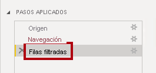

1. Para quitar columnas, en ficha de cinta **Inicio**, seleccione el grupo **Administrar columnas**, seleccione el icono **Elegir columnas**.

1. En la ventana **Elegir columnas**, para desactivar todas las columnas, desactive el elemento **(Seleccionar todas las columnas)**.

1. Para incluir columnas, compruebe las seis columnas siguientes:

    - EmployeeKey
    - EmployeeNationalIDAlternateKey
    - FirstName
    - LastName
    - Title
    - EmailAddress

1. En la lista **Pasos aplicados**, fíjese en la incorporación de otro paso de consulta.

     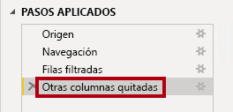

1. Para crear una columna de nombre único, en primer lugar seleccione el encabezado de columna **FirstName**. Mientras presiona la tecla **Ctrl**, seleccione la columna **LastName**.

     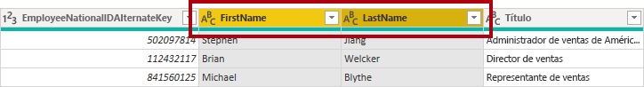

1. Haga clic con el botón derecho en cualquiera de los encabezados de columna seleccionados y, después, en el menú contextual, seleccione **Combinar columnas**.
    
    *Muchas transformaciones comunes se pueden aplicar haciendo clic con el botón secundario en el encabezado de columna y, posteriormente, eligiendo en el menú contextual. Sin embargo, hay más transformaciones disponibles en la cinta de opciones.*

1. En la ventana **Combinar columnas**, en la lista desplegable **Separador** seleccione **Espacio**.

1. En el cuadro **Nuevo nombre de columna**, reemplace el texto por **Salesperson**.

1. Para cambiar el nombre de la columna **EmployeeNationalIDAlternateKey**, haga doble clic en el encabezado de columna **EmployeeNationalIDAlternateKey** y reemplace el texto por **EmployeeID** y, a continuación, presione **Entrar**.

1. Use los pasos anteriores para cambiar el nombre de la columna **EmailAddress** a **UPN**.
    
    *UPN es un acrónimo para el nombre principal de usuario.*

1. En la parte inferior izquierda, en la barra de estado, compruebe que la consulta tiene cinco columnas y 18 filas.

### **Tarea 3: Configuración de la consulta SalespersonRegion**

En esta tarea, se configurará la consulta **SalespersonRegion**.

1. En el panel **Consultas**, seleccione la consulta **DimEmployeeSalesTerritory**.

1. En el panel **Configuración de la consulta**, cambie el nombre de la consulta a **SalesPersonRegion**.

1. Para quitar las dos últimas columnas, seleccione primero el encabezado de columna **DimEmployee**.

1. Mientras presiona la tecla **Ctrl**, seleccione el encabezado de columna **DimSalesTerritory**.

1. Haga clic con el botón secundario en cualquiera de los encabezados de selección de columna y, después, en el menú contextual, seleccione **Quitar columnas**.

1. En la barra de estado, compruebe que la consulta tiene dos columnas y 39 filas.

### **Tarea 4: Configuración de la consulta Product**

En esta tarea, se configurará la consulta **Product**.

*Importante: Cuando ya se hayan proporcionado instrucciones detalladas, los pasos de laboratorio proporcionarán instrucciones más concisas. Si necesita instrucciones detalladas, puede volver a consultar los pasos de tareas anteriores.*

1. Seleccione la consulta **DimProduct** y cambie el nombre de la consulta a **Producto**.

1. Busque la columna **FinishedGoodsFlag** y, después, filtre la columna para recuperar los productos que son productos acabados (es decir, TRUE).

1. Quite todas las columnas, **excepto** las siguientes:

    - ProductKey
    - EnglishProductName
    - StandardCost
    - Color
    - DimProductSubcategory

1. Observe que la columna **DimProductSubcategory** representa una tabla relacionada (contiene vínculos de **Valores**).

1. En el encabezado de columna **DimProductSubcategory**, a la derecha del nombre de la columna, seleccione el botón Expandir.

    

1. Consulte la lista completa de columnas y, a continuación, seleccione el cuadro **Seleccionar todas las columnas** para anular la selección de todas las columnas.
2. Seleccione **EnglishProductSubcategoryName** y **DimProductCategory** y desactive la casilla **Usar el nombre de columna original como prefijo** antes de seleccionar **Aceptar**.
    
    *Al seleccionar estas dos columnas, se aplicará una transformación para combinar con la tabla **DimProductSubcategory** y, después, incluir estas columnas. La columna **DimProductCategory** es, de hecho, otra tabla relacionada en el origen de datos.*
    
    *Los nombres de columna de la consulta deben ser siempre únicos. Cuando está activada, esta casilla prefijaría cada columna con el nombre de columna expandido (en este caso, **DimProductSubcategory**). Como se sabe que los nombres de columna seleccionados no entran en conflicto con los de la consulta **Product**, se anula la selección de la opción.*

1. Tenga en cuenta que la transformación dio como resultado la adición de dos columnas y que se ha quitado la columna **DimProductSubcategory**.

1. Expanda la columna **DimProductCategory** y, después, introduzca únicamente la columna **EnglishProductCategoryName**.

1. Cambie el nombre de las cuatro columnas siguientes:

    - **EnglishProductName** por **Product**
    - **StandardCost** por **Standard Cost** (incluir un espacio)
    - **EnglishProductSubcategoryName** por **Subcategory**
    - **EnglishProductCategoryName** por **Category**

1. En la barra de estado, compruebe que la consulta tiene 6 columnas y 397 filas.

### **Tarea 5: Configuración de la consulta Reseller**

En esta tarea configurará la tabla **Revendedor**.

1. Seleccione la consulta **DimReseller** y cambie el nombre a **Revendedor**.

1. Quite todas las columnas, **excepto** las siguientes:

    - ResellerKey
    - BusinessType
    - ResellerName
    - DimGeography

1. Expanda la columna **DimGeography** para incluir **solo** las tres columnas siguientes:

    - City
    - StateProvinceName
    - EnglishCountryRegionName

1. En el encabezado de la columna **Tipo de empresa**, seleccione la flecha hacia abajo y luego revise los distintos valores de columna y observe los valores **Warehouse** y **Ware House**.

1. Haga clic con el botón derecho en el encabezado de columna **Business Type** y, después, seleccione **Reemplazar valores**.

1. En la ventana **Reemplazar valores**, configure los valores siguientes:

    - En el cuadro **Valor que buscar**, escriba **Ware House**.
    - En el cuadro **Reemplazar por**, escriba **Warehouse**.

     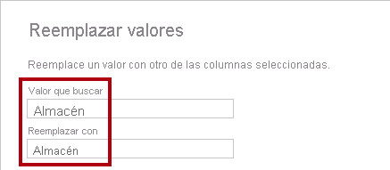

1. Cambie el nombre de las cuatro columnas siguientes:

    - **BusinessType** por **Business Type** (incluir un espacio)
    - **ResellerName** por **Reseller**
    - **StateProvinceName** por **State-Province**
    - **EnglishCountryRegionName** por **Country-Region**

1. En la barra de estado, compruebe que la consulta tiene 6 columnas y 701 filas.

### **Tarea 6: Configuración de la consulta Region**

En esta tarea, se configurará la consulta **Region**.

1. Seleccione la consulta **DimSalesTerritory** y cambie su nombre a **Región**.

1. Aplique un filtro a la columna **SalesTerritoryAlternateKey** para quitar el valor 0 (cero).
    
    *Esto quitará una fila.*

1. Quite todas las columnas, **excepto** las siguientes:

    - SalesTerritoryKey
    - SalesTerritoryRegion
    - SalesTerritoryCountry
    - SalesTerritoryGroup

1. Cambie el nombre de las tres columnas siguientes:

    - **SalesTerritoryRegion** por **Region**
    - **SalesTerritoryCountry** por **Country**
    - **SalesTerritoryGroup** por **Group**

1. En la barra de estado, compruebe que la consulta tiene cuatro columnas y 10 filas.

### **Tarea 7: Configuración de la consulta Sales**

En esta tarea, configurará la consulte **Ventas**.

1. Seleccione la consulta **FactResellerSales** y cambie su nombre a **Ventas**.

1. Quite todas las columnas, **excepto** las siguientes:

    - SalesOrderNumber
    - OrderDate
    - ProductKey
    - ResellerKey
    - EmployeeKey
    - SalesTerritoryKey
    - OrderQuantity
    - UnitPrice
    - TotalProductCost
    - SalesAmount
    - DimProduct
        
        *Nota: Puede que recuerde que, en el laboratorio **Preparación de datos en Power BI Desktop**, a un pequeño porcentaje de las filas **FactResellerSales** le faltaban valores de **TotalProductCost**. La columna **DimProduct** se ha incluido a fin de recuperar la columna del costo estándar del producto, para ayudar a corregir los valores que faltan.*

1. Expanda la columna **DimProduct**, desactive todas las columnas y, después, incluya únicamente la columna **StandardCost**.

1. Para crear una columna personalizada, en la ficha de cinta **Agregar columna**, desde el grupo **General**, seleccione **Columna personalizada**.

     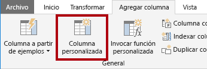

1. En la ventana **Columna personalizada**, en el cuadro **Nuevo nombre de columna**, reemplace el texto por **Cost**.

1. En el cuadro **Fórmula de columna personalizada**, escriba la siguiente expresión (después del símbolo igual):
    - *Puede copiar la expresión desde el archivo **D:\PL300\Labs\02-load-data-with-power-query-in-power-bi-desktop\Assets\Snippets.txt**.*
    - *Esta expresión comprueba si falta el valor **TotalProductCost**. Si falta, genera un valor multiplicando el valor de **OrderQuantity** por el de **StandardCost**; de lo contrario, utiliza el valor existente de **TotalProductCost**.*
    

    `
    if [TotalProductCost] = null then [OrderQuantity] * [StandardCost] else [TotalProductCost]
    `

1. Quite las dos columnas siguientes:

    - TotalProductCost
    - StandardCost

1. Cambie el nombre de las tres columnas siguientes:

    - **OrderQuantity** por **Quantity**
    - **UnitPrice** por **Unit Price** (incluir un espacio)
    - **SalesAmount** por **Sales**

1. Para modificar el tipo de datos de la columna, en el encabezado de columna **Cantidad**, a la izquierda del nombre de la columna, seleccione el icono **1.2** y, luego, **Número entero**.
    
    *Es importante configurar el tipo de datos correcto. Cuando la columna contiene un valor numérico, también es importante elegir el tipo correcto si espera realizar cálculos de matemáticos.*

     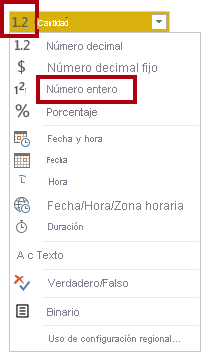

1. Modifique los tipos de datos siguientes de tres columnas a **Número decimal fijo**.
    
    *El tipo de datos de número decimal fijo permite 19 dígitos y permite una mayor precisión para evitar errores de redondeo. Es importante usar el tipo de número decimal fijo para los valores financieros o las tasas (como los tipos de cambio).*

    - Unit Price
    - Sales
    - Costo

1. En la barra de estado, compruebe que la consulta tiene 10 columnas y más de 999 filas.
    
    *Se cargarán un máximo de 1000 filas como datos de vista previa para cada consulta.*

### **Tarea 8: Configuración de la consulta Targets**

En esta tarea, se configurará la consulta **Targets**.

1. Seleccione la consulta **ResellerSalesTargets** y cambie el nombre a **Destinos**.

1. Para anular la dinamización de las columnas de 12 meses (**M01**-**M12**), en primer lugar seleccione varias opciones encabezados de columna **Year** y **EmployeeID**.

1. Haga clic con el botón derecho en cualquiera de los encabezados de selección de columna y, después, en el menú contextual, seleccione **Anular dinamización de otras columnas**.

1. Observe que los nombres de columna aparecen ahora en la columna **Attribute** y los valores aparecen en la columna **Value**.

1. Aplique un filtro a la columna **Value** para quitar los valores de guion (-).

    *Puede que recuerde que el carácter de guion se usó en el archivo CSV de origen para representar cero (0).*

1. Cambie el nombre de las dos columnas siguientes:

    - **Atributo** a **MonthNumber** (no hay espacio)
    - **Value** por **Target**.

1. Para preparar los valores de la columna **MonthNumber**, haga clic con el botón secundario en el encabezado de columna **MonthNumber** y, después, seleccione **Reemplazar valores**.
        
    *Ahora se aplicarán transformaciones para generar una columna de fecha. La fecha se derivará de las columnas **Year** y **MonthNumber**. Creará la columna mediante la característica **Columnas a partir de ejemplos**.*

1. En la ventana **Reemplazar valores**, en el cuadro **Valor para buscar**, escriba **M** y deje la opción **Reemplazar por** vacía.

1. Modifique el tipo de datos de la columna **MonthNumber** a **Número entero**.

1. En la ficha de cinta **Agregar columna**, desde el grupo **General**, seleccione el icono **Columna a partir de ejemplos**.

    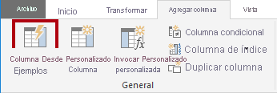

1. Observe que la primera fila es para el año **2017** y el número de mes **7**.

1. En la columna **Column1**, en la primera celda de la cuadrícula, empiece a escribir **7/1/2017** y luego presione **Entrar**.
    
    *La máquina virtual usa la configuración regional de EE. UU., por lo que esta fecha es de hecho el 1 de julio de 2017. Otras configuraciones regionales pueden requerir un **0** antes de la fecha.*

1. Observe que las celdas de la cuadrícula se actualizan con valores previstos.
    
    *La característica ha previsto con precisión que se están combinando valores de las columnas **Year** y **MonthNumber**.*

1. Observe también la fórmula presentada sobre la cuadrícula de consulta.

     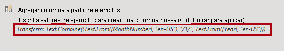

1. Para cambiar el nombre de la nueva columna, haga doble clic en el encabezado de columna **Combinado** y cambie el nombre de la columna como **TargetMonth**.

1. Quite las columnas siguientes:

    - Year
    - MonthNumber

1. Modifique los siguientes tipos de datos de la columna:

    - **Target** por número decimal fijo
    - **TargetMonth** por fecha

1. Para multiplicar los valores de **Destino** por 1000, seleccione el encabezado de columna **Destino** y, después, en la ficha de cinta **Transformar**, desde el grupo **Columna de número**, seleccione **Estándar** y, luego, **Multiplicar**.
    
    *Puede que recuerde que los valores de destino se almacenaron como miles.*

     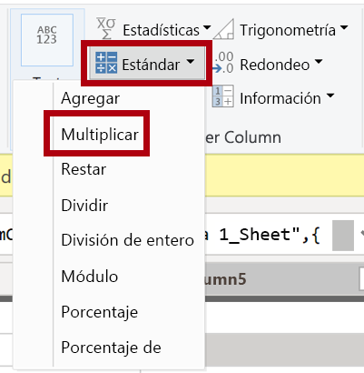

1. En la ventana **Multiplicar**, en el cuadro **Valor** escriba **1000** y seleccione **Aceptar**.

1. En la barra de estado, compruebe que la consulta tiene tres columnas y 809 filas.

### **Tarea 9: Configuración de la consulta ColorFormats**

En esta tarea, se configurará la consulta **ColorFormats**.

1. Seleccione la consulta **ColorFormats** y observe que la primera fila contiene los nombres de columna.

1. En la ficha de cinta **Inicio**, desde el grupo **Transformar**, seleccione **Usar la primera fila como encabezado**.

     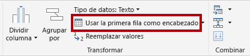

1. En la barra de estado, compruebe que la consulta tiene tres columnas y 10 filas.

### **Tarea 10: Actualización de la consulta Product**

En esta tarea, se actualizará la consulta **Product** mediante la combinación de la consulta **ColorFormats**.

1. Seleccione la consulta **Product**.

1. Para combinar la consulta **ColorFormats**, en la ficha de cinta **Inicio**, seleccione la flecha hacia abajo **Combinar** y, luego, **Combinar consultas**.
    
    *La combinación de consultas permite la integración de datos, en este caso a partir de orígenes de datos diferentes (SQL Server y un archivo CSV).*

     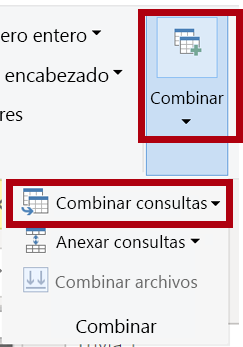

1. En la ventana **Combinar**, en la cuadrícula de consulta **Product**, seleccione el encabezado de columna **Color**.

     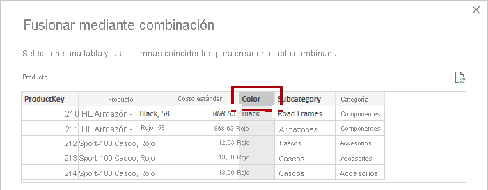

1. Debajo de la cuadrícula de consulta **Product**, en la lista desplegable, seleccione la consulta **ColorFormats**.

     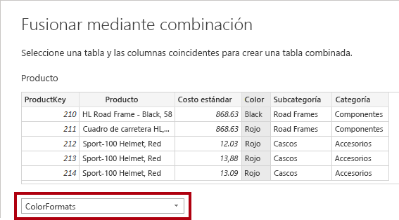

1. En la cuadrícula de consulta **ColorFormats**, seleccione el encabezado de columna **Color**.

1. Cuando se abra la ventana **Niveles de privacidad**, para cada uno de los dos orígenes de datos, en la lista desplegable correspondiente, seleccione **Organizativo** y, a continuación, **Guardar**.
    
    *Los niveles de privacidad se pueden configurar para que el origen de datos determine si los datos se pueden compartir entre orígenes. Establecer cada origen de datos como **Organizativo** les permite compartir datos, en caso necesario. Los orígenes de datos privados nunca se pueden compartir con otros orígenes de datos. Esto no significa que los datos privados no se puedan compartir, sino que el motor de Power Query no puede compartir datos entre los orígenes.*

     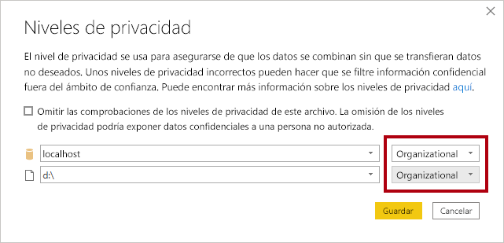

1. En la ventana **Combinar**, use el **Tipo de combinación** predeterminado: mantener la selección de Externa izquierda y seleccionar **Aceptar**.

1. Expanda la columna **ColorFormats** para incluir las dos columnas siguientes:

    - Background Color Format
    - Font Color Format

1. En la barra de estado, compruebe que la consulta tiene 8 columnas y 397 filas.

### **Tarea 11: Actualización de la consulta ColorFormats**

En esta tarea, se actualizará la consulta **ColorFormats** para deshabilitar su carga.

1. Seleccione la consulta **ColorFormats**.

1. En el panel **Configuración de la consulta**, seleccione el vínculo **Todas las propiedades**.

     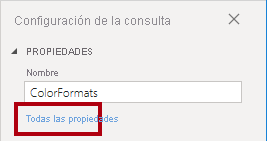

1. En la ventana **Propiedades de la consulta**, desactive la casilla **Habilitar carga para el informe**.
    
    *Deshabilitar la carga significa que no se cargará como una tabla en el modelo de datos. Esto se hace porque la consulta se combinó con la consulta **Producto**, que está habilitada para cargarse en el modelo de datos.*

     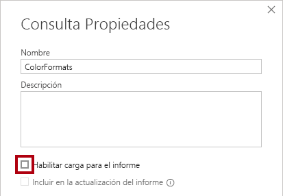

### **Tarea 12: Finalización**

En esta tarea, completará el laboratorio.

1. Compruebe que tiene ocho consultas, con el nombre correcto de la siguiente forma:

    - SalesPerson
    - SalesPersonRegion
    - Product
    - Reseller
    - Region
    - Sales
    - Targets
    - ColorFormats (que no se cargará en el modelo de datos)

1. Para cargar el modelo de datos, en la vista Backstage de **Archivo**, seleccione **Cerrar y aplicar**.
    
    *Todas las consultas habilitadas para carga se cargan ahora en el modelo de datos.*

     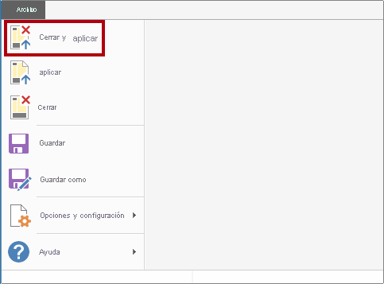

1. En el panel **Campos** (que se encuentra a la derecha), observe las siete tablas que se cargan en el modelo de datos.

     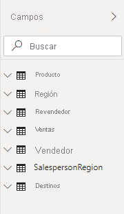

1. Guarde el archivo de Power BI Desktop.

*Configurará tablas y relaciones de modelos de datos en el laboratorio **Modelado de datos en Power BI Desktop**.*
