---
lab:
  title: Modelado de datos en Power BI Desktop, parte 1
  module: Module 4 - Design a Data Model in Power BI
ms.openlocfilehash: cbec1e2dc3bb7738b2e78de88e30b1d56cb79b60
ms.sourcegitcommit: 3520e7d016e94549d408464207c1b91cd47867c2
ms.translationtype: HT
ms.contentlocale: es-ES
ms.lasthandoff: 03/05/2022
ms.locfileid: "139840340"
---
# **Modelado de datos en Power BI Desktop, parte 1**

**El tiempo estimado para completar el laboratorio es de 45 minutos.**

En este laboratorio, comenzará a desarrollar el modelo de datos. Implicará la creación de relaciones entre las tablas y, después, la configuración de las propiedades de tabla y columna para mejorar la facilidad de uso del modelo de datos. También creará jerarquías y medidas rápidas.

En este laboratorio, aprenderá a:

- Crear relaciones de modelos

- Configurar propiedades de tablas y columnas

- Crear jerarquías

### **Caso de laboratorio**

Este laboratorio es una de las muchas series de laboratorios que se diseñaron como una historia completa sobre la preparación de datos para publicarlos como informes y paneles. Puede completar los laboratorios en cualquier orden. Sin embargo, si piensa trabajar en varios de ellos, para los diez primeros le recomendamos que siga el orden siguiente:

1. Preparación de datos en Power BI Desktop

2. Carga de datos en Power BI Desktop

3. **Modelado de datos en Power BI Desktop**

5. Creación de cálculos DAX en Power BI Desktop, parte 1

6. Creación de cálculos DAX en Power BI Desktop, parte 2

7. Diseño de un informe en Power BI Desktop, parte 1

8. Diseño de un informe en Power BI Desktop, parte 2

9. Creación de un panel de Power BI

10. Análisis de datos en Power BI Desktop

11. Aplicación de seguridad de nivel de fila

## **Ejercicio 1: Creación de relaciones del modelo**

En este ejercicio, creará relaciones del modelo.

### **Tarea 1: Primeros pasos**

En esta tarea configurará el entorno para el laboratorio.

*Importante: Si viene de realizar el laboratorio anterior (y lo completó correctamente) no realice esta tarea; en su lugar, continúe con la siguiente.*

1. Para abrir Power BI Desktop, en la barra de tareas, haga clic en el acceso directo de Microsoft Power BI Desktop.

    

1. Para cerrar la ventana de introducción, en la parte superior izquierda de la ventana, haga clic en **X**.

    

1. Para abrir el archivo de inicio de Power BI Desktop, haga clic en la ficha de cinta **Archivo** a fin de abrir la vista Backstage.

1. Seleccione **Abrir informe**.

    

1. Haga clic en **Examinar informes**.

    

1. En la ventana **Abrir**, vaya a la carpeta **D:\PL300\Labs\03-configure-data-model-in-power-bi-desktop\Starter**.

1. Seleccione el archivo **Sales Analysis**.

1. Haga clic en **Abrir**.

    

1. Cierre todas las ventanas informativas que se abran.

1. Para crear una copia del archivo, haga clic en la ficha de cinta **Archivo** para abrir la vista Backstage.

1. Seleccione **Guardar como**.

    

1. Si se le pide que aplique los cambios, haga clic en **Aplicar**.

    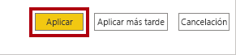

1. En la ventana **Guardar como**, vaya a la carpeta **D:\PL300\MySolution**.

1. Haga clic en **Guardar**.

    

### **Tarea 2: Creación de relaciones del modelo**

En esta tarea, creará relaciones del modelo.

1. En Power BI Desktop, en la parte izquierda, haga clic en el icono de la vista **Modelo**.

    

2. Si no ve las siete tablas, desplácese horizontalmente hacia la derecha y, después, arrastre y junte las tablas para poder verlas todas al mismo tiempo.

    *Sugerencia: También puede utilizar el control de zoom situado en la parte inferior de la ventana.*

    *En la vista Modelo, se pueden ver las tablas y las relaciones (conectores entre tablas). Actualmente no hay ninguna relación porque deshabilitó las opciones de relación de carga de datos en el laboratorio **Preparación de datos en Power BI Desktop**.*

3. Para volver a la vista Informe, a la izquierda, haga clic en el icono de la vista **Informe**.

    

4. Para ver todos los campos de tabla, en el panel **Campos**, haga clic con el botón derecho en un área vacía y, después, seleccione **Expandir todo**.

    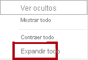

5. Para crear un objeto visual de tabla, en el panel **Campos**, desde dentro de la tabla **Product** (Producto), active el campo **Categoría**.

    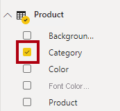

    *Los laboratorios usan una notación abreviada para hacer referencia a un campo. Tendrá este aspecto: **Producto \| Categoría**. En este ejemplo, **Product** es el nombre de la tabla y **Category** es el nombre del campo.*

6. Para agregar una columna adicional a la tabla, en el panel **Campos**, active el campo **Sales \| Sales** (Ventas | Ventas).

7. Observe que en el objeto visual de tabla se enumeran cuatro categorías de productos y que el importe de ventas es el mismo para cada una de ellas, y el mismo para el total.

    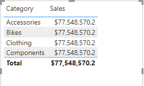

    *El problema es que la tabla se basa en campos de otras tablas. La expectativa es que en cada categoría de producto se muestren las ventas de esa categoría. Pero como no hay una relación del modelo entre estas tablas, la tabla **Sales** (Ventas) no se filtra. Ahora agregará una relación para propagar los filtros entre las tablas.*

8. En la pestaña **Modelado** de la cinta, en el grupo **Relaciones**, haga clic en **Administrar relaciones**.

    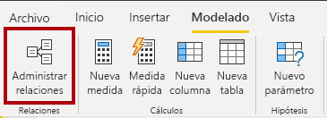

9. En la ventana **Administrar relaciones**, observe que todavía no se ha definido ninguna relación.

10. Para crear una relación, haga clic en **Nueva**.

    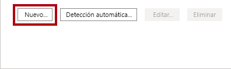

11. En la ventana **Crear relación**, en la primera lista desplegable, seleccione la tabla **Product** (Producto).

    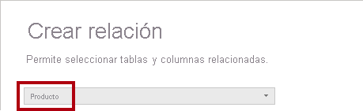

12. En la segunda lista desplegable (bajo la cuadrícula de la tabla **Product**), seleccione la tabla **Sales** (Ventas).

    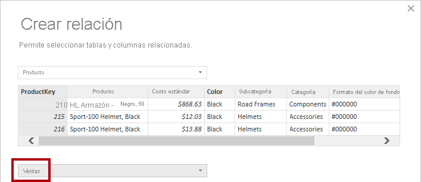

13. Observe que se han seleccionado automáticamente las columnas **ProductKey** (Clave de producto) de cada tabla.

    *Las columnas se han seleccionado porque comparten los mismos nombre y tipo de datos.*

14. En la lista desplegable **Cardinalidad**, observe que se ha seleccionado **Uno a varios (1:*)**.

    *La cardinalidad se ha detectado de forma automática, ya que Power BI entiende que la columna **ProductKey** de la tabla **Product** contiene valores únicos. Las relaciones uno a varios son la cardinalidad más común y todas las relaciones que cree en este laboratorio serán de este tipo. Trabajará con una cardinalidad de varios a varios en el laboratorio **Modelado de datos en Power BI Desktop, parte 2**.*

15. En la lista desplegable **Dirección del filtro cruzado**, observe que está seleccionado el valor **Único**.

    *La dirección de filtro único significa que los filtros se propagan de "un lado" a "varios lados". En este caso, significa que los filtros que se aplican a la tabla **Product** se propagarán a la tabla **Sales**, pero no en la dirección contraria. Trabajará con una relación bidireccional en el laboratorio **Modelado de datos en Power BI Desktop, parte 2**.*

16. Observe que la opción **Mark This Relationship Active** (Marcar esta relación activa) está seleccionada.

    *Las relaciones activas propagan los filtros. Una relación se puede marcar como inactiva para que los filtros no se propaguen. Pueden existir relaciones inactivas cuando hay varias rutas de relación entre las tablas. En este caso, los cálculos del modelo pueden usar funciones especiales para activarlas. Trabajará con una relación inactiva en el laboratorio **Modelado de datos en Power BI Desktop, parte 2**.*

17. Haga clic en **OK**.

    

18. En la ventana **Administrar relaciones**, observe que aparece la nueva relación y, después, haga clic en **Cerrar**.

    

19. En el informe, observe que el objeto visual de tabla se ha actualizado a fin de mostrar valores diferentes para cada categoría de producto.

    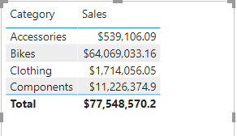

    *Los filtros que se aplican a la tabla **Product** ahora se propagan a la tabla **Sales**.*

20. Cambie a la vista Modelo y observe que ahora hay un conector entre las dos tablas (no importa si las tablas están situadas unas junto a otras).

    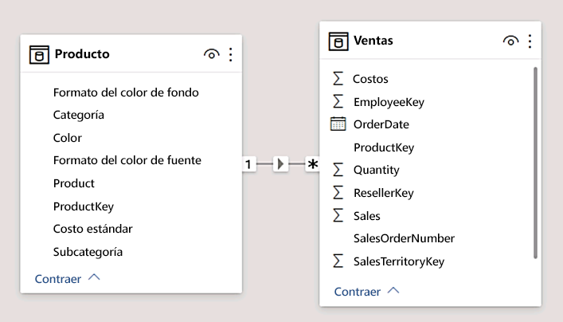

21. En el diagrama, observe que puede interpretar la cardinalidad, que la representan los indicadores **1** y *****.

    *La dirección del filtro se representa mediante la punta de la flecha. Una línea continua representa una relación activa; una línea discontinua representa una relación inactiva.*

22. Mantenga el cursor sobre la relación para resaltar las columnas relacionadas.

    *Hay una manera más fácil de crear una relación. En el diagrama del modelo, puede arrastrar y colocar columnas para crear una relación.*

23. Para crear una relación mediante una técnica distinta, en la tabla **Reseller** (Revendedor), arrastre la columna **ResellerKey** (Clave de revendedor) a la columna **ResellerKey** de la tabla **Sales**.

    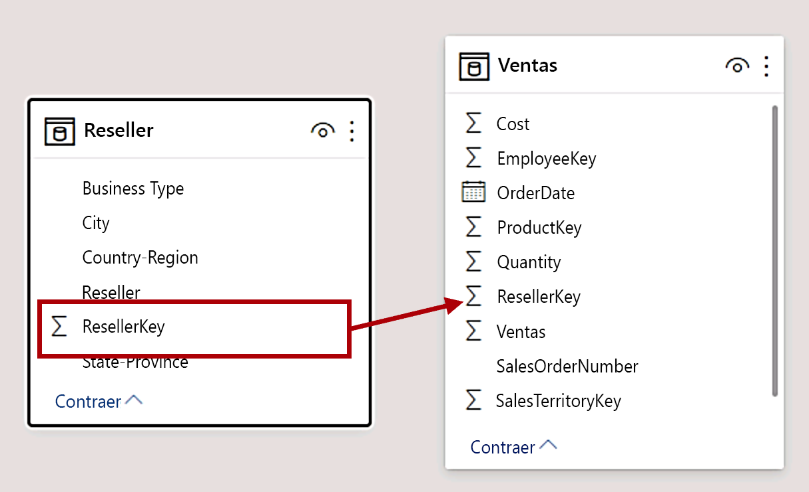

    *Sugerencia: A veces una columna no se deja arrastrar. Si se produce esta situación, seleccione otra columna y, después, vuelva a seleccionar la columna que quiere arrastrar e inténtelo de nuevo. Cerciórese de que se ve la nueva relación agregada al diagrama.*

24. Use la técnica nueva para crear las dos relaciones de modelo siguientes:

    - De **Region \| SalesTerritoryKey** (Región | Clave de territorio de ventas) a **Sales \| SalesTerritoryKey** (Ventas | Clave de territorio de ventas)

    - De **Salesperson \| EmployeeKey** (Vendedor | Clave de empleado) a **Sales \| EmployeeKey** (Ventas | Clave de empleado)

    *En este laboratorio, las tablas **SalespersonRegion** y **Targets** permanecerán desconectadas. Hay una relación de varios a varios entre vendedores y regiones, y se trabajará con este escenario avanzado en el laboratorio **Modelado de datos en Power BI Desktop, parte 2**.*

25. En el diagrama, organice las tablas para que la tabla **Sales** se coloque en el centro del diagrama y las tablas relacionadas estén organizadas a su alrededor. Coloque las tablas desconectadas al lado.

    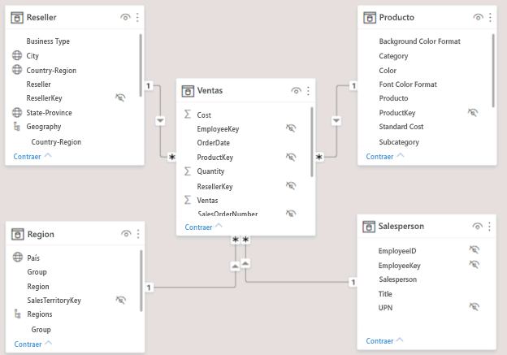

26. Guarde el archivo de Power BI Desktop.

## **Ejercicio 2: Configuración de tablas**

En este ejercicio, para configurar cada tabla creará jerarquías y ocultará, aplicará formato y clasificará las columnas.

### **Tarea 1: Configuración de la tabla Product**

En esta tarea, configurará la tabla **Product**.

1. En la vista Modelo, en el panel **Campos**, expanda la tabla **Product** si es necesario para mostrar todos los campos.

2. Para crear una jerarquía, en el panel **Campos**, haga clic con el botón derecho en la columna **Categoría** y, después, seleccione **Crear jerarquía**.

    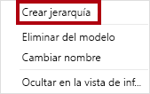

3. En el panel **Propiedades** (a la izquierda del panel **Campos**), reemplace el texto en el cuadro **Nombre** con **Products**.

    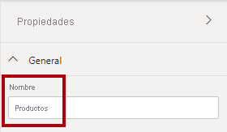

4. Para agregar el segundo nivel de jerarquía, en el panel **Propiedades**, en la lista desplegable **Jerarquía**, seleccione **Subcategoría** (es posible que tenga que desplazarse hacia abajo dentro del panel).

5. Para agregar el tercer nivel a la jerarquía, seleccione **Product** en la lista desplegable **Jerarquía**.

6. Para completar el diseño de la jerarquía, haga clic en **Aplicar cambios en el nivel**.

    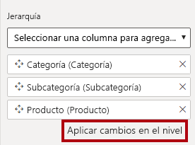

    *Sugerencia: No olvide hacer clic en **Aplicar cambios en el nivel**; es un error común pasar por alto este paso.*

7. En el panel **Campos**, observe la jerarquía **Products**.

    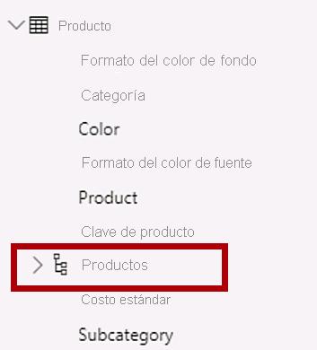

8. Para mostrar los niveles de la jerarquía, expanda la jerarquía **Products**.

    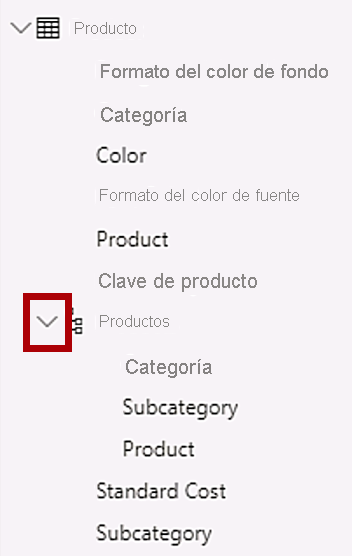

9. Para organizar las columnas en una carpeta para mostrar, seleccione primero la columna **Formato de color de fondo** en el panel **Campos**.

10. Mientras presiona la tecla **Ctrl**, seleccione la columna **Formato de color de fuente**.

11. En el panel **Propiedades**, en el cuadro **Carpeta para mostrar**, escriba **Formato**.

    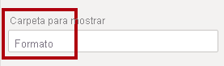

12. En el panel **Campos**, observe que ahora las dos columnas están dentro de una carpeta.

    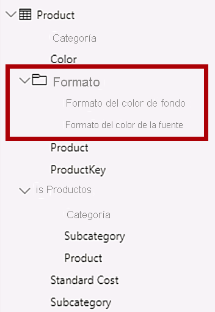

    *Las carpetas para mostrar son una excelente manera de descongestionar las tablas, especialmente las que contienen muchos campos.*

### **Tarea 2: Configuración de la tabla Region**

En esta tarea, configurará la tabla **Region**.

1. En la tabla **Region**, cree una jerarquía denominada **Regions** (Regiones), con los tres niveles siguientes:

    - Group (Grupo)

    - Country (País)

    - Region

    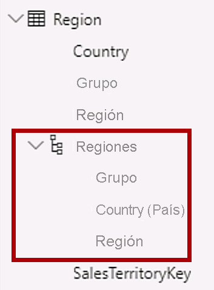

2. Seleccione la columna **Country** (País) (no el nivel de jerarquía **Country**).

3. En el panel **Propiedades**, expanda la sección **Avanzado** en la parte inferior del panel y, después, en la lista desplegable **Categoría de datos**, seleccione **País o región**.

    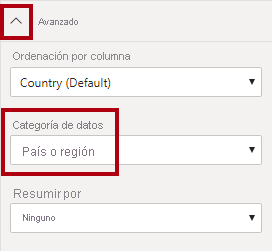

    *La categorización de datos puede proporcionar sugerencias al diseñador de informes. En este caso, la categorización de la columna como país o región proporciona información más precisa a Power BI cuando representa una visualización de mapa.*

### **Tarea 3: Configuración de la tabla Reseller**

En esta tarea, se configurará la tabla **Reseller**.

1. En la tabla **Reseller**, cree una jerarquía denominada **Resellers**, con los dos niveles siguientes:

    - Business Type (Tipo de empresa)

    - Reseller

    

2. Cree una segunda jerarquía denominada **Geography** (Geografía), con los cuatro niveles siguientes:

    - Country-Region (País o región)

    - State-Province

    - City (Ciudad)

    - Reseller

    

3. Clasifique las tres columnas siguientes:

    - **Country-Region** como **País o región**

    - **State-Province** como **Estado o provincia**

    - **City** como **Ciudad**

### **Tarea 4: Configuración de la tabla Sales**

En esta tarea, se configurará la tabla **Sales**.

1. En la tabla **Sales**, seleccione la columna **Cost**.

2. En el panel **Propiedades**, en el cuadro **Descripción**, escriba: **Basado en el costo estándar**

    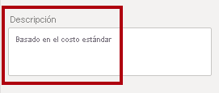

    *Las descripciones se pueden aplicar a tablas, columnas, jerarquías o medidas. En el panel **Campos**, el texto descriptivo se muestra en una información sobre herramientas cuando el autor del informe mantiene el cursor sobre el campo.*

3. Seleccione la columna **Cantidad**.

4. En el panel **Propiedades**, desde dentro de la sección **Formato**, deslice la propiedad **Separador de miles** a **Activar**.

    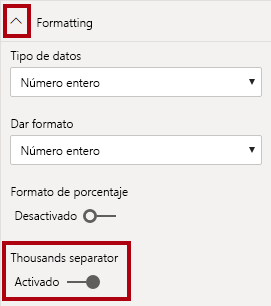

5. Seleccione la columna **Precio unitario**.

6. En el panel **Propiedades**, desde dentro de la sección **Formato**, deslice la propiedad **Lugares decimales** a **2**.

7. En el grupo **Avanzado** (es posible que tenga que desplazarse hacia abajo para encontrarlo), en la lista desplegable **Resumir por**, seleccione **Promedio**.

    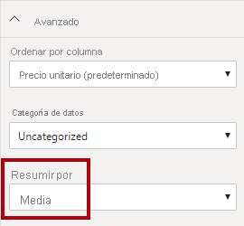

    *De forma predeterminada, las columnas numéricas se resumen mediante la suma de valores. Este comportamiento predeterminado no es adecuado para una columna como **Precio unitario**, que representa una tarifa. Al establecer el resumen predeterminado en promedio se generará un resultado significativo.*

### **Tarea 5: Actualización masiva de propiedades**

En esta tarea, actualizará varias columnas mediante actualizaciones únicas masivas. Usará este enfoque para ocultar columnas y dar formato a los valores de columna.

1. En el panel **Campos**, seleccione la columna **Product \| ProductKey**.

2. Mientras presiona la tecla **Ctrl**, seleccione las 13 columnas siguientes (que abarcan varias tablas):

    - Region \| SalesTerritoryKey

    - Reseller \| ResellerKey

    - Sales \| EmployeeKey
    
    - Ventas \| ProductKey

    - Sales \| ResellerKey

    - Sales \| SalesOrderNumber

    - Sales \| SalesTerritoryKey

    - Salesperson \| EmployeeID

    - Salesperson \| EmployeeKey

    - Salesperson \| UPN

    - SalespersonRegion \| EmployeeKey

    - SalespersonRegion \| SalesTerritoryKey

    - Targets \| EmployeeID

3. En el panel **Propiedades**, deslice la propiedad **Está oculta** a **Activar**.

    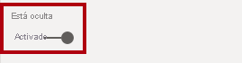

    *Las columnas estaban ocultas porque las usan las relaciones, o se usarán en la configuración de seguridad de nivel de fila o en la lógica de cálculo.*

    *Definirá la seguridad de nivel de fila en el laboratorio **Modelado de datos en Power BI Desktop, parte 2** mediante la columna **UPN**. Usará **SalesOrderNumber** en un cálculo en el laboratorio **Creación de cálculos DAX en Power BI Desktop, parte 1**.*

4. Seleccione las tres columnas siguientes:

    - Product \| Standard Cost

    - Sales \| Cost

    - Sales \| Sales

5. En el panel **Propiedades**, desde dentro de la sección **Formato**, establezca la propiedad **Lugares decimales** en **0**.

    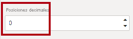

## **Ejercicio 3: Revisión de la interfaz del modelo**

En este ejercicio, cambiará a la vista Informe y revisará la interfaz del modelo.

### **Tarea 1: Revisión de la interfaz del modelo**

En esta tarea, cambiará a la vista Informe y revisará la interfaz del modelo.

1. Cambio a la vista Informe.

2. En el panel **Campos**, observe lo siguiente:

    - Las columnas, las jerarquías y sus niveles son campos, que se pueden usar para configurar los objetos visuales del informe

    - Solo se ven los campos relevantes para la creación de informes

    - La tabla **SalespersonRegion** no es visible porque todos sus campos están ocultos

    - Los campos espaciales de la tabla **Region** y **Reseller** se etiquetan con un icono espacial

    - Los campos con la etiqueta sigma (Ʃ) se resumirán, de forma predeterminada

    - Aparece una información sobre herramientas al mantener el cursor sobre el campo **Sales \| Cost** (Ventas | Costo).

3. Expanda el campo **Sales \| OrderDate** (Ventas | Fecha de pedido) y, después, observe que muestra una jerarquía de fecha.

    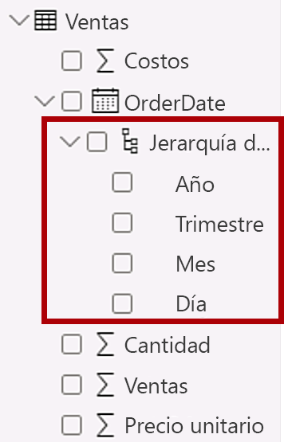

    *El campo **Targets \| TargetMonth** (Destinos | Mes de destino) presenta una jerarquía similar. Estas jerarquías no las ha creado. Se han creado de forma automática. Pero hay un problema. El año fiscal de Adventure Works comienza el 1 de julio de cada año. Pero en estas jerarquías de fechas creadas automáticamente, la jerarquía de fecha comienza el 1 de enero de cada año.*

    *Ahora se desactivará este comportamiento automático. En el laboratorio **Creación de cálculos DAX en Power BI Desktop, parte 1**, usará DAX para crear una tabla de fechas y configurarla para definir el calendario de Adventure Works.*

4. Para desactivar la fecha y hora automáticas, haga clic en la ficha **Archivo** de la cinta para abrir la vista Backstage.

5. A la izquierda, elija **Opciones y configuración** y seleccione **Opciones**.

    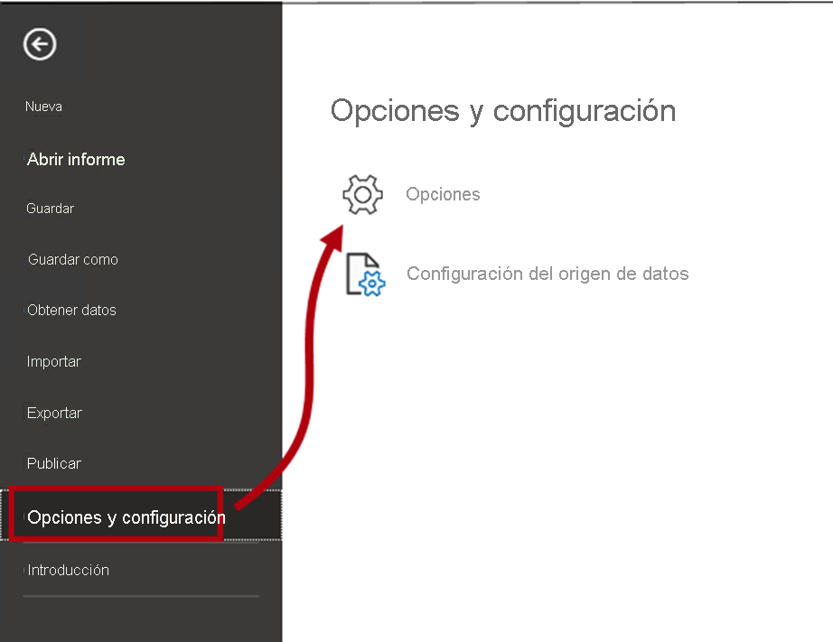

6. En la ventana **Opciones**, a la izquierda, en el grupo **Archivo actual**, seleccione **Carga de datos**.

    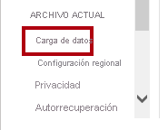

7. En la sección **Inteligencia de tiempo**, desactive **Fecha y hora automáticas**.

    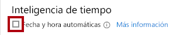

8. Haga clic en **OK**.

    

9. En el panel **Campos**, observe que las jerarquías de fecha ya no están disponibles.

    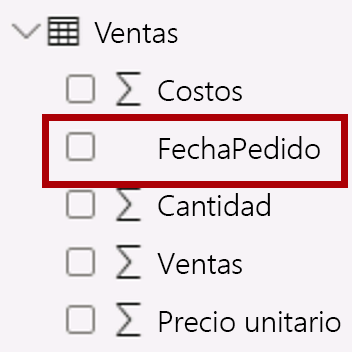

### **Tarea 2: Finalización**

En esta tarea, completará el laboratorio.

1. Guarde el archivo de Power BI Desktop.

2. Si se le pide que aplique las consultas, haga clic en **Aplicar más tarde**.

3. Si quiere iniciar el siguiente laboratorio, deje Power BI Desktop abierto.

    *Mejorará el modelo de datos configurando una relación de varios a varios y seguridad de nivel de fila en el laboratorio **Modelado de datos en Power BI Desktop, parte 2**.*
