---
lab:
  title: "Creación de cálculos DAX en Power\_BI Desktop, parte\_1"
  module: 5 - Create Model Calculations using DAX in Power BI
---


# <a name="create-dax-calculations-in-power-bi-desktop-part-1"></a>Creación de cálculos DAX en Power BI Desktop, parte 1

**El tiempo estimado para completar el laboratorio es de 45 minutos.**

En este laboratorio, creará tablas calculadas, columnas calculadas y medidas simples mediante expresiones de análisis de datos (DAX).

En este laboratorio, aprenderá a:

- Crear tablas calculadas

- Crear columnas calculadas

- Crear medidas

### <a name="lab-story"></a>**Caso de laboratorio**

Este laboratorio es una de las muchas series de laboratorios que se diseñaron como una historia completa sobre la preparación de datos para publicarlos como informes y paneles. Puede completar los laboratorios en cualquier orden. Sin embargo, si piensa trabajar en varios de ellos, le recomendamos que siga el orden siguiente:

1. Preparación de datos en Power BI Desktop

2. Carga de datos en Power BI Desktop

3. Diseño de un modelo de datos en Power BI

4. **Creación de cálculos DAX en Power BI Desktop, parte 1**

5. Creación de cálculos DAX en Power BI Desktop, parte 2

6. Diseño de un informe en Power BI Desktop, parte 1

7. Diseño de un informe en Power BI Desktop, parte 2

8. Análisis de datos con objetos visuales de IA

9. Creación de un panel de Power BI

10. Aplicación de seguridad de nivel de fila

## <a name="exercise-1-create-calculated-tables"></a>**Ejercicio 1: Creación de tablas calculadas**

En este ejercicio, creará dos tablas calculadas. La primera será la tabla **Salesperson** (Comercial), para permitir una relación directa entre esta y la tabla **Sales** (Ventas). La segunda será la tabla **Date** (Fecha).

### <a name="task-1-get-started"></a>**Tarea 1: Primeros pasos**

En esta tarea configurará el entorno para el laboratorio.

*Importante: Si viene de realizar el laboratorio anterior (y lo completó correctamente) no realice esta tarea; en su lugar, continúe con la siguiente.*

1. Para abrir Power BI Desktop, en la barra de tareas, haga clic en el acceso directo de Microsoft Power BI Desktop.

    

1. Para cerrar la ventana de introducción, en la parte superior izquierda de la ventana, haga clic en **X**.

    

1. Para abrir el archivo de inicio de Power BI Desktop, haga clic en la ficha de cinta **Archivo** a fin de abrir la vista Backstage.

1. Seleccione **Abrir informe**.

    

1. Haga clic en **Examinar informes**.

    

1. En la ventana **Abrir**, vaya a la carpeta **D:\PL300\Labs\04-create-dax-calculations-in-power-bi-desktop\Starter**.

1. Seleccione el archivo **Sales Analysis**.

1. Haga clic en **Abrir**.

    

1. Cierre todas las ventanas informativas que se abran.

1. Para crear una copia del archivo, haga clic en la ficha de cinta **Archivo** para abrir la vista Backstage.

1. Seleccione **Guardar como**.

    

1. Si se le pide que aplique los cambios, haga clic en **Aplicar**.

    

1. En la ventana **Guardar como**, vaya a la carpeta **D:\PL300\MySolution**.

1. Haga clic en **Guardar**.

    

### <a name="task-2-create-the-salesperson-table"></a>**Tarea 2: Creación de la tabla Salesperson**

En esta tarea, creará la tabla **Salesperson** (Comercial) (relación directa con **Sales** [Ventas]).

1. En Power BI Desktop, en la vista Informe, en la cinta de opciones **Modelado**, en el grupo **Cálculos**, haga clic en **Nueva tabla**.

    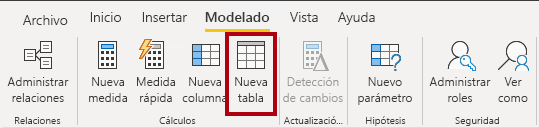

2. En la barra de fórmulas (que se abre directamente debajo de la cinta al crear o editar cálculos), escriba **Salesperson =**, presione **Mayús + Entrar**, escriba **"Salesperson (Performance)"** (Comercial [rendimiento]) y, a continuación, presione **Entrar**.

    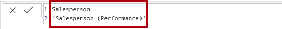

    *Para su comodidad, todas las definiciones de DAX de este laboratorio se pueden copiar del archivo de fragmentos de código, situado en **D:\PL300\Labs\04-create-dax-calculations-in-power-bi-desktop\Assets\Snippets.txt**.*

    *Una tabla calculada se crea especificando primero el nombre de la tabla, seguido del símbolo igual (=), y luego una fórmula DAX que devuelve una tabla. Tenga en cuenta que el nombre de la tabla no puede existir ya en el modelo de datos.*

    *La barra de fórmulas admite la entrada de una fórmula DAX válida. Incluye características como autocompletar, IntelliSense y codificación de colores, lo que le permite escribir la fórmula de forma rápida y precisa.*

    *Esta definición de tabla crea una copia de la tabla **Salesperson (Performance)** (Comercial [rendimiento]). Solo copia los datos, pero no se copian las propiedades del modelo, como la visibilidad, el formato, etc.*

    *Sugerencia: Se recomienda escribir "espacio en blanco" (es decir, retornos de carro y tabulaciones) para diseñar fórmulas en un formato intuitivo y fácil de leer, especialmente cuando las fórmulas son largas y complejas. Para especificar un retorno de carro, presione **Mayús + Entrar**. El "espacio en blanco" es opcional.*

3. En el panel **Campos**, observe que el icono de tabla es un sombreado azul (lo que denota una tabla calculada).

    

    *Las tablas calculadas se definen mediante una fórmula DAX que devuelve una tabla. Es importante comprender que las tablas calculadas aumentan el tamaño del modelo de datos porque materializan y almacenan valores. Se vuelven a calcular cada vez que se actualizan las dependencias de fórmula, como sucede en este modelo de datos cuando se cargan valores de fecha nuevos (futuros) en las tablas.*

    *A diferencia de las tablas con origen en Power Query, las tablas calculadas no se pueden usar para cargar datos de orígenes de datos externos. Solo pueden transformar datos en función de lo que ya se haya cargado en el modelo de datos.*

4. Cambie a la vista Modelo.

5. Observe que la tabla **Salesperson** (Comercial) está disponible (tenga cuidado, puede que esté oculta en la vista. En este caso, desplácese horizontalmente para encontrarla).

6. Cree una relación desde la columna **Salesperson \| EmployeeKey** (Comercial | Clave de empleado) a la columna **Sales \| EmployeeKey** (Ventas | Clave de empleado).

7. Haga clic con el botón derecho en la relación inactiva entre las tablas **Salesperson (Performance)** (Comercial [Rendimiento]) y **Sales** (Ventas) y, a continuación, seleccione **Eliminar**.

    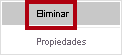

8. Cuando se le pida que confirme la eliminación, haga clic en **Aceptar**.

    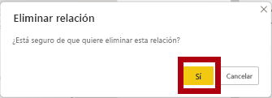

9. En la tabla **Salesperson** (Vendedor), seleccione varias columnas y, después, ocúltelas (establezca la propiedad **Is Hidden** (Está oculto) en **Sí**):

    - EmployeeID (Id. de empleado)

    - EmployeeKey (Clave de empleado)

    - UPN (Nombre principal de usuario)

10. En el diagrama del modelo, seleccione la tabla **Salesperson** (Comercial).

11. En el panel **Propiedades**, en el cuadro **Descripción**, escriba: **Salesperson related to Sales** (Comercial relacionado con ventas)

    *Recordará que las descripciones aparecen como información sobre herramientas en el panel **Campos** cuando el usuario mantiene el puntero sobre una tabla o un campo.*

12. En la tabla **Salesperson (Performance)** (Comercial [rendimiento]), establezca la descripción en: **Salesperson related to region(s)** (Comercial relacionado con regiones)

    *El modelo de datos ahora proporciona dos alternativas al analizar comerciales. La tabla **Salesperson** (Comercial) permite analizar las ventas realizadas por un comercial, mientras que la tabla **Salesperson (Performance)** (Comercial [rendimiento]) permite el análisis de las ventas realizadas en las regiones de ventas asignadas al comercial.*

### <a name="task-3-create-the-date-table"></a>**Tarea 3: Creación de la tabla Date (Fecha)**

En esta tarea, creará la tabla **Date** (Fecha).

1. Cambie a la vista de datos.

    

2. En la pestaña **Inicio** de la cinta de opciones, desde el grupo **Cálculos**, haga clic en **Nueva tabla**.

    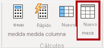

3. En la barra de fórmulas, escriba lo siguiente:


    **DAX**


    ```
    Date =  
    CALENDARAUTO(6)
    ```


    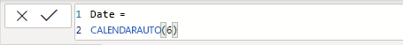

    
    *La función CALENDARAUTO() devuelve una tabla de una sola columna que consta de valores de fecha. El comportamiento "automático" examina todas las columnas de fecha del modelo de datos para determinar los valores de fecha más antiguos y más recientes almacenados en el modelo de datos. Después, crea una fila para cada fecha dentro de este intervalo, ampliando el intervalo en cualquier dirección para asegurarse de que se almacenan los años completos de datos.*

    *Esta función puede tomar un único argumento opcional, que es el último número de mes de un año. Cuando se omite, el valor es 12, lo que significa que diciembre es el último mes del año. En este caso, se escribe 6, lo que significa que junio es el último mes del año.*

4. Observe la columna de valores de fecha.

    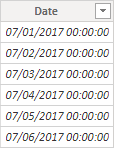

    *Las fechas que se muestran con el formato de la configuración regional de EE. UU (esto es, mm/dd/aaaa).*

5. En la esquina inferior izquierda, en la barra de estado, observe las estadísticas de la tabla, que confirman que se han generado 1826 filas de datos, lo cual representa datos de cinco años completos.

    

### <a name="task-4-create-calculated-columns"></a>**Tarea 4:** **Creación de columnas calculadas**

En esta tarea, agregará columnas adicionales para habilitar el filtrado y la agrupación por periodos de tiempo diferentes. También creará una columna calculada para controlar el criterio de ordenación de otras columnas.

*Para su comodidad, todas las definiciones de DAX de este laboratorio se pueden copiar del archivo de fragmentos de código, situado en **D:\PL300\Labs\04-create-dax-calculations-in-power-bi-desktop\Assets\Snippets.txt**.*

1. En la cinta contextual **Herramientas de tabla**, desde el grupo **Cálculos**, haga clic en **Nueva columna**.

    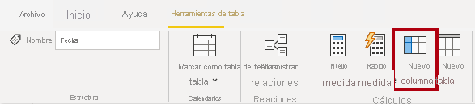

2. En la barra de fórmulas, escriba lo siguiente (o copie desde el archivo de fragmentos de código) y luego presione **Entrar**:


    **DAX**


    ```
    Year =
    "FY" & YEAR('Date'[Date]) + IF(MONTH('Date'[Date]) > 6, 1)
    ```


    *Una columna calculada se crea especificando primero el nombre de la columna, seguido del símbolo igual (=), y luego una fórmula DAX que devuelve un resultado de valor único. El nombre de columna no puede existir ya en la tabla.*

    *La fórmula utiliza el valor del año de la fecha, pero agrega uno al valor de año cuando el mes es posterior a junio. Así es como se calculan los años fiscales de Adventure Works.*

3. Compruebe que se ha agregado la nueva columna.

    

4. Use las definiciones de archivo de fragmentos de código para crear las siguientes dos columnas calculadas para la tabla **Date** (Fecha):

    - Quarter (Trimestre)

    - Month (Mes)

    

5. Para validar los cálculos, cambie a la vista Informe.

6. Para crear una nueva página del informe, en la parte inferior izquierda, haga clic en el icono del signo más.

    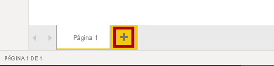

7. Para agregar un objeto visual de matriz a la nueva página de informe, en el panel **Visualizaciones**, seleccione el tipo de objeto visual de matriz.

    *Sugerencia: Puede mantener el cursor sobre cada icono para mostrar una información sobre herramientas que describa el tipo de objeto visual.*

    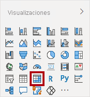

8. En el panel **Campos**, desde la tabla **Date** (Fecha), arrastre el campo **Year** (Año) hasta el apartado o área **Rows** (Filas).

    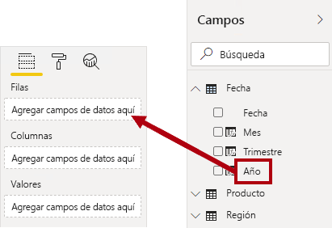

9. Arrastre el campo **Month** (Mes) hasta el apartado o área **Rows** (Filas), directamente debajo del campo **Year** (Año).

    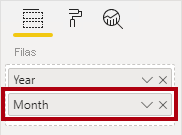

10. En la parte superior derecha del objeto visual de matriz (o en la parte inferior, según la ubicación del objeto visual), haga clic en el icono de flecha doble bifurcada (que expandirá todos los años hacia abajo un nivel).

    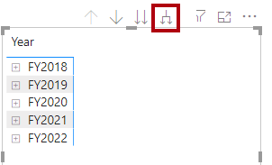

11. Observe que los años se expanden hasta meses y que los meses se ordenan alfabéticamente en lugar de cronológicamente.

    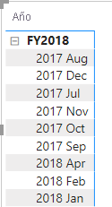

    *De forma predeterminada, los valores de texto se ordenan alfabéticamente, los números se ordenan de menor a mayor y las fechas se ordenan de la más antigua a la más reciente.*

12. Para personalizar el criterio de ordenación del campo **Month** (Mes), cambie a la vista de datos.

13. Agregue la columna **MonthKey** (Clave de mes) a la tabla **Date** (Fecha).


    **DAX**


    ```
    MonthKey =
    (YEAR('Date'[Date]) * 100) + MONTH('Date'[Date])
    ```


    *Esta fórmula calcula un valor numérico para cada combinación de año/mes.*

14. En la vista de datos, compruebe que la nueva columna contiene valores numéricos (por ejemplo, 201707 para julio de 2017, etc.).

    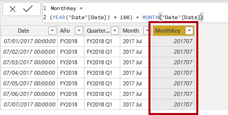

15. Cambie a la vista Informe.

16. En el panel **Campos**, asegúrese de que esté seleccionado el campo **Month** (Mes) (cuando se selecciona, tendrá un fondo gris oscuro).

17. En la cinta contextual **Herramientas de columna**, en el grupo **Ordenar**, haga clic en **ordenar por columna** y, a continuación, seleccione **MonthKey** (Clave de mes).

    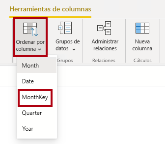

18. En el objeto visual de matriz, observe que los meses ahora se ordenan cronológicamente.

    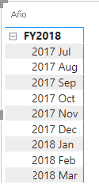

### <a name="task-5-complete-the-date-table"></a>**Tarea 5:** **Completado de la tabla Date (Fecha)**

En esta tarea, completará el diseño de la tabla **Date** (Fecha) ocultando una columna y creando una jerarquía. A continuación, creará relaciones con las tablas **Sales** (Ventas) y **Targets** (Objetivos).

1. Cambie a la vista Modelo.

2. En la tabla **Date** (Fecha), oculte la columna**MonthKey** (Clave de mes) (establezca **Está oculto** en **Sí**).

3. En el panel lateral de la derecha **Campos**, seleccione la tabla **Date** (Fecha), haga clic con el botón derecho en la columna **Year**(Año) y seleccione **Crear jerarquía**. 

4. Cambie el nombre de la jerarquía recién creada a **Fiscal** haciendo clic con el botón derecho y seleccionando **Cambiar nombre**. 
5. Agregue los dos campos restantes a la jerarquía Fiscal; para ello, selecciónelos en el panel campos, haga clic con el botón derecho y seleccione**Agregar a la jerarquía** -> **Fiscal**.
    
    - Quarter (Trimestre)

    - Month (Mes)

    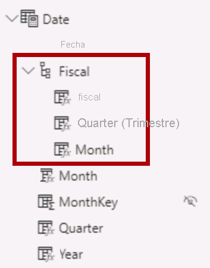

6. Cree las dos relaciones de modelo siguientes:

    - **Date \| Date** (Fecha | Fecha) a **Sales \| OrderDate** (Ventas | Fecha de pedido)

    - **Date \| Date** (Fecha | Fecha) a **Targets \| TargetMonth** (Objetivos | Mes de destino)

7. Oculte las dos columnas siguientes:

    - Sales \| OrderDate (Ventas | Fecha de pedido)

    - Targets \| TargetMonth (Objetivos | Mes de destino)

### <a name="task-6-mark-the-date-table"></a>**Tarea 6: Marcado de la tabla Date (Fecha)**

En esta tarea, marcará la tabla **Date** (Fecha) como tabla de fechas.

1. Cambie a la vista Informe.

2. En el panel **Campos**, seleccione la tabla **Date** (Fecha) (no el campo **Date**).

3. En la cinta contextual **Herramientas de tabla**, en el grupo **Calendarios**, haga clic en **Marcar como tabla de fechas** y, a continuación, seleccione **Marcar como tabla de fechas**.

    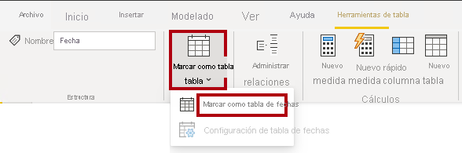

4. En la ventana **Marcar como tabla de fechas**, en la lista desplegable **Columna de fecha**, seleccione **Fecha**.

    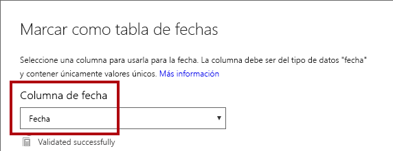

5. Haga clic en **Aceptar**.

    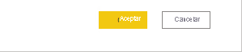

6. Guarde el archivo de Power BI Desktop.

    *Power BI Desktop ahora entiende que esta tabla define la fecha (tiempo). Esto es importante cuando se confía en cálculos de inteligencia de tiempo. Trabajará con cálculos de inteligencia de tiempo en el laboratorio **Creación de cálculos DAX en Power BI Desktop, parte 2**.*

    *Tenga en cuenta que este enfoque de diseño para una tabla de fechas es adecuado cuando no tiene una tabla de fechas en el origen de datos. Si tiene un almacenamiento de datos, sería adecuado cargar los datos de fecha desde su tabla de dimensiones de fecha en lugar de "redefinir" la lógica de datos en el modelo de datos.*

## <a name="exercise-2-create-measures"></a>**Ejercicio 2: Creación de medidas**

En este ejercicio, creará y dará formato a varias medidas.

### <a name="task-1-create-simple-measures"></a>**Tarea 1: Creación de medidas simples**

En esta tarea, creará medidas simples. Las medidas simples agregan valores en una sola columna o recuento de filas de una tabla.

1. En la vista Informe, en la **Página 2**, en el panel **Campos**, arrastre el campo **Sales \| Unit Price** (Ventas | Precio unitario) en el objeto visual de matriz.

    *Los laboratorios usan una notación abreviada para hacer referencia a un campo. Tendrá este aspecto: **Sales \| Unit Price** (Ventas | Precio unitario). En este ejemplo, **Sales** (Ventas) es el nombre de la tabla y **Unit Price** (Precio unitario) es el nombre del campo.*

    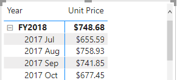

    *Recordará que en el laboratorio **Modelado de datos en Power BI Desktop** configuró la columna **Precio de venta** para resumir por **Media**. El resultado que se ve en el objeto visual de matriz es el precio unitario promedio mensual (suma de los valores de precio unitario dividido por el recuento de precios unitarios).*

2. En el panel de campos del objeto visual (situado debajo del panel **Visualizaciones**), en el apartado o área del cuadro **Valores**, observe que **Unit Price** (Precio unitario) aparece en la lista.

    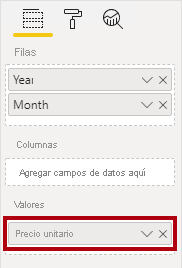

3. Haga clic en la flecha hacia abajo para **Unit price** (Precio unitario) y observe las opciones de menú disponibles.

    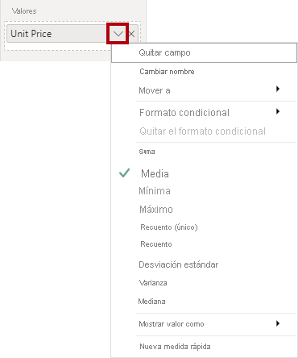

    *Las columnas numéricas visibles permiten a los autores de informes decidir en el momento del diseño del informe cómo se resumirían (o no) los valores de una columna. Esto puede dar lugar a informes inadecuados. Pero a algunos modeladores de datos no les gusta dejar las cosas al azar y optan por ocultar estas columnas y, en cambio, exponen la lógica de agregación definida en medidas. Este es el enfoque que se va a llevar a cabo en este laboratorio.*

4. Para crear una medida, en el panel **Campos**, haga clic con el botón derecho en la tabla **Sales** (Ventas) y seleccione **Nueva medida**.

    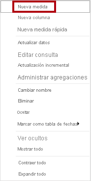

5. En la barra de fórmulas, agregue la siguiente definición de medida:


    **DAX**


    ```
    Avg Price =  
    ‎AVERAGE(Sales[Unit Price])
    ```


6. Agregue la medida **Avg Price** (Precio promedio) al objeto visual de matriz.

7. Tenga en cuenta que produce el mismo resultado que la columna **Unit Price** (Precio unitario) (pero con un formato diferente).

8. En el cuadro **Valores**, abra el menú contextual del campo **Avg Price** (Precio promedio) y observe que no es posible cambiar la técnica de agregación.

    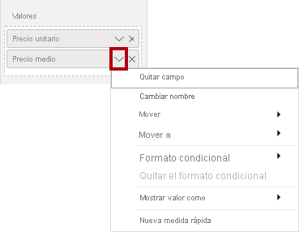

    *No es posible modificar el comportamiento de agregación de una medida.*

9. Use las definiciones de archivo de fragmentos de código para crear las siguientes cinco medidas para la tabla **Sales** (Ventas):

    - Median Price (Mediana de precio)

    - Min Price (Precio mínimo)

    - Max Price (Precio máximo)

    - Orders (Pedidos)

    - Order Lines (Líneas de pedido)

    *La función DISTINCTCOUNT() utilizada en la medida **Orders** (Pedidos) solo contará los pedidos una vez (ignorando duplicados). La función COUNTROWS() utilizada en la medida **Order Lines** (Líneas de pedido) opera en una tabla.*

    *En este caso, el número de pedidos se calcula contando los valores distintos de la columna **SalesOrderNumber** (Número de pedido de venta), mientras que el número de líneas de pedido es simplemente el número de filas de la tabla (cada fila es una línea de un pedido).*

10. Cambie a la vista Modelo y, a continuación, haga una selección múltiple de las cuatro medidas de precio: **Avg Price** (Precio promedio), **Max Price** (Precio máximo), **Median Price** (Mediana de precio) y **Min Price** (Precio mínimo).

11. Para la selección múltiple de medidas, configure los siguientes requisitos:

    - Establecer el formato en dos posiciones decimales

    - Asignar a una carpeta para mostrar denominada **Pricing** (Precios)

    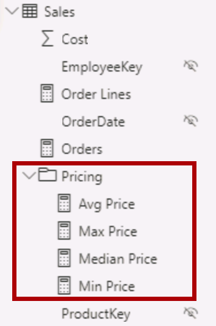

12. Oculte la columna **Unit Price** (Precio unitario).

    *La columna **Unit Price** (Precio unitario) ahora no está disponible para los autores de informes. Deben usar las medidas de precios que se han agregado al modelo. Este enfoque de diseño garantiza que los autores de informes no agregarán de forma inapropiada los precios, por ejemplo, sumándolos.*

13. Haga una selección múltiple de las medidas **Orders Lines** (Líneas de pedido) y **Orders** (Pedidos) y configure los requisitos siguientes:

    - Establecer el formato para usar el separador de miles

    - Asignar a una carpeta para mostrar denominada **Counts** (Recuentos)

    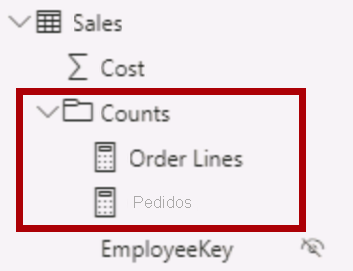

14. En la vista Informe, en el apartado o área **Values** (Valores) del objeto visual de matriz, en el campo **Unit Price** (Precio unitario), haga clic en la **X** para quitarlo.

    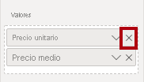

15. Aumente el tamaño del objeto visual de matriz para rellenar el ancho y el alto de la página.

16. Agregue las cinco medidas siguientes al objeto visual de matriz:

    - Median Price (Mediana de precio)

    - Min Price (Precio mínimo)

    - Max Price (Precio máximo)

    - Orders (Pedidos)

    - Order Lines (Líneas de pedido)

17. Compruebe que los resultados parecen razonables y tienen el formato correcto.

    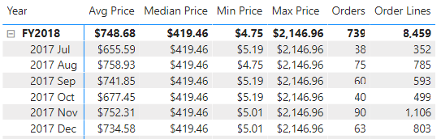

### <a name="task-2-create-additional-measures"></a>**Tarea 2: Creación de medidas adicionales**

En esta tarea, creará más medidas que usan fórmulas más complejas.

1. En la vista Informe, seleccione **Página 1**.

    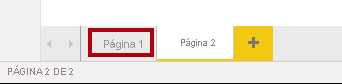

2. Revise el objeto visual de tabla y observe el total de la columna **Target** (Objetivo).

    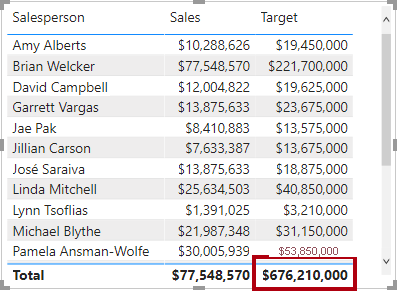

    

3. Seleccione el objeto visual de tabla y, a continuación, en el panel **Visualizaciones**, quite el campo **Destino**.

    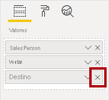

4. Cambie el nombre de la columna **Destinos \| Destino** a **Destinos \| TargetAmount**.

    *Sugerencia: Hay varias maneras de cambiar el nombre de la columna en la vista Informe: En el panel **Campos**, puede hacer clic con el botón derecho en la columna y luego seleccionar **Cambiar nombre**, o hacer doble clic en la columna o pulsar **F2**.*

    *Está a punto de crear una medida llamada **Destino**. No es posible tener una columna y una medida en la misma tabla con el mismo nombre.*

5. Cree la siguiente medida en la tabla **Targets** (Objetivos):


    **DAX**


    ```
    Target =

    IF(

    HASONEVALUE('Salesperson (Performance)'[Salesperson]),

    SUM(Targets[TargetAmount])

    )
    ```


    *La función HASONEVALUE() comprueba si se ha filtrado un solo valor de la columna **Salesperson**. Si es true, la expresión devuelve la suma de las cantidades objetivo (solo para ese comercial). Cuando es false, se devuelve un valor en blanco.*

6. Dé formato a la medida **Target** (Objetivo) para que no tenga posiciones decimales.

    *Sugerencia: Puede usar la cinta contextual **Herramientas de medición**.*

7. Oculte la columna **TargetAmount** (Cantidad objetivo).

    *Sugerencia: Puede hacer clic con el botón derecho en el panel **Campos**, y, a continuación, seleccionar **Ocultar**.*

8. Agregue la medida **Target** (Objetivo) al objeto visual de tabla.

9. Observe que el total de la columna **Target** (Objetivo) está ahora en blanco.

    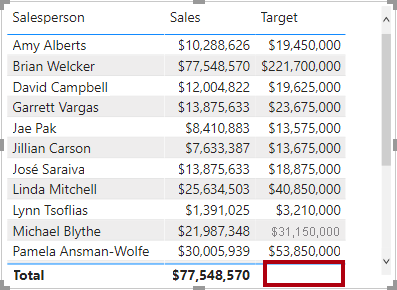

10. Use las definiciones de archivo de fragmentos de código para crear las siguientes dos medidas para la tabla **Targets** (Objetivos):

    - Variance (Varianza)

    - Variance Margin (Margen de varianza)

11. Aplique formato a la medida **Variance** (Varianza) para que no tenga posiciones decimales.

12. Dé formato a la medida **Variance Margin** (Margen de varianza) como un porcentaje con dos posiciones decimales.

13. Agregue las medidas **Variance** (Varianza) y **Variance Margin** (Margen de varianza) al objeto visual de tabla.

14. Cambie el tamaño de la tabla visual para que se puedan ver todas las columnas y filas.

    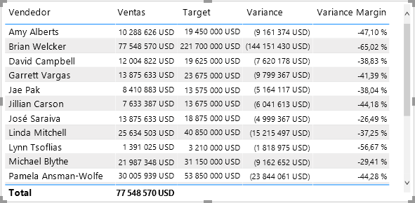

    *Si bien parece que todos los vendedores no están cumpliendo con el objetivo, recuerde que la tabla visual aún no está filtrada por un período de tiempo específico. Generará informes de rendimiento de ventas que filtran por un período seleccionado por el usuario en el laboratorio **Diseño de un informe en Power BI Desktop, parte 1**.*

15. En la esquina superior derecha del panel **Campos**, contraiga el panel y, a continuación, expándalo.

    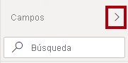

    *Al contraer y volver a abrir el panel, se restablece el contenido.*

16. Observe que en la parte superior de la lista aparece la tabla **Targets** (Objetivos).

    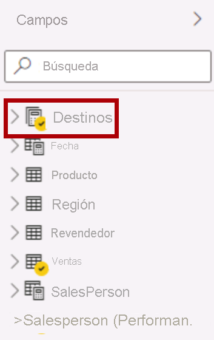

    *Las tablas que solo contienen medidas visibles se muestran automáticamente en la parte superior de la lista.*

### <a name="task-3-finish-up"></a>**Tarea 3: Finalización**

En esta tarea, completará el laboratorio.

1. Guarde el archivo de Power BI Desktop.

2. Si quiere iniciar el siguiente laboratorio, deje Power BI Desktop abierto.

    *Mejorará el modelo de datos con cálculos más avanzados mediante DAX en el laboratorio **Creación de cálculos DAX en Power BI Desktop, parte 2**.*
