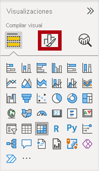
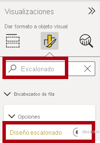
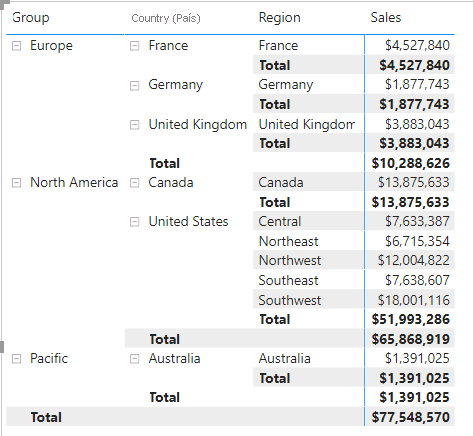
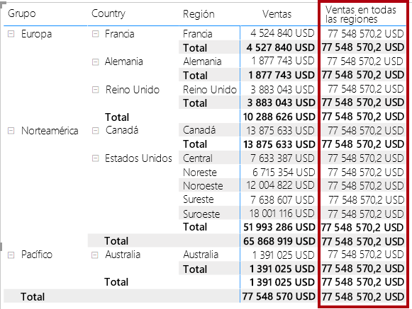
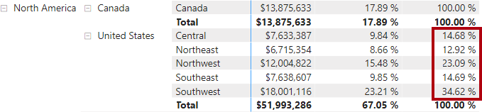
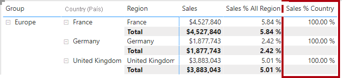
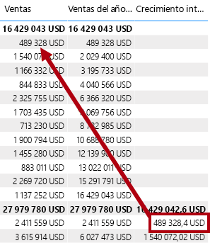
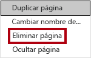
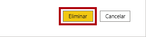

---
lab:
  title: Creación de cálculos DAX en Power BI Desktop, parte 2
  module: Module 5 - Create Model Calculations using DAX in Power BI
ms.openlocfilehash: 01d7f76dff212103ec9d08e6fe284356be9887f5
ms.sourcegitcommit: d88b7941fe3805f0bc2979ea864c5483ec289c75
ms.translationtype: HT
ms.contentlocale: es-ES
ms.lasthandoff: 06/04/2022
ms.locfileid: "146071625"
---
# <a name="create-dax-calculations-in-power-bi-desktop-part-2"></a>**Creación de cálculos DAX en Power BI Desktop, parte 2**

**El tiempo estimado para completar el laboratorio es de 45 minutos.**

En este laboratorio creará medidas con expresiones DAX que impliquen la manipulación del contexto de filtro.

En este laboratorio, aprenderá a:

- Usar la función CALCULATE () para manipular el contexto de filtro

- Usar funciones de inteligencia de tiempo

### <a name="lab-story"></a>**Caso de laboratorio**

Este laboratorio es una de las muchas series de laboratorios que se diseñaron como una historia completa sobre la preparación de datos para publicarlos como informes y paneles. Puede completar los laboratorios en cualquier orden. Sin embargo, si piensa trabajar en varios de ellos, para los diez primeros le recomendamos que siga el orden siguiente:

1. Preparación de datos en Power BI Desktop

2. Carga de datos en Power BI Desktop

3. Modelado de datos en Power BI Desktop

5. Creación de cálculos DAX en Power BI Desktop, parte 1

6. **Creación de cálculos DAX en Power BI Desktop, parte 2**

7. Diseño de un informe en Power BI Desktop, parte 1

8. Diseño de un informe en Power BI Desktop, parte 2

9. Creación de un panel de Power BI

10. Análisis de datos en Power BI Desktop

11. Aplicación de seguridad de nivel de fila

## <a name="exercise-1-work-with-filter-context"></a>**Ejercicio 1: Trabajo con contexto de filtro**

En este ejercicio, creará medidas con expresiones DAX que impliquen la manipulación del contexto de filtro.

### <a name="task-1-get-started"></a>**Tarea 1: Primeros pasos**

En esta tarea configurará el entorno para el laboratorio.

*Importante: Si viene de realizar el laboratorio anterior (y lo completó correctamente) no realice esta tarea; en su lugar, continúe con la siguiente.*

1. Para abrir Power BI Desktop, en la barra de tareas, haga clic en el acceso directo de Microsoft Power BI Desktop.

    

1. Para cerrar la ventana de introducción, en la parte superior izquierda de la ventana, haga clic en **X**.

    

1. Para abrir el archivo de inicio de Power BI Desktop, haga clic en la ficha de cinta **Archivo** a fin de abrir la vista Backstage.

1. Seleccione **Abrir informe**.

    

1. Haga clic en **Examinar informes**.

    

1. En la ventana **Abrir**, vaya a la carpeta **D:\PL300\Labs\05-create-dax-calculations-in-power-bi-desktop-advanced\Starter**.

1. Seleccione el archivo **Sales Analysis**.

1. Haga clic en **Abrir**.

    

1. Cierre todas las ventanas informativas que se abran.

1. Para crear una copia del archivo, haga clic en la ficha de cinta **Archivo** para abrir la vista Backstage.

1. Seleccione **Guardar como**.

    

1. Si se le pide que aplique los cambios, haga clic en **Aplicar**.

    

1. En la ventana **Guardar como**, vaya a la carpeta **D:\PL300\MySolution**.

1. Haga clic en **Guardar**.

    

### <a name="task-2-create-a-matrix-visual"></a>**Tarea 2: Creación de un objeto visual de matriz**

En esta tarea, creará un objeto visual de matriz para admitir la prueba de las nuevas medidas.

1. En Power BI Desktop, en la vista Informe, cree una nueva página de informe.

    

2. En la **Página 3**, agregue un objeto visual de matriz.

    

3. Cambie el tamaño del objeto visual de matriz para rellenar toda la página.

4. Para configurar los campos de los objetos visuales de matriz, en el panel **Campos**, arrastre la jerarquía **Region \| Regions** y colóquela en el objeto visual.

    *Los laboratorios usan una notación abreviada para hacer referencia a un campo o jerarquía. Tendrá este aspecto: **Region \| Regions**. En este ejemplo, **Region** es el nombre de la tabla y **Regions** es el nombre de la jerarquía.*

5. Agregue también el campo **Sales \| Sales**.

6. Para expandir toda la jerarquía, en la parte superior derecha del objeto visual de la matriz, haga clic dos veces en el icono de flecha bifurcada doble.

    

    *Recordará que la jerarquía **Regions** tiene los niveles **Group**, **Country** y **Region**.*

7. Para dar formato al objeto visual, en el panel **Visualizaciones**, seleccione el panel **Formato**.

    

8. En el cuadro **Buscar**, escriba **Escalonado**.

9. Establezca la propiedad **Diseño escalonado** en **Desactivado**.

    

10. Compruebe que el objeto visual de la matriz ahora tiene cuatro encabezados de columna.

    

    *En Adventure Works, las regiones de ventas están organizadas en grupos, países y regiones. Todos los países, excepto Estados Unidos, tienen una sola región, que se nombra después del país. Como Estados Unidos es un territorio de ventas de gran tamaño, se divide en cinco regiones comerciales.*

    *En este ejercicio creará varias medidas y, a continuación, las probará agregándolas al objeto visual de matriz.*

### <a name="task-3-manipulate-filter-context"></a>**Tarea 3: Manipulación del contexto de filtro**

En esta tarea, creará varias medidas con expresiones DAX que usan la función CALCULATE () para manipular el contexto de filtro.

1. Agregue una medida a la tabla **Sales** (Ventas), en función de la siguiente expresión:

    *Para su comodidad, todas las definiciones de DAX de este laboratorio se pueden copiar desde el archivo **D:\PL300\Labs\05-create-dax-calculations-in-power-bi-desktop-advanced\Assets\Snippets.txt**.*


    **DAX**


    ```
    Sales All Region =

    CALCULATE(SUM(Sales[Sales]), REMOVEFILTERS(Region))
    ```


    *La función CALCULATE() es una función eficaz que se usa para manipular el contexto de filtro. El primer argumento toma una expresión o una medida (una medida es simplemente una expresión con nombre). Los argumentos subsiguientes permiten modificar el contexto de filtro.*

    *La función REMOVEFILTERS() quita los filtros activos. Puede no tomar argumentos, o bien una tabla, una columna o varias columnas como argumento.*

    *En esta fórmula, la medida evalúa la suma de la columna **Sales** (Ventas) en un contexto de filtro modificado, que quita los filtros aplicados a las columnas de la tabla **Region** (Región).*

2. Agregue la medida **Sales All Region** (Ventas de toda la región) al objeto visual de matriz.

    

3. Tenga en cuenta que la medida **Sales All Region** (Ventas toda la región) calcula el total de las ventas de toda la región para cada región, país (subtotal) y grupo (subtotal).

    *La medida nueva aún no ofrece un resultado útil. Cuando las ventas de un grupo, un país o una región se dividen por este valor, se generará una relación útil conocida como "porcentaje de total general".*

4. En el panel **Campos**, asegúrese de que esté seleccionada la medida **Sales All Region** (Ventas de toda la región) (al seleccionarla, tendrá un fondo gris) y, después, en la barra de fórmulas, reemplace el nombre y la fórmula de la medida por la fórmula siguiente:

    *Sugerencia: Para reemplazar la fórmula existente, copie primero el fragmento de código. A continuación, haga clic dentro de la barra de fórmulas y presione **Ctrl+A** para seleccionar todo el texto. A continuación, presione **Ctrl+V** para pegar el fragmento de código y sobrescribir el texto seleccionado. Después, presione **Entrar**.*


    **DAX**


    ```
    Sales % All Region =  
    ‎DIVIDE(  
    ‎ SUM(Sales[Sales]),  
    ‎ CALCULATE(  
    ‎ SUM(Sales[Sales]),  
    ‎ REMOVEFILTERS(Region)  
    ‎ )  
    ‎)
    ```


    *Se ha cambiado el nombre de la medida para reflejar con precisión la fórmula actualizada. La función DIVIDE() divide la medida **Sales** (Ventas) (no modificada por el contexto del filtro) por la medida **Sales** (Ventas) en un contexto modificado que quita los filtros aplicados a la tabla **Region** (Región).*

5. En el visual de matriz, observe que se ha cambiado el nombre de la medida y que ahora aparece un valor diferente para cada grupo, país y región.

6. Aplique formato a la medida **Sales % All Region** (% ventas toda la región) como un porcentaje con dos posiciones decimales.

7. En el objeto visual de matriz, revise los valores de la medida **Sales % All Region** (% ventas toda la región).

    

8. Agregue otra medida a la tabla **Sales** (Ventas), en función de la siguiente expresión, con un formato de porcentaje:


    **DAX**

    ```
    Sales % Country =  
    ‎DIVIDE(  
    ‎ SUM(Sales[Sales]),  
    ‎ CALCULATE(  
    ‎ SUM(Sales[Sales]),  
    ‎ REMOVEFILTERS(Region[Region])  
    ‎ )  
    ‎)
    ```


9. Observe que la fórmula de la medida **Sales % Country** (% ventas país) difiere ligeramente de la fórmula de la medida **Sales % All Region** (% ventas toda la región).

    *La diferencia es que el denominador modifica el contexto de filtro quitando los filtros de la columna **Region** (Región) de la tabla **Region** (Región), no todas las columnas de la tabla **Region** (Región). Esto significa que se conservan los filtros aplicados a las columnas de grupo o de país. Obtendrá un resultado que representa las ventas como un porcentaje del país.*

10. Agregue la medida **Sales % Country** (% ventas país) al objeto visual de matriz.

11. Observe que solo las regiones Estados Unidos producen un valor que no es 100 %.

    

    *Recordará que solo Estados Unidos tiene varias regiones. Todos los demás países comprenderán una sola región, lo que explica que estén todos al 100 %.*

12. Para mejorar la legibilidad de esta medida en el objeto visual, sobrescriba la medida **Sales % Country** (% ventas país) por esta fórmula mejorada.


    **DAX**


    ```
    Sales % Country =  
    ‎IF(  
    ‎ ISINSCOPE(Region[Region]),  
    ‎ DIVIDE(  
    ‎ SUM(Sales[Sales]),  
    ‎ CALCULATE(  
    ‎ SUM(Sales[Sales]),  
    ‎ REMOVEFILTERS(Region[Region])  
    ‎ )  
    ‎ )  
    ‎)
    ```


    *Insertada en la función IF(), la función ISINSCOPE() se usa para comprobar si la columna de región es el nivel en una jerarquía de niveles. Cuando es true, se evalúa la función DIVIDE(). La ausencia de una parte false significa que se devuelve un valor en blanco cuando la columna de región no está en el ámbito.*

13. Tenga en cuenta que la medida **Sales % Country** (% ventas país) ahora solo devuelve un valor cuando una región está en el ámbito.

    

14. Agregue otra medida a la tabla **Sales** (Ventas), en función de la siguiente expresión, con un formato de porcentaje:


    **DAX**


    ```
    Sales % Group =  
    ‎DIVIDE(  
    ‎ SUM(Sales[Sales]),  
    ‎ CALCULATE(  
    ‎ SUM(Sales[Sales]),  
    ‎ REMOVEFILTERS(  
    ‎ Region[Region],  
    ‎ Region[Country]  
    ‎ )  
    ‎ )  
    ‎)
    ```


    *Para obtener las ventas como porcentaje del grupo, se pueden aplicar dos filtros para quitar eficazmente los filtros de dos columnas.*

15. Agregue la medida **Sales % Group** (% ventas grupo) al objeto visual de matriz.

16. Para mejorar la legibilidad de esta medida en el objeto visual, sobrescriba la medida **Sales % Group** (% ventas grupo) por esta fórmula mejorada.


    **DAX**


    ```
    Sales % Group =  
    ‎IF(  
    ‎ ISINSCOPE(Region[Region])  
    ‎ || ISINSCOPE(Region[Country]),  
    ‎ DIVIDE(  
    ‎ SUM(Sales[Sales]),  
    ‎ CALCULATE(  
    ‎ SUM(Sales[Sales]),  
    ‎ REMOVEFILTERS(  
    ‎ Region[Region],  
    ‎ Region[Country]  
    ‎ )  
    ‎ )  
    ‎ )  
    ‎)
    ```


17. Tenga en cuenta que la medida **Sales % Group** (% ventas grupo) ahora solo devuelve un valor cuando una región o país está en el ámbito.

18. En la vista Modelo, coloque las tres nuevas medidas en una carpeta para mostrar denominada **Ratios** (Proporciones).

    

19. Guarde el archivo de Power BI Desktop.

    *Las medidas agregadas a la tabla **Sales** (Ventas) han modificado el contexto de filtro para lograr una navegación jerárquica. Tenga en cuenta que el patrón para lograr el cálculo de un subtotal requiere quitar algunas columnas del contexto de filtro y, para llegar a un total general, se deben quitar todas las columnas.*

## <a name="exercise-2-work-with-time-intelligence"></a>**Ejercicio 2: Trabajo con inteligencia de tiempo**

En este ejercicio, creará una medida de ventas del año hasta la fecha y una medida de crecimiento de ventas de año a año.

### <a name="task-1-create-a-ytd-measure"></a>**Tarea 1: Creación de una medida del año hasta la fecha**

En esta tarea, creará una medida ventas del año hasta la fecha.

1. En la vista Informe, en la **Página 2**, observe el objeto visual de matriz que muestra varias medidas con años y meses agrupados en las filas.

2. Agregue una medida a la tabla **Sales** (Ventas), en función de la siguiente expresión, y con un formato de cero posiciones decimales:


    **DAX**


    ```
    Sales YTD =  
    ‎TOTALYTD(SUM(Sales[Sales]), 'Date'[Date], "6-30")
    ```


    *La función TOTALYTD () evalúa una expresión, en este caso la suma de la columna **Sales** (Ventas), en una columna de fecha determinada. La columna de fecha debe pertenecer a una tabla de fechas marcada como tal, como se hizo en el laboratorio **Creación de cálculos DAX en Power BI Desktop, parte 1**.*

    *La función también puede tomar un tercer argumento opcional que represente la última fecha de un año. La ausencia de esta fecha significa que el 31 de diciembre es la última fecha del año. En el caso de Adventure Works, junio es el último mes del año, y por eso se usa "6-30".*

3. Agregue el campo **Sales** (Ventas) y la medida **Sales YTD** (Ventas del año hasta la fecha) al objeto visual de matriz.

4. Observe la acumulación de valores de ventas dentro del año.

    

    *La función TOTALYTD() realiza la manipulación de filtros, específicamente la manipulación de filtros de tiempo. Por ejemplo, a fin de calcular las ventas del año hasta la fecha para septiembre de 2017 (el tercer mes del año fiscal), se quitan todos los filtros de la tabla **Date** (Fecha) y se reemplazan por un nuevo filtro de fechas que comienzan al principio del año (1 de julio de 2017) y se extienden hasta la última fecha del período de fecha en contexto (30 de septiembre de 2017).*

    *Tenga en cuenta que hay muchas funciones de inteligencia de tiempo disponibles en DAX para admitir las manipulaciones de filtro de tiempo comunes.*

### <a name="task-2-create-a-yoy-growth-measure"></a>**Tarea 2: Creación de una medida de crecimiento de ventas de año a año**

En esta tarea, creará una medida de crecimiento de ventas de año a año.

1. Agregue una medida adicional a la tabla **Sales** (Ventas), en función de la siguiente expresión:


    **DAX**


    ```
    Sales YoY Growth =  
    ‎VAR SalesPriorYear =  
    ‎ CALCULATE(  
    ‎ SUM(Sales[Sales]),  
    ‎ PARALLELPERIOD(  
    ‎ 'Date'[Date],  
    ‎ -12,  
    ‎ MONTH  
    ‎ )  
    ‎ )  
    ‎RETURN  
    ‎ SalesPriorYear
    ```


    *La fórmula de medida **Sales YoY Growth** (Crecimiento de ventas de año a año) declara una variable. Las variables pueden ser útiles para simplificar la lógica de la fórmula y resultar más eficaces cuando una expresión debe evaluarse varias veces dentro de la fórmula (que será el caso de la lógica de crecimiento de ventas de año a año). Las variables se declaran mediante un nombre único, y la expresión de medida se debe mostrar después de la palabra clave **RETURN**.*

    *A la variable **SalesPriorYear** (ventas del año anterior) se le asigna una expresión que calcula la suma de la columna **Sales** (Ventas) en un contexto modificado que usa la función PARALLELPERIOD() para retraer cada fecha 12 meses en el contexto del filtro.*

2. Agregue la medida **Sales YoY Growth** (Crecimiento de ventas de año a año) al objeto visual de matriz.

3. Observe que la nueva medida devuelve BLANK durante los 12 primeros meses (ya que no se registró ninguna venta antes del año fiscal 2017).

4. Observe que el valor de la medida **Sales YoY Growth** (Crecimiento de ventas de año a año) para **2018 Jul** (Julio de 2018) es el valor **Ventas** para **2017 Jul** (Julio de 2017).

    

    *Ahora que se ha probado la "parte difícil" de la fórmula, puede sobrescribir la medida con la fórmula final que calcula el resultado del crecimiento.*

5. Para completar la medida, sobrescriba la medida **Sales YoY Growth** (Crecimiento de ventas de año a año) con esta fórmula, aplicándole formato de porcentaje con dos decimales:


    **DAX**


    ```
    Sales YoY Growth =  
    ‎VAR SalesPriorYear =  
    ‎ CALCULATE(  
    ‎ SUM(Sales[Sales]),  
    ‎ PARALLELPERIOD(  
    ‎ 'Date'[Date],  
    ‎ -12,  
    ‎ MONTH  
    ‎ )  
    ‎ )  
    ‎RETURN  
    ‎ DIVIDE(  
    ‎ (SUM(Sales[Sales]) - SalesPriorYear),  
    ‎ SalesPriorYear  
    ‎ )
    ```


6. En la fórmula, en la cláusula **RETURN**, observe que se hace referencia a la variable dos veces.

7. Compruebe que el crecimiento de año a año para **2018 Jul** (Julio de 2018) es del **392,83 %**.

    

    *Esto significa que las ventas de julio de 2018 (2 411 559 USD) representan una mejora de casi el 400 % (casi 4 veces más) sobre las ventas logradas el mismo periodo del año anterior (489 328 USD).*

8. En la vista Modelo, coloque las dos nuevas medidas en una carpeta para mostrar denominada **Time Intelligence** (Inteligencia de tiempo).

    

### <a name="task-3-finish-up"></a>**Tarea 3: Finalización**

En esta tarea, completará el laboratorio.

1. A fin de limpiar la solución preparada para el desarrollo de informes, en la parte inferior izquierda, haga clic con el botón derecho en la pestaña **Página 2** y, después, seleccione **Eliminar página**.

    

2. Cuando se le solicite eliminar la página, haga clic en **Eliminar**.

    

3. Elimine también **Página 3**.

4. En la página restante, para eliminar la página, seleccione el objeto visual de tabla y presione la tecla **Supr**.

5. Guarde el archivo de Power BI Desktop.

6. Si quiere iniciar el siguiente laboratorio, deje Power BI Desktop abierto.

    *Creará un informe basado en el modelo de datos en el laboratorio **Diseño de un informe en Power BI Desktop, parte 1**.*
