---
lab:
  title: "Diseño de un informe en Power\_BI Desktop, parte\_1"
  module: Module 7 - Create Reports
---

# **Diseño de un informe en Power BI Desktop, parte 1**

**El tiempo estimado para completar el laboratorio es de 45 minutos.**

In this lab you will create a three-page report. You will then publish it to Power BI, whereupon you will open and interact with the report.

En este laboratorio, aprenderá a:

- Diseñar un informe

- Configurar campos visuales y aplicar formato a propiedades

### **Caso de laboratorio**

This lab is one of many in a series of labs that was designed as a complete story from data preparation to publication as reports and dashboards. You can complete the labs in any order. However, if you intend to work through multiple labs, for the first 10 labs, we suggest you do them in the following order:

1. Preparación de datos en Power BI Desktop

2. Carga de datos en Power BI Desktop

3. Modelado de datos en Power BI Desktop

5. Creación de cálculos DAX en Power BI Desktop, parte 1

6. Creación de cálculos DAX en Power BI Desktop, parte 2

7. **Diseño de un informe en Power BI Desktop, parte 1**

8. Diseño de un informe en Power BI Desktop, parte 2

9. Creación de un panel de Power BI

10. Análisis de datos en Power BI Desktop

11. Aplicación de seguridad de nivel de fila

## **Ejercicio 1: Creación de un informe**

En este ejercicio se creará un informe de tres páginas denominado **Informe de ventas**.

### **Tarea 1: Introducción e inicio de sesión**

En esta tarea, configurará el entorno para el laboratorio iniciando sesión en Power BI.

*Importante: Si ya ha iniciado sesión en Power BI, continúe con la siguiente tarea.*

1. Para abrir Microsoft Edge, en la barra de tareas, haga clic en el acceso directo del programa Microsoft Edge.

    

1. En la ventana del explorador Microsoft Edge, vaya a **https://powerbi.com**.

    *Sugerencia: También puede usar el favorito del servicio Power BI en la barra de favoritos de Microsoft Edge.*

1. Haga clic en **Iniciar sesión**, ubicado en la esquina superior derecha.

    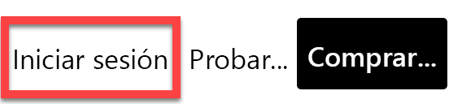

1. Escriba los detalles de la cuenta que se le han proporcionado (consulte los **Recursos**).

1. Si se le pide que actualice la contraseña, vuelva a escribir la proporcionada y, luego, escriba y confirme una nueva.

    *Importante: Asegúrese de anotar la contraseña nueva.*

1. Complete el proceso de inicio de sesión.

1. Si Microsoft Edge le solicita si quiere mantener la sesión iniciada, haga clic en **Sí**.

1. Deje abierta la ventana del explorador Microsoft Edge.

### **Tarea 2: Introducción: Habilitación de Map and filled map visuals (Elementos visuales de mapa y relleno)**

En esta tarea, habilitará los elementos visuales de mapa y relleno en el entorno para el laboratorio actualizando la Configuración de integración en el portal de administración de Power BI. 

1. Para abrir el portal de administración de Power BI, en la parte superior derecha del explorador, haga clic el icono **Configuración**.

    

1. Seleccione **Portal de administración**.

    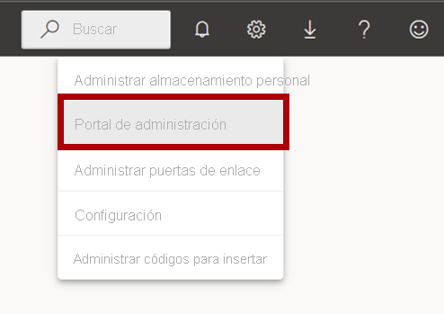

1. Scroll down the page to Integration settings. Click the arrow to expand the Map and filled map visuals option.

    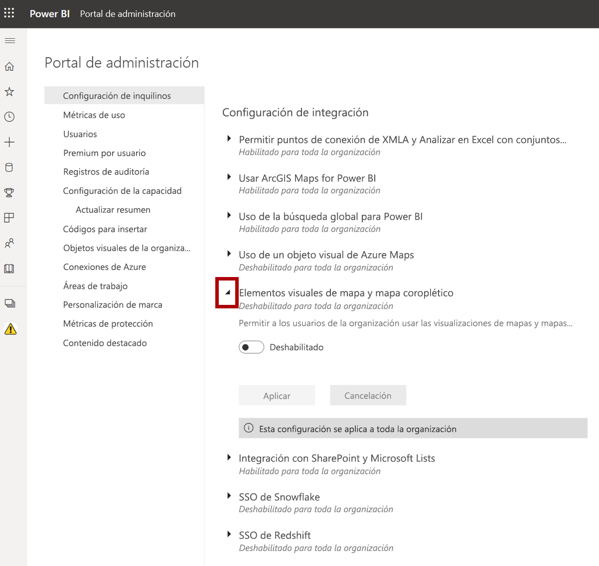

1. Establezca la opción Map and filled map visuals (Elementos visuales de mapa y relleno) en **Habilitado**.

1. Haga clic en **Aplicar** para aplicar los cambios. 

    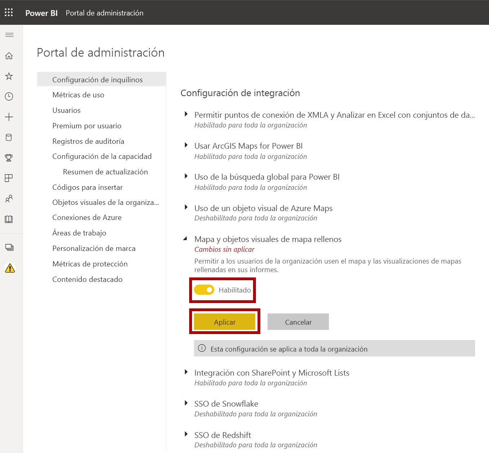

1. Aparecerá un mensaje en la parte superior derecha del explorador que indica que los cambios en la Configuración de inquilinos se aplicarán en los próximos 15 minutos. 

    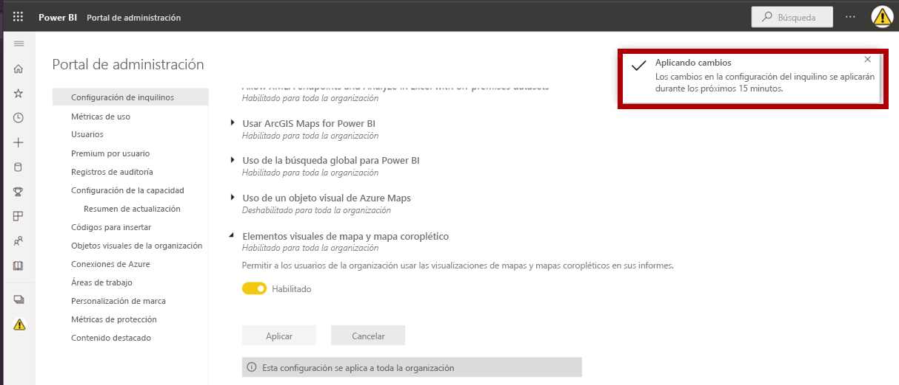

1. Deje abierta la ventana del explorador Microsoft Edge.

### **Tarea 3: Introducción y apertura del informe**

En esta tarea, configurará el entorno para el laboratorio abriendo el informe de inicio.

*Importante: Si viene de realizar el laboratorio anterior (y lo completó correctamente) no realice esta tarea; en su lugar, continúe con la siguiente.*

1. Para abrir Power BI Desktop, en la barra de tareas, haga clic en el acceso directo de Microsoft Power BI Desktop.

    

2. Para cerrar la ventana de introducción, en la parte superior izquierda de la ventana, haga clic en **X**.

    

3. Para iniciar sesión en el servicio Power BI, en la parte superior derecha, haga clic en **Iniciar sesión**.

    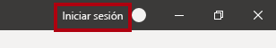

4. Complete el proceso de inicio de sesión con la misma cuenta que usó para iniciar sesión en el servicio Power BI.

5. Para abrir el archivo de inicio de Power BI Desktop, haga clic en la ficha de cinta **Archivo** a fin de abrir la vista Backstage.

6. Seleccione **Abrir informe**.

    

7. Haga clic en **Examinar informes**.

    

8. En la ventana **Abrir**, vaya a la carpeta **D:\PL300\Labs\07-design-report-in-power-bi-desktop\Starter**.

9. Seleccione el archivo **Sales Analysis**.

10. Haga clic en **Abrir**.

    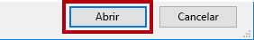

11. Cierre todas las ventanas informativas que se abran.

12. Para crear una copia del archivo, haga clic en la ficha de cinta **Archivo** para abrir la vista Backstage.

13. Seleccione **Guardar como**.

    

14. Si se le pide que aplique los cambios, haga clic en **Aplicar**.

    

15. En la ventana **Guardar como**, vaya a la carpeta **D:\PL300\MySolution**.

16. Haga clic en **Guardar**.

    

### **Tarea 4: Diseño de la página 1**

In this task you will design the first report page. When you’ve completed the design, the page will look like the following:

1. Para cambiar el nombre de la página en Power BI Desktop, en la parte inferior izquierda, haga clic con el botón derecho en **Página 1** y luego seleccione **Cambiar nombre**.

    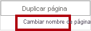

    *Sugerencia: También puede hacer doble clic en el nombre de la página para cambiarle el nombre.*

2. Cambie el nombre de la página a **Información general** y presione **Entrar**.

    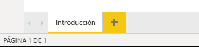

3. Para agregar una imagen, en la ficha de cinta **Insertar**, en el grupo **Elementos**, haga clic en **Imagen**.

    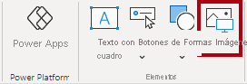

4. En la ventana **Abrir**, vaya a la carpeta **D:\PL300\Resources**.

5. Seleccione el archivo **AdventureWorksLogo.jpg** y haga clic en **Abrir**.

    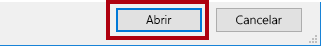

6. Arrastre la imagen para colocarla en la esquina superior izquierda y también los marcadores de guía para cambiar su tamaño.

    

7. Para agregar una segmentación, primero debe anular la selección de la imagen al hacer clic en un área vacía de la página del informe.
8. En el panel **Campos**, seleccione el campo **Fecha \| Año** (no el nivel **Año** de la jerarquía).
    
    *Los laboratorios usan una notación abreviada para hacer referencia a un campo. Tendrá este aspecto: **Fecha \| Año**. En este ejemplo, **Fecha** es el nombre de la tabla y **Año** es el nombre del campo.*

9. Observe que se ha agregado una tabla de valores de año a la página del informe.

10. Para convertir el objeto visual de una tabla en una segmentación, en el panel **Visualizaciones**, seleccione **Segmentación**.

    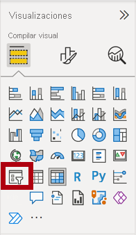

11. Para convertir la segmentación de una lista en un menú desplegable, en la parte superior derecha de la segmentación, haga clic en la flecha hacia abajo y seleccione **Menú desplegable**.

    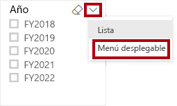

12. Cambie el tamaño y coloque la segmentación para que quede debajo de la imagen y pueda asegurarse de que tenga el mismo ancho que la imagen.

    

13. En la segmentación **Año**, abra la lista desplegable, seleccione **FY2020** y, después, contraiga la lista desplegable.

    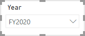

    *La página del informe ahora se filtra por el año **FY2020**.*

14. Anule la selección de la segmentación haciendo clic en un área vacía de la página del informe.

15. Cree una segunda segmentación basada en el campo **Región \| Región** (no en el nivel **Región** de la jerarquía).

16. Deje la segmentación en forma de lista y, después, cambie el tamaño de la segmentación y colóquela debajo de la segmentación **Año**.

    

17. Para dar formato a la segmentación, debajo del panel **Visualizaciones**, abra el panel **Formato**.

    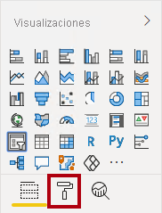

18. Expanda el grupo **Controles de selección**.

    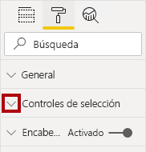

19. Establezca la **opción Mostrar "Seleccionar todo"** como **Activada**.

    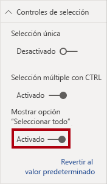

20. En la segmentación **Región**, observe que ahora el primer elemento es **Seleccionar todo**.

    *Al seleccionarlo, este elemento selecciona todos los elementos o anula su selección. Facilita a los usuarios del informe establecer los elementos de segmentación necesarios.*

21. Anule la selección de la segmentación haciendo clic en un área vacía de la página del informe.

22. Para agregar un gráfico a la página, en el panel **Visualizaciones**, haga clic en el tipo de objeto visual **Gráfico de columnas apiladas y de líneas**.

    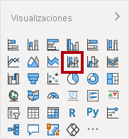

23. Cambie el tamaño y coloque el objeto visual para situarlo a la derecha del logotipo y que ocupe el resto del ancho de la página del informe.

    

24. Arrastre y coloque los siguientes campos al objeto visual:

    - Fecha \| Mes

    - Ventas \| Ventas

25. En el panel de campos del objeto visual (no en el panel **Campos**, que se encuentra debajo del panel **Visualizaciones**), fíjese en que los campos están asignados a los apartados o áreas **Eje compartido** y **Valores de columnas**.

    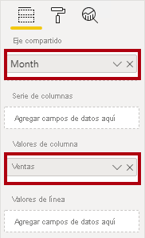

    *Si arrastra campos a un objeto visual, se agregarán a los apartados o áreas predeterminados. Para mayor precisión, puede arrastrar campos directamente a los apartados, como hará a continuación.*

26. En el panel **Campos**, arrastre el campo **Ventas \| Margen de beneficio** al apartado o área **Valores de líneas**.

    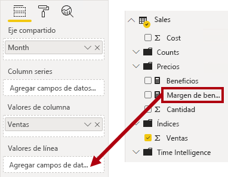

27. Tenga en cuenta que el objeto visual solo tiene 11 meses.

    *El último mes del año actual, junio de 2020, no tiene ninguna venta (todavía). De forma predeterminada, el objeto visual ha eliminado los meses con ventas en blanco. Ahora configurará el objeto visual para que muestre todos los meses.*

28. En el panel de campos del objeto visual, en el apartado o área **Eje compartido**, haga clic en la flecha hacia abajo del campo **Mes** y luego seleccione **Mostrar elementos sin datos**.

    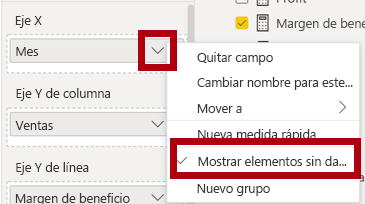

29. Observe que ahora aparece el mes **Junio de 2020**.

30. Anule la selección del gráfico haciendo clic en un área vacía de la página del informe.

31. Para agregar un gráfico a la página, en el panel **Visualizaciones**, haga clic en el tipo de objeto visual **Mapa**.

    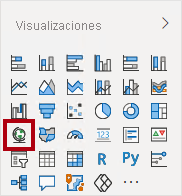

32. Cambie el tamaño y coloque el objeto visual para situarlo debajo del gráfico de columnas o líneas, y que ocupe la mitad del ancho del gráfico anterior.

    

33. Agregue los campos siguientes a los apartados o áreas del objeto visual:

    - Ubicación: **Región \| País**

    - Leyenda: **Producto \| Categoría**

    - Tamaño: **Ventas \| Ventas**

34. Anule la selección del gráfico haciendo clic en un área vacía de la página del informe.

35. Para agregar un gráfico a la página, en el panel **Visualizaciones**, haga clic en el tipo de objeto visual **Gráfico de barras apiladas**.

    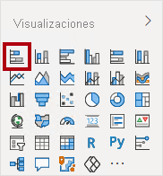

36. Cambie el tamaño y coloque el objeto visual para que rellene el espacio restante de la página del informe.

    

37. Agregue los campos siguientes a los apartados o áreas del objeto visual:

    - Eje: **Producto \| Categoría**

    - Valor: **Ventas \| Cantidad**

38. Para dar formato al objeto visual, abra el panel **Formato**.

    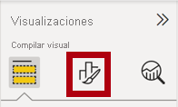

39. Expanda el grupo **Colores de datos** y, después, establezca la propiedad **Color predeterminado** en un color adecuado (para complementar el gráfico de columnas o líneas).

40. Establezca la propiedad **Etiquetas de datos** como **activada**.

    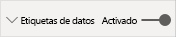

41. Guarde el archivo de Power BI Desktop.

    *Ahora se ha completado el diseño de la primera página.*

### **Tarea 5: Diseño de la página 2**

En este laboratorio, creará un informe de tres páginas.

*Importante: Cuando ya se hayan proporcionado instrucciones detalladas en los laboratorios, los pasos proporcionarán instrucciones más concisas. Si necesita las instrucciones detalladas, puede volver a consultar las otras tareas de este laboratorio.*

1. Para crear una nueva página, en la parte inferior izquierda, haga clic en el icono del signo más.

    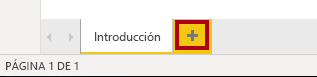

2. Cambie el nombre de la página a **Beneficios**.

    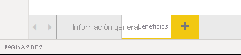

  
‎ 

3. Agregue una segmentación basada en el campo **Región \| Región**.

4. Use el panel **Formato** para habilitar la opción "Seleccionar todo" (en el grupo **Controles de selección**).

5. Cambie el tamaño y coloque la segmentación para situarla en el lado izquierdo de la página del informe y que tenga aproximadamente la mitad de la altura de la página.

    

6. Agregue un objeto visual de matriz, cambie su tamaño y colóquelo de modo que ocupe el espacio restante de la página del informe.

    

7. Agregue la jerarquía **Fecha \| Fiscal** a la matriz del apartado o área **Filas**.

    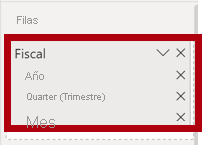

8. Agregue los siguientes cinco campos de la tabla **Ventas** al apartado o área **Valores**:

    - Pedidos (de la carpeta **Recuentos**)

    - Ventas

    - Costos

    - Beneficios

    - Margen de beneficio

    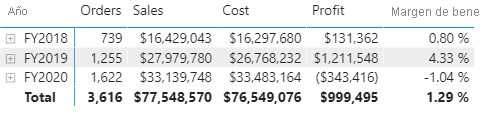

9. En el panel **Filtros**, situado a la izquierda del panel **Visualizaciones**, fíjese en el apartado o área **Filtros de esta página** (puede que tenga que desplazarse hacia abajo).

    

10. En el panel **Campos**, arrastre el campo **Producto \|| Categoría** al apartado **Filtros de esta página**.

11. Dentro de la tarjeta de filtro, en la parte superior derecha, haga clic en la flecha para contraer la tarjeta.

    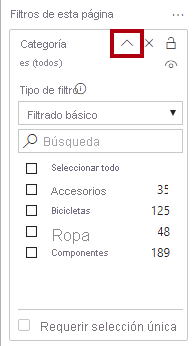

    *Los campos agregados al panel **Filtros** pueden lograr el mismo resultado que una segmentación. Una diferencia es que no ocupan espacio en la página del informe. Otra diferencia es que se pueden configurar para alcanzar requisitos de filtrado más avanzados.*

12. Agregue cada uno de los siguientes campos de la tabla **Producto** al apartado o área **Filtros de esta página** directamente debajo de la tarjeta **Categoría** y contráigalos:

    - Subcategoría

    - Producto

    - Color

    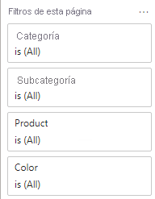

13. Guarde el archivo de Power BI Desktop.

    *Ahora se ha completado el diseño de la segunda página.*

### **Tarea 6: Diseño de la página 3**

Luego se publica en Power BI, desde donde se puede abrir e interactuar con él.

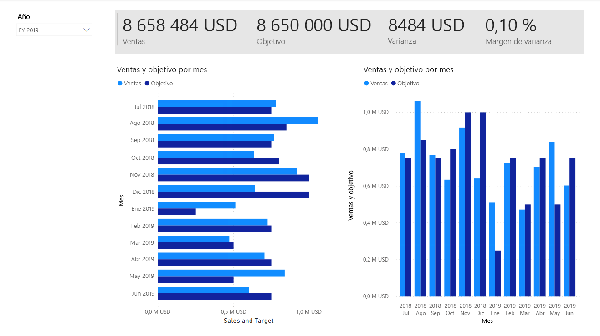

1. Cree una página y cámbiele el nombre a **Mi rendimiento**.

1. Para simular el rendimiento de los filtros de seguridad de nivel de fila, arrastre el campo **Vendedor (rendimiento) \| Vendedor** a los filtros de nivel de página del panel de filtros.
    
    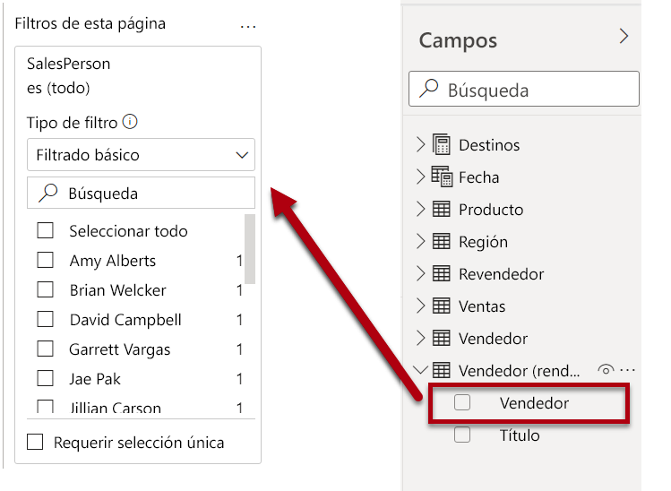 

1. Select <bpt id="p1">**</bpt>Michael Blythe<ept id="p1">**</ept>. Data on the <bpt id="p1">**</bpt>My Performance<ept id="p1">**</ept> report page will now be filtered to display data for Michael Blythe only.

1. Agregue una segmentación desplegable basada en el campo **Fecha \| Año** y luego cambie el tamaño y colóquela para que se sitúe en la esquina superior izquierda de la página.

    

1. En la segmentación, establezca la página para filtrar por **FY2019**.

    

1. Agregue un objeto visual **Tarjeta de varias filas**, cambie el tamaño y la posición para que se sitúe a la derecha de la segmentación y rellene el ancho restante de la página.

    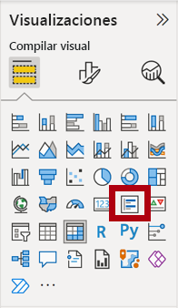

    

1. Agregue los cuatro campos siguientes al objeto visual:

    - Ventas \| Ventas

    - Destinos \| Destino

    - Destinos \| Varianza

    - Destinos \| Margen de varianza

1. Aplique formato al objeto visual:

    - En el grupo **Etiquetas de datos**, aumente la propiedad **Tamaño del texto** a **28 puntos**.

    - En el grupo **Fondo**, establezca gris claro como **Color**.

    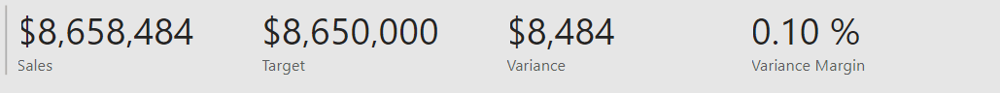

1. Agregue un objeto visual **Gráfico de barras agrupadas** y, después, cambie su tamaño y colóquelo de modo que se encuentre debajo del objeto visual de la tarjeta de varias filas. Luego, rellene la altura restante de la página, así como la mitad de la anchura del objeto visual de la tarjeta de varias filas.

    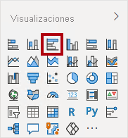

    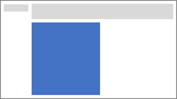

1. Agregue los campos siguientes a los apartados o áreas del objeto visual:

    - Eje: **Fecha \| Mes**

    - Valor: **Ventas \| Ventas** y **Destinos \| Destino**

    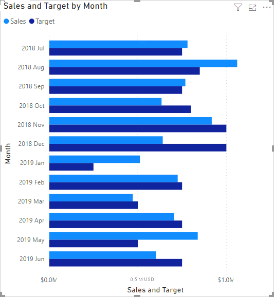

1. Para crear una copia del objeto visual, presione **Ctrl+C** y, a continuación, **Ctrl+V**.

1. Coloque el objeto visual nuevo a la derecha del original.

    

1. Para modificar el tipo de visualización, en el panel **Visualizaciones**, seleccione **Gráfico de columnas agrupadas**.

    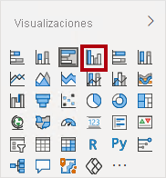

    *Ahora es posible ver los mismos datos que se expresan mediante dos tipos de visualización diferentes. No obstante, esto no es un buen uso del diseño de página; sin embargo, se mejorará en el laboratorio **Diseño de un informe en Power BI Desktop, parte 2** mediante la superposición de objetos visuales. Al agregar botones a la página, permitirá que el usuario del informe determine cuál de los dos objetos visuales será visible.*

    *Ahora se ha completado el diseño de la tercera y última página.*

### **Tarea 7: Publicación del informe**

En esta tarea, publicará el informe.

1. Seleccione la página **Información general**.

2. Guarde el archivo de Power BI Desktop.

3. En la pestaña de la cinta **Inicio**, en el grupo **Compartir**, haga clic en **Publicar**.

    

4. En la ventana **Publicar en Power BI**, observe que **Mi área de trabajo** esté seleccionado.

5. Para publicar el informe, haga clic en **Seleccionar**.

    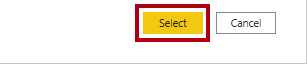

6. Cuando la publicación se haya realizado correctamente, haga clic en **Entendido**.

    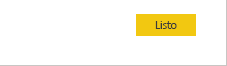

7. Deje Power BI Desktop abierto.

    *En el siguiente ejercicio, explorará el informe en el servicio Power BI.*

## **Ejercicio 2: Exploración del informe**

En este ejercicio, explorará el informe que se publicó en Power BI.

### **Tarea 1: Exploración del informe**

En esta tarea, explorará el informe que se publicó en Power BI.

1. En la ventana del explorador Microsoft Edge, en el panel **Navegación** del servicio Power BI (situado a la izquierda, podría estar contraído), expanda **Mi área de trabajo**.

    

2. Revise los contenidos del área de trabajo y fíjese en el informe **Sales Analysis** y el conjunto de datos.

    *Al publicar el archivo de Power BI Desktop, el modelo de datos se publicó como un conjunto de datos.*

    *Si no lo ve, presione **F5** para actualizar el explorador y, después, expanda el área de trabajo de nuevo.*

    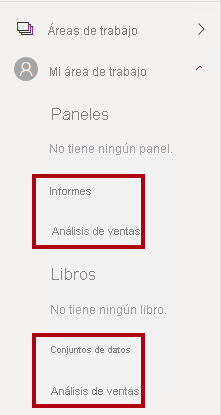

3. Para abrir el informe, haga clic en el informe **Sales Analysis**.

4. A la izquierda, en el panel **Páginas**, seleccione la página **Información general**. 

5. En la segmentación **Regiones**, mientras presiona la tecla **Ctrl**, seleccione varias regiones.

6. En el gráfico de columnas o líneas, seleccione cualquier columna de mes para aplicar un filtro cruzado a la página.

7. Mientras presiona la tecla **Ctrl**, seleccione un mes adicional.

    *De forma predeterminada, el filtrado cruzado filtra el resto de objetos visuales de la página.*

8. Observe que el gráfico de barras está filtrado y resaltado, con la parte en negrita de las barras que representan los meses filtrados.

9. Mantenga el cursor sobre el objeto visual del gráfico de barras y, después, en la parte superior derecha, mantenga el cursor sobre el icono de filtro.

    

    *El icono de filtro le permite comprender todos los filtros que se aplican al objeto visual, incluidas las segmentaciones y los filtros cruzados de otros objetos visuales.*

10. Mantenga el cursor sobre una barra y observe la información sobre herramientas que aparece.

11. Para deshacer el filtro cruzado, en el gráfico de columnas o líneas, haga clic en un área vacía del objeto visual.

12. Mantenga el cursor sobre el objeto visual de mapa y, después, en la parte superior derecha, haga clic en el icono **Modo de enfoque**.

    

    *El modo de enfoque amplía el objeto visual hasta que ocupa toda la página.*

13. Mantenga el cursor sobre distintos segmentos de los gráficos de barras para mostrar la información sobre herramientas.

14. Para volver a la página del informe, en la parte superior izquierda, haga clic en **Volver al informe**.

    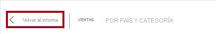

15. Mantenga de nuevo el cursor sobre el objeto visual de mapa y, después, en la esquina superior derecha, haga clic en los puntos suspensivos (...) y observe las opciones del menú.

    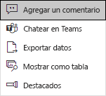

16. Pruebe todas las opciones, excepto **Chatear en Teams**.

17. A la izquierda, en el panel **Páginas**, seleccione la página **Beneficio**.

    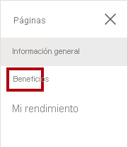

18. Tenga en cuenta que la segmentación **Región** tiene una selección diferente de la segmentación **Región** en la página **Información general**.

    *Las segmentaciones no están sincronizadas. Modificará el diseño del informe para asegurarse de que se sincronicen entre las páginas en el laboratorio **Diseño de un informe en Power BI Desktop, parte 2**.*

19. En el panel **Filtros**, que se encuentra a la derecha, expanda una tarjeta de filtro y aplique algunos de ellos.

    *El panel **Filtros** permite definir más filtros de los que podrían caber en una página a modo de segmentaciones.*

20. En el objeto visual de matriz, use el botón de signo más (+) para expandir la jerarquía **Fiscal**.

21. Seleccione la página **Mi rendimiento**.

    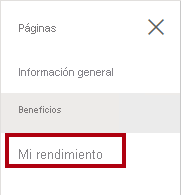

22. En la parte superior derecha de la barra de menús, haga clic en **Ver** y seleccione **Pantalla completa**.

    

23. Interactúe con la página modificando la segmentación y aplicando un filtro cruzado a la página.

24. En la parte inferior de la ventana, observe los comandos para cambiar de página, retroceder o avanzar por las páginas, o salir del modo de pantalla completa.

25. Haga clic en el icono izquierdo para salir del modo de pantalla completa.

    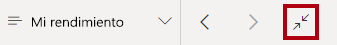

### **Tarea 2: Finalización**

En esta tarea, completará el laboratorio.

1. Para volver al área de trabajo, en el banner de la página web de la ventana, haga clic en **Mi área de trabajo**.

    

2. Deje abierta la ventana del explorador Microsoft Edge.

    *Mejorará el diseño del informe con características avanzadas en el laboratorio **Diseño de un informe en Power BI Desktop, parte 2**.*
