---
lab:
  title: "Diseño de un informe en Power\_BI Desktop, parte\_2"
  module: 7 - Create Reports
---

# Diseño de un informe en Power BI Desktop, parte 2

**El tiempo estimado para completar el laboratorio es de 45 minutos.**

En este laboratorio, mejorará el **Análisis de ventas** con características de diseño avanzadas.

En este laboratorio, aprenderá a:

- Sincronizar segmentaciones

- Crear una página de obtención de detalles

- Aplicar formato condicional

- Crear y usar marcadores

### **Caso de laboratorio**

Este laboratorio es una de las muchas series de laboratorios que se diseñaron como una historia completa sobre la preparación de datos para publicarlos como informes y paneles. Puede completar los laboratorios en cualquier orden. Sin embargo, si piensa trabajar en varios de ellos, le recomendamos que siga el orden siguiente:

1. Preparación de datos en Power BI Desktop

2. Carga de datos en Power BI Desktop

3. Diseño de un modelo de datos en Power BI

4. Creación de cálculos DAX en Power BI Desktop, parte 1

5. Creación de cálculos DAX en Power BI Desktop, parte 2

6. Diseño de un informe en Power BI Desktop, parte 1

7. **Diseño de un informe en Power BI Desktop, parte 2**

8. Análisis de datos con objetos visuales de IA

9. Creación de un panel de Power BI

10. Aplicación de seguridad de nivel de fila

## **Ejercicio 1: Configuración de segmentaciones de sincronización**

En este ejercicio, sincronizará las segmentaciones de página del informe.

### Tarea 1: Introducción e inicio de sesión

En esta tarea, configurará el entorno para el laboratorio iniciando sesión en Power BI.

*Importante: Si ya ha iniciado sesión en Power BI, continúe con la siguiente tarea.*

1. Para abrir Microsoft Edge, en la barra de tareas, haga clic en el acceso directo del programa Microsoft Edge.

    

2. En la ventana del explorador Microsoft Edge, vaya a **https://powerbi.microsoft.com**.

    *Sugerencia: También puede usar el favorito del servicio Power BI en la barra de favoritos de Microsoft Edge.*

3. Haga clic en **Iniciar sesión**, ubicado en la esquina superior derecha.

    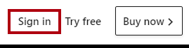

4. Complete el proceso de inicio de sesión.

5. Si Microsoft Edge le solicita si quiere mantener la sesión iniciada, haga clic en **Sí**.

6. En la ventana del explorador Microsoft Edge, en el panel **Navegación** del servicio Power BI, expanda **Mi área de trabajo**.

    

7. Deje abierta la ventana del explorador Microsoft Edge.

### Tarea 2: Introducción y apertura del informe

En esta tarea, configurará el entorno para el laboratorio abriendo el informe de inicio.

*Importante: Si viene de realizar el laboratorio anterior (y lo completó correctamente) no realice esta tarea; en su lugar, continúe con la siguiente.*

1. Para abrir Power BI Desktop, en la barra de tareas, haga clic en el acceso directo de Microsoft Power BI Desktop.

    

2. Para cerrar la ventana de introducción, en la parte superior izquierda de la ventana, haga clic en **X**.

    

3. Para iniciar sesión en el servicio Power BI, en la parte superior derecha, haga clic en **Iniciar sesión**.

    

4. Complete el proceso de inicio de sesión con la misma cuenta que usó para iniciar sesión en el servicio Power BI.

5. Para abrir el archivo de inicio de Power BI Desktop, haga clic en la ficha de cinta **Archivo** a fin de abrir la vista Backstage.

6. Seleccione **Abrir informe**.

    

7. Haga clic en **Examinar informes**.

    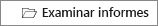

8. En la ventana **Abrir**, vaya a la carpeta **D:\PL300\Labs\07-design-report-in-power-bi-desktop-enhanced\Starter**.

9. Seleccione el archivo **Sales Analysis**.

10. Haga clic en **Abrir**.

    

11. Cierre todas las ventanas informativas que se abran.

12. Para crear una copia del archivo, haga clic en la ficha de cinta **Archivo** para abrir la vista Backstage.

13. Seleccione **Guardar como**.

    

14. Si se le pide que aplique los cambios, haga clic en **Aplicar**.

    

15. En la ventana **Guardar como**, vaya a la carpeta **D:\PL300\MySolution**.

16. Haga clic en **Guardar**.

    

### **Tarea 3: Segmentación de la sincronización**

En esta tarea, sincronizará las segmentaciones **Año** y **Región**.

*Continuará el desarrollo del informe creado en el laboratorio **Diseño de un informe en Power BI Desktop, parte 1**.*

1. En Power BI Desktop, en la página **Información general**, establezca la segmentación **Año** en **FY2018**.

2. Vaya a la página **Mi rendimiento** y, después, observe que la segmentación **Año** es otro valor.

    *Cuando las segmentaciones no están sincronizadas, pueden contribuir a la representación errónea de los datos y a la frustración de los usuarios del informe. Ahora sincronizará las segmentaciones del informe.*

3. Vuelva a la página **Información general** y, después, seleccione la segmentación **Año**.

4. En la pestaña **Vista** de la cinta, desde el grupo **Mostrar paneles**, haga clic en **Segmentaciones de sincronización**.

    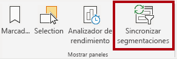

5. En el panel **Segmentaciones de sincronización** (a la izquierda del panel **Visualizaciones**), en la segunda columna (que representa la sincronización), active las casillas de las páginas **Información general** y **Mi rendimiento**.

    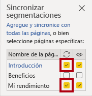

6. En la página **Información general**, seleccione la segmentación **Región**.

7. Sincronice la segmentación con las páginas **Información general** y **Beneficios**.

    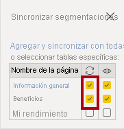

8. Para probar las segmentaciones de sincronización, seleccione otras opciones de filtrado y, después, compruebe que las segmentaciones sincronizadas filtran por la misma selección.

9. Para cerrar la página **Segmentación de sincronización**, haga clic en la **X** situada en la parte superior derecha del panel.

    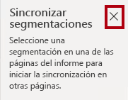

## **Ejercicio 2: Configuración de la obtención de detalles**

En este ejercicio, creará una página y la configurará como una página de obtención de detalles. Cuando haya completado el diseño, la página tendrá un aspecto similar al siguiente:

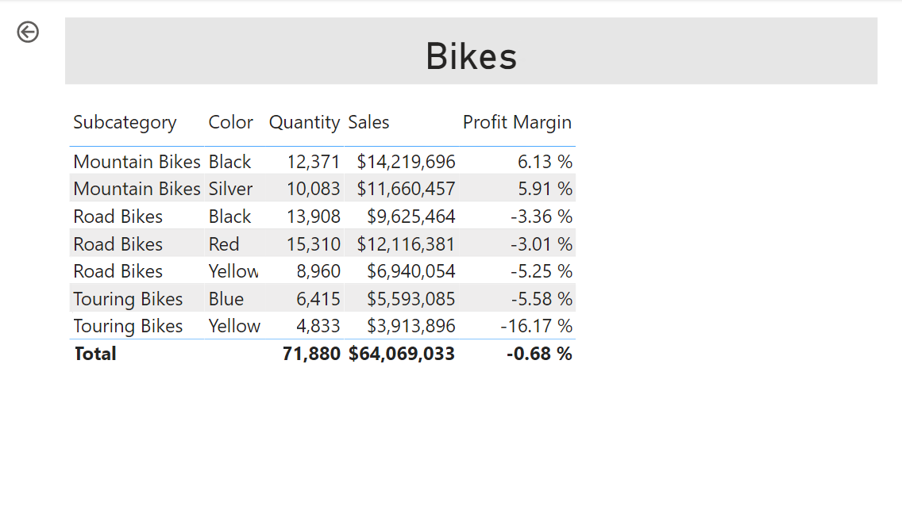

### **Tarea 1: Creación de una página de obtención de detalles**

En esta tarea, creará una página y la configurará como una página de obtención de detalles.

1. Agregue una nueva página de informe con el nombre **Detalles del producto**.

    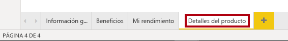

2. Haga clic con el botón derecho en la pestaña de la página **Detalles del producto** y después seleccione **Ocultar página**.

    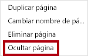

    *Los usuarios del informe no podrán ir directamente a la página de obtención de detalles. Tendrán que acceder a ella desde objetos visuales en otras páginas. En el ejercicio final de este laboratorio descubrirá cómo obtener detalles de la página.*

3. Debajo del panel **Visualizaciones**, en la sección **Obtener detalles**, agregue el campo **Producto \| Categoría** al cuadro **Add Drill-Through Fields Here** (Agregar los campos de obtención de detalles aquí).

    *Los laboratorios usan una notación abreviada para hacer referencia a un campo. Tendrá este aspecto: **Producto \| Categoría**. En este ejemplo, **Product** es el nombre de la tabla y **Category** es el nombre del campo.*

    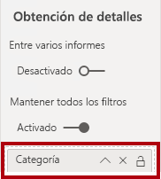

4. Para probar la página de obtención de detalles, en la tarjeta de filtro de obtención de detalles, seleccione **Bikes** (Bicicletas).

    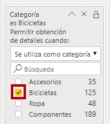

5. En la parte superior izquierda de la página del informe, observe el botón de flecha.

    

    *Un botón se agrega automáticamente cuando se agrega un campo al apartado o área de obtención de detalles. Permite a los usuarios del informe retroceder a la página desde la que han obtenido detalles.*

6. Agregue un objeto visual **Tarjeta** a la página y, después, cambie el tamaño y colóquelo para ubicarlo a la derecha del botón y rellenar el ancho restante de la página.

    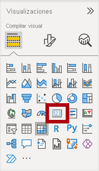

    

7. Arrastre el campo **Producto \| Categoría** al objeto visual de tarjeta.

8. Configure las opciones de formato para el objeto visual y, después, establezca la propiedad **Etiqueta de categoría** en **Desactivar**.

    

9. Establezca la propiedad **Efectos > Color de fondo** en un tono gris claro.
    
    

10. Agregue un objeto visual **Tabla** a la página y, después, cambie el tamaño y colóquelo para ubicarlo debajo del objeto visual de tarjeta y rellenar el espacio restante de la página.

    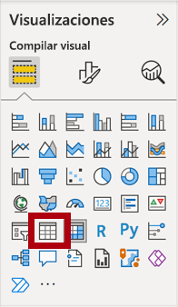

    

11. Agregue los campos siguientes al objeto visual:

    - Producto \| Subcategoría

    - Producto \| Color

    - Ventas \| Cantidad

    - Ventas \| Ventas

    - Ventas \| Margen de beneficio

12. Configure las opciones de formato para el objeto visual y, en la sección **Valores**, establezca la propiedad **Tamaño de texto** en **20pt**.

    *El diseño de la página de obtención de detalles está casi terminado. En el siguiente ejercicio mejorará la página con formato condicional.*

## **Ejercicio 3: Incorporación de formato condicional**

En este ejercicio, mejorará la página de obtención de detalles con formato condicional. Cuando haya completado el diseño, la página tendrá un aspecto similar al siguiente:

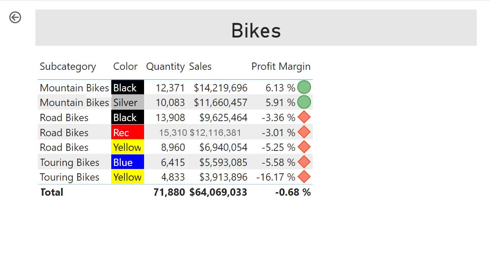

### **Tarea 1: Adición de formato condicional**

En esta tarea, mejorará la página de obtención de detalles con formato condicional.

1. Seleccione el objeto visual de tabla.

2. En el panel de visualización, haga clic en la flecha hacia abajo del valor **Margen de beneficio** y, después, seleccione **Formato condicional \| Iconos**.

    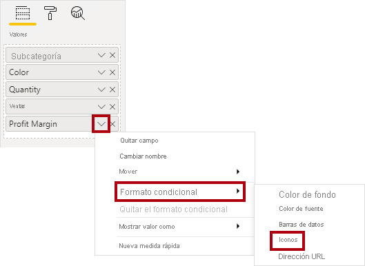

3. En la ventana **Iconos: Margen de beneficio**, en la lista desplegable **Diseño de los iconos**, seleccione **A la derecha de los datos**.

    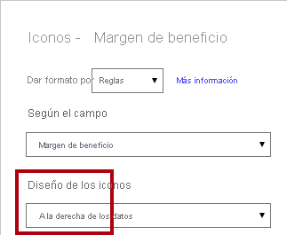

4. Para eliminar la regla intermedia, a la izquierda del triángulo amarillo, haga clic en la **X**.

    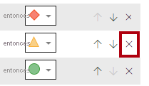

5. Configure la primera regla (el rombo de color rojo) de esta manera:

    - En el segundo control, quite el valor

    - En el tercer control, seleccione **Número**

    - En el quinto control, escriba **0**

    - En el sexto control, seleccione **Número**

6. Configure la segunda regla (el círculo de color verde) de esta manera:

    - En el segundo control, escriba **0**

    - En el tercer control, seleccione **Número**

    - En el quinto control, quite el valor

    - En el sexto control, seleccione **Número**

    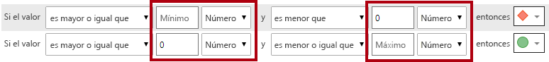

    *Las reglas se pueden interpretar de la siguiente manera: mostrar un rombo de color rojo si el valor de margen de beneficio es menor que 0; de lo contrario, si el valor es mayor o igual a cero, mostrar un círculo de color verde.*

7. Haga clic en **Aceptar**.

    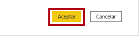

8. En el objeto visual de tabla, compruebe que se muestran los iconos correctos.

    

9. Configure el formato condicional de color de fondo para el campo **Color**.

10. En la ventana **Color de fondo: Color**, en la lista desplegable **Estilo de formato**, seleccione **Valor de campo**.

    

11. En la lista desplegable **¿En qué campo debemos basar esto?** , seleccione **Producto \| Formato \| Formato del color de fondo**.

    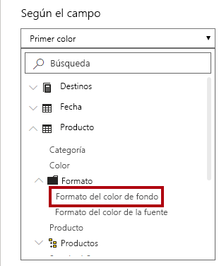

12. Haga clic en **Aceptar**.

    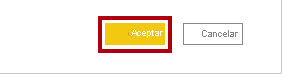

13. Repita los pasos anteriores para configurar el formato condicional de color de fuente para el campo **Color**, mediante el campo **Producto \| Formato \| Formato de color de fondo**.

    *Puede que recuerde que los colores de fondo y fuente se crearon a partir del archivo **ColorFormats.csv** en el laboratorio **Preparación de datos de Power BI Desktop** y, después, se integraron en la consulta **Producto** en el laboratorio **Carga de datos en Power BI Desktop**.*

## **Ejercicio 4: Incorporación de marcadores y botones**

En este ejercicio, mejorará la página **Mi rendimiento** con botones, lo que permite al usuario del informe seleccionar el tipo de objeto visual que se va a mostrar. Cuando haya completado el diseño, la página tendrá un aspecto similar al siguiente:

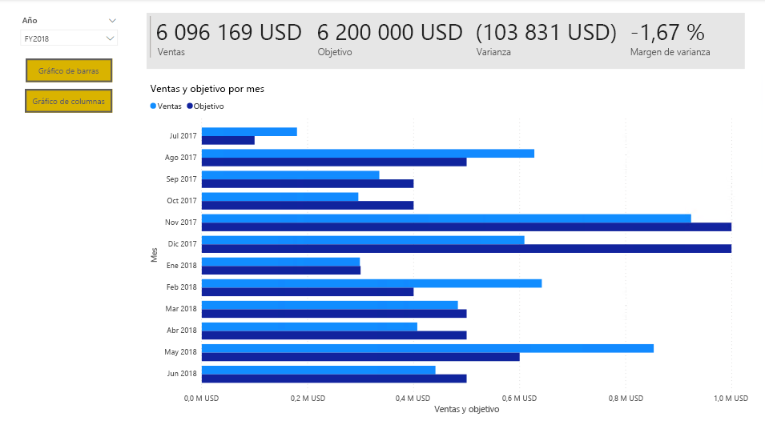

### **Tarea 1: Adición de marcadores**

En esta tarea, agregará dos marcadores, para mostrar cada uno de los objetos visuales de ventas mensuales y destinos.

1. Vaya a la página **Mi rendimiento**.

2. En la pestaña **Vista** de la cinta, desde el grupo **Mostrar paneles**, haga clic en **Marcadores**.

    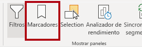

3. En la pestaña **Vista** de la cinta, desde el grupo **Mostrar paneles**, haga clic en **Selección**.

    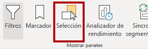

4. En el panel **Selección**, situado junto a uno de los elementos **Ventas y destino por mes**, haga clic en el icono de ojo para ocultar el objeto visual.

    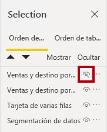

5. En el panel **Marcadores**, haga clic en **Agregar**.

    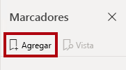

6. Para cambiar el nombre del marcador, haga doble clic en él.

7. Si el gráfico visible es el gráfico de barras, cambie el nombre del marcador por **Gráfico de barras ACTIVADO**, de lo contrario cámbielo por **Gráfico de columnas ACTIVADO**.

8. Para editar el marcador, en el panel **Marcadores**, desplace el cursor sobre el marcador, haga clic en los puntos suspensivos y, a continuación, seleccione **Datos**.

    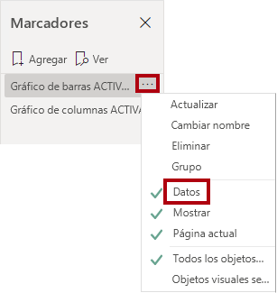

    *Deshabilitar la opción **Datos** significa que el marcador no usará el estado de filtro actual. Esto es importante porque, de lo contrario, el marcador se bloqueará permanentemente en el filtro aplicado actualmente por la segmentación **Año**.*

9. Para actualizar el marcador, haga clic en los puntos suspensivos de nuevo y, a continuación, seleccione **Actualizar**.

    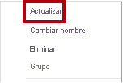

    *En los pasos siguientes, creará y configurará un segundo marcador para mostrar el segundo objeto visual.*

10. En el panel **Selección**, alterne la visibilidad de los dos elementos **Ventas y destino por mes**.

    *En otras palabras, oculte el objeto visual visible y haga visible el objeto visual oculto.*

    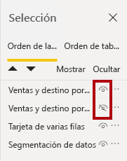

11. Cree un segundo marcador y asígnele el nombre apropiado (**Gráfico de columnas ACTIVADO** o **Gráfico de barras ACTIVADO).**

    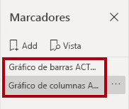

12. Configure el segundo marcador para omitir los filtros (opción **Datos** desactivada) y actualizar el marcador.

13. En el panel **Selección**, para que los dos objetos visuales sean visibles, basta con mostrar el objeto visual oculto.

14. Cambie el tamaño y la posición de los dos objetos visuales para que rellenen la página debajo del objeto visual de tarjeta de varias filas y se superpongan por completo.

    *Sugerencia: Para elegir el objeto visual que está oculto, selecciónelo en el panel **Selección**.*

    

15. En el panel **Marcadores**, seleccione cada uno de los marcadores y observe que solo uno de los objetos visuales es visible.

    *La siguiente fase de diseño consiste en agregar dos botones a la página, lo que permitirá al usuario del informe seleccionar los marcadores.*

### **Tarea 2: Adición de botones**

En esta tarea, agregará dos botones y les asignará acciones de marcador.

1. En la cinta **Insertar**, desde el grupo **Elementos**, haga clic en **Botón** y, después, seleccione **En blanco**.

    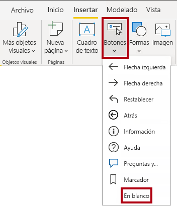

2. Coloque el botón directamente debajo de la segmentación **Año**.

3. Seleccione el botón y, a continuación, en el panel **Formato del botón**, haga clic en **General** y **active** la propiedad **Título**.

    

4. Expanda la sección **Título** y luego, en el cuadro **Texto**, escriba **Gráfico de barras**.

5. Expanda la sección **Fondo** y, a continuación, establezca un color de fondo mediante un color complementario.

6. Haga clic en **Botón** y **active** la propiedad **Acción**.

    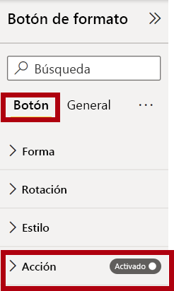

7. Expanda la sección **Acción** y, después, establezca la lista desplegable **Tipo** en **Marcador**.

8. En la lista desplegable **Marcador**, seleccione **Gráfico de barras ACTIVADO**.

    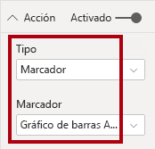

9. Cree una copia del botón mediante copiar y pegar y, después, configure el botón nuevo de la siguiente manera:

    *Sugerencia: Los comandos de acceso directo para copiar y pegar son **Ctrl+C** seguido de **Ctrl+V**.*

    - Establezca la propiedad **Texto del botón** en **Gráfico de columnas**.

    - En la sección **Acción**, establezca la lista desplegable **Marcador** en **Gráfico de columnas ACTIVADO**.

    *Ahora se ha completado el diseño del informe Sales Analysis.*

### **Tarea 3: Publicación del informe**

En esta tarea, publicará el informe.

1. Seleccione la página **Información general**.

2. En la segmentación **Año**, seleccione **FY2020**.

3. En la segmentación **Región**, seleccione **Seleccionar todo**.

4. Guarde el archivo de Power BI Desktop.

    *El archivo se debe guardar siempre antes de publicarlo en el servicio Power BI.*

5. En la pestaña de la cinta **Inicio**, en el grupo **Compartir**, haga clic en **Publicar**.

    

6. En la ventana **Publicar en Power BI**, observe que **Mi área de trabajo** esté seleccionado.

7. Para publicar el informe, haga clic en **Seleccionar**.

    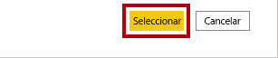

8. Si se le pide que reemplace el conjunto de datos, haga clic en **Reemplazar**.

9. Cuando la publicación se haya realizado correctamente, haga clic en **Entendido**.

    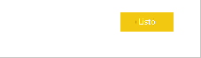

10. Cierre Power BI Desktop.

    *En el siguiente ejercicio, explorará el informe en el servicio Power BI.*

## **Ejercicio 5: Exploración del informe**

En este ejercicio, explorará el informe en el servicio Power BI.

### **Tarea 1: Exploración del informe**

En esta tarea, explorará el informe en el servicio Power BI.

1. En la ventana del explorador Microsoft Edge, en el servicio Power BI, en el panel **Navegación**, seleccione **Mi área de trabajo** y luego haga clic en el informe **Análisis de ventas**.

2. Para probar el informe de obtención de detalles, en la página **Información general**, en el objeto visual **Cantidad por categoría**, haga clic con el botón derecho en la barra **Clothing** (Ropa) y seleccione **Obtención de detalles \| Detalles del producto**.

    

3. Observe que la página **Detalles del producto** es para **Clothing**.

4. Para volver a la página de origen, haga clic en el botón de flecha en la esquina superior izquierda de la página.

5. Seleccione la página **Mi rendimiento**.

6. Haga clic en cada uno de los botones y, después, observe que se muestra otro objeto visual.

### **Tarea 2: Finalización**

En esta tarea, completará el laboratorio.

1. Para volver al área de trabajo, en el banner de la página web de la ventana, haga clic en **Mi área de trabajo**.

    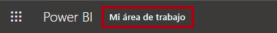

2. Deje abierta la ventana del explorador Microsoft Edge.
