---
lab:
  title: Creación de un panel de Power BI
  module: Module 8 - Create Dashboards
ms.openlocfilehash: 0f8abb8670c71f5063dc28032daa321bf4b742f9
ms.sourcegitcommit: 9ea1e7e21b9b3c718030c94b1693d153a2010ec7
ms.translationtype: HT
ms.contentlocale: es-ES
ms.lasthandoff: 07/07/2022
ms.locfileid: "147015360"
---
# **Creación de un panel de Power BI**

**El tiempo estimado para completar el laboratorio es de 45 minutos.**

En este laboratorio se creará el panel **Supervisión de ventas**.

En este laboratorio, aprenderá a:

- Anclar objetos visuales en un panel

- Usar Preguntas y respuestas para crear iconos de panel

### **Caso de laboratorio**

Este laboratorio es una de las muchas series de laboratorios que se diseñaron como una historia completa sobre la preparación de datos para publicarlos como informes y paneles. Puede completar los laboratorios en cualquier orden. Sin embargo, si piensa trabajar en varios de ellos, le recomendamos que siga el orden siguiente:

1. Preparación de datos en Power BI Desktop

2. Carga de datos en Power BI Desktop

3. Modelado de datos en Power BI Desktop

5. Creación de cálculos DAX en Power BI Desktop, parte 1

6. Creación de cálculos DAX en Power BI Desktop, parte 2

7. Diseño de un informe en Power BI Desktop, parte 1

8. Diseño de un informe en Power BI Desktop, parte 2

9. **Creación de un panel de Power BI**

10. Análisis de datos en Power BI Desktop

11. Aplicación de seguridad de nivel de fila

## **Ejercicio 1: Creación de un panel**

En este ejercicio, se creará el panel **Supervisión de ventas**. El panel completado tendrá un aspecto similar al siguiente:

### **Tarea 1: Introducción e inicio de sesión**

En esta tarea, configurará el entorno para el laboratorio iniciando sesión en Power BI.

*Importante: Si ya ha iniciado sesión en Power BI en un laboratorio anterior, continúe con la siguiente tarea.*

1. Para abrir Microsoft Edge, en la barra de tareas, haga clic en el acceso directo del programa Microsoft Edge.

    

2. En la ventana del explorador Microsoft Edge, vaya a **https://powerbi.microsoft.com**.

    *Sugerencia: También puede usar el favorito del servicio Power BI en la barra de favoritos de Microsoft Edge.*

3. Haga clic en **Iniciar sesión**, ubicado en la esquina superior derecha.

    

4. Escriba los detalles de la cuenta que se le han proporcionado.

5. Si se le pide que actualice la contraseña, vuelva a escribir la proporcionada y, luego, escriba y confirme una nueva.

    *Importante: Asegúrese de anotar la contraseña nueva.*

6. Complete el proceso de inicio de sesión.

7. Si Microsoft Edge le solicita si quiere mantener la sesión iniciada, haga clic en **Sí**.

8. En la ventana del explorador Microsoft Edge, en el panel **Navegación** del servicio Power BI, expanda **Mi área de trabajo**.

    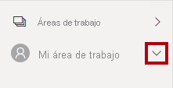

9. Deje abierta la ventana del explorador Microsoft Edge.

### **Tarea 2: Introducción y apertura del informe**

En esta tarea, configurará el entorno para el laboratorio abriendo el informe de inicio.

*Importante: Si viene de realizar el laboratorio anterior (y lo completó correctamente) no realice esta tarea; en su lugar, continúe con la siguiente.*

1. Para abrir Power BI Desktop, en la barra de tareas, haga clic en el acceso directo de Microsoft Power BI Desktop.

    

2. Para cerrar la ventana de introducción, en la parte superior izquierda de la ventana, haga clic en **X**.

    

3. Si Power BI Desktop no tiene iniciada la sesión en el servicio Power BI, en la parte superior derecha, haga clic en **Iniciar sesión**.

    

4. Complete el proceso de inicio de sesión con la misma cuenta que usó para iniciar sesión en el servicio Power BI.

5. Para abrir el archivo de inicio de Power BI Desktop, haga clic en la ficha de cinta **Archivo** a fin de abrir la vista Backstage.

6. Seleccione **Abrir informe**.

    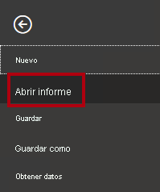

7. Haga clic en **Examinar informes**.

    

8. En la ventana **Abrir**, vaya a la carpeta **D:\PL300\Labs\08-create-power-bi-dashboard\Starter**.

9. Seleccione el archivo **Sales Analysis**.

10. Haga clic en **Abrir**.

    

11. Cierre todas las ventanas informativas que se abran.

12. Para crear una copia del archivo, haga clic en la ficha de cinta **Archivo** para abrir la vista Backstage.

13. Seleccione **Guardar como**.

    

14. Si se le pide que aplique los cambios, haga clic en **Aplicar**.

    

15. En la ventana **Guardar como**, vaya a la carpeta **D:\PL300\MySolution**.

16. Haga clic en **Guardar**.

    

### **Tarea 3: Introducción y publicación del informe**

En esta tarea, configurará el entorno para el laboratorio creando un conjunto de datos.

*Importante: Si ya ha publicado el informe en el laboratorio **Diseño de un informe en Power BI Desktop, parte 2**, continúe con la tarea siguiente.*

1. En la ventana del explorador Microsoft Edge, en el panel **Navegación** del servicio Power BI, en la parte inferior, haga clic en **Obtener datos**.

    

2. En el icono **Archivos**, haga clic en **Obtener**.

    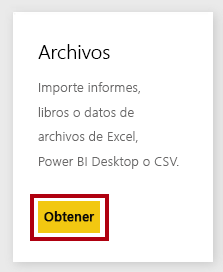

3. Haga clic en el icono **Archivo local**.

    

4. En la ventana **Abrir**, vaya a la carpeta **D:\PL300\Labs\08-create-power-bi-dashboard\Solution**.

5. Seleccione el archivo **Sales Analysis.pbix** y, después, haga clic en **Abrir**.

6. Si se le pide que reemplace el conjunto de datos, haga clic en **Reemplazarlo**.

### **Tarea 4: Creación de un panel**

En esta tarea, se creará el panel **Supervisión de ventas**. Anclará un objeto visual del informe y agregará un icono basado en un URI de datos de imagen, además de usar Q&A para crear un icono.

1. En la ventana del explorador Microsoft Edge, en el servicio Power BI, abra el informe **Sales Analysis**.

2. En la página **Información general**, establezca la segmentación **Año** en **FY2020**.

    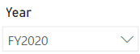

3. Establezca la segmentación **Región** en **Seleccionar todo**.

    *Al anclar objetos visuales a un panel, usarán el contexto de filtro actual. Una vez anclados, no se puede cambiar el contexto del filtro. En el caso de los filtros basados en el tiempo, se recomienda usar una segmentación de fecha relativa (o Q&A con una pregunta relativa basada en el tiempo).*

4. Para crear un panel y anclar un objeto visual, mantenga el cursor sobre el objeto visual de columna/línea **Ventas y margen de beneficio por mes**.

5. En la esquina inferior derecha, haga clic en la chincheta.

    

6. En la ventana **Anclar al panel**, en el cuadro **Nombre del panel**, escriba **Supervisión de ventas**.

    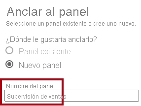

7. Haga clic en **Anclar**.

    

8. Abra el panel **Navegación**, seleccione **Mi área de trabajo** y luego abra el panel **Supervisión de ventas**.

    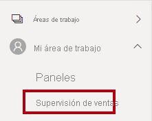

9. Observe que el panel tiene un solo icono.

    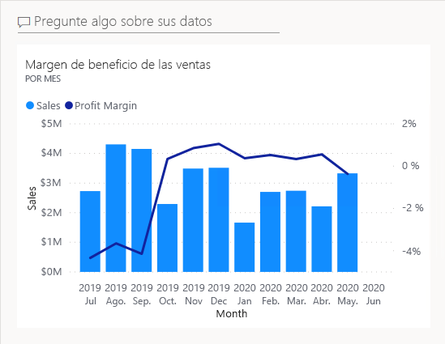

10. Para agregar un icono basado en una pregunta, en la parte superior izquierda del panel, haga clic en **Pregunte algo sobre sus datos**.

    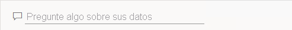

    *Puede usar la característica Q&A para formular una pregunta y Power BI responderá con un objeto visual.*

11. Haga clic en una de las preguntas sugeridas bajo el cuadro de Q&A, en los cuadros azules.

12. Revise la respuesta.

13. Quite todo el texto del cuadro de Preguntas y respuestas.

14. En el cuadro de Preguntas y respuestas, escriba lo siguiente: **Ventas del año hasta la fecha**

    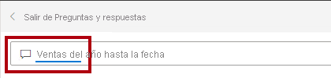

15. Observe que la respuesta es **(En blanco)**.

    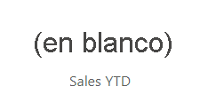

    *Puede que recuerde cómo agregó la medida **Ventas del año hasta la fecha** en el laboratorio **Creación de cálculos DAX en Power BI Desktop, parte 2**. Esta medida es una expresión de Inteligencia de tiempo y, por lo tanto, requiere un filtro en la tabla **Fecha** para generar un resultado.*

16. Amplíe la pregunta con: **en el año FY2020**.

    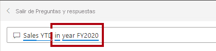

17. Observe que la respuesta ahora es **33 M USD**.

    

18. Para anclar la respuesta al panel, en la esquina superior derecha, haga clic en **Anclar visualización**.

    

19. Cuando se le pida que ancle el icono al panel, haga clic en **Anclar**.

    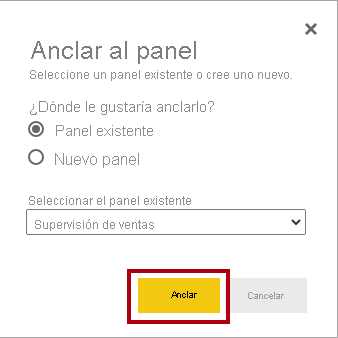

20. Para volver al panel, en la esquina superior izquierda, haga clic en **Salir de Preguntas y respuestas**.

    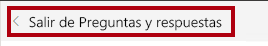

21. Para agregar el logotipo de la empresa, en la barra de menús, haga clic en **Editar** y, después, seleccione **Agregar icono**.

    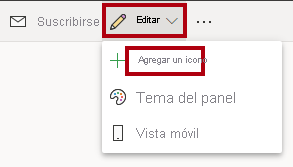

    *El uso de esta técnica para agregar un icono le permite adornar el panel con elementos multimedia, como contenido web, imágenes, cuadros de texto con formato enriquecido y vídeo (mediante vínculos de YouTube o Vimeo).*

22. En el panel **Agregar icono** (situado a la derecha), seleccione el icono **Imagen**.

    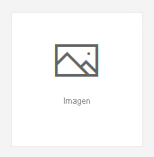

23. Haga clic en **Next**.

    

24. En el panel **Agregar icono de imagen**, en el cuadro **URL**, escriba la dirección URL completa que se encuentra en el archivo **D:\PL300\Resources\AdventureWorksLogo_DataURL.txt**.

    *Puede insertar una imagen mediante su dirección URL o puede usar una dirección URL de datos, que inserta el contenido en línea.*

25. En la parte inferior del panel, haga clic en **Aplicar**.

    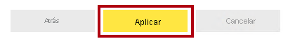

26. Para cambiar el tamaño del icono del logotipo, arrastre la esquina inferior derecha y cambie el tamaño del icono a una unidad de ancho y dos unidades de alto.

    *Los tamaños de los iconos están restringidos en una forma rectangular. Solo se puede cambiar el tamaño a múltiplos de la forma rectangular.*

27. Organice los iconos de modo que el logotipo aparezca en la parte superior izquierda, con el icono **Ventas del año hasta la fecha** en la parte inferior, y el icono **Ventas, margen de beneficio**, en la parte derecha.

    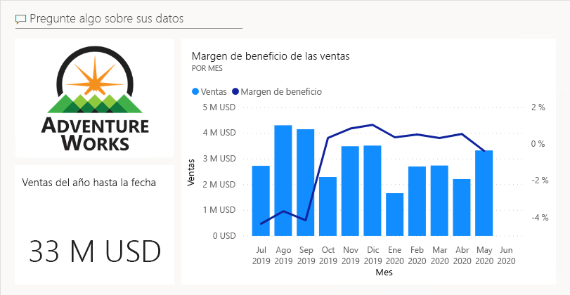

### **Tarea 5: Edición de los detalles del icono**

En esta tarea, se modificarán los detalles de dos iconos.

1. Mantenga el cursor sobre el icono de **Ventas del año hasta la fecha** y, en la parte superior derecha del icono, haga clic en los puntos suspensivos y, después, seleccione **Editar detalles**.

    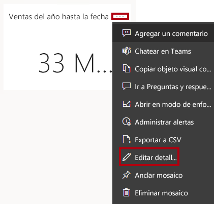

2. En el panel **Detalles del icono** (que se encuentra a la derecha), en el cuadro **Subtítulo**, escriba **FY2020**.

    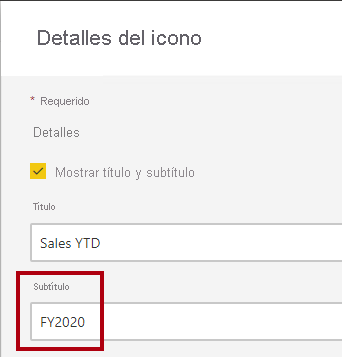

3. Haga clic en **Aplicar**.

    

4. Observe que el icono **Ventas del año hasta la fecha** muestra un subtítulo.

    

5. Edite los detalles del icono **Ventas, Margen de beneficio**.

6. En el panel **Detalles del icono**, en la sección **Funcionalidad**, active **Mostrar hora de última actualización**.

    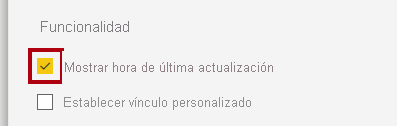

7. Haga clic en **Aplicar**.

    

8. Observe que el icono describe la hora de la última actualización (que se ha hecho al cargar el modelo de datos en Power BI Desktop).

    *En el ejercicio siguiente, se actualizará el conjunto de datos. Normalmente, esto se conseguiría mediante el uso de la actualización programada, de modo que Power BI utilizaría una puerta de enlace para conectarse a la base de datos de SQL Server. Sin embargo, debido a las restricciones en la configuración del aula, no hay ninguna puerta de enlace. Por lo tanto, abrirá Power BI Desktop, realizará una actualización manual de datos y, después, cargará el archivo en el área de trabajo.*

## **Ejercicio 2: Actualización del conjunto de datos**

En este ejercicio, primero se cargarán los datos del pedido de ventas de junio de 2020 en la base de datos **AdventureWorksDW2020**. Posteriormente, se abrirá el archivo de Power BI Desktop, se realizará una actualización de datos y, después, se cargará el archivo en el área de trabajo.

### **Tarea 1: Actualización de la base de datos de laboratorio**

En esta tarea, se ejecutará un script de PowerShell para actualizar los datos de la base de datos **AdventureWorksDW2020**.

1. En el Explorador de archivos, dentro de la carpeta **D:\PL300\Setup**, haga clic con el botón derecho en el archivo **UpdateDatabase-2-AddSales.ps1** y, después, seleccione **Ejecutar con PowerShell**.

    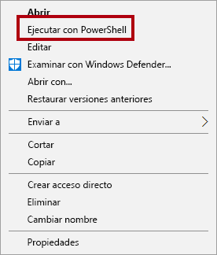

2. Si se le solicita que cambie la directiva de ejecución, pulse **A**.

3. Cuando se le pida que presione cualquier tecla para cerrar, vuelva a presionar **Entrar**.

    *La base de datos **AdventureWorksDW2020** ahora incluye los pedidos de ventas realizados en junio de 2020.*

### **Tarea 2: Actualización del archivo de Power BI Desktop**

En esta tarea, se abrirá el archivo **Análisis de ventas** de Power BI Desktop, se realizará una actualización de datos y, después, se cargará el archivo en el área de trabajo **Análisis de ventas**.

1. En el archivo de Power BI Desktop, en el panel **Campos**, haga clic con el botón derecho en la tabla **Ventas** y, después, seleccione **Actualizar datos**.

    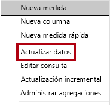

2. Cuando finalice la actualización, guarde el archivo de Power BI Desktop.

3. Para publicar el archivo en su área de trabajo, en la ficha de cinta **Inicio**, dentro del grupo **Compartir**, haga clic en **Publicar** y, luego, en **Seleccionar**.

    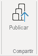

4. Cuando se le pida que reemplace el conjunto de datos, haga clic en **Reemplazar**.

    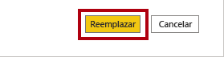

    *El conjunto de datos en el servicio Power BI ahora incluye los datos de ventas de junio de 2020.*

5. Cierre Power BI Desktop.

## **Ejercicio 3: Revisión del panel**

En este ejercicio, revisará el panel para consultar las ventas actualizadas.

### **Tarea 1: Revisión del panel**

En esta tarea, revisará el panel para consultar las ventas actualizadas.

1. En la ventana del explorador Microsoft Edge, en el servicio Power BI, revise el panel **Supervisión de ventas**.

2. En el icono **Ventas, margen de beneficio**, en el subtítulo, observe que los datos se han actualizado a **AHORA**.

3. Observe también que ahora hay una columna para **junio de 2020**.

    *Si no ve los datos de junio de 2020, es posible que tenga que presionar **F5** para volver a cargar el explorador web.*

    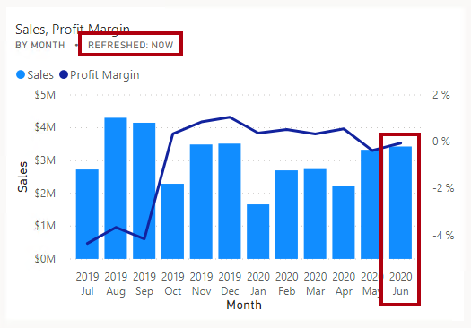

    

4. Para cerrar el panel, haga clic en **Cerrar**.
