---
lab:
  title: "Análisis de datos en Power\_BI Desktop"
  module: Module 10 - Perform Advanced Analytics
---

# **Análisis de datos en Power BI Desktop**

**El tiempo estimado para completar el laboratorio es de 45 minutos.**

En este laboratorio, creará el informe **Exploración de ventas**.

En este laboratorio, aprenderá a:

- Crear gráficos de dispersión animados

- Usar un objeto visual para pronosticar valores

### **Caso de laboratorio**

This lab is one of many in a series of labs that was designed as a complete story from data preparation to publication as reports and dashboards. You can complete the labs in any order. However, if you intend to work through multiple labs, for the first 10 labs, we suggest you do them in the following order:

1. Preparación de datos en Power BI Desktop

2. Carga de datos en Power BI Desktop

3. Modelado de datos en Power BI Desktop

5. Creación de cálculos DAX en Power BI Desktop, parte 1

6. Creación de cálculos DAX en Power BI Desktop, parte 2

7. Diseño de un informe en Power BI Desktop, parte 1

8. Diseño de un informe en Power BI Desktop, parte 2

9. Creación de un panel de Power BI

10. **Análisis de datos en Power BI Desktop**

11. Aplicación de seguridad de nivel de fila

## **Ejercicio 1: Creación del informe**

En este ejercicio, creará el informe **Exploración de ventas**.

### **Tarea 1: Introducción e inicio de sesión**

En esta tarea, configurará el entorno para el laboratorio iniciando sesión en Power BI.

*Importante: Si ya ha iniciado sesión en Power BI en un laboratorio anterior, continúe con la siguiente tarea.*

1. Para abrir Microsoft Edge, en la barra de tareas, haga clic en el acceso directo del programa Microsoft Edge.

    

1. En la ventana del explorador Microsoft Edge, vaya a **https://powerbi.com**.

    *Sugerencia: También puede usar el favorito del servicio Power BI en la barra de favoritos de Microsoft Edge.*

1. Haga clic en **Iniciar sesión**, ubicado en la esquina superior derecha.

    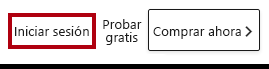

1. Escriba los detalles de la cuenta que se le han proporcionado.

1. Si se le pide que actualice la contraseña, vuelva a escribir la proporcionada y, luego, escriba y confirme una nueva.

    *Importante: Asegúrese de anotar la contraseña nueva.*

1. Complete el proceso de inicio de sesión.

1. Si Microsoft Edge le solicita si quiere mantener la sesión iniciada, haga clic en **Sí**.

1. En la ventana del explorador Microsoft Edge, en el panel **Navegación** del servicio Power BI, expanda **Mi área de trabajo**.

    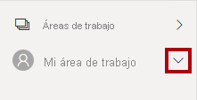

1. Deje abierta la ventana del explorador Microsoft Edge.

### **Tarea 2: Introducción y creación de un conjunto de datos**

En esta tarea, configurará el entorno para el laboratorio creando un conjunto de datos.

*Importante: Si ya ha publicado el conjunto de datos en el laboratorio **Creación de paneles en Power BI**, continúe con la siguiente tarea.*

1. En la ventana del explorador Microsoft Edge, en el panel **Navegación** del servicio Power BI, en la parte inferior, haga clic en **Obtener datos**.

    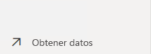

2. En el icono **Archivos**, haga clic en **Obtener**.

    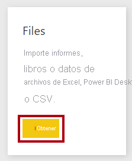

3. Haga clic en el icono **Archivo local**.

    

4. En la ventana **Abrir**, vaya a la carpeta **D:\PL300\Labs\09-create-power-bi-dashboard\Solution**.

5. Seleccione el archivo **Sales Analysis.pbix** y, después, haga clic en **Abrir**.

6. Si se le pide que reemplace el conjunto de datos, haga clic en **Reemplazar**.

### **Tarea 3: Creación del informe**

En esta tarea, creará el informe **Exploración de ventas**.

1. Para abrir Power BI Desktop, en la barra de tareas, haga clic en el acceso directo de Microsoft Power BI Desktop.

    *Importante: Si ya tiene Power BI Desktop abierto (de un laboratorio anterior), cierre esa instancia.*

    

2. Para cerrar la ventana de introducción, en la parte superior izquierda de la ventana, haga clic en **X**.

    

3. Si Power BI Desktop no tiene iniciada la sesión en el servicio Power BI, en la parte superior derecha, haga clic en **Iniciar sesión**.

    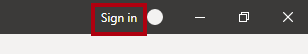

4. Complete el proceso de inicio de sesión con la misma cuenta que usó para iniciar sesión en el servicio Power BI.

5. Para guardar el archivo, haga clic en la ficha de cinta **Archivo** a fin de abrir la vista Backstage.

6. Seleccione **Guardar**.

    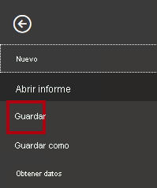

7. En la ventana **Guardar como**, vaya a la carpeta **D:\PL300\MySolution**.

8. En el cuadro **Nombre de archivo**, escriba **Exploración de ventas**.

    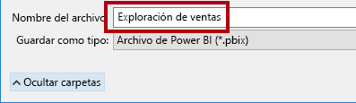

9. Para crear una conexión dinámica con el conjunto de datos **Sales Analysis**, en la ficha de cinta **Inicio**, desde el grupo **Datos**, haga clic en **Conjuntos de datos de Power BI**.

    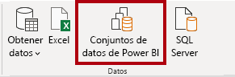

10. En la ventana **Selección de un conjunto de datos para crear un informe**, seleccione el conjunto de datos **Análisis de ventas**.

11. Haga clic en **Crear**.

    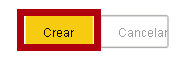

12. Guarde el archivo de Power BI Desktop.

    *Ahora creará cuatro páginas de informe, y en cada una trabajará con un objeto visual diferente para analizar y explorar los datos.*

## **Ejercicio 2: Creación de un gráfico de dispersión**

En este ejercicio, creará un gráfico de dispersión que se puede animar.

### **Tarea 1: Creación de un gráfico de dispersión animado**

En esta tarea, creará un gráfico de dispersión que se puede animar.

1. Cambie el nombre **Página 1** por **Gráfico de dispersión**.

    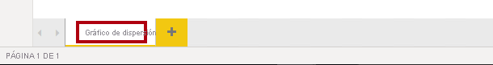

2. Agregue un objeto visual **Gráfico de dispersión** a la página del informe y, después, cambie su tamaño y colóquelo para que ocupe toda la página.

    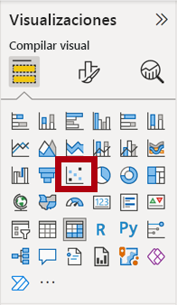

    

3. Agregue los campos siguientes a los apartados o áreas del objeto visual:

    The labs use a shorthand notation to reference a field. It will look like this: <bpt id="p1">**</bpt>Reseller<ept id="p1">**</ept> <bpt id="p2">**</bpt><ph id="ph1">\|</ph><ept id="p2">**</ept> <bpt id="p3">**</bpt>Business Type<ept id="p3">**</ept>. In this example, <bpt id="p1">**</bpt>Reseller<ept id="p1">**</ept> is the table name and <bpt id="p2">**</bpt>Business Type<ept id="p2">**</ept> is the field name.

    - Leyenda: **Revendedor \| Tipo de negocio**

    - Eje X: **Ventas \| Ventas** 

    - Eje Y: **Ventas \| Margen de beneficio**

    - Tamaño: **Ventas \| Cantidad**

    - Eje de reproducción: **Fecha \| Trimestre**

    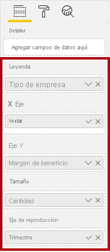

    *El gráfico se puede animar cuando se agrega un campo al apartado o área **Eje de reproducción**.*

4. En el panel **Filtros**, agregue el campo **Producto \| Categoría** al apartado o área **Filtros** de esta página.

5. En la tarjeta de filtro, filtre por **Bicicletas**.

    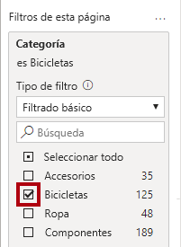

6. Para animar el gráfico, haga clic en **Reproducir** en la esquina inferior izquierda.

    

7. Vea todo el ciclo de animación desde **FY2018 Q1** hasta **FY2020 Q4**.

    *El gráfico de dispersión permite comprender los valores de medida de manera simultánea: en este caso, cantidad de pedido, ingresos de ventas y margen de beneficios.*

    *Cada burbuja representa un tipo de negocio de revendedor. Los cambios en el tamaño de la burbuja reflejan las cantidades de pedido mayores o menores. Los movimientos horizontales representan aumentos o disminuciones de los ingresos de ventas, y los movimientos verticales, aumentos o disminuciones de la rentabilidad.*

8. Cuando se detenga la animación, haga clic en una de las burbujas para ver su seguimiento a lo largo del tiempo.

9. Mantenga el cursor sobre cualquier burbuja para mostrar una información sobre herramientas en la que se describen los valores de medida para el tipo de distribuidor en ese momento dado.

10. En el panel **Filtros**, filtre solo por **Clothing** (Ropa) y observe que genera un resultado muy diferente.

11. Guarde el archivo de Power BI Desktop.

## **Ejercicio 3: Creación de una previsión**

En este ejercicio, creará una previsión para determinar los posibles ingresos de ventas futuras.

### **Tarea 1: Creación de una previsión**

En esta tarea, creará una previsión para determinar los posibles ingresos de ventas futuras.

1. Agregue una nueva página y, después, cambie el nombre de la página por **Previsión**.

    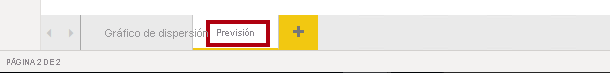

2. Agregue un objeto visual **Gráfico de líneas** a la página del informe y, después, cambie su tamaño y colóquelo para que ocupe toda la página.

    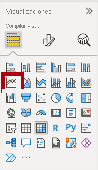

    

  

3. Agregue los campos siguientes a los apartados o áreas del objeto visual:

    - Eje: **Fecha \| Fecha**

    - Valores: **Ventas \| Ventas** 

    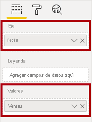

4. En el panel **Filtros**, agregue el campo **Fecha \| Año** al apartado o área **Filtros de esta página**.

5. En la tarjeta de filtro, filtre por dos años: **FY2019** y **FY2020**.

    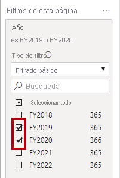

    *Al realizar la previsión sobre una línea temporal, necesitará al menos dos ciclos (años) de datos para generar una previsión precisa y estable.*

  

6. Agregue también el campo **Producto \| Categoría** al apartado o área **Filtros de esta página** y filtre por **Bikes**.

    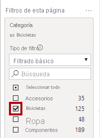

7. Para agregar una previsión, debajo del panel **Visualizaciones**, seleccione el panel **Analytics** (Análisis).

    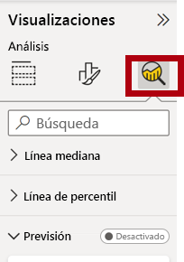

8. Expanda la sección **Previsión**.

    

    *Si la sección **Previsión** no está disponible, probablemente se deba a que el objeto visual no se ha configurado correctamente. La previsión solo está disponible cuando se cumplen dos condiciones: el eje tiene un único campo de tipo Fecha y solo hay un campo de valor.*

9. Haga clic en **Agregar**.

    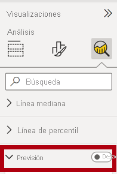

10. Configure las propiedades de previsión siguientes:

    - Predecir duración: 1 mes

    - Intervalo de confianza: 80 %

    - Estacionalidad: 365

11. Haga clic en **Aplicar**.

    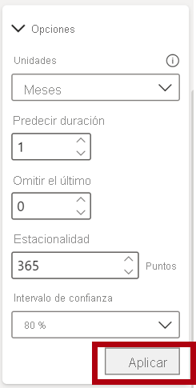

12. En el objeto visual de línea, observe que la previsión se ha ampliado un mes más allá de los datos del historial.

    *El área de color gris representa la confianza. Cuanto mayor sea la confianza, menos estable y, por tanto, menos precisa será la previsión.*

    *Cuando conozca la duración del ciclo, en este caso anual, debe especificar los puntos de estacionalidad. A veces podría ser semanal (7) o mensual (30).*

13. En el panel **Filtros**, filtre solo por **Ropa** y observe que genera un resultado diferente.

14. Guarde el archivo de Power BI Desktop.

### **Tarea 2: Finalización**

En esta tarea, completará el laboratorio.

1. Seleccione la página **Gráfico de dispersión**.

2. Guarde el archivo de Power BI Desktop.

3. Para publicar el archivo en el área de trabajo, en la ficha de cinta **Inicio**, desde el grupo **Compartir**, haga clic en **Publicar**.

    

4.  Cierre Power BI Desktop.
