---
lab:
  title: Aplicación de seguridad de nivel de fila
  module: Module 13 - Row-Level Security
---

# **Aplicación de seguridad de nivel de fila**

**El tiempo estimado para completar el laboratorio es de 45 minutos.**

In this lab you will create a many-to-many relationship between the <bpt id="p1">**</bpt>Salesperson<ept id="p1">**</ept> table and the <bpt id="p2">**</bpt>Sales<ept id="p2">**</ept> table. You will also enforce row-level security to ensure that a salesperson can only analyze sales data for their assigned region(s).

En este laboratorio, aprenderá a:

- Configurar relaciones de varios a varios

- Aplicar seguridad de nivel de fila

### **Caso de laboratorio**

This lab is one of many in a series of labs that was designed as a complete story from data preparation to publication as reports and dashboards. You can complete the labs in any order. However, if you intend to work through multiple labs, for the first 10 labs, we suggest you do them in the following order:

1. Preparación de datos en Power BI Desktop

2. Carga de datos en Power BI Desktop

3. Modelado de datos en Power BI Desktop

5. Creación de cálculos DAX en Power BI Desktop, parte 1

6. Creación de cálculos DAX en Power BI Desktop, parte 2

7. Diseño de un informe en Power BI Desktop, parte 1

8. Diseño de un informe en Power BI Desktop, parte 2

9. Creación de un panel de Power BI

10. Análisis de datos en Power BI Desktop

11. **Aplicación de seguridad de nivel de fila**

## **Ejercicio 1: Aplicación de seguridad de nivel de fila**

En este ejercicio aplicará seguridad de nivel de fila para asegurarse de que los vendedores solo puedan ver las ventas realizadas en sus regiones asignadas.

### **Tarea 1: Primeros pasos**

En esta tarea configurará el entorno para el laboratorio.

*Importante: Si viene de realizar el laboratorio anterior (y lo completó correctamente) no realice esta tarea; en su lugar, continúe con la siguiente.*

1. Para abrir Power BI Desktop, en la barra de tareas, haga clic en el acceso directo de Microsoft Power BI Desktop.

    

1. Para cerrar la ventana de introducción, en la parte superior izquierda de la ventana, haga clic en **X**.

    

1. Para abrir el archivo de inicio de Power BI Desktop, haga clic en la ficha de cinta **Archivo** a fin de abrir la vista Backstage.

1. Seleccione **Abrir informe**.

    

1. Haga clic en **Examinar informes**.

    

1. En la ventana **Abrir**, vaya a la carpeta **D:\PL300\Labs\12-row-level-security\Starter**.

1. Seleccione el archivo **Sales Analysis**.

1. Haga clic en **Abrir**.

    

1. Cierre todas las ventanas informativas que se abran.

1. Para crear una copia del archivo, haga clic en la ficha de cinta **Archivo** para abrir la vista Backstage.

1. Seleccione **Guardar como**.

    

1. Si se le pide que aplique los cambios, haga clic en **Aplicar**.

    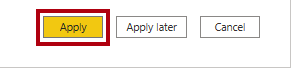

1. En la ventana **Guardar como**, vaya a la carpeta **D:\PL300\MySolution**.

1. Haga clic en **Guardar**.

    

### **Tarea 2: Aplicación de seguridad de nivel de fila**

En esta tarea aplicará seguridad de nivel de fila para asegurarse de que los vendedores solo puedan ver las ventas realizadas en sus regiones asignadas.

1. Cambie a la vista de datos.

    

2. En el panel **Campos**, seleccione la tabla **Salesperson (Performance)** (Vendedor [Rendimiento]).

3. Revise los datos y verá que Michael Blythe (EmployeeKey 281) tiene un valor de UPN de **michael-blythe@adventureworks.com** .

    *Recuerde que Michael Blythe está asignado a tres regiones de ventas: Noreste de EE. UU., Centro de EE. UU. y Sudeste de EE. UU.*

4. Cambie a la vista Informe.

5. En la ficha de cinta **Modelado**, en el grupo **Seguridad**, haga clic en **Administrar roles**.

    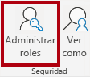

6. En la ventana **Administrar roles**, haga clic en **Crear**.

    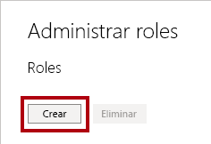

7. En el cuadro, reemplace el texto seleccionado por el nombre del rol: **Salespeople** y, después, presione **Entrar**.

    

8. A fin de asignar un filtro para la tabla **Salesperson (Performance)** , haga clic en el carácter de puntos suspensivos (...) y, después, seleccione **Agregar filtro \| [UPN]** .

    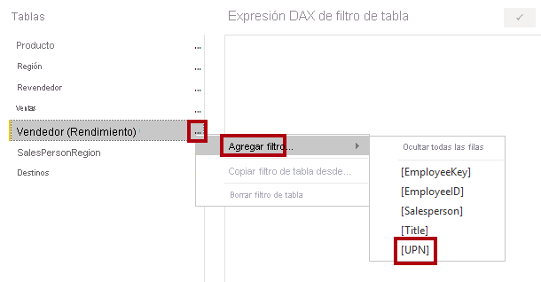

9. En el cuadro **Expresión DAX de filtro de tabla**, modifique la expresión reemplazando **"Value"** por **USERPRINCIPALNAME()** .

    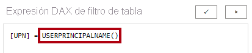

    *USERPRINCIPALNAME() es una función de expresiones de análisis de datos (DAX) que devuelve el nombre del usuario autenticado. Significa que la tabla **Salesperson (Performance)** filtrará por el nombre principal de usuario (UPN) del usuario que realiza la consulta del modelo.*

10. Haga clic en **Guardar**.

    

11. Para probar el rol de seguridad, en la ficha de cinta **Modelado**, en el grupo **Seguridad**, haga clic en **Ver como**.

    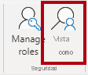

12. En la ventana **Ver como roles**, compruebe el elemento **Otro usuario** y, después, en el cuadro correspondiente, escriba **michael-blythe@adventureworks.com** .

13. Compruebe el rol **Salespeople**.

    

    *Esta configuración da como resultado el uso del rol **Salespeople** y la suplantación del usuario con el nombre Michael Blythe.*

14. Haga clic en **OK**.

    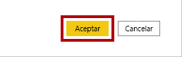

15. Fíjese en el mensaje emergente amarillo, encima de la página del informe, que describe el contexto de seguridad de la prueba.

    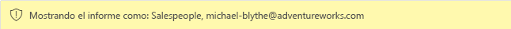

16. En el objeto visual de tabla, observe que solo aparece el vendedor **Michael Blythe**.

    

17. Para detener las pruebas, en el lado derecho del banner amarillo, haga clic en **Detener visualización**.

    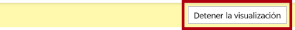

    *Cuando el archivo de Power BI Desktop se publique en el servicio Power BI, deberá completar una tarea posterior a la publicación para asignar las entidades de seguridad al rol **Salespeople**. No lo haremos en este laboratorio.*

18. Para eliminar el rol, en la ficha de cinta **Modelado**, en el grupo **Seguridad**, haga clic en **Administrar roles**.

    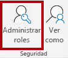

19. En la ventana **Administrar roles**, haga clic en **Eliminar**.

    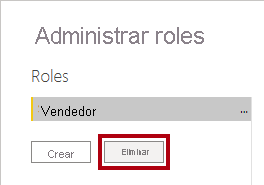

20. Cuando se le pida que confirme la eliminación, haga clic en **Sí, eliminar**.

21. Haga clic en **Guardar**.

    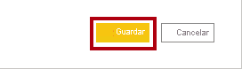

### **Tarea 2: Finalización**

En esta tarea, completará el laboratorio.

1. Guarde el archivo de Power BI Desktop.
