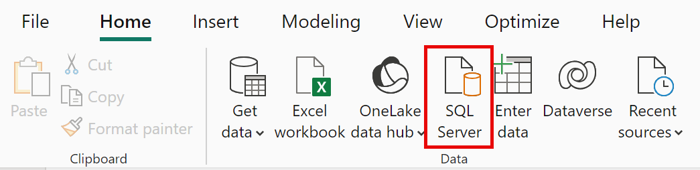
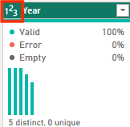

---
lab:
  title: "Obtención de datos en Power\_BI"
  module: Get data in Power BI
---

# Obtención de datos en Power BI

## **Caso de laboratorio**

Este laboratorio está diseñado para presentarle la aplicación de Power BI Desktop y cómo conectarse a los datos y usar técnicas de vista previa de datos para comprender las características y la calidad de los datos de origen.

En este laboratorio, aprenderá a:

- Abra Power BI Desktop.
- Conectarse a diferentes orígenes de datos.
- Previsualizar los datos de origen con Power Query.
- Usar características de generación de perfiles de datos en Power Query.

**Este laboratorio debe durar unos 30 minutos**.

## Introducción a Power BI Desktop

Para completar este ejercicio, abre primero un explorador web e introduce la siguiente URL para descargar la carpeta zip:

`https://github.com/MicrosoftLearning/PL-300-Microsoft-Power-BI-Data-Analyst/raw/Main/Allfiles/Labs/01-get-data-in-power-bi/01-get-data.zip`

Extraiga la carpeta a la carpeta **C:\sers\student\Downloads\01-get-data**.

Abre el archivo **01-Starter-Sales Analysis.pbix**.

- El archivo de inicio se ha configurado especialmente para ayudarte a completar el laboratorio. La siguiente configuración de nivel de informe se ha deshabilitado en el archivo de inicio:

  - Carga de datos > Importar relaciones de orígenes de datos en la primera carga
  - Carga de datos > Detectar automáticamente nuevas relaciones cuando se carguen los datos

## Obtención de datos de SQL Server

Esta tarea le enseña a conectarse a una base de datos de SQL Server e importar tablas, que crean consultas en Power Query.

1. En la ficha de cinta **Inicio**, en el grupo **Datos**, seleccione **SQL Server**.

     

1. En la ventana **Base de datos de SQL Server**, en el cuadro **Servidor**, escriba **localhost** y deje **Base de datos** en blanco y, a continuación, seleccione **Aceptar**.

    > ***Nota**: En este laboratorio, se conectará a la base de datos de SQL Server mediante **localhost**. Aunque este enfoque funciona aquí, no se recomienda para sus propias soluciones porque los orígenes de datos de puerta de enlace no pueden resolver **localhost**.*

1. Si se te solicitan credenciales, selecciona **Windows > Usar mis credenciales actuales** y luego haz clic en **Conectar**.

1. Selecciona **Aceptar** si recibes una advertencia de que no se puede establecer una conexión cifrada.

1. En el panel **Navegador**, expanda la base de datos **AdventureWorksDW2020**.

    > ***Nota**: La base de datos **AdventureWorksDW2020** está basada en la base de datos de ejemplo **AdventureWorksDW2017**. Se ha modificado para admitir los objetivos de aprendizaje de los laboratorios del curso.*

1. Seleccione la tabla **DimEmployee** y observe la vista previa de los datos de la tabla.

     

    > ***Nota**: Los datos de la vista previa permiten ver las columnas y un ejemplo de filas.*

1. Para importar los datos de tabla, **activa la casilla** situada junto a las tablas siguientes:

    - DimEmployee
    - DimEmployeeSalesTerritory
    - DimProduct
    - DimReseller
    - DimSalesTerritory
    - FactResellerSales

1. Completa esta tarea seleccionando **Transformar datos**, lo que abrirá el editor de Power Query; déjalo abierto para la siguiente tarea.

Ahora te has conectado a seis tablas de una base de datos de SQL Server.

## **Vista previa de datos en el Editor de Power Query**

Esta tarea presenta el Editor de Power Query y permite revisar los datos y generar perfiles de estos. Esto le ayuda a determinar cómo limpiar y transformar los datos más adelante. También revisará ambas tablas de dimensiones con el prefijo "Dim" y las tablas de hechos con el prefijo "Fact".

1. En la ventana del **Editor de Power Query**, a la izquierda, observe el panel **Consultas**. El panel **Consultas** contiene una consulta para cada tabla seleccionada.

     

1. Seleccione la primera consulta **DimEmployee**.

    > *La tabla **DimEmployee** de la base de datos SQL Server almacena una fila para cada empleado. Un subconjunto de las filas de esta tabla representa a los vendedores, que serán pertinentes para el modelo que va a desarrollar.*

1. En la esquina inferior izquierda de la barra de estado, se proporcionan algunas estadísticas de la tabla, que tiene 33 columnas y 296 filas.

     

1. En el panel de vista previa de los datos, desplácese horizontalmente para revisar todas las columnas. Observe que las cinco últimas columnas contienen vínculos de tipo **Tabla** o **Valor**.

    > *Estas cinco columnas representan relaciones con otras tablas de la base de datos. pueden usarse para combinar tablas. Estas tablas se combinarán más adelante en el laboratorio **Cargar datos transformados en Power BI Desktop**.*

1. Para evaluar la calidad de las columnas, en la ficha de cinta **Vista**, en el grupo **Vista previa de los datos**, consulte **Calidad de columnas**. La característica calidad de las columnas permite determinar fácilmente el porcentaje de valores válidos, errores o valores vacíos encontrados en las columnas.

     

1. Observe que la columna **Posición** tiene un 94 % de filas vacías (nulas).

     

1. Para evaluar la distribución de las columnas, en la ficha de cinta **Vista**, en el grupo **Vista previa de los datos**, consulte **Distribución de columnas**.

1. Revise de nuevo la columna **Position** y observe que hay cuatro valores distintos y uno único.

1. Revise la distribución de la columna **EmployeeKey**: 296 valores distintos y 296 únicos.

     

    > ***Nota**: Cuando los recuentos distintos y únicos son iguales, significa que la columna contiene valores únicos. Al realizar el modelado, es importante que algunas tablas del modelo tengan columnas únicas, Estas columnas únicas se pueden usar para crear relaciones de uno a varios, que se realizarán en el laboratorio **Modelado de datos en Power BI Desktop**.*

1. En el panel **Consultas**, seleccione la consulta **DimProduct**.

    > *La tabla **DimProduct** contiene una fila por producto vendido por la empresa.*

1. En el panel **Consultas**, seleccione la consulta **DimReseller**.

    > *La tabla **DimReseller** contiene una fila por revendedor. Los revendedores venden, distribuyen o agregan valor a los productos Adventure Works.*

1. Para ver los valores de las columnas, en la ficha de cinta **Vista**, en el grupo **Vista previa de los datos**, consulte **Perfil de columna**.

1. Seleccione el encabezado de columna **BusinessType** y observe el nuevo panel debajo del panel de vista previa de datos. Revise las estadísticas de columna y la distribución de valores en el panel de vista previa de los datos.

    > *Fíjese en el problema con la calidad de los datos: hay dos etiquetas para el almacén (**Warehouse** y **Ware House**, este último mal escrito).*

     

1. Si mantiene el puntero sobre la barra de **Ware House**, verá que hay cinco filas con este valor.

1. En el panel **Consultas**, seleccione la consulta **DimSalesTerritory**.  

    > *La tabla **DimSalesTerritory** contiene una fila por región de ventas, incluida **la sede corporativa** (sede central). Las regiones se asignan a un país y los países se asignan a grupos. En el laboratorio **Datos de modelo de Power BI Desktop**, creará una jerarquía para admitir el análisis en el nivel de región, país o grupo.*

1. En el panel **Consultas**, seleccione la consulta **FactResellerSales**.

    > *La tabla **FactResellerSales** contiene una fila por línea de pedido de venta. Un pedido de venta contiene uno o varios elementos de línea.*

1. Revise la calidad de la columna **TotalProductCost** y observe que el 8 % de las filas están vacías.

    > *El hecho de que falten valores en la columna **TotalProductCost** supone un problema de calidad de los datos.*

## **Obtención de datos de un archivo CSV**

En esta tarea, creará una nueva consulta basada en archivos CSV.

1. Para agregar una nueva consulta, vaya a la ventana **Editor de Power Query**. En la ficha de cinta **Inicio**, en el grupo **Nueva consulta**, seleccione la flecha desplegable de **Nuevo origen** y, luego, seleccione **Texto o CSV**.

1. Vaya a la carpeta **Descargas > 01-get-data** que extrajo anteriormente y seleccione el archivo **ResellerSalesTargets.csv**. Seleccione **Open** (Abrir).

1. En la ventana **ResellerSalesTargets.csv**, revise la vista previa de los datos. Seleccione **Aceptar**.

1. En el panel **Consultas**, observe la adición de la consulta **ResellerSalesTargets**.

    > *El archivo CSV **ResellerSalesTargets** contiene una fila por vendedor y año. Cada fila registra 12 objetivos de ventas mensuales (expresados en miles). El año comercial de la empresa Adventure Works comienza el 1 de julio.*

1. Observe que ninguna columna contiene valores vacíos.  Cuando no hay un objetivo de ventas mensual, se almacena un carácter de guion.

1. Revise los iconos de cada encabezado de columna, a la izquierda del nombre de columna. Los iconos representan el tipo de datos de la columna. **123** es un número entero y **ABC** es texto.

     

1. Repite los pasos para crear una consulta basada en el archivo **ColorFormats.csv**.

    > *El archivo CSV **ColorFormats** contiene una fila por color del producto. Cada fila registra los códigos HEX para dar formato a los colores de fondo y de fuente.*

Ahora deberías tener dos nuevas consultas: **ResellerSalesTargets** y **ColorFormats**.

 

## Laboratorio completado
