---
lab:
  title: "Diseño de un modelo de datos en Power\_BI"
  module: Design a Data Model in Power BI
---

# Diseño de un modelo de datos en Power BI

## **Caso de laboratorio**

En este laboratorio, comenzará a desarrollar el modelo de datos. Implicará la creación de relaciones entre las tablas y, después, la configuración de las propiedades de tabla y columna para mejorar la facilidad de uso del modelo de datos. También creará jerarquías y medidas rápidas.

En este laboratorio, aprenderá a:

- Crear relaciones de modelos
- Configurar propiedades de tablas y columnas
- Crear jerarquías

**Este laboratorio debe durar unos 45 minutos**.

## **Introducción**

En esta tarea configurará el entorno para el laboratorio.

1. Abra Power BI Desktop.

    

    *Sugerencia: De forma predeterminada, se abre el cuadro de diálogo Introducción delante de Power BI Desktop. Puede optar por iniciar sesión y cerrar la ventana emergente.*

1. Para abrir el archivo de inicio de Power BI Desktop, seleccione **Archivo > Abrir informe > Examinar informes**.

1. Vaya a la carpeta **D:\PL300\Labs\03-configure-data-model-in-power-bi-desktop\Starter** y seleccione el archivo **Sales Analysis**.

1. Cierre todas las ventanas informativas que se abran.

1. Vaya a **Archivo > Guardar como** y guarde el archivo en la carpeta **D:\PL300\MySolution**.

## **Crear relaciones de modelos**

En esta tarea, creará relaciones del modelo. El archivo se ha configurado para no identificar relaciones entre las tablas de los laboratorios anteriores. Esta no es la configuración predeterminada, pero se recomienda para evitar el trabajo adicional de crear las relaciones correctas para el modelo.

*Importante: Los laboratorios usan una notación abreviada para hacer referencia a un campo, con este formato: **Product \| Category**. En este ejemplo, **Product** es el nombre de la tabla y **Category** es el nombre del campo.*

1. En Power BI Desktop, en la parte izquierda, seleccione el icono de la vista **Modelo**.

     

1. Si no ve las siete tablas, desplácese horizontalmente hacia la derecha y arrastre y junte las tablas para poder verlas todas al mismo tiempo.

     *Sugerencia: También puede utilizar el control de zoom situado en la parte inferior de la ventana.*

1. Para volver a la vista Informe, a la izquierda, seleccione el icono de la vista **Informe**.

     

1. Para ver todos los campos de tabla, en el panel **Datos**, haga clic con el botón derecho en un área vacía y, después, seleccione **Expandir todo**.

1. Para crear un objeto visual de tabla, en el panel **Datos**, desde dentro de la tabla **Producto**, active el campo **Categoría**.

1. Para agregar otra columna a la tabla, en el panel **Datos**, active el campo **Ventas \| Ventas**.

1. Observe que en el objeto visual de tabla se enumeran cuatro categorías de productos y que el importe de ventas es el mismo para cada una de ellas, y el mismo para el total.

    *El problema es que la tabla se basa en campos de otras tablas. La expectativa es que en cada categoría de producto se muestren las ventas de esa categoría. Pero como no hay una relación del modelo entre estas tablas, la tabla **Sales** no se filtra. Ahora agregará una relación para propagar filtros entre las tablas.*

     

1. En la pestaña **Modelado** de la cinta, en el grupo **Relaciones**, seleccione **Administrar relaciones**.

     

1. En la ventana **Administrar relaciones**, observe que todavía no se ha definido ninguna relación.

1. Para crear una relación, seleccione **Nueva**.

1. En la ventana **Crear relación**, en la primera lista desplegable, seleccione la tabla **Product** (Producto).

     

1. En la segunda lista desplegable (bajo la cuadrícula de la tabla **Product**), seleccione la tabla **Sales** (Ventas).

     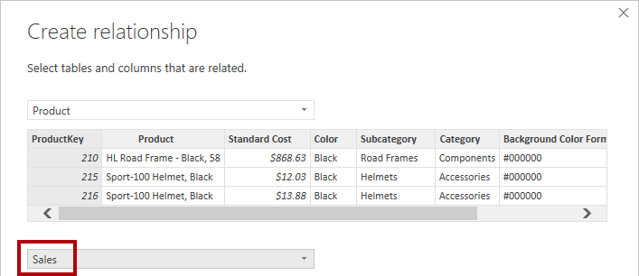

1. Observe que se han seleccionado automáticamente las columnas **ProductKey** (Clave de producto) de cada tabla.

    *Las columnas se han seleccionado porque comparten el mismo nombre y tipo de datos. Es posible que tenga que buscar columnas coincidentes con nombres diferentes en datos reales.*

1. En la lista desplegable **Cardinalidad**, observe que se ha seleccionado **Uno a varios (1:*)**.

    *La cardinalidad se ha detectado de forma automática, ya que Power BI entiende que la columna **ProductKey** de la tabla **Product** contiene valores únicos. Las relaciones uno a varios son la cardinalidad más común y todas las relaciones que cree en este laboratorio serán de este tipo.*

1. En la lista desplegable **Dirección del filtro cruzado**, observe que está seleccionado el valor **Único**.

    *La dirección de filtro único significa que los filtros se propagan de "un lado" a "varios lados". En este caso, significa que los filtros que se aplican a la tabla **Product** se propagarán a la tabla **Sales**, pero no en la dirección contraria.*

1. Observe que la opción **Mark This Relationship Active** (Marcar esta relación activa) está seleccionada.

    *Las relaciones activas propagan los filtros. Una relación se puede marcar como inactiva para que los filtros no se propaguen. Pueden existir relaciones inactivas cuando hay varias rutas de relación entre las tablas. En este caso, los cálculos del modelo pueden usar funciones especiales para activarlas.*

1. Seleccione **Aceptar**. En la ventana **Administrar relaciones**, observe que aparece la nueva relación. Seleccione **Cerrar**.

1. Observe que ahora hay un conector entre las dos tablas (no importa si las tablas están situadas juntas o no).
    1. Puede interpretar la cardinalidad representada por los indicadores **1** y **(*)** .
    1. La dirección del filtro se representa mediante la punta de la flecha.
    1. Una línea continua representa una relación activa. Una línea discontinua representa una relación inactiva.
    1. Mantenga el cursor sobre la relación para resaltar las columnas relacionadas.

     

     Hay una manera más fácil de crear una relación. En el diagrama del modelo, puede arrastrar y colocar columnas para crear una relación.

1. Para crear una relación usando una técnica distinta, en la tabla **Reseller** arrastre la columna **ResellerKey** a la columna **ResellerKey** de la tabla **Sales**.

    *Sugerencia: A veces una columna no se deja arrastrar. Si se produce esta situación, seleccione otra columna y, después, vuelva a seleccionar la columna que quiere arrastrar e inténtelo de nuevo. Cerciórese de que se ve la nueva relación agregada al diagrama.*

     

1. Use la técnica nueva para crear las dos relaciones de modelo siguientes:

     - De **Region \| SalesTerritoryKey** (Región | Clave de territorio de ventas) a **Sales \| SalesTerritoryKey** (Ventas | Clave de territorio de ventas)
     - De **Salesperson \| EmployeeKey** (Vendedor | Clave de empleado) a **Sales \| EmployeeKey** (Ventas | Clave de empleado)

1. En el diagrama, organice las tablas para que la tabla **Sales** se coloque en el centro del diagrama y las tablas relacionadas estén organizadas a su alrededor. Coloque las tablas desconectadas al lado.

     

1. En la vista Informe, observe que el objeto visual de la tabla se ha actualizado para mostrar valores diferentes para cada categoría de producto.

    *Los filtros que se aplican a la tabla **Product** ahora se propagan a la tabla **Sales**.*

     

1. Guarde el archivo de Power BI Desktop.

## **Configuración de tablas**

En este ejercicio configurará cada tabla. Para ello, creará jerarquías y ocultará, clasificará y aplicará formato a columnas.

## **Configuración de la tabla Product**

En esta tarea configurará la tabla **Product**.

1. En la vista Modelo, en el panel **Datos**, expanda la tabla **Producto** si es necesario para mostrar todos los campos.

1. Para crear una jerarquía, en el panel **Datos**, haga clic con el botón derecho en la columna **Categoría** y, después, seleccione **Crear jerarquía**.

     

1. En el panel **Propiedades** (a la izquierda del panel **Datos**), reemplace el texto en el cuadro **Nombre** con **Productos**.

1. Para agregar el segundo nivel de jerarquía, en el panel **Propiedades**, en la lista desplegable **Jerarquía**, seleccione **Subcategoría** (es posible que tenga que desplazarse hacia abajo dentro del panel).

1. Para agregar el tercer nivel a la jerarquía, seleccione **Product** en la lista desplegable **Jerarquía**.

1. Para completar el diseño de la jerarquía, seleccione **Aplicar cambios en el nivel**.

     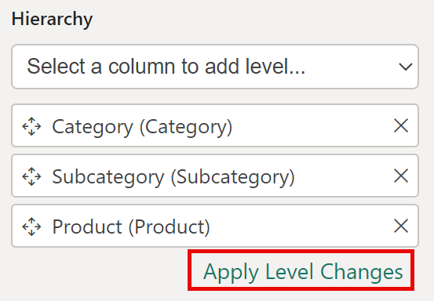

    *Sugerencia: No olvide seleccionar **Aplicar cambios en el nivel**. Es un error habitual pasar por alto este paso.*

1. En el panel **Datos**, observe la jerarquía **Productos**.

     

1. Para mostrar los niveles de la jerarquía, expanda la jerarquía **Products**.

     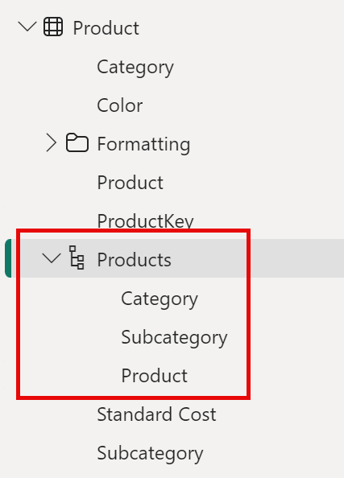

1. Para organizar las columnas en una carpeta para mostrar, seleccione primero la columna **Formato de color de fondo** en el panel **Datos**.

1. Mientras presiona la tecla **Ctrl**, seleccione la columna **Formato de color de fuente**.

1. En el panel **Propiedades**, en el cuadro **Carpeta para mostrar**, escriba **Formato**.

     

1. En el panel **Datos**, observe que ahora las dos columnas están dentro de una carpeta.
    
   *Las carpetas para mostrar son una excelente manera de descongestionar las tablas, especialmente las que contienen muchos campos. Son una presentación lógica solamente.*

     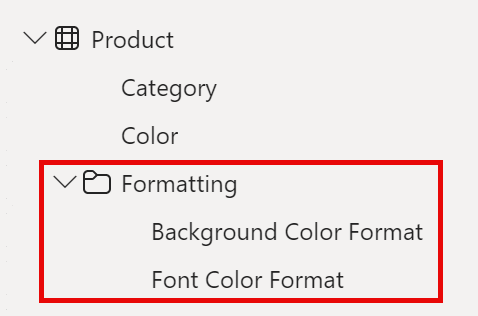

## **Configuración de la tabla Region**

En esta tarea configurará la tabla **Region**.

1. En la tabla **Region**, cree una jerarquía denominada **Regions** (Regiones), con los tres niveles siguientes:

     - Group (Grupo)
     - Country (País)
     - Region

     

1. Seleccione la columna **Country** (País) (no el nivel de jerarquía **Country**).

1. En el panel **Propiedades**, expanda la sección **Avanzado** en la parte inferior del panel y, después, en la lista desplegable **Categoría de datos**, seleccione **País o región**.

    *La categorización de datos puede proporcionar sugerencias al diseñador de informes. En este caso, la categorización de la columna como país o región proporciona información más precisa a Power BI cuando representa una visualización de mapa.*

     

## **Configuración de la tabla Reseller**

En esta tarea configurará la tabla **Reseller**.

1. En la tabla **Reseller**, cree una jerarquía denominada **Resellers**, con los dos niveles siguientes:

     - Business Type
     - Reseller

1. Cree una segunda jerarquía denominada **Geography** (Geografía), con los cuatro niveles siguientes:

     - Country-Region
     - State-Province
     - City
     - Reseller

1. Establezca la **Categoría de datos** para las columnas **Country-Region**, **State-Province** y **City** (no el nivel de jerarquía) en **País o región**, **Estado o Provincia**, y **Ciudad**, respectivamente.

## **Configuración de la tabla Sales**

En esta tarea configurará la tabla **Sales**.

1. En la tabla **Sales**, seleccione la columna **Cost**.

1. En el panel **Propiedades**, en el cuadro **Descripción**, escriba: *Basado en el costo estándar*.

    *Las descripciones se pueden aplicar a tablas, columnas, jerarquías o medidas. En el panel **Datos**, el texto descriptivo se muestra en una información sobre herramientas cuando el autor del informe mantiene el cursor sobre el campo.*

1. Seleccione la columna **Cantidad**.

1. En el panel **Propiedades**, dentro de la sección **Formato**, deslice la propiedad **Separador de miles** a **Sí**.

1. Seleccione la columna **Precio unitario**.

1. En el panel **Propiedades**, desde dentro de la sección **Formato**, establezca la propiedad **Posiciones decimales** en **2**.

1. En el grupo **Avanzado** (es posible que tenga que desplazarse hacia abajo para encontrarlo), en la lista desplegable **Resumir por**, seleccione **Promedio**.

    *De forma predeterminada, las columnas numéricas se resumen mediante la suma de valores. Este comportamiento predeterminado no es adecuado para una columna como **Unit Price**, que representa una tarifa. Al establecer el resumen predeterminado en el promedio se generará un resultado significativo.*

## **Actualización masiva de propiedades**

En esta tarea actualizará varias columnas mediante actualizaciones masivas únicas. Usará este enfoque para ocultar columnas y darle formato a los valores de columna.

1. En el panel **Datos**, seleccione la columna **Producto \| Clave de producto**.

1. Mientras presiona la tecla **Ctrl**, seleccione las 13 columnas siguientes (que abarcan varias tablas):

     - Region \| SalesTerritoryKey
     - Reseller \| ResellerKey
     - Sales \| EmployeeKey
     - Ventas \| ProductKey
     - Sales \| ResellerKey
     - Sales \| SalesOrderNumber
     - Sales \| SalesTerritoryKey
     - Salesperson \| EmployeeID
     - Salesperson \| EmployeeKey
     - Salesperson \| UPN
     - SalespersonRegion \| EmployeeKey
     - SalespersonRegion \| SalesTerritoryKey
     - Targets \| EmployeeID

1. En el panel **Propiedades**, deslice la propiedad **Está oculta** a **Sí**.

    *Las columnas estaban ocultas porque las usan las relaciones, o se usarán en la configuración de seguridad de nivel de fila o en la lógica de cálculo.*

    *Usará **SalesOrderNumber** en un cálculo en el laboratorio **Creación de cálculos DAX en Power BI Desktop**.*

1. Seleccione las tres columnas siguientes:

     - Product \| Standard Cost
     - Sales \| Cost
     - Sales \| Sales

1. En el panel **Propiedades**, desde dentro de la sección **Formato**, establezca la propiedad **Posiciones decimales** en **0**.

## **Revisión de la interfaz del modelo**

En este ejercicio cambiará a la vista Informe y revisará la interfaz del modelo.

## **Revisión de la interfaz del modelo**

En esta tarea cambiará a la vista Informe y revisará la interfaz del modelo.

1. Cambio a la vista Informe.

1. En el panel **Datos**, observe lo siguiente:

     - Las columnas, las jerarquías y sus niveles son campos, que se pueden usar para configurar los objetos visuales del informe
     - Solo se ven los campos relevantes para la creación de informes
     - La tabla **SalespersonRegion** no está visible porque todos sus campos están ocultos.
     - Los campos espaciales de la tabla **Region** y **Reseller** se etiquetan con un icono espacial
     - Los campos con la etiqueta sigma (Ʃ) se resumirán, de forma predeterminada
     - Aparece una información sobre herramientas al mantener el cursor sobre el campo **Sales \| Cost** (Ventas | Costo).

1. Expanda el campo **Sales \| OrderDate** (Ventas | Fecha de pedido) y, después, observe que muestra una jerarquía de fecha.

    *El campo **Targets \| TargetMonth** presenta una jerarquía similar. Estas jerarquías no las ha creado usted. Se han creado de forma automática. Pero hay un problema. El año fiscal de Adventure Works comienza el 1 de julio de cada año. Pero en estas jerarquías de fechas creadas automáticamente, la jerarquía de fecha comienza el 1 de enero de cada año.*

     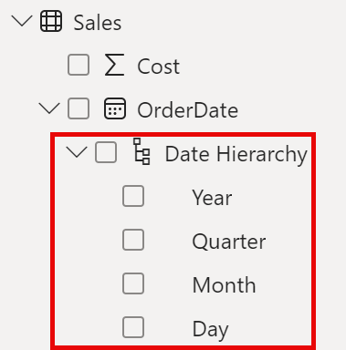

 Ahora desactivará este comportamiento automático. En el laboratorio **Creación de cálculos DAX en Power BI Desktop**, usará DAX para crear una tabla de fechas y configurarla para definir el calendario de Adventure Works.

1. Para desactivar la fecha y hora automáticas, vaya a **Archivo > Opciones y configuración > Opciones > Archivo actual** y seleccione **Carga de datos**.
    1. En la sección **Inteligencia de tiempo**, desactive **Fecha y hora automáticas**.

     

1. En el panel **Datos**, observe que las jerarquías de fecha ya no están disponibles.

     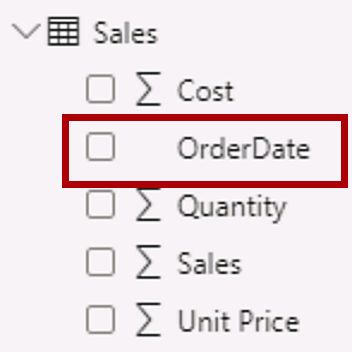

## **Creación de medidas rápidas**

En este ejercicio creará dos medidas rápidas.

## **Crear medidas rápidas**

En esta tarea creará dos medidas rápidas para calcular los beneficios y el margen de beneficio.

*Una medida rápida crea la fórmula de cálculo de forma automática. Son fáciles y rápidas de crear para cálculos simples y comunes. Creará medidas sin usar esta herramienta en el laboratorio **Creación de cálculos DAX en Power BI Desktop**.*

1. En el panel **Datos**, haga clic con el botón derecho en la tabla **Ventas** y seleccione **Nueva medida rápida**.

     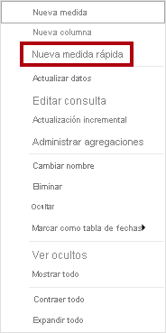

1. En la ventana **Medidas rápidas**, en la lista desplegable **Cálculo**, en el grupo **Operaciones matemáticas**, seleccione **Resta**.

     

1. En el panel **Datos** de la ventana **Medidas rápidas**, expanda la tabla **Ventas**.

1. Arrastre el campo **Sales** al cuadro **Valor base**.

1. Arrastre el campo **Costo** al cuadro **Valor que se restará**.

     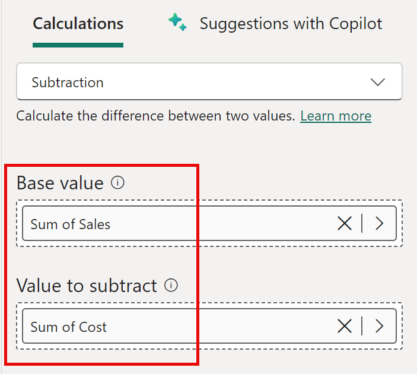

1. En el panel **Datos**, dentro de la tabla **Ventas**, observe la nueva medida.
    1. *Las medidas usan el icono de calculadora.*

     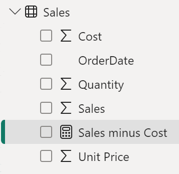

1. Para cambiar el nombre de la medida, haga clic con el botón derecho en ella, seleccione **Cambiar nombre** y dele el nombre **Beneficios**.

    *Sugerencia: Para cambiar el nombre de un campo, también puede hacer doble clic en él, o bien seleccionarlo y presionar **F2**.*

1. En la tabla **Sales**, agregue una segunda medida rápida, en función de los requisitos siguientes:

     - Use la operación matemática **División**.
     - Establezca el **Numerador** en el campo **Sales \| Profit**.
     - Establezca el **Denominador** en el campo **Sales \| Sales**.
     - Cambie el nombre de la medida por **Margen de beneficio**.

1. Asegúrese de que la medida **Margen de beneficio** está seleccionada y, después, en la cinta contextual **Herramientas de medición**, establezca el formato en **Porcentaje**, con dos posiciones decimales.

     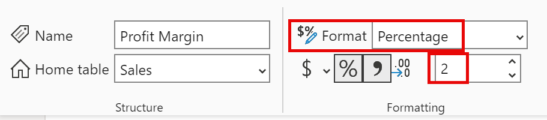

1. Para probar las dos medidas, seleccione primero el objeto visual **Tabla** en la página del informe.

1. En el panel **Datos**, active las dos medidas.

     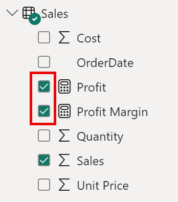

1. Seleccione y arrastre la guía correcta para ampliar el objeto visual de tabla.

     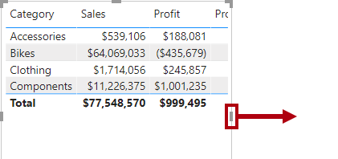

1. Compruebe que las medidas generan un resultado razonable con el formato correcto.

     

## **Creación de una relación de varios a varios**

En esta tarea creará una relación de varios a varios entre las tablas **Salesperson** y **Sales**.

 *Los laboratorios usan una notación abreviada para hacer referencia a un campo. Tendrá este aspecto: **Salesperson \| Salesperson**. En este ejemplo, **Salesperson** es el nombre de la tabla y **Salesperson** es el nombre del campo.*

1. En Power BI Desktop, en la vista Informe, en el panel **Datos**, active los dos campos siguientes para crear un objeto visual de **tabla**.

     - Salesperson \| Salesperson
     - Sales \| Sales

     

     *En la tabla se muestran las ventas realizadas por cada vendedor. Pero hay otra relación entre los vendedores y las ventas. Algunos vendedores pertenecen a una, dos o posiblemente más regiones de ventas. Además, las regiones de ventas pueden tener varios vendedores asignados.*

     *Desde la perspectiva de la administración del rendimiento, las ventas de un vendedor (en función de sus territorios asignados) se deben analizar y comparar con los objetivos de ventas. Creará relaciones para admitir este análisis en el siguiente ejercicio.*

1. Observe que **Michael Blythe** ha vendido casi 9 millones de USD.

1. Cambie a la Vista de modelo y arrastre la tabla **SalespersonRegion** para ponerla entre las tablas **Region** y **Salesperson**.

1. Use la técnica de arrastrar y colocar para crear las dos relaciones de modelo siguientes:

     - De **Salesperson \| EmployeeKey** a **SalespersonRegion \| EmployeeKey**
     - De **Region \| SalesTerritoryKey** a **SalespersonRegion \| SalesTerritoryKey**

    *La tabla **SalespersonRegion** se puede considerar una tabla de puente.*

1. Cambie a la vista Informe y observe que el objeto visual no se ha actualizado. El resultado de ventas de Michael Blythe no ha cambiado.

1. Vuelva a la vista Modelo y, luego, siga la dirección del filtro de relación (la punta de flecha) desde la tabla **Salesperson**.

    *Tenga en cuenta la tabla **Salesperson** filtra la tabla **Sales**. También filtra la tabla **SalespersonRegion**, pero no continúa propagando filtros hasta la tabla **Region** (la flecha apunta hacia la dirección equivocada).*

     

1. Para editar la relación entre las tablas **Region** y **SalespersonRegion**, haga doble clic en la relación.

1. En la ventana **Editar relación**, en la lista desplegable **Dirección del filtro cruzado**, seleccione **Ambos**.

1. Active la casilla **Aplicar filtro de seguridad en ambas direcciones** y seleccione Aceptar.

     

1. Observe que ahora la relación tiene una flecha doble.

     

1. Cambie a la vista Informe y, después, observe que los valores de ventas todavía no han cambiado.

    *Ahora el problema está relacionado con el hecho de que hay dos posibles rutas de propagación de filtros entre las tablas **Salesperson** y **Sales**. Esta ambigüedad se resuelve de manera interna, en función de una evaluación del "número mínimo de tablas". Para ser claros, no debería diseñar modelos con este tipo de ambigüedad, el problema se solucionará en parte más adelante en este laboratorio y al completar el laboratorio **Creación de cálculos DAX en Power BI Desktop**.*

1. Cambie a la Vista de modelo para forzar la propagación de filtros a través de la tabla puente. Edite (doble clic) la relación entre las tablas **Salesperson** y **Sales**.

1. En la ventana **Editar relación**, desactive la casilla **Activar esta relación** y seleccione **Aceptar**.

    *Ahora la propagación del filtro seguirá la única ruta activa.*

1. En el diagrama, observe que la relación inactiva se representa mediante una línea discontinua.

     

1. Cambie a la vista Informe y observe que las ventas de Michael Blythe ahora ascienden a casi 22 millones de USD.

     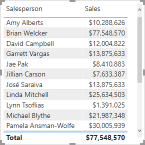

1. Observe también que las ventas de cada vendedor, si se sumaran, superarían el total de la tabla.

     *Es una observación común de una relación de varios a varios, debido al recuento doble, triple, etc., de los resultados de las ventas regionales. Fíjese en Brian Welcker, el segundo vendedor de la lista. Su importe de ventas es igual a la cantidad total de ventas. Es el resultado correcto, porque, al ser el director de ventas, sus ventas se miden sumando las de todas las regiones.*

     *Aunque la relación de varios a varios está funcionando, ahora no se pueden analizar las ventas realizadas por un vendedor, porque la relación está inactiva. Podrá reactivar la relación cuando introduzca una tabla calculada, que permitirá el análisis de ventas realizado en las regiones de ventas asignadas al vendedor (para un análisis del rendimiento), en el laboratorio **Creación de cálculos DAX en Power BI Desktop**.*

1. Cambie a la vista Modelado y, después, en el diagrama, seleccione la tabla **Salesperson**.

1. En el panel **Propiedades**, en el cuadro **Nombre**, reemplace el texto por **Salesperson (Performance)** (Vendedor (rendimiento)).

*La tabla con el nombre cambiado ahora refleja su finalidad: se usa para notificar y analizar el rendimiento de los vendedores en función de las ventas de sus regiones de ventas asignadas.*

## **Relación con la tabla Targets**

En esta tarea creará una relación con la tabla **Targets**.

1. Cree una relación desde la columna **Salesperson (Performance) \| EmployeeID** y la columna **Targets \| EmployeeID**.

1. En la vista Informe, agregue el campo **Targets \| Target** al objeto visual de tabla.

1. Cambie el tamaño del objeto visual de tabla para que todas las columnas estén visibles.

     

 *Ahora se pueden visualizar las ventas y los destinos, pero debe tener cuidado por dos motivos. En primer lugar, no hay ningún filtro de período de tiempo, por lo que los destinos también incluyen cantidades de destino futuras. En segundo lugar, los destinos no son aditivos y, por tanto, no se debe mostrar el total. Se pueden deshabilitar dándole formato al objeto visual, o bien se pueden quitar usando lógica de cálculo. Seguirá el segundo enfoque con la creación de una medida de destino en el laboratorio **Creación de cálculos DAX avanzados en Power BI Desktop**, que devolverá un valor en blanco cuando se filtre más de un vendedor.*

### **Finalización**

En esta tarea, completará el laboratorio.

Guarde el archivo de Power BI Desktop y seleccione **Aplicar más tarde** si se le pide que aplique consultas.
