---
lab:
  title: Configuración del modelo semántico de Power BI
  module: Configure a semantic model in Power BI
---

# Configuración del modelo semántico de Power BI

## Caso de laboratorio

En este laboratorio, comenzará a desarrollar el modelo de datos. Implicará la creación de relaciones entre las tablas y, después, la configuración de las propiedades de tabla y columna para mejorar la facilidad de uso del modelo de datos. También creará jerarquías y medidas rápidas.

En este laboratorio, aprenderá a:

- Creación de relaciones de modelos.
- Configurar propiedades de tablas y columnas.
- Creación de jerarquías.
- Crear medidas rápidas.
- Configure una relación de varios a varios.

**Este laboratorio debe durar unos 45 minutos**.

## Introducción

Para completar este ejercicio, abra primero un explorador web y escriba la siguiente URL para descargar el archivo ZIP:

`https://github.com/MicrosoftLearning/PL-300-Microsoft-Power-BI-Data-Analyst/raw/Main/Allfiles/Labs/03-configure-semantic-model/03-model-data.zip`

Extraiga el archivo en la carpeta **C:\Users\Student\Downloads\03-model-data**.

Abre el archivo **03-Starter-Sales Analysis.pbix**.

> _**Nota**: Es posible que vea un cuadro de diálogo de inicio de sesión a medida que se carga el archivo. Seleccione **Cancelar** para descartar el cuadro de diálogo de inicio de sesión. Cierre todas las ventanas informativas que se abran. Si se le pide aplicar los cambios, seleccione **Aplicar más tarde**._

## Crear relaciones de modelos

En esta tarea, creará relaciones del modelo. El archivo se configuró para no identificar las relaciones entre tablas, que no es la configuración predeterminada, pero se recomienda evitar que el trabajo adicional cree las relaciones correctas para el modelo.

> Los laboratorios usan una notación abreviada para hacer referencia a un campo. Tendrá el siguiente aspecto: `Product | Category`. En este ejemplo, `Product` es el nombre de la tabla y `Category` es el nombre del campo.

1. En Power BI Desktop, para ver todos los campos de la tabla, en el panel **Datos**, haga clic con el botón derecho en un área vacía y, a continuación, seleccione **Expandir todo**.

1. Para crear un objeto visual de tabla, en el panel **Datos**, dentro de la tabla `Product`, marque el campo `Category`.

1. Para agregar otra columna a la tabla, en el panel **Datos**, marque el campo `Sales | Sales`.

1. Observe que en el objeto visual de tabla se enumeran cuatro categorías de productos y que el importe de ventas es el mismo para cada una de ellas, y el mismo para el total.

    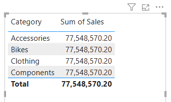

    > _El problema es que la tabla se basa en campos de otras tablas. La expectativa es que en cada categoría de producto se muestren las ventas de esa categoría. Sin embargo, como no existe una relación de modelo entre estas tablas, la tabla `Sales` no se filtra. Ahora agregará una relación para propagar los filtros entre las tablas._

1. Para cambiar al diseñador de modelos, a la izquierda, seleccione el icono **vista Modelo**.

    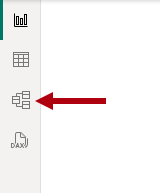

1. En la cinta **Inicio**, seleccione **Administrar relaciones**.

    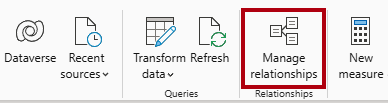

1. En la ventana **Administrar relaciones**, observe que todavía no se ha definido ninguna relación.

1. Para crear una relación, selecciona **+Nueva relación**.

1. Para configurar una relación de tabla `Product` a tabla `Sales`, en la lista desplegable **De tabla**, seleccione la tabla `Product`, y en la lista desplegable **A tabla**, seleccione la tabla `Sales`.

    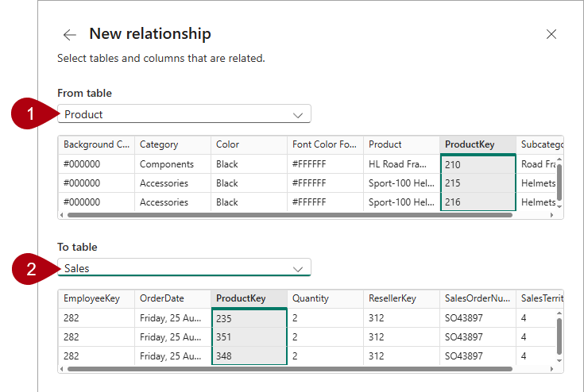

1. Observe que las siguientes propiedades se configuraron automáticamente:

    - **Se seleccionan columnas ProductKey en cada tabla**. _Las columnas se han seleccionado porque comparten el mismo nombre y tipo de datos. Es posible que tenga que buscar columnas coincidentes con nombres diferentes en datos reales._
    - **El tipo de cardinalidad es Uno a varios (1:\*)**. _La cardinalidad se detectó automáticamente, porque Power BI entiende que la columna `ProductKey` de la tabla `Product` contiene valores únicos. Las relaciones uno a varios son la cardinalidad más común y todas las relaciones que cree en este laboratorio serán de este tipo._
    - **Tipo de dirección de filtro cruzado único**. _La dirección de filtro único significa que los filtros se propagan del "lado uno" al "lado varios". En este caso, significa que los filtros que se aplican a la tabla `Product` se propagarán a la tabla `Sales`, pero no en la dirección contraria._
    - **La opción Activar esta relación está marcada**. _Las relaciones activas propagan los filtros. Una relación se puede marcar como inactiva para que los filtros no se propaguen. Pueden existir relaciones inactivas cuando hay varias rutas de relación entre las tablas. En este caso, los cálculos del modelo pueden usar funciones especiales para activarlas._

    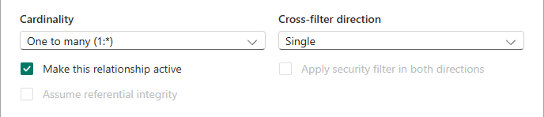

1. Seleccione **Guardar**. En la ventana **Administrar relaciones**, observe que aparece la nueva relación. Seleccione **Cerrar**.

1. En el diagrama del modelo, observe que ahora hay un conector entre las dos tablas (puede optar por cambiar la posición de las tablas para ver la relación con más claridad).

    

    > _Puede interpretar muchas de las propiedades de relación examinando la línea de relación en el diagrama:_
    >
    > - _Cardinalidad se representa mediante los indicadores de **1** y **(\*)**._
    > - _La dirección del filtro se representa mediante la punta de la flecha._
    > - _Una línea continua representa una relación activa. Una línea de puntos representa una relación inactiva._
    >
    > Sugerencia: Pase el cursor sobre la relación para resaltar las columnas relacionadas.

1. Cambie a la **vista Informe** y observe que la visualización de la tabla se ha actualizado para mostrar valores diferentes para cada categoría de producto.

    > _Los filtros aplicados a la tabla `Product` se propagan ahora a la tabla `Sales`._

    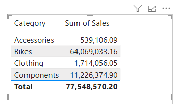

## Creación de relaciones adicionales

Hay una manera más fácil de crear una relación. En el diagrama del modelo, puede arrastrar y colocar columnas para crear una relación.

1. Para crear una nueva relación mediante una técnica diferente, cambie a la **vista Modelo**.

1. En la tabla `Reseller`, arrastre la columna `ResellerKey` a la columna `ResellerKey` de la tabla `Sales`.

    > _**Importante**: En ocasiones una columna no se deja arrastrar. Si se produce esta situación, seleccione otra columna y, después, vuelva a seleccionar la columna que quiere arrastrar e inténtelo de nuevo. Cerciórese de que se ve la nueva relación agregada al diagrama._

    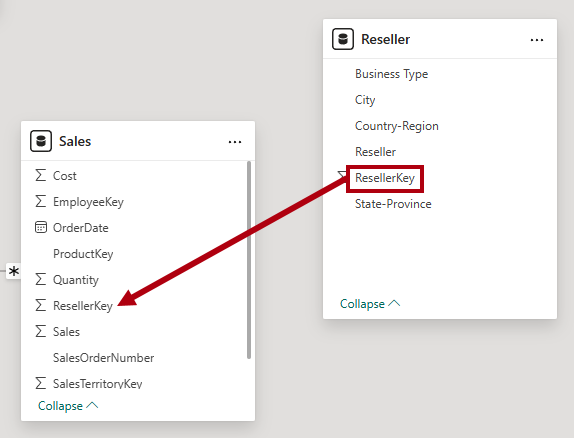

1. En la ventana **Nueva relación**, revise la configuración y, a continuación, seleccione **Guardar**.

1. Use la técnica nueva para crear las dos relaciones de modelo siguientes:

     - `Region | SalesTerritoryKey` a `Sales | SalesTerritoryKey`
     - `Salesperson | EmployeeKey` a `Sales | EmployeeKey`

1. En el diagrama, organice las tablas para que la tabla `Sales` se coloque en el centro del diagrama y las tablas relacionadas estén organizadas a su alrededor. Coloque las tablas desconectadas al lado.

    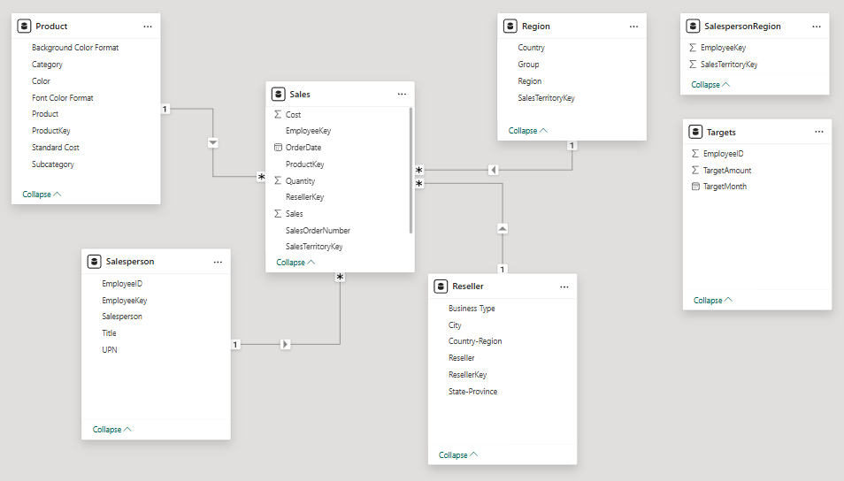

1. Guarde el archivo de Power BI Desktop.

## Configuración de la tabla Product

En esta tarea, configurarás la tabla `Product` con una jerarquía y una carpeta para mostrar.

1. Cambia a la vista **Modelo**.

1. En el panel **Datos**, si es necesario, expanda la tabla `Product` para mostrar todos los campos.

1. En la tabla `Product`, haga clic con el botón derecho en la columna `Category` y seleccione **Crear jerarquía**.

    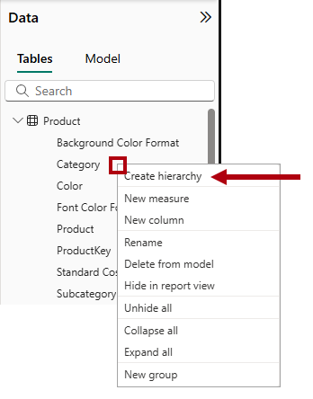

1. En el panel **Propiedades**, en la casilla **Nombre**, sustituya el valor por _Productos_.

    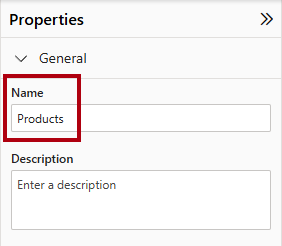

1. Para agregar dos niveles a la jerarquía, en la lista desplegable **Jerarquía**, seleccione **Subcategoría** y, a continuación, seleccione **Producto**, y seleccione **Aplicar cambios de nivel**.

    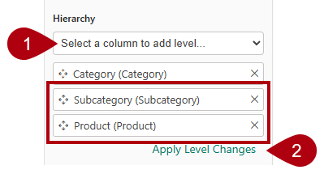

1. En el panel **Datos**, observe la jerarquía `Products`. Para ver los niveles jerárquicos, expándalo.

    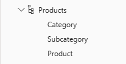

1. Para organizar las columnas en una carpeta de visualización, en el panel **Datos**, seleccione primero la columna `Background Color Format`.

1. Mientras pulsa la tecla **Ctrl**, seleccione la columna `Font Color Format`.

1. En el panel **Propiedades**, en el cuadro **Carpeta para mostrar**, escriba _Formato_.

    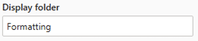

1. En el panel **Datos**, observe que ahora las dos columnas están dentro de una carpeta.

    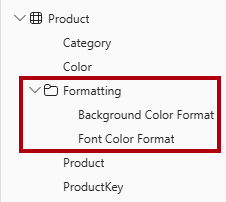

    > _Las carpetas para mostrar son una excelente manera de organizar las tablas, especialmente las que contienen muchos campos. Solo ofrecen una presentación lógica._

## Configuración de la tabla Region

En esta tarea, configurarás la tabla `Region` con una jerarquía y categorías actualizadas.

1. En la tabla `Region`, cree una jerarquía denominada _Regiones_, con los tres niveles siguientes:

     - `Group`
     - `Country`
     - `Region`

1. Seleccione la columna `Country` (no el nivel jerárquico `Country`).

1. En el panel **Propiedades**, expanda la sección **Avanzado** (ubicada en la parte inferior del panel) y, después, en la lista desplegable **Categoría de datos**, seleccione **País o región**.

    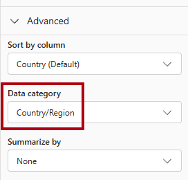

    > _La categorización de datos puede proporcionar sugerencias al diseñador de informes. En este caso, la categorización de la columna como país o región proporciona información más precisa a Power BI cuando representa una visualización de mapa._

## Configuración de la tabla Reseller

En esta tarea, configurarás la tabla `Reseller` para agregar una jerarquía y actualizar categorías de datos.

1. En la tabla `Reseller`, cree una jerarquía denominada _Resellers_, con los dos niveles siguientes:

     - `Business Type`
     - `Reseller`

1. Cree una segunda jerarquía denominada _Geography_ (Geografía), con los cuatro niveles siguientes:

     - `Country-Region`
     - `State-Province`
     - `City`
     - `Reseller`

1. Establece la categoría de datos para las columnas siguientes (no dentro de la jerarquía):

    - `Country-Region` a **País/Región**
    - `State-Province` a **Estado o provincia**
    - `City`a **Ciudad**

## Configuración de la tabla Sales

En esta tarea, configurarás la tabla `Sales` con descripciones, formato y resumen actualizados.

1. En la tabla `Sales`, seleccione la columna `Cost`.

1. En el panel **Propiedades**, en el cuadro **Descripción**, escriba: _Basado en el costo estándar_

    > _Las descripciones se pueden aplicar a tablas, columnas, jerarquías o medidas. En el panel **Datos**, el texto descriptivo se muestra en una información sobre herramientas cuando el autor del informe mantiene el cursor sobre el campo._

1. Seleccione la columna `Quantity`.

1. En el panel **Propiedades**, dentro de la sección **Formato**, establezca la propiedad **Separador de miles** a _Sí_.

1. Seleccione la columna `Unit Price`.

1. En el panel **Propiedades**, desde dentro de la sección **Formato**, establezca la propiedad **Posiciones decimales** en _2_.

1. En el grupo **Avanzado** (es posible que tenga que desplazarse hacia abajo para encontrarlo), en la lista desplegable **Resumir por**, seleccione **Promedio**.

    > _De forma predeterminada, las columnas numéricas se resumen mediante la suma de valores. Este comportamiento predeterminado no es adecuado para una columna como `Unit Price`, que representa una tasa. Al establecer el resumen predeterminado en promedio se generará un resultado significativo._

## Actualización masiva de propiedades

En esta tarea actualizará varias columnas mediante actualizaciones masivas únicas. Usará este enfoque para ocultar columnas y darle formato a los valores de columna.

1. En el panel **Datos** (o diagrama del modelo), seleccione la columna `Product | ProductKey`.

1. Mientras presiona la tecla **Ctrl**, seleccione las 13 columnas siguientes (que abarcan varias tablas):

     - `Region | SalesTerritoryKey`
     - `Reseller | ResellerKey`
     - `Sales | EmployeeKey`
     - `Sales | ProductKey`
     - `Sales | ResellerKey`
     - `Sales | SalesOrderNumber`
     - `Sales | SalesTerritoryKey`
     - `Salesperson | EmployeeID`
     - `Salesperson | EmployeeKey`
     - `Salesperson | UPN`
     - `SalespersonRegion | EmployeeKey`
     - `SalespersonRegion | SalesTerritoryKey`
     - `Targets | EmployeeID`

1. En el panel **Propiedades**, establezca la propiedad **Está oculta** en _Sí_.

    > _Las columnas estaban ocultas porque las usan las relaciones, o se usarán en la configuración de seguridad de nivel de fila o en la lógica de cálculo._
    >
    > _usará la columna `SalesOrderNumber` en un cálculo en el laboratorio **Creación de cálculos DAX en Power BI Desktop**._

1. Seleccione las tres columnas siguientes:

     - `Product | Standard Cost`
     - `Sales | Cost`
     - `Sales | Sales`

1. En el panel **Propiedades**, desde dentro de la sección **Formato**, establezca la propiedad **Posiciones decimales** en _0_.

## Exploración de la interfaz del modelo

En esta tarea, cambiará a la **vista Informe**, revisará la interfaz del modelo de datos y configurará el ajuste automático de fecha y hora.

1. Cambia a la vista **Informe**.

1. En el panel **Datos**, observe lo siguiente:

     - Las columnas, las jerarquías y sus niveles son campos, que se pueden usar para configurar los objetos visuales del informe.
     - Solo se ven los campos relevantes para la creación de informes.
     - La tabla `SalespersonRegion` no está visible porque todos sus campos están ocultos.
     - Los campos espaciales de la tabla `Region` y `Reseller` se etiquetan con un icono espacial.
     - Los campos con la etiqueta sigma (Ʃ) se resumirán de forma predeterminada.
     - Aparece una información sobre herramientas al mantener el cursor sobre el campo `Sales | Cost`.

1. Expanda el campo `Sales | OrderDate` y observe que revela un `Date Hierarchy`. El campo `Targets | TargetMonth` proporciona una jerarquía similar.

    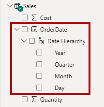

    > _**Importante**: Estas jerarquías no se crearon por usted. Se crearon automáticamente como una configuración predeterminada. Sin embargo, hay un problema. El año fiscal de Adventure Works comienza el 1 de julio de cada año. Pero en estas jerarquías de fechas creadas automáticamente, la jerarquía de fecha comienza el 1 de enero de cada año._

1. Para desactivar la configuración automática de Fecha y hora, vaya a **Archivo > Opciones y configuración > Opciones**.

1. En la ventana **Opciones**, en la sección **Archivo actual**, desplácese a **Carga de datos > Inteligencia horaria**, y desmarque **Fecha/hora automática**.

    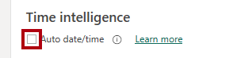

1. En el panel **Datos**, observe que las jerarquías de fecha ya no están disponibles.

## Crear medidas rápidas

En esta tarea creará dos medidas rápidas para calcular los beneficios y el margen de beneficio. Una medida rápida crea el una fórmula de cálculo de forma automática. Son fáciles y rápidas de crear para cálculos simples y comunes.

1. En el panel **Datos**, haga clic con el botón derecho en la tabla `Sales` y seleccione **Nueva medida rápida**.

    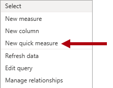

1. En el panel **Medida rápida**, en la lista desplegable **Seleccionar un cálculo**, dentro del grupo **Operaciones matemáticas**, seleccione **Sustracción**.

    

1. Desde el panel **Datos**, arrastre el campo `Sales | Sales` al apartado **Valor base**.

    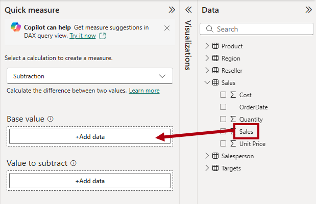

1. Arrastre el campo `Sales | Cost` a la casilla **Valor a restar**.  

    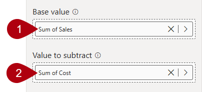

1. Seleccione **Agregar**.

1. En el panel **Datos**, dentro de la tabla `Sales`, observe la nueva medida.

    > _Las medidas se indican mediante el icono de la calculadora._

    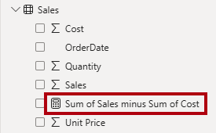

1. Para cambiar el nombre de la medida, haga clic con el botón derecho en ella, seleccione **Cambiar nombre** y dele el nombre _Beneficios_.

    > _Sugerencia: Para cambiar el nombre de un campo, también puede hacer doble clic en él, o bien seleccionarlo y presionar **F2**._

1. En la tabla `Sales`, agregue una segunda medida rápida, en función de los requisitos siguientes:

    > **Importante**: Si la opción de crear una medida rápida no aparece en el menú contextual, utilice el comando situado en la cinta **Inicio**, dentro del grupo **Cálculos**.

    - Use la operación matemática **División**.
    - Coloque el **Numerador** en el campo `Sales | Profit`.
    - Establezca el campo **Denominador** en el campo `Sales | Sales`.
    - Cambie el nombre de la medida por _Margen de beneficio_.

1. Asegúrese de que la medida `Profit Margin` está seleccionada y, a continuación, en la cinta contextual **Herramientas de medida**, establezca el formato en **Porcentaje**, con dos decimales.

    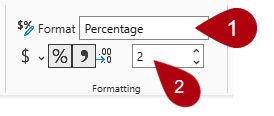

1. Para probar las dos medidas, seleccione primero el visual de tabla existente en la página.

1. En el panel **Datos**, marque las medidas `Profit` y `Profit Margin` para añadirlas a la tabla.

    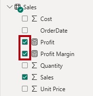

1. Seleccione y arrastre la guía correcta para ampliar el objeto visual de tabla.

    

1. Compruebe que las medidas generan un resultado razonable con el formato correcto.

    

## Creación de una relación de varios a varios

En esta tarea, creará una relación de muchos a muchos entre la tabla `Salesperson` y la tabla `Sales`.

1. En la **vista Informe**, seleccione un área en blanco de la página del informe.

1. Para crear una nueva tabla visual, en el panel **Datos**, marque los dos campos siguientes:

     - `Salesperson | Salesperson`
     - `Sales | Sales`

    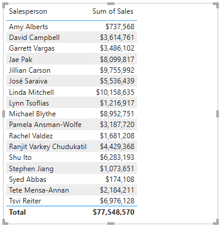

    > _La tabla visual muestra las ventas realizadas por cada vendedor. Pero hay otra relación entre los vendedores y las ventas. Algunos vendedores pertenecen a una, dos o posiblemente más regiones de ventas. Además, las regiones de ventas pueden tener varios vendedores asignados._
    >
    > _Desde la perspectiva de la administración del rendimiento, las ventas de un vendedor (en función de sus territorios asignados) se deben analizar y comparar con los objetivos de ventas. Creará relaciones para admitir este análisis en el siguiente ejercicio._

1. Observe que _Michael Blythe_ ha generado casi 9 millones de dólares de ventas.

1. Cambie a la **vista Modelo** y arrastre la tabla `SalespersonRegion` para colocarla entre las tablas `Region` y `Salesperson`.

1. Use la técnica de arrastrar y colocar para crear las dos relaciones de modelo siguientes:

    - `Salesperson | EmployeeKey` a `SalespersonRegion | EmployeeKey`
    - `Region | SalesTerritoryKey` a `SalespersonRegion | SalesTerritoryKey`

    > _La tabla `SalespersonRegion` puede considerarse una tabla puente._

1. Cambie a la **vista Informe** y observe que el objeto visual no se ha actualizado. El resultado de ventas de Michael Blythe no ha cambiado.

1. Vuelva a la **vista Modelo** y, a continuación, siga las indicaciones del filtro de relaciones (punta de flecha) de la tabla `Salesperson`.

    > _Considere que la tabla `Salesperson` filtra la tabla `Sales`. También filtra la tabla `SalespersonRegion`, pero no continúa propagando filtros a la tabla `Region` (la punta de flecha apunta en la dirección equivocada)._

    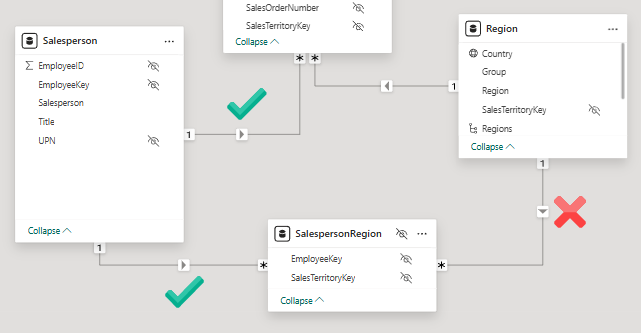

1. Para editar la relación entre las tablas `Region` y `SalespersonRegion`, haga doble clic en la relación.

1. En la ventana **Editar relación**, en la lista desplegable **Dirección del filtro cruzado**, seleccione _Ambos_.

1. Active la casilla **Aplicar filtro de seguridad en ambas direcciones**.

    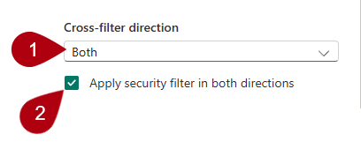

1. Seleccione **Guardar**.

1. Observe que ahora la relación tiene una flecha doble.

    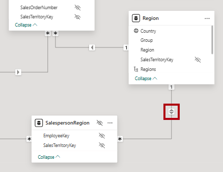

1. Cambie a la **vista Informe** y observe que los valores de ventas todavía no han cambiado.

    > _El problema ahora está relacionado con el hecho de que hay dos posibles rutas de propagación del filtro entre las tablas `Salesperson` y `Sales`. Esta ambigüedad se resuelve de manera interna, en función de una evaluación del "número mínimo de tablas". Para ser claros, no debe diseñar modelos con este tipo de ambigüedad, la cuestión se abordará en parte más adelante en este laboratorio, y por la realización del laboratorio **Crear cálculos DAX en Power BI Desktop**._

1. Cambia a la vista **Modelo**.

1. Para forzar la propagación del filtro a través de la tabla puente, edite (haga doble clic) la relación entre las tablas `Salesperson` y `Sales`.

1. En la ventana **Editar relación**, desactive la casilla **Activar esta relación**.

    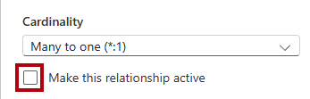

1. Seleccione **Guardar**.

    > _La propagación del filtro seguirá ahora la única ruta activa._

1. En el diagrama del modelo, observe que la relación inactiva está representada por una línea de puntos.

    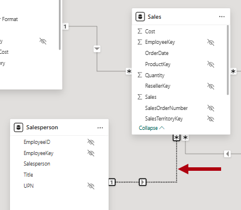

1. Cambia a la **vista Informe** y observe que las ventas de Michael Blythe ascienden ahora a casi 22 millones de dólares.

1. Observe también que las ventas de cada vendedor, si se sumaran, superarían el total de la tabla.

     > _Es una observación común de una relación de varios a varios, debido al recuento doble, triple, etc., de los resultados de las ventas regionales. Fíjese en Brian Welcker, el segundo vendedor de la lista. Su importe de ventas es igual a la cantidad total de ventas. Es el resultado correcto debido a que es el Director de ventas; sus ventas se miden por las ventas de todas las regiones._
     >
     > _Aunque la relación de varios a varios ya funciona, ahora no se pueden analizar las ventas realizadas por un vendedor (porque la relación está inactiva). Podrá reactivar la relación al introducir una tabla calculada que permitirá el análisis de ventas realizado en las regiones de ventas asignadas al vendedor (para un análisis del rendimiento) en el laboratorio **Creación de cálculos DAX en Power BI Desktop, parte 1**._

1. Cambie a la **vista Modelo** y, en el diagrama del modelo, seleccione la tabla `Salesperson`.

1. En el panel **Propiedades**, en el cuadro **Nombre**, reemplace el texto por _Salesperson (Performance)_ (Vendedor (rendimiento)).

    > _La tabla con el nombre cambiado ahora refleja su finalidad: se usa para notificar y analizar el rendimiento de los vendedores en función de las ventas de sus regiones de ventas asignadas._

## Relación con la tabla Targets

En esta tarea creará una relación con la tabla `Targets`.

1. Cree una relación a partir de la columna `Salesperson (Performance) | EmployeeID` y la columna `Targets | EmployeeID`.

1. En la **vista Informe**, añada el campo `Targets | Target` al objeto visual de la tabla.

1. Cambie el tamaño del objeto visual de tabla para que todas las columnas estén visibles.

    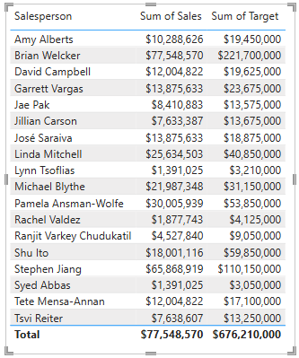

 > _Ahora es posible visualizar las ventas y los objetivos-pero por ahora tenga cuidado por dos razones. En primer lugar, no hay ningún filtro en un período de tiempo, por lo que los destinos también incluyen cantidades de destino futuras. En segundo lugar, los objetivos no son aditivos, por lo que no debería mostrarse el total. Se pueden deshabilitar dándole formato al objeto visual, o bien quitarse mediante la lógica de cálculo._

1. Guarde el archivo de Power BI Desktop.

## Laboratorio completado

Puede optar por guardar el informe de Power BI, aunque no es necesario para este laboratorio. En el ejercicio siguiente, trabajará con un archivo de inicio creado previamente.

1. Vaya al menú **"Archivo"** en la esquina superior izquierda y seleccione **"Guardar como"**. 
1. Seleccione **Examinar este dispositivo**.
1. Seleccione la carpeta donde desea guardar el archivo y asígnele un nombre descriptivo. 
1. Seleccione el botón **Guardar** para guardar el informe como un archivo .pbix. 
1. Si aparece un cuadro de diálogo en el que se le pide que aplique los cambios pendientes en la consulta, seleccione **Aplicar**.
1. Cierre Power BI Desktop.