---
lab:
  title: "Creación de cálculos DAX en Power\_BI Desktop"
  module: Create Model Calculations using DAX in Power BI
---


# Creación de cálculos DAX en Power BI Desktop

## **Caso de laboratorio**

En este laboratorio creará tablas calculadas, columnas calculadas y medidas simples con Data Analysis Expressions (DAX).

En este laboratorio, aprenderá a:

- Crear tablas calculadas
- Crear columnas calculadas
- Crear medidas

**Este laboratorio debe durar unos 45 minutos**.

## Introducción

Para completar este ejercicio, abre primero un explorador web e introduce la siguiente URL para descargar la carpeta zip:

`https://github.com/MicrosoftLearning/PL-300-Microsoft-Power-BI-Data-Analyst/raw/Main/Allfiles/Labs/04-create-dax-calculations-in-power-bi-desktop\04-intro-dax.zip`

Extráela a la carpeta **C:\Users\Student\Downloads\04-intro-dax**.

Abre el archivo **04-Starter-Sales Analysis.pbix**.

> ***Nota**: Puedes ignorar el inicio de sesión al seleccionar **Cancelar**. Cierra todas las ventanas informativas que se abran. Si se te pide que apliques los cambios, selecciona **Aplicar más tarde**.*

## Creación de la tabla calculada Comercial

En esta tarea creará la tabla calculada **Salesperson** (relación directa con **Sales**).

Una tabla calculada se crea especificando primero el nombre de la tabla, seguido del símbolo igual (=), y luego una fórmula DAX que devuelve una tabla. El nombre de la tabla no puede existir ya en el modelo de datos.

La barra de fórmulas admite la entrada de una fórmula DAX válida. Incluye características como autocompletar, IntelliSense y codificación de colores, lo que le permite escribir la fórmula de forma rápida y precisa.

1. En Power BI Desktop, en la vista Informe, en la cinta de opciones **Modelado**, en el grupo **Cálculos**, seleccione **Nueva tabla**.

     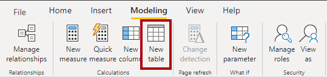

2. En la barra de fórmulas (que se abre directamente debajo de la cinta al crear o editar cálculos), escriba **Salesperson =**, presione **Mayús + Entrar**, escriba **"Salesperson (Performance)"** (Comercial [rendimiento]) y, a continuación, presione **Entrar**.

    > **Nota**: *Para tu comodidad, todas las definiciones de DAX de este laboratorio se pueden copiar del archivo de fragmentos de código, situado en **D:\Allfiles\Labs\04-create-dax-calculations-in-power-bi-desktop\Assets\Snippets.txt**.*

     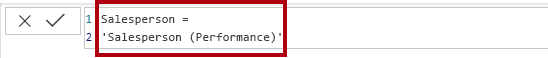

    > *Esta definición de tabla crea una copia de la tabla **Salesperson (Performance)** . Solo se copian los datos, no se copian las propiedades del modelo, como visibilidad, formato, etc.*

1. En el panel **Datos**, observa que el icono de la tabla tiene una calculadora adicional delante (lo que denota que se trata de una tabla calculada).

    

    > ***Nota**: Las tablas calculadas se definen mediante una fórmula DAX que devuelve una tabla. Es importante comprender que las tablas calculadas aumentan el tamaño del modelo de datos porque materializan y almacenan valores. Se vuelven a calcular cada vez que se actualizan las dependencias de fórmula, como sucede en este modelo de datos cuando se cargan valores de fecha nuevos (futuros) en las tablas.*
    >
    > *A diferencia de las tablas con origen en Power Query, las tablas calculadas no se pueden usar para cargar datos de orígenes de datos externos. Solo pueden transformar datos en función de lo que ya se haya cargado en el modelo de datos.*

1. Cambie a la Vista de modelo y observe que la tabla **Salesperson** está disponible (puede que tenga que restablecer la vista para encontrar la tabla).

1. Cree una relación desde la columna **Salesperson \| EmployeeKey** (Comercial | Clave de empleado) a la columna **Sales \| EmployeeKey** (Ventas | Clave de empleado).

1. Haga clic con el botón derecho en la relación inactiva entre las tablas **Salesperson (Performance)** (Comercial [Rendimiento]) y **Sales** (Ventas) y, a continuación, seleccione **Eliminar**. Cuando se le pida que confirme la eliminación, seleccione **Sí**.

1. En la tabla **Salesperson** (Vendedor), seleccione varias columnas y, después, ocúltelas (establezca la propiedad **Is Hidden** (Está oculto) en **Sí**):

    - EmployeeID (Id. de empleado)
    - EmployeeKey (Clave de empleado)
    - UPN (Nombre principal de usuario)

1. En el diagrama del modelo, seleccione la tabla **Salesperson** (Comercial).

1. En el panel **Propiedades**, en el cuadro **Descripción**, escriba: **Salesperson related to Sales** (Comercial relacionado con ventas)
    
    > *Recordará que las descripciones aparecen como información sobre herramientas en el panel **Datos** cuando el usuario mantiene el puntero sobre una tabla o un campo.*

1. En la tabla **Salesperson (Performance)** (Comercial [rendimiento]), establezca la descripción en: **Salesperson related to region(s)** (Comercial relacionado con regiones)

*El modelo de datos ahora proporciona dos alternativas al analizar comerciales. La tabla **Salesperson** (Comercial) permite analizar las ventas realizadas por un comercial, mientras que la tabla **Salesperson (Performance)** (Comercial [rendimiento]) permite el análisis de las ventas realizadas en las regiones de ventas asignadas al comercial.*

## Creación de la tabla de fecha

En esta tarea, creará la tabla **Date** (Fecha).

1. Cambia a la vista Tabla. En la pestaña **Inicio** de la cinta de opciones, desde el grupo **Cálculos**, seleccione **Nueva tabla**.

    

1. En la barra de fórmulas, introduce el siguiente DAX:

    ```DAX
    Date =  
    CALENDARAUTO(6)
    ```

    

    > *La función CALENDARAUTO() devuelve una tabla de una sola columna que consta de valores de fecha. El comportamiento "automático" examina todas las columnas de fecha del modelo de datos para determinar los valores de fecha más antiguos y más recientes almacenados en el modelo de datos. Después, crea una fila para cada fecha dentro de este intervalo, ampliando el intervalo en cualquier dirección para asegurarse de que se almacenan los años completos de datos.*
    >
    > *Esta función puede tomar un único argumento opcional, que es el último número de mes de un año. Cuando se omite, el valor es 12, lo que significa que diciembre es el último mes del año. En este caso, se escribe 6, lo que significa que junio es el último mes del año.*

1. Ten en cuenta que la columa de los valores de fecha tiene el formato de la configuración regional de EE. UU. (es decir, mm/dd/aaaa).

    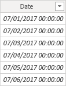

1. En la esquina inferior izquierda, en la barra de estado, observe las estadísticas de la tabla, que confirman que se han generado 1826 filas de datos, lo cual representa datos de cinco años completos.

    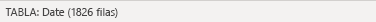

## Crear columnas calculadas

En esta tarea agregará más columnas para habilitar el filtrado y la agrupación por períodos de tiempo diferentes. También creará una columna calculada para controlar el criterio de ordenación de otras columnas.

> **Nota**: *Para tu comodidad, todas las definiciones de DAX de este laboratorio se pueden copiar desde el archivo **Snippets.txt**.*

1. En la cinta contextual **Herramientas de tabla**, desde el grupo **Cálculos**, seleccione **Nueva columna**.

    > *Una columna calculada se crea especificando primero el nombre de la columna, seguido del símbolo igual (=), y luego una fórmula DAX que devuelve un resultado de valor único. El nombre de columna no puede estar ya en la tabla.*

    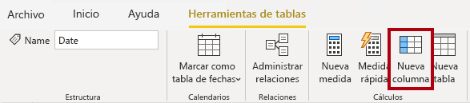

1. En la barra de fórmulas, escriba lo siguiente (o copie desde el archivo de fragmentos de código) y luego presione **Entrar**:

   ```DAX
   Year =
   "FY" & YEAR('Date'[Date]) + IF(MONTH('Date'[Date]) > 6, 1)
   ```

    > *La fórmula utiliza el valor del año de la fecha, pero agrega uno al valor de año cuando el mes es posterior a junio. Así es como se calculan los años fiscales de Adventure Works.*

1. Use las definiciones de archivo de fragmentos de código para crear las siguientes dos columnas calculadas para la tabla **Date** (Fecha):

    - Quarter (Trimestre)
    - Mes

1. Comprueba que se han agregado las nuevas columnas.

    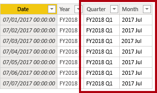

1. Para validar los cálculos, cambie a la vista Informe.

1. Para crear una nueva página del informe, seleccione el icono de signo más situado junto a la página 1.

    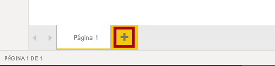

1. Para agregar un objeto visual de matriz a la nueva página de informe, en el panel **Visualizaciones**, seleccione el tipo de objeto visual de matriz.

    > *Sugerencia: Puede mantener el cursor sobre cada icono para mostrar una información sobre herramientas que describa el tipo de objeto visual.*

    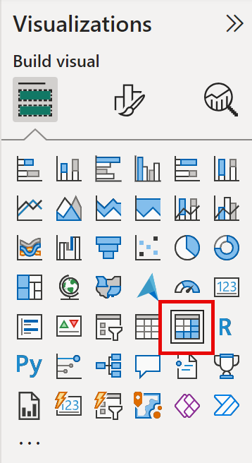

1. En el panel **Datos**, desde la tabla **Fecha**, arrastre el campo **Año** hasta el apartado o área **Filas**.

    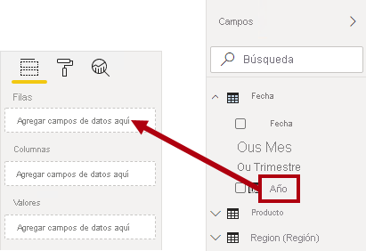

1. Arrastre el campo **Month** (Mes) hasta el apartado o área **Rows** (Filas), directamente debajo del campo **Year** (Año).

1. En la parte superior derecha del objeto visual Matriz (o en la parte inferior, según la ubicación del objeto visual), seleccione el icono de flecha doble bifurcada (que expandirá todos los años hacia abajo un nivel).

    

1. Observe que los años se expanden hasta meses y que los meses se ordenan alfabéticamente en lugar de cronológicamente.

    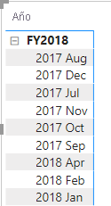

    > *De forma predeterminada, los valores de texto se ordenan alfabéticamente, los números se ordenan de menor a mayor y las fechas se ordenan de la más antigua a la más reciente.*

1. Para personalizar el criterio de ordenación del campo **Mes**, cambia a la vista Tabla.

1. Agregue la columna **MonthKey** (Clave de mes) a la tabla **Date** (Fecha).

    ```DAX
    MonthKey =
    (YEAR('Date'[Date]) * 100) + MONTH('Date'[Date])
    ```

    > *Esta fórmula calcula un valor numérico para cada combinación de año/mes.*

1. En la vista Tabla, comprueba que la nueva columna contiene valores numéricos (por ejemplo, 201707 para julio de 2017, etc.).

    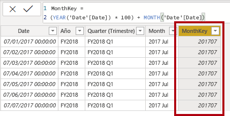

1. Cambie a la vista Informe. En el panel **Datos** y selecciona **Mes**.

1. En la cinta contextual **Herramientas de columna**, en el grupo **Ordenar**, seleccione **Ordenar por columna** y, a continuación, **MonthKey** (Clave de mes).

    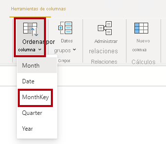

1. En el objeto visual de matriz, observe que los meses ahora se ordenan cronológicamente.

    

## Completado de la tabla Date (Fecha)

En esta tarea, completará el diseño de la tabla **Date** (Fecha) ocultando una columna y creando una jerarquía. A continuación, creará relaciones con las tablas **Sales** (Ventas) y **Targets** (Objetivos).

1. Cambie a la vista Modelo. En la tabla **Date** (Fecha), oculte la columna**MonthKey** (Clave de mes) (establezca **Está oculto** en **Sí**).

1. En el panel lateral derecho **Datos**, seleccione la tabla **Fecha**, haga clic con el botón derecho en la columna **Año** y seleccione **Crear jerarquía**.

1. Cambie el nombre de la jerarquía recién creada a **Fiscal**. Para ello, haga clic con el botón derecho y seleccione **Cambiar nombre**.

1. Agregue los dos campos restantes a la jerarquía Fiscal. Para ello, selecciónelos en el panel **Datos**, haga clic con el botón derecho y seleccione**Agregar a la jerarquía** -> **Fiscal**.

    - Quarter (Trimestre)
    - Month (Mes)

    

1. Cree las dos relaciones de modelo siguientes:

    - **Date \| Date** (Fecha | Fecha) a **Sales \| OrderDate** (Ventas | Fecha de pedido)
    - **Date \| Date** (Fecha | Fecha) a **Targets \| TargetMonth** (Objetivos | Mes de destino)


    > *Los laboratorios usan una notación abreviada para hacer referencia a un campo. Tendrá este aspecto: **Sales \| Unit Price** (Ventas | Precio unitario). En este ejemplo, **Sales** (Ventas) es el nombre de la tabla y **Unit Price** (Precio unitario) es el nombre del campo.*

1. Oculte las dos columnas siguientes:

    - Sales \| OrderDate (Ventas | Fecha de pedido)
    - Targets \| TargetMonth (Objetivos | Mes de destino)

## Marcar la tabla de fecha

En esta tarea, marcará la tabla **Date** (Fecha) como tabla de fechas.

1. Cambie a la vista Informe. En el panel **Datos**, seleccione la tabla **Fecha** (no el campo **Fecha**).

1. En la cinta contextual **Herramientas de tabla**, dentro del grupo **Calendarios**, selecciona **Marcar como tabla de fechas**.

1. En la ventana **Marcar como tabla de fechas**, desliza la propiedad **Marcar como tabla de fechas** a **Sí** y, en la lista desplegable **Elegir una columna de fecha**, selecciona **Fecha**. Seleccione **Guardar**.

    

1. Guarde el archivo de Power BI Desktop.

> *Ahora Power BI Desktop comprende que esta tabla define la fecha (hora). Este enfoque de diseño para una tabla de fechas es adecuado cuando no tienes una tabla de fechas en el origen de datos. Si tienes un almacenamiento de datos, sería adecuado cargar los datos de fecha desde su tabla de dimensiones de fecha en lugar de "redefinir" la lógica de datos en el modelo de datos.*

## Creación de medidas simples

En esta tarea, creará medidas simples. Las medidas simples agregan valores en una sola columna o recuento de filas de una tabla.

1. En la vista Informe, en la **Página 2**, en el panel **Datos**, arrastre el campo **Ventas \| Precio unitario** hasta el objeto visual de matriz.

    

1. En el panel de campos del objeto visual (situado debajo del panel **Visualizaciones**), en el apartado o área del cuadro **Valores**, observa que **Precio unitario** aparece en la lista como el **Promedio del precio unitario**. Seleccione la flecha hacia abajo de **Unit Price** (Precio unitario) y observe las opciones de menú disponibles.

    

    > *Las columnas numéricas visibles permiten a los autores de informes decidir en el momento del diseño del informe cómo se resumirían (o no) los valores de una columna. Esto puede dar lugar a informes inadecuados. Pero a algunos modeladores de datos no les gusta dejar las cosas al azar y optan por ocultar estas columnas y, en cambio, exponen la lógica de agregación definida en medidas. Este es el enfoque que va a seguir en este laboratorio.*

1. Para crear una medida, en el panel **Datos**, haga clic con el botón derecho en la tabla **Ventas** y seleccione **Nueva medida**.

1. En la barra de fórmulas, agregue la siguiente definición de medida:

    ```DAX
    Avg Price =  
    AVERAGE(Sales[Unit Price])
    ```

1. Agrega la medida **Precio promedio** al objeto visual de la matriz y ten en cuenta que produce el mismo resultado que la columna **Precio unitario** (pero con un formato diferente).

1. En el cuadro **Valores**, abra el menú contextual del campo **Avg Price** y observe que no es posible cambiar la técnica de agregación.

    

    > *No es posible modificar el comportamiento de agregación de una medida.*

1. Use las definiciones de archivo de fragmentos de código para crear las siguientes cinco medidas para la tabla **Sales** (Ventas):

    - Median Price (Mediana de precio)
    - Min Price (Precio mínimo)
    - Max Price (Precio máximo)
    - Orders (Pedidos)
    - Order Lines (Líneas de pedido)

    > *La función DISTINCTCOUNT() utilizada en la medida **Orders** (Pedidos) solo contará los pedidos una vez (ignorando duplicados). La función COUNTROWS() utilizada en la medida **Order Lines** (Líneas de pedido) opera en una tabla.*
    >
    > *En este caso, el número de pedidos se calcula contando los valores distintos de la columna **SalesOrderNumber** (Número de pedido de venta), mientras que el número de líneas de pedido es simplemente el número de filas de la tabla (cada fila es una línea de un pedido).*

1. Cambie a la vista Modelo y, a continuación, haga una selección múltiple de las cuatro medidas de precio: **Avg Price** (Precio promedio), **Max Price** (Precio máximo), **Median Price** (Mediana de precio) y **Min Price** (Precio mínimo).

11. Para la selección múltiple de medidas, configure los siguientes requisitos:

    - Establecer el formato en dos posiciones decimales

    - Asignar a una carpeta para mostrar denominada **Pricing** (Precios)

    

12. Oculte la columna **Unit Price** (Precio unitario).

    > *La columna **Unit Price** (Precio unitario) ahora no está disponible para los autores de informes. Deben usar las medidas de precios que se han agregado al modelo. Este enfoque de diseño garantiza que los autores de informes no agregarán de forma inapropiada los precios, por ejemplo, sumándolos.*

13. Haga una selección múltiple de las medidas **Orders Lines** (Líneas de pedido) y **Orders** (Pedidos) y configure los requisitos siguientes:

    - Establecer el formato para usar el separador de miles

    - Asignar a una carpeta para mostrar denominada **Counts** (Recuentos)

    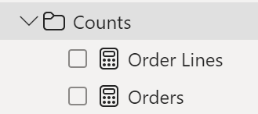

14. En la vista Informe, en el cuadro **Valores** del apartado o área del objeto visual Matriz, en el campo **Unit Price**, seleccione la **X** para quitarlo.

15. Aumente el tamaño del objeto visual de matriz para rellenar el ancho y el alto de la página.

16. Agregue las cinco medidas siguientes al objeto visual de matriz:

    - Median Price (Mediana de precio)
    - Min Price (Precio mínimo)
    - Max Price (Precio máximo)
    - Orders (Pedidos)
    - Order Lines (Líneas de pedido)

17. Compruebe que los resultados parecen razonables y tienen el formato correcto.

    

## Creación de medidas adicionales

En esta tarea creará más medidas que usan fórmulas más complejas.

1. En la vista Informe, seleccione **Página 1** y revise el objeto visual Tabla.Observe el total de la columna **Target**.

    

1. Seleccione el objeto visual de tabla y, a continuación, en el panel **Visualizaciones**, quite el campo **Destino**.

1. Cambie el nombre de la columna **Destinos \| Destino** a **Destinos \| TargetAmount**.

    > *Sugerencia: Hay varias maneras de cambiar el nombre de la columna en la vista Informe: en el panel **Datos**, puede hacer clic con el botón derecho en la columna y luego seleccionar **Cambiar nombre**, o hacer doble clic en la columna o presionar **F2**.*

1. Cree la siguiente medida en la tabla **Targets** (Objetivos):

    ```DAX
    Target =
    IF(
    HASONEVALUE('Salesperson (Performance)'[Salesperson]),
    SUM(Targets[TargetAmount])
    )
    ```

    > *La función HASONEVALUE() comprueba si se ha filtrado un solo valor de la columna **Salesperson**. Si es true, la expresión devuelve la suma de las cantidades objetivo (solo para ese comercial). Cuando es false, se devuelve un valor en blanco.*

1. Dé formato a la medida **Target** (Objetivo) para que no tenga posiciones decimales.

    > *Sugerencia: Puede usar la cinta contextual **Herramientas de medición**.*

1. Oculte la columna **TargetAmount** (Cantidad objetivo).

    > *Sugerencia: Puede hacer clic con el botón derecho en el panel **Datos**, y, a continuación, seleccionar **Ocultar**.*

1. Agregue la medida **Target** (Objetivo) al objeto visual de tabla.

1. Observe que el total de la columna **Target** (Objetivo) está ahora en blanco.

    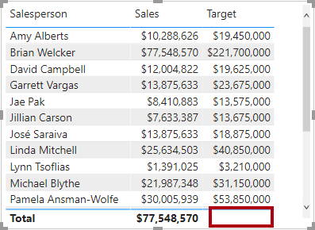

1. Use las definiciones de archivo de fragmentos de código para crear las siguientes dos medidas para la tabla **Targets** (Objetivos):

    - Variance (Varianza)
    - Variance Margin (Margen de varianza)

1. Aplique formato a la medida **Variance** (Varianza) para que no tenga posiciones decimales.

1. Dé formato a la medida **Variance Margin** (Margen de varianza) como un porcentaje con dos posiciones decimales.

1. Agregue las medidas **Variance** (Varianza) y **Variance Margin** (Margen de varianza) al objeto visual de tabla.

1. Cambie el tamaño de la tabla visual para que se puedan ver todas las columnas y filas.

    

    > *Si bien parece que todos los vendedores no están cumpliendo con el objetivo, recuerde que el objeto visual Tabla aún no está filtrado por un período de tiempo específico. Generará informes de rendimiento de ventas que filtren por un período seleccionado por el usuario en el laboratorio **Diseño de un informe en Power BI Desktop**.*

1. En la esquina superior derecha del panel **Datos**, contraiga el panel y, a continuación, expándalo.

    > *Al contraer y volver a abrir el panel, se restablece el contenido.*

1. Observe que en la parte superior de la lista aparece la tabla **Targets** (Objetivos).

    

    *Las tablas que solo contienen medidas visibles se muestran automáticamente en la parte superior de la lista.*

## Laboratorio completado
