---
lab:
  title: Crear cálculos DAX en modelos semánticos
  module: Create DAX calculations in semantic models
---

# Crear cálculos DAX en modelos semánticos

## Caso de laboratorio

En este laboratorio creará tablas calculadas, columnas calculadas y medidas simples con Data Analysis Expressions (DAX).

En este laboratorio, aprenderá a:

- Crear tablas calculadas
- Crear columnas calculadas
- Creación de medidas.

**Este laboratorio debe durar unos 45 minutos**.

## Introducción

Para completar este ejercicio, abra primero un explorador web y escriba la siguiente URL para descargar el archivo ZIP:

`https://github.com/MicrosoftLearning/PL-300-Microsoft-Power-BI-Data-Analyst/raw/Main/Allfiles/Labs/04-create-dax-calculations\04-dax-calculations.zip`

Extraiga el archivo a la carpeta **C:\sers\student\Downloads\04-dax-calculations**.

Abre el archivo **04-Starter-Sales Analysis.pbix**.

> _**Nota**: Es posible que vea un cuadro de diálogo de inicio de sesión a medida que se carga el archivo. Seleccione **Cancelar** para descartar el cuadro de diálogo de inicio de sesión. Cierre todas las ventanas informativas que se abran. Si se le pide aplicar los cambios, seleccione **Aplicar más tarde**._

## Creación de la tabla calculada Comercial

En esta tarea, creará la tabla calculada `Salesperson` (que tendrá una relación directa con la tabla `Sales`).

Una tabla calculada se crea especificando primero el nombre de la tabla, seguido del símbolo igual (=), y luego una fórmula DAX que devuelve una tabla. El nombre de la tabla no puede existir ya en el modelo de datos.

Introduzca una fórmula DAX válida en la barra de _fórmula_. La barra de fórmulas incluye funciones como autocompletar, Intellisense y codificación por colores, que permiten introducir la fórmula con rapidez y precisión.

1. En Power BI Desktop, en la **vista Informe**, en la cinta de opciones **Modelado**, en el grupo **Cálculos**, seleccione **Nueva tabla**.

    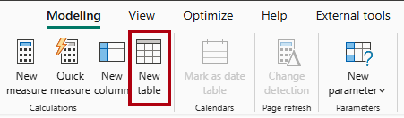

1. En la barra de fórmulas (que se abre justo debajo de la cinta al crear o editar cálculos), escriba `Salesperson =`, pulse **Mayús+Intro**, escriba `'Salesperson (Performance)'` y, a continuación, pulse **Intro**.

    > _**Nota**: Para su comodidad, todas las definiciones DAX en este laboratorio se pueden copiar desde el archivo de fragmentos, que se encuentra en el archivo **04-dax-calculations\Snippets.txt**._

    

    > _Esta definición de tabla crea una copia de la tabla `Salesperson (Performance)`. Solo copia los datos, pero no las propiedades del modelo, como la visibilidad, el formato, etc._

1. En el panel **Datos**, observe que el icono de la nueva tabla tiene una calculadora adicional delante (lo que indica que se trata de una tabla calculada).

    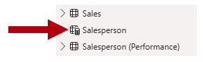

    > _**Nota**: Las tablas calculadas se definen mediante una fórmula DAX que devuelve una tabla. Es importante comprender que las tablas calculadas aumentan el tamaño del modelo de datos porque materializan y almacenan valores. Además, se vuelven a calcular cada vez que se actualizan las dependencias de fórmula, como sucede en este modelo de datos cuando se cargan valores de fecha nuevos (futuros) en las tablas._
    >
    > _A diferencia de las tablas con origen en Power Query, las tablas calculadas no se pueden usar para cargar datos de orígenes de datos externos. Solo pueden transformar datos en función de lo que ya se haya cargado en el modelo de datos._

1. Cambie a la **vista Modelo** y observe que la tabla `Salesperson` está disponible.

1. Cree una relación a partir de la columna `Salesperson | EmployeeKey` y la columna `Sales | EmployeeKey`.

    > _Los laboratorios usan una notación abreviada para hacer referencia a un campo. Tendrá este aspecto: `Salesperson | EmployeeKey`. En este ejemplo, `Salesperson` es el nombre de la tabla y `EmployeeKey` es el nombre de la columna._

1. Haga clic con el botón derecho en la relación inactiva (línea de puntos) entre las tablas `Salesperson (Performance)` y `Sales` y, a continuación, seleccione **Eliminar**. Cuando se le pida que confirme la eliminación, seleccione **Sí**.

1. En la tabla `Salesperson`, seleccione las siguientes columnas y, a continuación, ocúltelas (establezca la propiedad **Is Hidden** (Está oculto) en _Sí_):

    - `EmployeeID`
    - `EmployeeKey`
    - `UPN`

1. En el diagrama del modelo, seleccione la tabla `Salesperson`.

1. En el panel **Propiedades**, en el cuadro **Descripción**, escriba: _Comercial relacionado con ventas_

    > _Recordará que las descripciones aparecen como información sobre herramientas en el panel **Datos** cuando el usuario mantiene el puntero sobre una tabla o un campo._

1. Para la tabla `Salesperson (Performance)`, establezca la descripción en: _Salesperson related to region(s)_ (Comercial relacionado con regiones)

> _El modelo de datos ahora proporciona dos alternativas al analizar comerciales. La tabla `Salesperson` permite analizar las ventas realizadas por un comercial, mientras que la tabla `Salesperson (Performance)` permite el análisis de las ventas realizadas en las regiones de ventas asignadas al comercial._

## Creación de la tabla de fecha

En esta tarea, creará la tabla `Date`.

1. Cambia a la **vista Tabla**. En la pestaña **Inicio** de la cinta de opciones, desde el grupo **Cálculos**, seleccione **Nueva tabla**.

    

1. En la barra de fórmulas, introduce el siguiente DAX:

    ```dax
    Date =  
    CALENDARAUTO(6)
    ```

    

    > _La función `CALENDARAUTO` devuelve una tabla de una sola columna que consta de valores de fecha. El comportamiento "automático" examina todas las columnas de fecha del modelo de datos para determinar los valores de fecha más antiguos y más recientes almacenados en el modelo de datos. Después, crea una fila para cada fecha dentro de este intervalo, ampliando el intervalo en cualquier dirección para asegurarse de que se almacenan los años completos de datos._
    >
    > _Esta función puede tomar un único argumento opcional, que es el último número de mes de un año. Cuando se omite, el valor es 12, lo que significa que diciembre es el último mes del año. En este caso, se escribe 6, lo que significa que junio es el último mes del año._

1. Tenga en cuenta que la columna de valores de fecha puede estar formateada según la configuración regional de EE. UU. (es decir, mm/dd/aaaa).

    

1. En la esquina inferior izquierda, en la barra de estado, observe las estadísticas de la tabla, que confirman que se han generado 1826 filas de datos, lo cual representa datos de cinco años completos.

    

## Crear columnas calculadas

En esta tarea agregará más columnas para habilitar el filtrado y la agrupación por períodos de tiempo diferentes. También creará una columna calculada para controlar el criterio de ordenación de otras columnas.

> _**Nota**: Para su comodidad, todas las definiciones DAX de este laboratorio pueden copiarse del archivo **Snippets.txt**._

1. En la cinta contextual **Herramientas de tabla**, desde el grupo **Cálculos**, seleccione **Nueva columna**.

    > _Una columna calculada se crea especificando primero el nombre de la columna, seguido del símbolo igual (=), y luego una fórmula DAX que devuelve un resultado de valor único. El nombre de columna no puede estar ya en la tabla._

    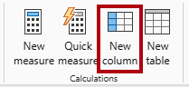

1. En la barra de fórmulas, escriba lo siguiente (o copie desde el archivo de fragmentos de código) y luego presione **Entrar**:

    > _La fórmula utiliza el valor del año de la fecha, pero agrega uno al valor de año cuando el mes es posterior a junio. Así es como se calculan los años fiscales de Adventure Works._

   ```dax
   Year =
   "FY" & YEAR('Date'[Date]) + IF(MONTH('Date'[Date]) > 6, 1)
   ```

1. Use las definiciones de archivo de fragmentos de código para crear las siguientes dos columnas calculadas para la tabla `Date`:

    - `Quarter`
    - `Month`

1. Comprueba que se han agregado las nuevas columnas.

    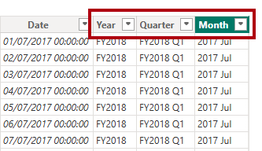

1. Para validar los cálculos, cambie a la **vista Informe**.

1. Para crear una nueva página del informe, seleccione el icono de signo más situado junto a la **página 1**.

    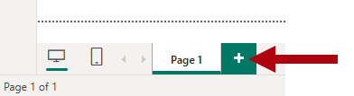

1. Para agregar un objeto visual de matriz a la nueva página de informe, en el panel **Visualizaciones**, seleccione el tipo de objeto visual de matriz.

    > _Sugerencia: Puede mantener el cursor sobre cada icono para mostrar una información sobre herramientas que describa el tipo de objeto visual._

    

1. En el panel **Datos**, desde dentro de la tabla `Date`, arrastre el campo `Year` al pozo **Filas**.

    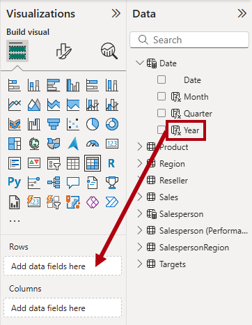

1. Arrastre el campo `Month` al apartado **Filas**, justo debajo del campo `Year`.

1. En la parte superior derecha del objeto visual Matriz (o en la parte inferior, según la ubicación del objeto visual), seleccione el icono de flecha doble bifurcada (que expandirá todos los años hacia abajo un nivel).

    

1. Observe que los años se expanden hasta meses y que los meses se ordenan alfabéticamente en lugar de cronológicamente.

    

    > _De forma predeterminada, los valores de texto se ordenan alfabéticamente, los números se ordenan de menor a mayor y las fechas se ordenan de la más antigua a la más reciente._

1. Para personalizar el orden de los campos `Month`, cambie a la **vista Tabla**.

1. Agregue la columna `MonthKey` a la tabla `Date`.

    ```dax
    MonthKey =
    (YEAR('Date'[Date]) * 100) + MONTH('Date'[Date])
    ```

    > _Esta fórmula calcula un valor numérico para cada combinación de año/mes._

1. En la **vista Tabla**, compruebe que la nueva columna contiene valores numéricos (por ejemplo, 201707 para julio de 2017, etc.).

    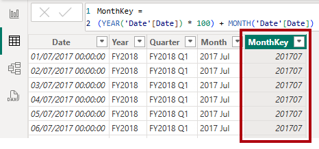

1. Cambie a la **vista Informe**.

1. En el panel **Datos**, seleccione el campo `Month`.

1. En la cinta contextual **Herramientas de columna**, en el grupo **Ordenar**, seleccione **Ordenar por columna** y, a continuación, **MonthKey** (Clave de mes).

    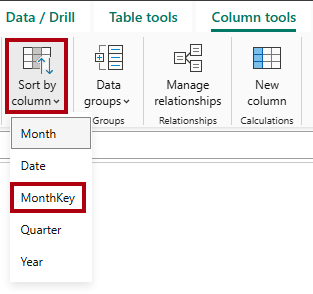

1. En el objeto visual de matriz, observe que los meses ahora se ordenan cronológicamente.

    

## Completado de la tabla Date (Fecha)

En esta tarea, completará el diseño de la tabla `Date` ocultando una columna y creando una jerarquía. A continuación, creará relaciones con las tablas `Sales` y `Targets`.

1. Cambia a la vista **Modelo**.

1. En la tabla `Date`, oculte la columna `MonthKey` (establezca **Is Hidden** (Está oculto) en _Sí_).

1. En el panel **Datos**, seleccione la tabla `Date`, haga clic con el botón derecho en la columna `Year` y seleccione **Crear jerarquía**.

    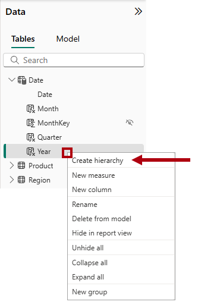

1. En el panel **Propiedades**, en la casilla **Nombre**, sustituya el valor por _Fiscal_.

    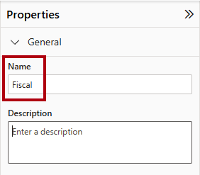

1. Para agregar niveles a la jerarquía, en la lista desplegable **Jerarquía**, seleccione **Trimestre** y luego seleccione **Mes**, y luego seleccione **Aplicar cambios de nivel**.

    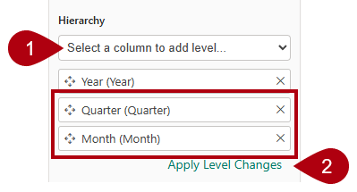

1. Cree las dos relaciones de modelo siguientes:

    - `Date | Date` a `Sales | OrderDate`
    - `Date | Date` a `Targets | TargetMonth`

1. Oculte las dos columnas siguientes:

    - `Sales | OrderDate`
    - `Targets | TargetMonth`

## Marcar la tabla de fecha

En esta tarea, marcará la tabla `Date` como tabla de fechas.

1. Cambia a la vista **Informe**.

1. En el panel **Datos**, seleccione la tabla `Date` (no el campo `Date`).

1. En la cinta contextual **Herramientas de tabla**, dentro del grupo **Calendarios**, selecciona **Marcar como tabla de fechas**.

    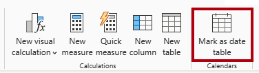

1. En la ventana **Marcar como tabla de fechas**, deslice la propiedad **Marcar como tabla de fechas** a _Activado_.

1. En la lista desplegable **Elegir una columna de fecha**, seleccione **Fecha**.

    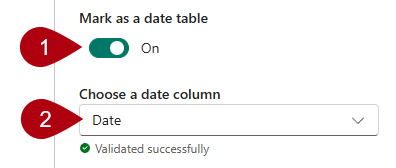

1. Seleccione **Guardar**.

1. Guarde el archivo de Power BI Desktop.

> _Power BI Desktop ahora entiende que esta tabla define la fecha (tiempo)._
>
> _Este enfoque de diseño para una tabla de fechas es adecuado cuando no tiene una tabla de fechas en el origen de datos. Si tiene un almacenamiento de datos, sería adecuado cargar los datos de fecha desde su tabla de dimensiones de fecha en lugar de "redefinir" la lógica de datos en el modelo de datos._

## Creación de medidas simples

En esta tarea, creará medidas simples. Las medidas simples agregan valores en una sola columna o recuento de filas de una tabla.

1. En la **vista Informe**, en **Página 2**, desde el panel **Datos**, arrastre el campo `Sales | Unit Price` al objeto visual de matriz.

    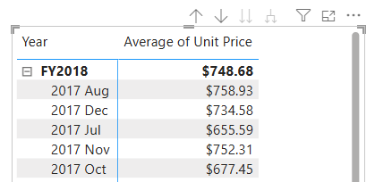

1. En el panel de campos visuales (situado en el panel **Visualizaciones**), en el apartado **Valores**, observe que el campo `Unit Price` está configurado como **Promedio del precio unitario**.

    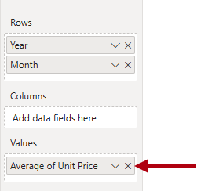

1. Seleccione la flecha hacia abajo para **Promedio del precio unitario** y, a continuación, observe las opciones de menú disponibles.

    > _Las columnas numéricas visibles permiten a los autores de informes decidir en el momento del diseño del informe cómo se resumirían (o no) los valores de una columna. Sin embargo, puede dar lugar a informes inadecuados._
    >
    > _A algunos modeladores de datos no les gusta dejar las cosas al azar, por lo que optan por ocultar estas columnas y en su lugar exponer la lógica de agregación definida en las medidas. Es el enfoque que adoptará ahora en este laboratorio._

1. Para crear una medida, en el panel **Datos**, haga clic con el botón derecho en la tabla `Sales` y seleccione **Nueva medida**.

1. En la barra de fórmulas, agregue la siguiente definición de medida:

    ```DAX
    Avg Price =  
    AVERAGE(Sales[Unit Price])
    ```

1. Agregue la medida `Avg Price` a la matriz visual, y observe que produce el mismo resultado que la columna `Unit Price` (pero con diferente formato).

1. En el apartado **Valores**, abra el menú contextual del campo `Avg Price` y observe que no es posible cambiar la técnica de agregación.

    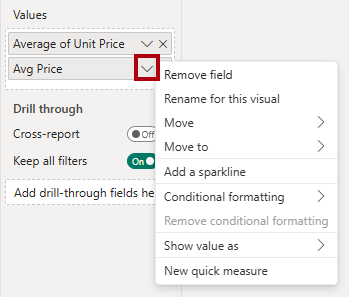

    > _No es posible modificar el comportamiento de agregación de una medida._

1. Use las definiciones de archivo de fragmentos de código para crear las siguientes cinco medidas para la tabla `Sales`:

    - `Median Price`
    - `Min Price`
    - `Max Price`
    - `Orders`
    - `Order Lines`

    > _La función `DISTINCTCOUNT` que se usa en la medida `Orders` cuenta los pedidos solo una vez (ignorando los duplicados). La función `COUNTROWS` utilizada en la medida `Order Lines` opera sobre una tabla._
    >
    > _En este caso, el número de pedidos se calcula contando los valores distintos de las columnas `SalesOrderNumber`, mientras que el número de líneas de pedido es simplemente el número de filas de la tabla (cada fila es una línea de un pedido)._

1. Cambie a la **vista Modelo** y, a continuación, haga una selección múltiple de las cuatro medidas de precio: `Avg Price`, `Max Price`, `Median Price` y `Min Price`.

1. Para la selección múltiple de medidas, configure los siguientes requisitos:

    - Establecer el formato en dos posiciones decimales
    - Asigne una carpeta de visualización denominada _Precios_ (utilice la propiedad **Carpeta de visualización** del panel **Propiedades**).

    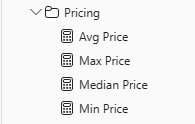

1. Ocultar la columna `Unit Price`.

    > _La columna `Unit Price` ya no está disponible para los autores de informes. Deben usar las medidas de precios que se han agregado al modelo. Este enfoque de diseño garantiza que los autores de informes no agregarán de forma inapropiada los precios, por ejemplo, sumándolos._

1. Seleccione varias veces las medidas `Order Lines` y `Orders` y, a continuación, configure los siguientes requisitos:

    - Establecer el formato para usar el separador de miles.
    - Asignar a una carpeta para mostrar denominada _Counts_ (Recuentos).

    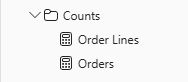

1. En la **vista Informe**, en el campo **Valores** del objeto visual de matriz, en **Promedio del precio unitario**, seleccione **X** para eliminarlo.

    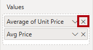

1. Aumente el tamaño del objeto visual de matriz para rellenar el ancho y el alto de la página.

1. Agregue las cinco medidas siguientes al objeto visual de matriz:

    - `Median Price`
    - `Min Price`
    - `Max Price`
    - `Orders`
    - `Order Lines`

1. Compruebe que los resultados parecen razonables y tienen el formato correcto.

    

## Creación de medidas adicionales

En esta tarea creará más medidas que usan fórmulas más complejas.

1. En la **vista Informe**, seleccione **Página 1** y revise el objeto visual de la tabla de vendedores (a la derecha), observando el total de la columna **Suma de objetivo**.

    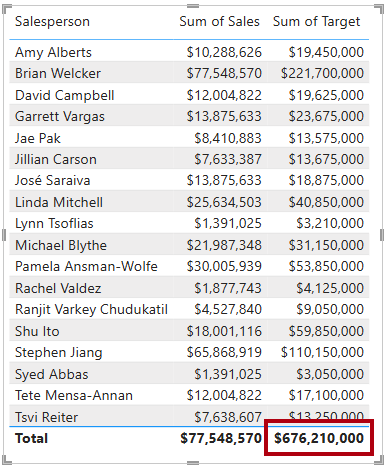

1. Seleccione el visual de tabla y, a continuación, en el panel **Visualizaciones**, elimine **Suma del objetivo**.

1. Cambie el nombre de la columna `Targets | Target` a _TargetAmount_.

    > _Sugerencia: Hay varias maneras de cambiar el nombre de la columna en la **vista Informe**: En el panel **Datos**, puede hacer clic con el botón derecho en la columna y, a continuación, seleccionar **Cambiar nombre**, o bien hacer doble clic en la columna, o incluso presionar **F2**._

1. Cree la siguiente medida en la tabla `Targets`:

    ```dax
    Target =
    IF(
        HASONEVALUE('Salesperson (Performance)'[Salesperson]),
        SUM(Targets[TargetAmount])
    )
    ```

    > _La función `HASONEVALUE` comprueba si se filtra un único valor de la columna `Salesperson`. Si es true, la expresión devuelve la suma de las cantidades objetivo (solo para ese comercial). Cuando es false, se devuelve `BLANK`._

1. Dé formato a la medida `Target` para que no tenga posiciones decimales.

    > _Sugerencia: Puede usar la cinta contextual **Herramientas de medición**._

1. Ocultar la columna `TargetAmount`.

    > _Sugerencia: Puede hacer clic con el botón derecho en el panel **Datos**, y, a continuación, seleccionar **Ocultar**._

1. Observe que en la parte superior de la lista aparece la tabla `Targets`.

    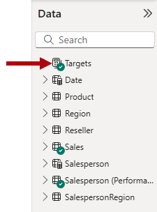

    > _Las tablas que solo contienen medidas visibles se muestran automáticamente en la parte superior de la lista._

1. Agregue la medida `Target` al objeto visual de tabla.

1. Observe que el total de la columna **Target** (Objetivo) está ahora en `BLANK`.

    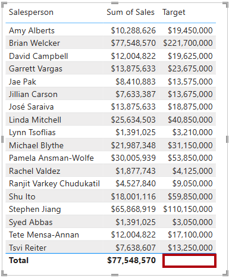

1. Use las definiciones de archivo de fragmentos de código para crear las siguientes dos medidas para la tabla `Targets`:

    - `Variance`
    - `Variance Margin`

1. Dé formato a la medida `Variance` para que no tenga posiciones decimales.

1. Dar formato a la medida `Variance Margin` como porcentaje con dos posiciones decimales.

1. Agregue las medidas `Variance` y `Variance Margin` al objeto visual de tabla.

1. Cambie el tamaño de la tabla visual para que se puedan ver todas las columnas y filas.

    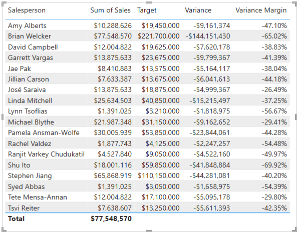

    > _Si bien parece que todos los vendedores no están cumpliendo con el objetivo, recuerde que la tabla visual aún no está filtrada por un período de tiempo específico. Generará informes de rendimiento de ventas que filtren por un período de tiempo seleccionado por el usuario en el laboratorio **Diseñar un informe en Power BI Desktop**._

1. Guarde el archivo de Power BI Desktop.

## Laboratorio completado

Puede optar por guardar el informe de Power BI, aunque no es necesario para este laboratorio. En el ejercicio siguiente, trabajará con un archivo de inicio creado previamente.

1. Vaya al menú **"Archivo"** en la esquina superior izquierda y seleccione **"Guardar como"**. 
1. Seleccione **Examinar este dispositivo**.
1. Seleccione la carpeta donde desea guardar el archivo y asígnele un nombre descriptivo. 
1. Seleccione el botón **Guardar** para guardar el informe como un archivo .pbix. 
1. Si aparece un cuadro de diálogo en el que se le pide que aplique los cambios pendientes en la consulta, seleccione **Aplicar**.
1. Cierre Power BI Desktop.