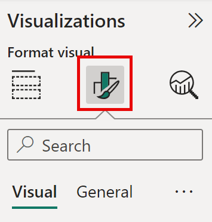
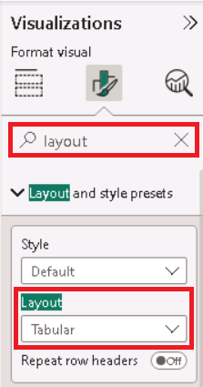
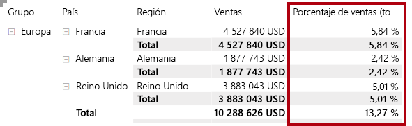
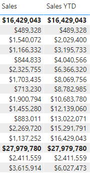
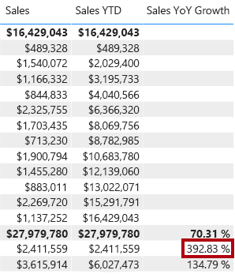

---
lab:
  course: PL-300
  title: "Creación de cálculos DAX avanzados en Power\_BI Desktop"
  module: Create Model Calculations using DAX in Power BI
---


# Creación de cálculos DAX avanzados en Power BI Desktop

## **Caso de laboratorio**

En este laboratorio creará medidas con expresiones DAX que impliquen la manipulación del contexto de filtro.

En este laboratorio, aprenderá a:

- Usar la función CALCULATE () para manipular el contexto de filtro
- Usar funciones de inteligencia de tiempo

**Este laboratorio debe durar unos 45 minutos**.

## **Trabajo con contexto de filtro**

*Importante: Si ha realizado el laboratorio anterior (y lo ha completado correctamente) no realice esta tarea, continúe a partir de la siguiente.*

1. Abra Power BI Desktop.

    

1. Para abrir el archivo de inicio de Power BI Desktop, selecciona **Abrir > Examinar este dispositivo**.

1. En la ventana **Abrir**, vaya a la carpeta **D:\Allfiles\Labs\05-create-dax-calculations-in-power-bi-desktop-advanced\Starter** y abra el archivo **Sales Analysis**.

   *Nota: En este momento, Power BI te pedirá que inicies sesión si aún no lo has hecho. Puedes iniciar sesión o seleccionar **Cancelar** y continuar con el laboratorio.*

1. Cierre todas las ventanas informativas que se abran.

1. Fíjese en el mensaje de advertencia debajo de la cinta. 

    *Este mensaje le avisa de que no se han aplicado consultas para cargar el archivo como tablas de modelo. Aplicará consultas más adelante en este laboratorio.*
    
    *Para descartar el mensaje de advertencia, seleccione la **X** situada a la derecha del mensaje de advertencia.*

1. Para crear una copia del archivo, vaya a **Archivo > Guardar como** y guárdelo en la carpeta **D:\Allfiles\MySolution**.

1. Si se le pide que aplique los cambios, seleccione **Aplicar más tarde**.

## **Creación de un objeto visual de matriz**

En esta tarea creará un objeto visual Matriz para probar las nuevas medidas.

1. En Power BI Desktop, en la vista Informe, cree una nueva página de informe.

1. En la **Página 3**, agregue un objeto visual de matriz.

    

1. Cambie el tamaño del objeto visual de matriz para rellenar toda la página.

1. Para configurar los campos de los objetos visuales de matriz, en el panel **Datos**, arrastre la jerarquía **Región \| Regiones** y colóquela en el objeto visual.
    
    *Los laboratorios usan una notación abreviada para hacer referencia a un campo o jerarquía. Tendrá este aspecto: **Region \| Regions**. En este ejemplo, **Region** es el nombre de la tabla y **Regions** es el nombre de la jerarquía.*

1. Agregue también el campo **Sales \| Sales**.

1. Para expandir toda la jerarquía, en la parte superior derecha del objeto visual de matriz, seleccione dos veces el icono de flecha bifurcada doble.
    
    *Recordará que la jerarquía **Regions** tiene los niveles **Group**, **Country** y **Region**.*

    

1. Para dar formato al objeto visual, en el panel **Visualizaciones**, seleccione el panel **Formato**.

    

1. En el cuadro **Buscar**, escriba **Escalonado**.

1. Establezca la propiedad **Diseño escalonado** en **Desactivado**.

    

1. Compruebe que el objeto visual de la matriz ahora tiene cuatro encabezados de columna.

    

    *En Adventure Works, las regiones de ventas están organizadas en grupos, países y regiones. Todos los países, excepto Estados Unidos, tienen una sola región, que se nombra después del país. Como Estados Unidos es un territorio de ventas de gran tamaño, se divide en cinco regiones comerciales.*

    *En este ejercicio creará varias medidas y, a continuación, las probará agregándolas al objeto visual de matriz.*

## **Manipulación del contexto de filtro**

En esta tarea creará varias medidas con expresiones DAX que usan la función CALCULATE() para manipular el contexto de filtro.

1. Agregue una medida a la tabla **Sales** (Ventas), en función de la siguiente expresión:
    
     *Para su comodidad, todas las definiciones de DAX de este laboratorio se pueden copiar desde el archivo **D:\Allfiles\Labs\05-create-dax-calculations-in-power-bi-desktop-advanced\Assets\Snippets.txt**.*


    **DAX**


    ```
    Sales All Region =

    CALCULATE(SUM(Sales[Sales]), REMOVEFILTERS(Region))
    ```


    *La función CALCULATE() es una función eficaz que se usa para manipular el contexto de filtro. El primer argumento toma una expresión o una medida (una medida es simplemente una expresión con nombre). Los argumentos subsiguientes permiten modificar el contexto de filtro.*

    *La función REMOVEFILTERS() quita los filtros activos. Puede no tomar argumentos, o bien una tabla, una columna o varias columnas como argumento.*

    *En esta fórmula, la medida evalúa la suma de la columna **Sales** (Ventas) en un contexto de filtro modificado, que quita los filtros aplicados a las columnas de la tabla **Region** (Región).*

1. Agregue la medida **Sales All Region** (Ventas de toda la región) al objeto visual de matriz.

    

1. Tenga en cuenta que la medida **Sales All Region** (Ventas toda la región) calcula el total de las ventas de toda la región para cada región, país (subtotal) y grupo (subtotal).

    *La medida nueva aún no ofrece un resultado útil. Cuando las ventas de un grupo, un país o una región se dividen por este valor, se generará una relación útil conocida como "porcentaje de total general".*

1. En el panel **Datos**, asegúrese de que esté seleccionada la medida **Ventas de toda la región** (al seleccionarla, tendrá un fondo gris) y, después, en la barra de fórmulas, reemplace el nombre y la fórmula de la medida por la fórmula siguiente:

    *Sugerencia: Para reemplazar la fórmula, copie primero el fragmento de código. Seleccione la barra de fórmulas y presione **Ctrl+A** para seleccionar todo el texto. A continuación, presione **Ctrl+V** para pegar el fragmento de código y sobrescribir el texto seleccionado. Después, presione **Entrar**.*


    **DAX**


    ```
    Sales % All Region =  
    DIVIDE(  
     SUM(Sales[Sales]),  
     CALCULATE(  
     SUM(Sales[Sales]),  
     REMOVEFILTERS(Region)  
     )  
    )
    ```

    *Se ha cambiado el nombre de la medida para reflejar con precisión la fórmula actualizada. La función DIVIDE() divide la medida **Sales** (Ventas) (no modificada por el contexto del filtro) por la medida **Sales** (Ventas) en un contexto modificado que quita los filtros aplicados a la tabla **Region** (Región).*

1. En el objeto visual Matriz, observe que se ha cambiado el nombre de la medida y que ahora aparece un valor diferente para cada grupo, país y región.

1. Aplique formato a la medida **Sales % All Region** (% ventas toda la región) como un porcentaje con dos posiciones decimales.

1. En el objeto visual de matriz, revise los valores de la medida **Sales % All Region** (% ventas toda la región).

    

1. Agregue otra medida a la tabla **Sales** (Ventas), en función de la siguiente expresión, con un formato de porcentaje:


    **DAX**

    ```
    Sales % Country =  
    DIVIDE(  
     SUM(Sales[Sales]),  
     CALCULATE(  
     SUM(Sales[Sales]),  
     REMOVEFILTERS(Region[Region])  
     )  
    )
    ```

1. Observe que la fórmula de la medida **Sales % Country** (% ventas país) difiere ligeramente de la fórmula de la medida **Sales % All Region** (% ventas toda la región).

    *La diferencia es que el denominador modifica el contexto de filtro quitando los filtros de la columna **Region** de la tabla **Region**, no todas las columnas de la tabla **Region**. Esto significa que se conservan los filtros aplicados a las columnas de grupo o país. Obtendrá un resultado que representa las ventas como un porcentaje del país.*

1. Agregue la medida **Sales % Country** (% ventas país) al objeto visual de matriz.

1. Observe que solo las regiones de Estados Unidos producen un valor que no es el 100 %.
    
    *Recordará que solo Estados Unidos tiene varias regiones. Todos los demás países comprenden una sola región, lo que explica que todos den el 100 %.*

    

    

1. Para mejorar la legibilidad de esta medida en el objeto visual, sobrescriba la medida **Sales % Country** (% ventas país) por esta fórmula mejorada.


    **DAX**


    ```
    Sales % Country =  
    IF(  
     ISINSCOPE(Region[Region]),  
     DIVIDE(  
     SUM(Sales[Sales]),  
     CALCULATE(  
     SUM(Sales[Sales]),  
     REMOVEFILTERS(Region[Region])  
     )  
     )  
    )
    ```


    *La función IF() utiliza la función ISINSCOPE() para probar si la columna Region es un nivel en una jerarquía de niveles. Si es true, se evalúa la función DIVIDE(). Si es false, se devuelve un valor en blanco, porque la columna Region no está dentro del ámbito.*

1. Tenga en cuenta que la medida **Sales % Country** (% ventas país) ahora solo devuelve un valor cuando una región está en el ámbito.

    

1. Agregue otra medida a la tabla **Sales** (Ventas), en función de la siguiente expresión, con un formato de porcentaje:


    **DAX**


    ```
    Sales % Group =  
    DIVIDE(  
     SUM(Sales[Sales]),  
     CALCULATE(  
     SUM(Sales[Sales]),  
     REMOVEFILTERS(  
     Region[Region],  
     Region[Country]  
     )  
     )  
    )
    ```


    *Para obtener las ventas como porcentaje del grupo, se pueden aplicar dos filtros para quitar eficazmente los filtros de dos columnas.*

1. Agregue la medida **Sales % Group** (% ventas grupo) al objeto visual de matriz.

1. Para mejorar la legibilidad de esta medida en el objeto visual, sobrescriba la medida **Sales % Group** (% ventas grupo) por esta fórmula mejorada.


    **DAX**


    ```
    Sales % Group =  
    IF(  
     ISINSCOPE(Region[Region])  
     || ISINSCOPE(Region[Country]),  
     DIVIDE(  
     SUM(Sales[Sales]),  
     CALCULATE(  
     SUM(Sales[Sales]),  
     REMOVEFILTERS(  
     Region[Region],  
     Region[Country]  
     )  
     )  
     )  
    )
    ```


1. Tenga en cuenta que la medida **Sales % Group** (% ventas grupo) ahora solo devuelve un valor cuando una región o país está en el ámbito.

1. En la vista Modelo, coloque las tres nuevas medidas en una carpeta para mostrar denominada **Ratios** (Proporciones).

    

1. Guarde el archivo de Power BI Desktop.

*Las medidas agregadas a la tabla **Sales** (Ventas) han modificado el contexto de filtro para lograr una navegación jerárquica. Tenga en cuenta que el patrón para lograr el cálculo de un subtotal requiere quitar algunas columnas del contexto de filtro y, para llegar a un total general, se deben quitar todas las columnas.*

## **Trabajo con inteligencia de tiempo**

En este ejercicio creará una medida de ventas del año hasta la fecha y una medida del aumento interanual de las ventas.

## **Creación de una medida del año hasta la fecha**

En esta tarea creará una medida de ventas del año hasta la fecha.

1. En la vista Informe, en la **Página 2**, observe el objeto visual de matriz que muestra varias medidas con años y meses agrupados en las filas.

2. Agregue una medida a la tabla **Sales** (Ventas), en función de la siguiente expresión, y con un formato de cero posiciones decimales:


    **DAX**


    ```
    Sales YTD =  
    TOTALYTD(SUM(Sales[Sales]), 'Date'[Date], "6-30")
    ```


    *La función TOTALYTD () evalúa una expresión, en este caso la suma de la columna **Sales**, en una columna de fecha determinada. La columna de fecha debe pertenecer a una tabla de fechas marcada como tal, como hizo en el laboratorio **Creación de cálculos DAX en Power BI Desktop**.*

    *La función también puede tomar un tercer argumento opcional que represente la última fecha de un año. La ausencia de esta fecha significa que el 31 de diciembre es la última fecha del año. En el caso de Adventure Works, junio es el último mes del año, y por eso se usa "6-30".*

3. Agregue el campo **Sales** (Ventas) y la medida **Sales YTD** (Ventas del año hasta la fecha) al objeto visual de matriz.

4. Observe la acumulación de valores de ventas dentro del año.

    

    *La función TOTALYTD() realiza la manipulación de filtros, específicamente la manipulación de filtros de tiempo. Por ejemplo, a fin de calcular las ventas del año hasta la fecha para septiembre de 2017 (el tercer mes del año fiscal), se quitan todos los filtros de la tabla **Date** (Fecha) y se reemplazan por un nuevo filtro de fechas que comienzan al principio del año (1 de julio de 2017) y se extienden hasta la última fecha del período de fecha en contexto (30 de septiembre de 2017).*

    *Hay muchas funciones de inteligencia de tiempo disponibles en DAX para admitir las manipulaciones de filtro de tiempo comunes.*

## **Creación de una medida de crecimiento de ventas de año a año**

En esta tarea creará una medida del aumento interanual de las ventas.

1. Agregue una medida a la tabla **Sales** en función de la siguiente expresión:


    **DAX**


    ```
    Sales YoY Growth =  
    VAR SalesPriorYear =  
     CALCULATE(  
     SUM(Sales[Sales]),  
     PARALLELPERIOD(  
     'Date'[Date],  
     -12,  
     MONTH  
     )  
     )  
    RETURN  
     SalesPriorYear
    ```


    *La medida **Sales YoY Growth** usa una variable. Las variables ayudan a simplificar la fórmula y son más eficaces si se usa la lógica varias veces dentro de una fórmula.*

    *Las variables se declaran con un nombre único y la expresión de medida debe generarse después de la palabra clave **RETURN**. A diferencia de otras variables de lenguajes de programación, las variables DAX solo se pueden usar dentro de la fórmula única.*

    *A la variable **SalesPriorYear** se le asigna una expresión que calcula la suma de la columna **Sales** en un contexto modificado que usa la función PARALLELPERIOD() para retraer cada fecha 12 meses en el contexto del filtro.*

1. Agregue la medida **Sales YoY Growth** (Crecimiento de ventas de año a año) al objeto visual de matriz.

1. Observe que la nueva medida devuelve BLANK durante los 12 primeros meses (ya que no se registró ninguna venta antes del año fiscal 2017).

1. Observe que el valor de la medida **Sales YoY Growth** (Crecimiento de ventas de año a año) para **2018 Jul** (Julio de 2018) es el valor **Ventas** para **2017 Jul** (Julio de 2017).

    

    *Ahora que se ha probado la "parte difícil" de la fórmula, puede sobrescribir la medida con la fórmula final que calcula el resultado del aumento.*

1. Para completar la medida, sobrescriba la medida **Sales YoY Growth** (Crecimiento de ventas de año a año) con esta fórmula, aplicándole formato de porcentaje con dos decimales:


    **DAX**


    ```
    Sales YoY Growth =  
    VAR SalesPriorYear =  
     CALCULATE(  
     SUM(Sales[Sales]),  
     PARALLELPERIOD(  
     'Date'[Date],  
     -12,  
     MONTH  
     )  
     )  
    RETURN  
     DIVIDE(  
     (SUM(Sales[Sales]) - SalesPriorYear),  
     SalesPriorYear  
     )
    ```


1. En la fórmula, en la cláusula **RETURN**, observe que se hace referencia a la variable dos veces.

1. Compruebe que el crecimiento de año a año para **2018 Jul** (Julio de 2018) es del **392,83 %**.

    

    *La medida de aumento interanual identifica casi el 400 % (o 4 veces) el aumento de las ventas durante el mismo período del año anterior.*

1. En la vista Modelo, coloque las dos nuevas medidas en una carpeta para mostrar denominada **Time Intelligence** (Inteligencia de tiempo).

    

### **Finalización**

En esta tarea, completará el laboratorio.

1. A fin de limpiar la solución preparada para el desarrollo de informes, en la parte inferior izquierda, haga clic con el botón derecho en la pestaña **Página 2** y, después, seleccione **Eliminar página**. Cuando se le pregunte si desea eliminar la página, seleccione **Eliminar**.

1. Elimine también **Página 3**.

1. En la página restante, para eliminar la página, seleccione el objeto visual de tabla y presione la tecla **Supr**.

1. Guarde el archivo de Power BI Desktop.

1. Si quiere iniciar el siguiente laboratorio, deje Power BI Desktop abierto.

*Creará un informe basado en el modelo de datos en el laboratorio **Diseño de un informe en Power BI Desktop**.*
