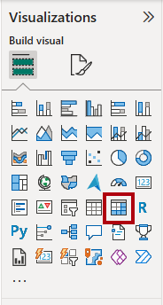
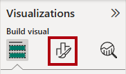
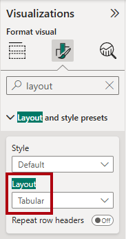
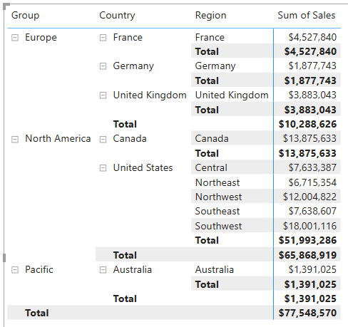
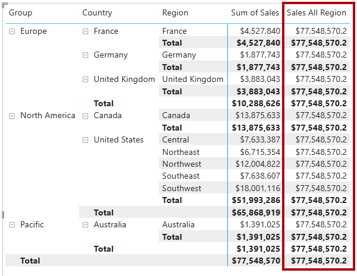
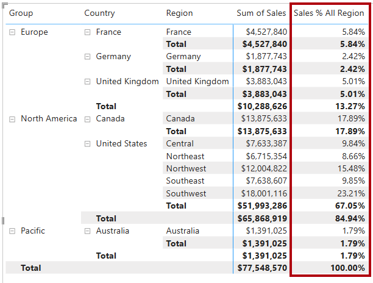
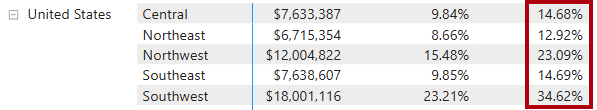
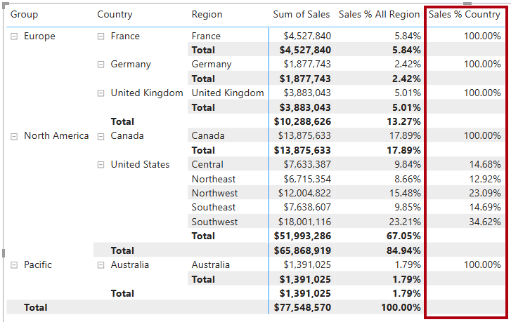
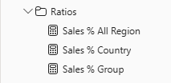

---
lab:
  title: "Modificación del contexto de filtro de DAX en los modelos de Power\_BI."
  module: Modify DAX filter context in Power BI
---

# Modificación del contexto de filtro de DAX en los modelos de Power BI.

## Caso de laboratorio

En este laboratorio, creará medidas con expresiones DAX que implican la manipulación del contexto de filtrado.

Aprenderá a:

 - Utilice la función `CALCULATE` para manipular el contexto del filtro.

**Este laboratorio debe durar unos 30 minutos**.

## Introducción

Para completar este ejercicio, abra primero un explorador web y escriba la siguiente URL para descargar el archivo ZIP:

`https://github.com/MicrosoftLearning/PL-300-Microsoft-Power-BI-Data-Analyst/raw/Main/Allfiles/Labs/05-modify-dax-filter-context/05-modify-dax-filter-context.zip`

Extraiga el archivo a la carpeta **C:\sers\student\Downloads\05-modify-dax-filter-context**.

Abre el archivo **05-Starter-Sales Analysis.pbix**.

> _**Nota**: Es posible que vea un cuadro de diálogo de inicio de sesión a medida que se carga el archivo. Seleccione **Cancelar** para descartar el cuadro de diálogo de inicio de sesión. Cierre todas las ventanas informativas que se abran. Si se le pide aplicar los cambios, seleccione **Aplicar más tarde**._

## Creación de un objeto visual de matriz

En esta tarea creará un objeto visual Matriz para probar las nuevas medidas.

1. En Power BI Desktop, cree una nueva página de informe.

1. En la **Página 3**, agregue un objeto visual de matriz.

    

1. Cambie el tamaño del objeto visual de matriz para rellenar toda la página.

1. Para configurar los campos visuales de la matriz, desde el panel **Datos**, arrastre la jerarquía `Region | Regions` y suéltela dentro del visual.

    > Los laboratorios usan una notación abreviada para hacer referencia a un campo o jerarquía. Tendrá el siguiente aspecto: `Region | Regions`. En este ejemplo, `Region` es el nombre de la tabla y `Regions` es el nombre de la jerarquía._

1. Agregue el campo `Sales | Sales` al apartado **Valores**.

1. Para expandir toda la jerarquía, en la parte superior derecha del objeto visual de matriz, seleccione dos veces el icono de flecha bifurcada doble.

    

1. Para dar formato al objeto visual, en el panel **Visualizaciones**, seleccione el panel **Formato**.

    

1. En el cuadro **Buscar**, escribe _Diseño_.

1. Establece la propiedad **Diseño** como _Tabular_.

    

1. Comprueba que el objeto visual de la matriz tiene ahora 4 encabezados de columna.

    

    > _En Adventure Works, las regiones de ventas están organizadas en grupos, países y regiones. Todos los países, excepto Estados Unidos, tienen una sola región, que se nombra después del país. Como Estados Unidos es un territorio de ventas de gran tamaño, se divide en cinco regiones comerciales._

En este ejercicio creará varias medidas y, a continuación, las probará agregándolas al objeto visual de matriz.

## Manipulación del contexto de filtro

En esta tarea creará varias medidas con expresiones DAX que usan la función `CALCULATE` para manipular el contexto de filtro.

> _La función `CALCULATE` es una función eficaz que se usa para manipular el contexto de filtro. El primer argumento toma una expresión o una medida (una medida es simplemente una expresión con nombre). Los argumentos subsiguientes permiten modificar el contexto de filtro._

1. Agregue una medida a la tabla `Sales`, en función de la siguiente expresión:

    > _**Nota**: Para su comodidad, todas las definiciones DAX en este laboratorio se pueden copiar desde el archivo **C:\sers\Student\Downloads\05-modify-dax-filter-context\Snippets.txt**._

    ```dax
    Sales All Region =
    CALCULATE(
        SUM(Sales[Sales]),
        REMOVEFILTERS(Region)
    )
    ```

    > _La función `REMOVEFILTERS` elimina los filtros activos. Puede no tomar argumentos, o bien una tabla, una columna o varias columnas como argumento._
    >
    > _En esta fórmula, la medida evalúa la suma de la columna `Sales` en un contexto de filtro modificado, que elimina cualquier filtro aplicado a las columnas de la tabla `Region`._

1. Agregue la medida `Sales All Region` al objeto visual de matriz.

    

1. Tenga en cuenta que la medida calcula el total de las ventas de toda la región para cada región, país (subtotal) y grupo (subtotal).

    > _La medida nueva aún no ofrece un resultado útil. Cuando las ventas de un grupo, un país o una región se dividen por este valor, se generará una relación útil conocida como "porcentaje de total general"._

1. En el panel **Datos**, asegúrese de que esté seleccionada la medida `Sales All Region` (al seleccionarla, tendrá un fondo gris) y, después, en la barra de fórmulas, reemplace el nombre y la fórmula de la medida por la fórmula siguiente:

    > _Sugerencia: Para reemplazar la fórmula, copie primero el fragmento de código. Seleccione la barra de fórmulas y presione **Ctrl+A** para seleccionar todo el texto. A continuación, presione **Ctrl+V** para pegar el fragmento de código y sobrescribir el texto seleccionado. Después, presione **Entrar**._

    ```dax
    Sales % All Region =
    DIVIDE(
        SUM(Sales[Sales]),
        CALCULATE(
            SUM(Sales[Sales]),
            REMOVEFILTERS(Region)
        )
    )
    ```

    > _Se ha cambiado el nombre de la medida para reflejar con precisión la fórmula actualizada. La función `DIVIDE` divide la suma de la columna `Sales` (no modificada por el contexto del filtro) por la suma de la columna `Sales` en un contexto modificado, lo que elimina cualquier filtro aplicado a la tabla `Region`._

1. En el objeto visual Matriz, observe que se ha cambiado el nombre de la medida y que ahora aparece un valor diferente para cada grupo, país y región.

1. Dar formato a la medida `Sales % All Region` como un porcentaje con dos posiciones decimales.

1. En el objeto visual de matriz, revise los valores de la medida `Sales % All Region`.

    

1. Agregue otra medida a la tabla `Sales`, en función de la siguiente expresión, y aplique un formato de porcentaje:

    ```dax
    Sales % Country =
    DIVIDE(
        SUM(Sales[Sales]),
        CALCULATE(
            SUM(Sales[Sales]),
            REMOVEFILTERS(Region[Region])
        )
    )
    ```

1. Observe que la fórmula de la medida `Sales % Country` difiere ligeramente de la fórmula de la medida `Sales % All Region`.

    > _La diferencia es que el denominador modifica el contexto del filtro eliminando los filtros de la columna `Region` de la tabla `Region`, no de todas las columnas de la tabla `Region`. Esto significa que se conservan los filtros aplicados a las columnas de grupo o país. Obtendrá un resultado que representa las ventas como porcentaje del país._

1. Agregue la medida `Sales % Country` al objeto visual de matriz.

1. Obsérvese que solo las regiones de Estados Unidos producen un valor que no es el 100%.

    

    > _Tal vez recuerde que solo Estados Unidos tiene varias regiones. Todos los demás países comprenden una única región, lo que explica por qué todos son del 100%._

1. Para mejorar la legibilidad de esta medida en visual, sobrescriba la medida `Sales % Country` con la siguiente fórmula mejorada.

    ```dax
    Sales % Country =
    IF(
        ISINSCOPE(Region[Region]),
        DIVIDE(
            SUM(Sales[Sales]),
            CALCULATE(
                SUM(Sales[Sales]),
                REMOVEFILTERS(Region[Region])
            )
        )
    )
    ```

    > _La función `IF` utiliza la función `ISINSCOPE` para comprobar si la columna de la región es el nivel en una jerarquía de niveles. Cuando es verdadero, se evalúa la función `DIVIDE`. Cuando es falso, se devuelve `BLANK` porque la columna de la región no está en el ámbito._

1. Observe que la medida `Sales % Country` ahora solo devuelve un valor cuando una región está en el ámbito.

    

1. Agregue otra medida a la tabla `Sales`, en función de la siguiente expresión, y aplique un formato de porcentaje:

    ```dax
    Sales % Group =
    DIVIDE(
        SUM(Sales[Sales]),
        CALCULATE(
            SUM(Sales[Sales]),
            REMOVEFILTERS(
                Region[Region],
                Region[Country]
            )
        )
    )
    ```

    > _Para obtener las ventas como porcentaje del grupo, se pueden aplicar dos filtros para quitar eficazmente los filtros de dos columnas._

1. Agregue la medida `Sales % Group` al objeto visual de matriz.

1. Para mejorar la legibilidad de esta medida en visual, sobrescriba la medida `Sales % Group` con la siguiente fórmula.

    ```dax
    Sales % Group =
    IF(
        ISINSCOPE(Region[Region])
            || ISINSCOPE(Region[Country]),
        DIVIDE(
            SUM(Sales[Sales]),
            CALCULATE(
                SUM(Sales[Sales]),
                REMOVEFILTERS(
                    Region[Region],
                    Region[Country]
                )
            )
        )
    )
    ```

1. Observe que la medida `Sales % Group` ahora solo devuelve un valor cuando hay una región o un país en el ámbito.

1. En la **vista Modelo**, coloque las tres nuevas medidas en una carpeta para mostrar denominada _Ratios_.

    

1. Guarde el archivo de Power BI Desktop.

> _Las medidas añadidas a la tabla `Sales` han modificado el contexto del filtro para conseguir una navegación jerárquica. Tenga en cuenta que el patrón para lograr el cálculo de un subtotal requiere quitar algunas columnas del contexto de filtro y, para llegar a un total general, se deben quitar todas las columnas._

## Laboratorio completado

Puede optar por guardar el informe de Power BI, aunque no es necesario para este laboratorio. En el ejercicio siguiente, trabajará con un archivo de inicio creado previamente.

1. Vaya al menú **"Archivo"** en la esquina superior izquierda y seleccione **"Guardar como"**. 
1. Seleccione **Examinar este dispositivo**.
1. Seleccione la carpeta donde desea guardar el archivo y asígnele un nombre descriptivo. 
1. Seleccione el botón **Guardar** para guardar el informe como un archivo .pbix. 
1. Si aparece un cuadro de diálogo en el que se le pide que aplique los cambios pendientes en la consulta, seleccione **Aplicar**.
1. Cierre Power BI Desktop.