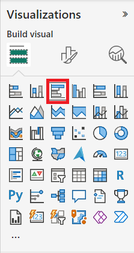
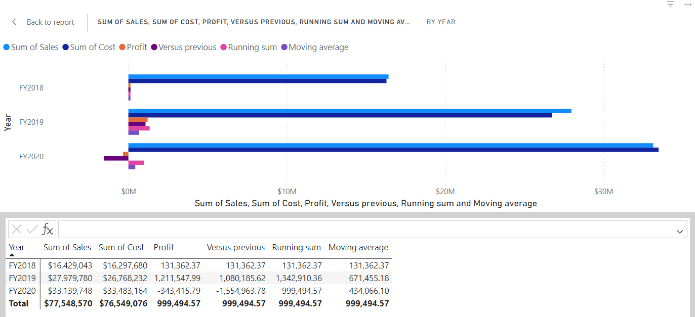
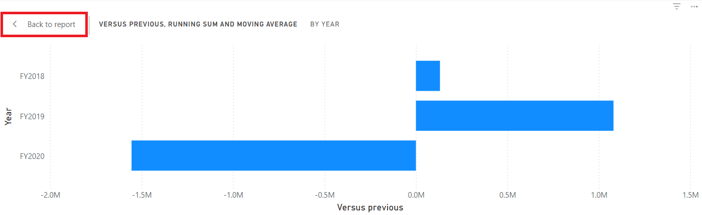
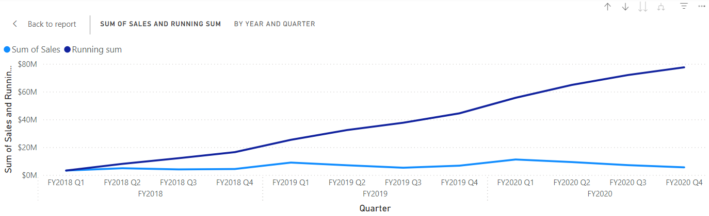

---
lab:
  title: "Creación de cálculos visuales en Power\_BI\_Desktop"
  module: Create Visual Calculations in Power BI Desktop
---

# Creación de cálculos visuales en Power BI Desktop

## **Caso de laboratorio**

En este laboratorio, crearás cálculos visuales con Data Analysis Expressions (DAX). 

En este laboratorio, aprenderá a:

- Crear y editar cálculos visuales
- Usar las funciones PREVIOUS(), RUNNINGSUM() y MOVINGAVERAGE() para crear métricas de comparación entre años fiscales
- Usar el parámetro Eje opcional al crear métricas de comparación.
- Usar el parámetro Restablecer opcional para personalizar los cálculos acumulativos en un eje de varios niveles.

**Este laboratorio debe durar unos 30 minutos**.

## Introducción

Para completar este ejercicio, abre primero un explorador web e introduce la siguiente URL para descargar la carpeta zip:

`https://github.com/MicrosoftLearning/PL-300-Microsoft-Power-BI-Data-Analyst/raw/Main/Allfiles/Labs/05b-create-visual-calculations-in-power-bi-desktop/05b-visual-calculations.zip`

Extráela a la carpeta **C:\Users\Student\Downloads\05b-visual-calculations**.

Abre el archivo **05b-Starter-Sales Analysis.pbix**.

> ***Nota**: Puedes ignorar el inicio de sesión al seleccionar **Cancelar**. Cierra todas las ventanas informativas que se abran. Si se te pide que apliques los cambios, selecciona **Aplicar más tarde**.*

## Creación de un objeto visual de gráfico de barras

En esta tarea, crearás un gráfico de barras que muestra el importe de ventas, el coste total del producto y las ganancias por año fiscal, con métricas de comparación como información sobre herramientas.

1. En el panel **Visualizaciones**, selecciona el tipo de objeto visual Gráfico de barras agrupadas.

   

1. En el panel **Datos**, desde la tabla **Fecha**, arrastra el campo **Año** hasta el apartado o área **Eje Y**.

1. Arrastra los campos **Ventas** y **Coste** desde la tabla **Ventas** hasta el apartado o área **Eje X**.

    > Fíjate en que, al agregar Ventas y Coste al objeto visual, la suma de cada campo se calculó automáticamente.

1. Ordena el gráfico de barras resultante por **Año** ascendente mediante el menú de tres puntos al seleccionar **Año** y**Orden ascendente**:

   

    > Ahora tienes un gráfico de barras que muestra la suma de ventas y la suma de costes por año ordenada cronológicamente.

### Adición de cálculos

1. Con el gráfico de barras seleccionado, selecciona **Nuevo cálculo visual** en la cinta de opciones:

   

1. Se abre la ventana de edición de cálculos visuales. En la barra de fórmulas situada encima de la matriz de objetos visuales, introduce la expresión siguiente y pulsa Intro para confirmar el cálculo:

    ```DAX
   Profit = [Sum of Sales] – [Sum of Cost]
    ```

1. Confirma que ahora ves una columna de Ganancias en la matriz, en la parte inferior de la pantalla:

   

1. Expande el menú en **Nuevo cálculo visual** y selecciona **Frente a anterior** en las opciones de plantilla:

    > **Frente a anterior** compara un valor con otro anterior, por lo que vemos las ganancias en comparación con el valor anterior de Año.

   

1. En la barra de fórmulas, reemplaza el marcador de posición `[Field]` con `[Profit]` dos veces y confirma el cálculo.

1. Selecciona **Suma acumulada** en el menú de plantillas, reemplaza el marcador de posición `[Field]` por `[Profit]` y confirma el cálculo.

    > **Suma acumulada** calcula la suma de valores, agregando el valor actual a los valores anteriores, por lo que vemos el total del año actual y los anteriores.

1. Selecciona **Media móvil** en el menú de plantillas y reemplaza el marcador de posición `[Field]` por `[Profit]` y el marcador de posición `WindowSize` por 2. Ahora deberías tener la siguiente configuración:

    > **Media móvil** calcula un promedio de un conjunto de valores en una ventana determinada mediante la división de la suma de los valores por el tamaño de la ventana. Al ajustar el tamaño de la ventana en 2, se calcula la media de dos valores consecutivos. En este ejemplo, los valores son beneficios anuales, por lo que vemos que la media móvil para FY2019 es la media de las ganancias de FY2018 y FY2019.

   

1. En el apartado o área **Eje X**, selecciona el icono de visibilidad de los campos siguientes para ocultarlos del objeto visual:

    - Suma de ventas
    - Suma del costo
    - Profit

   

    > Observa cómo los campos y cálculos que ocultaste ya no se muestran en el objeto visual.

1. En el panel **Visualizaciones**, arrastra **Suma acumulada** y **Media móvil** hasta el apartado o área **Información sobre herramientas**.  

1. Confirma que el objeto visual cumple ahora los objetivos. Sal de la pantalla de edición de cálculos visuales al informe:

   

    > Ahora tienes un gráfico de barras con los valores siguientes: Suma de ventas, Suma de costes, Ganancias y *Ganancias frente a anterior* con información sobre herramientas de *Suma en ejecución de ganancias* y *Media móvil de ganancias*.

## Creación de un objeto visual de matriz

En esta tarea, crearás un objeto visual de matriz que compara el importe de ventas por categoría con el primer año fiscal correspondiente a cada uno de los años siguientes.

1. En la vista **Informe**, crea una nueva página de informe.

1. En la **Página 2**, agrega un objeto visual de matriz.

1. Agregue los campos siguientes a los apartados o áreas del objeto visual:

    - Filas: **Producto \| Categoría**
    - Columnas: **Fecha \| Año**
    - Valores: **Ventas \| Ventas**

    > *Los laboratorios usan una notación abreviada para hacer referencia a un campo. Tendrá este aspecto: **Fecha \| Año**. En este ejemplo, **Fecha** es el nombre de la tabla y **Año** es el nombre del campo.*

### Adición de cálculos

1. Con la matriz seleccionada, selecciona **Nuevo cálculo visual** en la cinta de opciones.

1. En la ventana de edición de cálculos visuales, escribe y guarda el siguiente cálculo:

    ```DAX
   Versus first = [Sum of Sales] - FIRST([Sum of Sales])
    ```

    > Observa cómo la matriz muestra la diferencia en el importe de ventas de cada categoría frente a la primera categoría.

1. Selecciona el campo **Frente a primero** en el apartado o área **Valores** y actualiza el cálculo agregando el valor ROWS del parámetro Eje a FIRST:

    ```DAX
   Versus first = [Sum of Sales] - FIRST([Sum of Sales], ROWS)
    ```

    > Observa cómo nada cambia, ya que FILAS es el valor predeterminado para el parámetro Eje.

1. Reemplaza ROWS por COLUMNS y observa que el cálculo ahora compara el importe de ventas por categoría con el primer año fiscal:

   

    > Observa cómo la columna **Frente a primero** de **Ventas totales** devuelve cero en lugar de la diferencia con el primer año fiscal. **Total de ventas** se encuentra en un nivel jerárquico diferente al de las sumas anuales y, por lo tanto, se considera la primera columna en ese nivel.

1. Sal de la pantalla de edición de cálculos visuales al informe.

## Creación de un objeto visual de gráfico de líneas

En esta tarea, crearás un gráfico de líneas que muestra la suma acumulada de las ventas. La suma se restablecerá al principio de cada año fiscal.

1. En la vista **Informe**, crea una nueva página de informe.

1. En la **Página 3**, agrega un objeto visual de gráfico de líneas.

1. Agregue los campos siguientes a los apartados o áreas del objeto visual:

    - Eje X: **Fecha \| Año** y **Fecha \| Trimestre**
    - Eje Y: **Ventas \| Ventas**

### Adición de suma acumulada

1. Con el gráfico de líneas seleccionado, expande el menú en **Nuevo cálculo visual** y selecciona **Suma acumulada** en las opciones de plantilla.

1. Reemplaza el marcador de posición `[Field]` por `[Sum of Sales]` y confirma el cambio. El objeto visual debe tener el aspecto siguiente:

   

### Actualización de la suma acumulada para que se reinicie cada año fiscal nuevo

1. Mientras sigues en la ventana de edición de cálculos visuales, selecciona el campo **Suma acumulada** en **Eje Y**, actualiza la expresión para este cálculo agregando el parámetro de restablecimiento HIGHESTPARENT y confirma los cambios:

    ```DAX
   Running sum = RUNNINGSUM([Sum of Sales], HIGHESTPARENT)
    ```

Comprueba que la suma acumulada se reinicia cada año fiscal nuevo:

   

## Laboratorio completado
