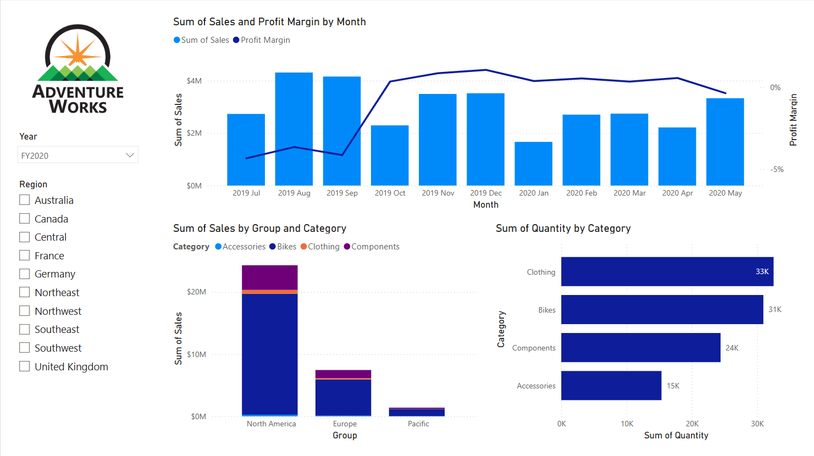
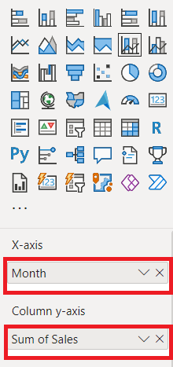
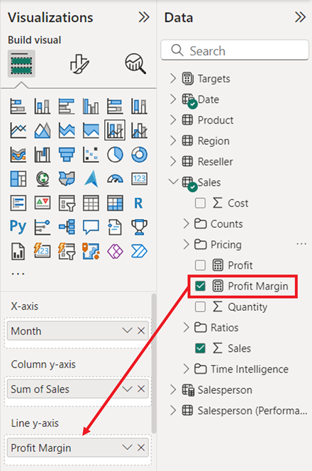
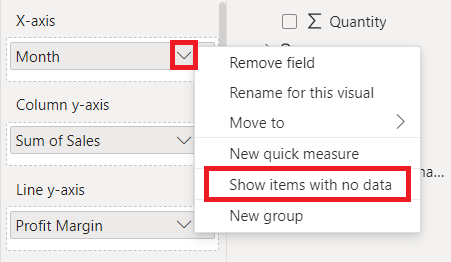
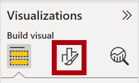
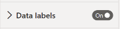
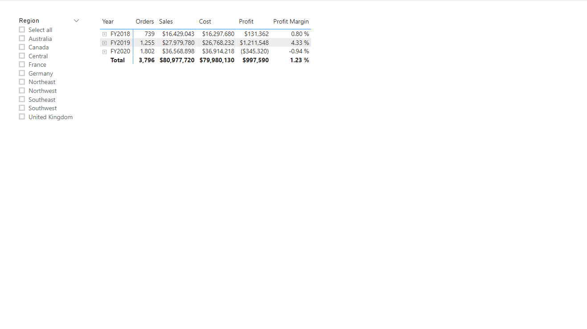
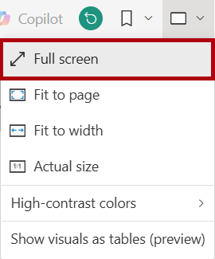

---
lab:
  course: 'PL-300, DP-605'
  title: "Diseño de un informe en Power\_BI Desktop"
  module: Create Reports in Power BI Desktop
---

# Diseño de un informe en Power BI Desktop

## **Caso de laboratorio**

En este laboratorio, creará un informe de tres páginas. Luego, lo publicará en Power BI, desde donde lo podrá abrir e interactuar con él.

En este laboratorio, aprenderá a:

- Diseñar un informe
- Configurar campos visuales y aplicar formato a propiedades

**Este laboratorio debe durar unos 45 minutos**.

## **Creación de un informe**

En esta tarea configurará el entorno para el laboratorio abriendo el informe de inicio.

1. En Power BI Desktop, vaya a **Archivo** > **Abrir informe** > **Examinar informes**.

1. Abra el archivo **Sales Analysis** de la carpeta **D:\Allfiles\Labs\06-design-report-in-power-bi-desktop\Starter**.

1. Cree una copia del archivo. Para ello, vaya a **Archivo** > **Guardar como** y guarde la copia en la carpeta **D:\Allfiles0\MySolution**.

## **Diseño de la página 1**

En esta tarea diseñará la primera página del informe. Cuando haya completado el diseño, la página tendrá un aspecto similar al siguiente:

1. Para cambiar el nombre de la página en Power BI Desktop, en la parte inferior izquierda, haga clic con el botón derecho en **Página 1**, elija **Cambiar nombre de página** y dele el nombre **Información general**.

    *Sugerencia: También puede hacer doble clic en el nombre de la página para cambiarle el nombre.*

1. Para agregar una imagen, en la ficha de cinta **Insertar**, en el grupo **Elementos**, seleccione **Imagen**.

    

1. En la ventana **Abrir**, vaya a la carpeta **D:\Allfiles\Resources**.

1. Seleccione el archivo **AdventureWorksLogo.jpg** y **Abrir**.

1. Arrastre la imagen para colocarla en la esquina superior izquierda y también los marcadores de guía para cambiar su tamaño.

     

1. Para agregar una segmentación, primero anule la selección de la imagen haciendo clic en un área vacía de la página del informe. A continuación, elija **Segmentación** en el panel **Visualizaciones**.

     

1. En el panel **Datos**, arrastre el campo **Fecha \| Año** (no el nivel **Año** de la jerarquía) a la segmentación **Campo** en el panel Visualizaciones.
    
    *Los laboratorios usan una notación abreviada para hacer referencia a un campo. Tendrá este aspecto: **Fecha \| Año**. En este ejemplo, **Fecha** es el nombre de la tabla y **Año** es el nombre del campo.*

1. Para convertir la segmentación de lista en una lista desplegable, vaya a **Visualizaciones > Objeto visual > Visual > Configuración de segmentación > Estilo** y elija **Lista desplegable** en el menú desplegable.

    

1. Cambie el tamaño y coloque la segmentación para que quede debajo de la imagen y pueda asegurarse de que tenga el mismo ancho que la imagen.

     

1. En la segmentación **Año**, abra la lista desplegable, seleccione **FY2020** y, después, contraiga la lista desplegable.
    1. *La página del informe ahora se filtra por el año **FY2020**.*

     

1. Anule la selección de la segmentación haciendo clic en un área vacía de la página del informe.

1. Cree una segunda segmentación basada en el campo **Región \| Región** (no en el nivel **Región** de la jerarquía).

1. Deje la segmentación en forma de lista y, después, cambie el tamaño de la segmentación y colóquela debajo de la segmentación **Año**.

     

1. Anule la selección de la segmentación haciendo clic en un área vacía de la página del informe.

1. Para agregar un gráfico a la página, en el panel **Visualizaciones**, seleccione el tipo de objeto visual **Gráfico de columnas apiladas y de líneas**.

     

1. Cambie el tamaño y coloque el objeto visual para situarlo a la derecha del logotipo y que ocupe el resto del ancho de la página del informe.

     

1. Arrastre y coloque los siguientes campos al objeto visual:

     - Fecha \| Mes
     - Ventas \| Ventas

1. En el panel de campos del objeto visual (situado debajo del panel **Visualizaciones**), fíjese en que los campos están asignados a los apartados o áreas **Eje X** y **Eje Y de columna**.
    
    *Si arrastra campos a un objeto visual, se agregarán a los apartados o áreas predeterminados. Para mayor precisión, puede arrastrar campos directamente a los apartados o áreas, como hará a continuación.*

     

1. En el panel **Datos**, arrastre el campo **Ventas \| Margen de beneficio** al apartado o área **Eje Y de línea**.

     

1. Tenga en cuenta que el objeto visual solo tiene 11 meses.
    
    *El último mes del año actual, junio de 2020, no tiene ninguna venta (todavía). De forma predeterminada, el objeto visual ha eliminado los meses con ventas en blanco. Ahora configurará el objeto visual para que muestre todos los meses.*

1. En el panel de campos del objeto visual, en el apartado o área **Eje X**, seleccione la flecha abajo del campo **Month** y elija **Mostrar elementos sin datos**.
    
    *Observe que ahora aparece el mes **Junio de 2020**.*

     

1. Anule la selección del gráfico haciendo clic en un área vacía de la página del informe.

1. Para agregar un gráfico a la página, en el panel **Visualizaciones**, seleccione el tipo de objeto visual **Gráfico de barras apiladas**.

     

1. Cambie el tamaño y coloque el objeto visual para situarlo debajo del gráfico de columnas o líneas, y que ocupe la mitad del ancho del gráfico anterior.

     

1. Agregue los campos siguientes a los apartados o áreas del objeto visual:

     - Eje X: **Region \| Country**
     - Eje Y: **Ventas \| Ventas**
     - Leyenda: **Producto \| Categoría**

1. Anule la selección del gráfico haciendo clic en un área vacía de la página del informe.

1. Para agregar un gráfico a la página, en el panel **Visualizaciones**, haga clic en el tipo de objeto visual **Gráfico de barras apiladas**.

     

1. Cambie el tamaño y coloque el objeto visual para que rellene el espacio restante de la página del informe.

     

1. Agregue los campos siguientes a los apartados o áreas del objeto visual:

     - Eje Y: **Product \| Category**
     - Eje X: **Sales \| Quantity**

1. Para dar formato al objeto visual, abra el panel **Formato**.

     

1. Expanda las **Barras** y el grupo **Colores**, y luego establezca la propiedad **Color predeterminado** en un color adecuado (para complementar el gráfico de columnas o líneas).

1. Establezca la propiedad **Etiquetas de datos** como **activada**.

     

1. Guarde el archivo de Power BI Desktop.

*Ahora se ha completado el diseño de la primera página.*

## **Diseño de la página 2**

En esta tarea diseñará la segunda página del informe. Cuando haya completado el diseño, la página tendrá un aspecto similar al siguiente:

 

*Importante: Cuando ya se hayan proporcionado instrucciones detalladas en los laboratorios, los pasos proporcionarán instrucciones más concisas. Si necesita las instrucciones detalladas, puede volver a consultar las otras tareas de este laboratorio.*

1. Para crear una nueva página, en la parte inferior izquierda, seleccione el icono de signo más y cambie el nombre de la página nueva a **Beneficio**.

1. Agregue una segmentación basada en el campo **Región \| Región**.

1. Use el panel **Formato** para habilitar la opción "Seleccionar todo" (en el grupo **Selección**).

1. Cambie el tamaño y coloque la segmentación para situarla en el lado izquierdo de la página del informe y que tenga aproximadamente la mitad de la altura de la página.

     

1. Agregue un objeto visual de matriz, cambie su tamaño y colóquelo de modo que ocupe el espacio restante de la página del informe.

     

1. Agregue la jerarquía **Fecha \| Fiscal** a la matriz del apartado o área **Filas**.

     

1. Agregue los siguientes cinco campos de la tabla **Ventas** al apartado o área **Valores**:

     - Pedidos (de la carpeta **Recuentos**)
     - Ventas
     - Costos
     - Beneficios
     - Margen de beneficio

     

1. En el panel **Filtros**, situado a la izquierda del panel **Visualizaciones**, fíjese en el apartado o área **Filtros de esta página** (puede que tenga que desplazarse hacia abajo).

     

1. En el panel **Datos**, arrastre el campo **Producto \| Categoría** al apartado **Filtros de esta página**.
    
    *Los campos agregados al panel **Filtros** pueden lograr el mismo resultado que una segmentación. Una diferencia es que no ocupan espacio en la página del informe. Otra diferencia es que se pueden configurar para alcanzar requisitos de filtrado más avanzados.*

1. Dentro de la tarjeta de filtro, en la parte superior derecha, seleccione la flecha para contraer la tarjeta.

1. Agregue cada uno de los siguientes campos de la tabla **Producto** al apartado o área **Filtros de esta página** directamente debajo de la tarjeta **Categoría** y contráigalos:

     - Subcategoría
     - Producto
     - Color

     

1. Guarde el archivo de Power BI Desktop.

 *Ahora se ha completado el diseño de la segunda página.*

## **Página de diseño 3**

En esta tarea diseñará la tercera y última página del informe. Cuando haya completado el diseño, la página tendrá un aspecto similar al siguiente:

 

1. Cree una página y cámbiele el nombre a **Mi rendimiento**.

1. Para simular el rendimiento de los filtros de seguridad de nivel de fila, arrastre el campo **Vendedor (rendimiento) \| Vendedor** a los filtros de nivel de página del panel de filtros.

     

1. Seleccione **Michael Blythe**. Los datos de la página del informe **Mi rendimiento** ahora se filtrarán para mostrar solo los datos de Michael Blythe.

1. Agregue una segmentación desplegable basada en el campo **Fecha \| Año** y luego cambie el tamaño y colóquela para que se sitúe en la esquina superior izquierda de la página.

     

1. En la segmentación, establezca la página para filtrar por **FY2019**.

     

1. Agregue un objeto visual **Tarjeta de varias filas**, cambie el tamaño y la posición para que se sitúe a la derecha de la segmentación y rellene el ancho restante de la página.

     

     

1. Agregue los cuatro campos siguientes al objeto visual:

     - Ventas \| Ventas
     - Destinos \| Destino
     - Destinos \| Varianza
     - Destinos \| Margen de varianza

1. Aplique formato al objeto visual:

     - En el grupo **Valores de llamada**, aumente la propiedad **Tamaño del texto** a **28 puntos**.

     - En el grupo **General > Efectos > Fondo**, establezca el **Color** en un color gris claro (como "Blanco, 20 % más oscuro) para dar contraste.

         

1. Agregue un objeto visual **Gráfico de barras agrupadas** y, después, cambie su tamaño y colóquelo de modo que se encuentre debajo del objeto visual de la tarjeta de varias filas. Luego, rellene la altura restante de la página, así como la mitad de la anchura del objeto visual de la tarjeta de varias filas.

     

     

1. Agregue los campos siguientes a los apartados o áreas del objeto visual:

     - Eje Y: **Date \| Month**
     - Eje X: **Sales \| Sales** y **Targets \| Target**

         

1. Para crear una copia del objeto visual, presione **Ctrl+C** y, a continuación, **Ctrl+V**.

1. Coloque el objeto visual nuevo a la derecha del original.

     

1. Para modificar el tipo de visualización, en el panel **Visualizaciones**, seleccione **Gráfico de columnas agrupadas**.

     

 *Ahora es posible ver los mismos datos expresados con dos tipos de visualización diferentes. No obstante, este no es un buen uso del diseño de página. Lo mejorará en el laboratorio **Mejora de un informe en Power BI Desktop** superponiendo objetos visuales. Al agregar botones a la página, permitirá que el usuario del informe determine cuál de los dos objetos visuales estará visible.*

 *Ahora se ha completado el diseño de la tercera y última página.*

## **Publicación del informe**

En esta tarea publicará el informe en el servicio Power BI.

1. Seleccione la página **Información general** y guarde el archivo de Power BI Desktop.

1. En la pestaña de la cinta **Inicio**, en el grupo **Compartir**, seleccione **Publicar**.
    
    *Si aún no ha iniciado sesión en Power BI Desktop, deberá iniciar sesión para publicar el informe.*

     

1. En la ventana **Publicar en Power BI**, observe que **Mi área de trabajo** esté seleccionado.
    
    *En este laboratorio no profundizaremos en los distintos elementos del servicio Power BI.*

1. Para publicar el informe, elija **Seleccionar**. Esta operación puede tardar unos minutos. 
1. Cuando la publicación se haya realizado correctamente, seleccione **Entendido**.

## **Exploración del informe**

En esta tarea explorará el informe que se publicó en Power BI.

1. Abra el explorador Microsoft Edge e inicie sesión en **https://app.powerbi.com** .

1. En la ventana del explorador Microsoft Edge, en el panel **Navegación** del servicio Power BI (situado a la izquierda, podría estar contraído), expanda **Mi área de trabajo**.

    

1. Revise el contenido del área de trabajo. Observa las opciones de navegación de Todo, Contenido y Modelos semánticos más los flujos de datos.
    1. *En un área de trabajo pueden existir cuatro tipos de elementos. Hablaremos de los **informes** y los **modelos semánticos**.*
    1. *Puede que tengas que actualizar el navegador Microsoft Edge si el modelo semántico no es visible.*
    1. *Al publicar el archivo de Power BI Desktop, el modelo de datos se publicó como modelo semántico.*

1. Para abrir el informe, seleccione el informe **Sales Analysis**.

1. A la izquierda, en el panel **Páginas**, seleccione la página **Información general**.

1. En la segmentación **Regiones**, mientras presiona la tecla **Ctrl**, seleccione varias regiones.

1. En el gráfico de columnas o líneas, seleccione cualquier columna de mes para aplicar un filtro cruzado a la página.

1. Con la tecla **Ctrl** presionada, seleccione otro mes.

     *Nota: De forma predeterminada, el filtro cruzado filtra el resto de objetos visuales de la página.*

1. Observe que el gráfico de barras está filtrado y resaltado, con la parte en negrita de las barras que representan los meses filtrados.

1. Mantenga el cursor sobre el objeto visual del gráfico de barras y, después, en la parte superior derecha, mantenga el cursor sobre el icono de filtro. 
    
    *El icono de filtro le permite comprender todos los filtros que se aplican al objeto visual, incluidas las segmentaciones y los filtros cruzados de otros objetos visuales.*

1. Mantenga el cursor sobre una barra y observe la información sobre herramientas que aparece.

1. Para deshacer el filtro cruzado, en el gráfico de columnas o líneas, seleccione un área vacía del objeto visual.

1. Mantenga el cursor sobre el objeto visual de gráfico de columnas apiladas y, en la parte superior derecha, seleccione el icono **Modo de enfoque**.
    
    *El modo de enfoque amplía el objeto visual hasta que ocupa toda la página.*

     

1. Mantenga el cursor sobre distintos segmentos de los gráficos de barras para mostrar la información sobre herramientas.

1. Para volver a la página del informe, en la parte superior izquierda, seleccione **Volver al informe**.

     

1. Mantenga de nuevo el cursor sobre uno de los objetos visuales y, en la parte superior derecha, seleccione los puntos suspensivos (...) y observe las opciones del menú. Pruebe todas las opciones, excepto **Chatear en Teams**.

     

1. A la izquierda, en el panel **Páginas**, seleccione la página **Beneficio**.

     

1. Tenga en cuenta que la segmentación **Región** tiene una selección diferente de la segmentación **Región** en la página **Información general**.
    
    *Las segmentaciones no están sincronizadas. Modificará el diseño del informe para asegurarse de que las páginas se sincronizan en el laboratorio **Mejora de un informe en Power BI Desktop**.*

1. En el panel **Filtros**, que se encuentra a la derecha, expanda una tarjeta de filtro y aplique algunos de ellos.
    
    *El panel **Filtros** permite definir más filtros de los que podrían caber en una página a modo de segmentaciones.*

1. En el objeto visual de matriz, use el botón de signo más (+) para expandir la jerarquía **Fiscal**.

1. Seleccione la página **Mi rendimiento**.

     

1. En la parte superior derecha de la barra de menús, seleccione **Ver** y **Pantalla completa**.

     

1. Interactúe con la página modificando la segmentación y aplicando un filtro cruzado a la página.

1. En la parte inferior de la ventana, observe los comandos para cambiar de página, retroceder o avanzar por las páginas, o salir del modo de pantalla completa.

1. Seleccione el icono de la derecha para salir del modo de pantalla completa.

     

### **Finalización**

En esta tarea, completará el laboratorio.

Para volver a "Mi área de trabajo", seleccione **Mi área de trabajo** en el banner de la página web.

 *Mejorará el diseño del informe con características avanzadas en el laboratorio **Mejora de un informe en Power BI Desktop**.*
