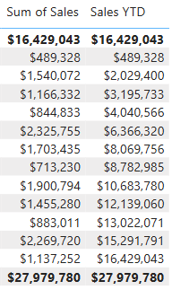
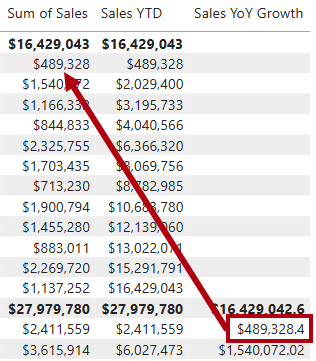
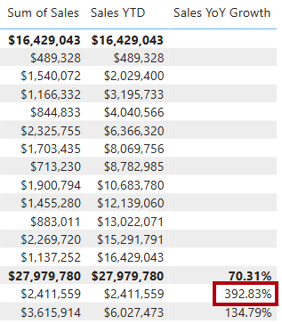
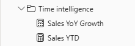

---
lab:
  title: "Uso de las funciones de inteligencia de tiempo de DAX en Power\_BI"
  module: Use DAX time intelligence functions in Power BI
---

# Uso de las funciones de inteligencia de tiempo de DAX en Power BI

## Caso de laboratorio

En este laboratorio, creará medidas con expresiones DAX que implican inteligencia de tiempo.

En este laboratorio, aprenderá a:

 - Usar varias funciones de inteligencia de tiempo para manipular el contexto de filtro que se refiere a fechas específicas.

**Este laboratorio debe durar unos 15 minutos**.

## Introducción

Para completar este ejercicio, abra primero un explorador web y escriba la siguiente URL para descargar el archivo ZIP:

`https://github.com/MicrosoftLearning/PL-300-Microsoft-Power-BI-Data-Analyst/raw/Main/Allfiles/Labs/06-use-dax-time-intelligence/06-time-intelligence.zip`

Extraiga el archivo en la carpeta**C:\Users\Student\Downloads\06-time-intelligence**.

Abre el archivo**06-Starter-Sales Analysis.pbix**.

> _**Nota**: Es posible que vea un cuadro de diálogo de inicio de sesión a medida que se carga el archivo. Seleccione**Cancelar** para descartar el cuadro de diálogo de inicio de sesión. Cierre todas las ventanas informativas que se abran. Si se le pide aplicar los cambios, seleccione**Aplicar más tarde**._

## Creación de una medida del año hasta la fecha

En esta tarea, crearás una medida de ventas de año hasta la fecha mediante funciones de inteligencia de tiempo.

1. En Power BI Desktop, en la**vista Informe**, en**Página 2**, observe que el objeto visual de matriz muestra varias medidas con los años y meses agrupados en las filas.

2. Agregue una medida a la tabla`Sales`, en función de la siguiente expresión, y con un formato de cero posiciones decimales:

    ```dax
    Sales YTD =
    TOTALYTD(
        SUM(Sales[Sales]),
        'Date'[Date],
        "6-30"
    )
    ```

    > _La función`TOTALYTD` evalúa una expresión, en este caso la suma de la columna`Sales`, en una columna de fecha determinada. La columna de fecha debe pertenecer a una tabla de fechas marcada como tabla de fechas._
    >
    > _La función también puede tomar un tercer argumento opcional que represente la última fecha de un año. La ausencia de esta fecha significa que el 31 de diciembre es la última fecha del año. En el caso de Adventure Works, junio es el último mes del año, y por eso se usa "6-30"._

3. Agregue el campo`Sales` y la medida`Sales YTD` al objeto visual de matriz.

4. Observe la acumulación de valores de ventas dentro del año.

    

> _La función`TOTALYTD` realiza la manipulación de filtros, específicamente la manipulación de filtros de hora. Por ejemplo, para calcular las ventas del año hasta la fecha para septiembre de 2017 (el tercer mes del año fiscal), se quitan todos los filtros de la tabla`Date` y se reemplazan por un nuevo filtro de fechas que comienzan al principio del año (1 de julio de 2017) y se extienden hasta la última fecha del período de fecha en contexto (30 de septiembre de 2017)._
>
> _Hay muchas[funciones de inteligencia de tiempo](/dax/time-intelligence-functions-dax/?azure-portal=true) disponibles en DAX para admitir las manipulaciones de filtro de hora comunes._

## Creación de una medida de crecimiento de ventas de año a año

En esta tarea, crearás una medida del aumento interanual de las ventas mediante una variable.

> Las variables le ayudan a simplificar la fórmula y son más eficaces si se usa la lógica varias veces dentro de una fórmula. Las variables se declaran mediante un nombre único, y la expresión de medida se debe mostrar después de la palabra clave`RETURN`. A diferencia de otras variables de lenguaje de programación, las variables DAX solo se pueden usar en la fórmula única._

1. Agregue una medida a la tabla`Sales` en función de la siguiente expresión:

    ```dax
    Sales YoY Growth =
    VAR SalesPriorYear =
        CALCULATE(
            SUM(Sales[Sales]),
            PARALLELPERIOD(
                'Date'[Date],
                -12,
                MONTH
            )
        )
    RETURN
        SalesPriorYear
    ```

    > _A la variable`SalesPriorYear` se le asigna una expresión que calcula la suma de la columna`Sales` en un contexto modificado. Ese contexto usa la función`PARALLELPERIOD` para cambiar de nuevo 12 meses de cada fecha en el contexto de filtro._

1. Agregue la medida`Sales YoY Growth` al objeto visual de matriz.

1. Observe que la nueva medida devuelve`BLANK` para los 12 primeros meses (ya que no se han registrado ventas antes del año fiscal 2017).

1. Observe que el valor de la medida`Sales YoY Growth` para_2018 Jul_ es el valor de ventas para_2017 Jul_.

    

    > _Ahora que se ha probado la "parte difícil" de la fórmula, puede sobrescribir la medida con la fórmula final que calcula el resultado del aumento._

1. Para completar la medida, sobrescriba la medida`Sales YoY Growth` con esta fórmula, con formato de porcentaje con dos decimales:

    ```dax
    Sales YoY Growth =
    VAR SalesPriorYear =
        CALCULATE(
            SUM(Sales[Sales]),
            PARALLELPERIOD(
                'Date'[Date],
                -12,
                MONTH
            )
        )
    RETURN
        DIVIDE(
            (SUM(Sales[Sales]) - SalesPriorYear),
            SalesPriorYear
        )
    ```

1. En la fórmula, en la cláusula`RETURN`, observe que se hace referencia dos veces a la variable.

1. Compruebe que el crecimiento de año a año para_2018 Jul_ es del 392,83 %.

    

    > _La medida de crecimiento interanual identifica casi el 400 % (o 4 veces) el aumento de las ventas durante el mismo período del año anterior._

1. En la**vista Modelo**, coloque las dos nuevas medidas en una carpeta para mostrar denominada_Time Intelligence_.

    

1. Guarde el archivo de Power BI Desktop.

## Laboratorio completado

Puede optar por guardar el informe de Power BI, aunque no es necesario para este laboratorio. En el ejercicio siguiente, trabajará con un archivo de inicio creado previamente.

1. Vaya al menú **"Archivo"** en la esquina superior izquierda y seleccione **"Guardar como"**. 
1. Seleccione**Examinar este dispositivo**.
1. Seleccione la carpeta donde desea guardar el archivo y asígnele un nombre descriptivo. 
1. Seleccione el botón**Guardar** para guardar el informe como un archivo .pbix. 
1. Si aparece un cuadro de diálogo en el que se le pide que aplique los cambios pendientes en la consulta, seleccione**Aplicar**.
1. Cierre Power BI Desktop.