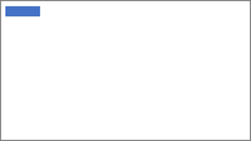

---
lab:
  title: "Diseño de informes de Power\_BI"
  module: Design Power BI reports
---

# Diseño de informes de Power BI

## Caso de laboratorio

En este laboratorio, creará un informe de tres páginas. A continuación, lo publicará en el servicio Power BI, donde abrirá el informe e interactuará con él.

En este laboratorio, aprenderá a:

- Diseñar un informe
- Configurar campos visuales y aplicar formato a propiedades
- Sincronizar segmentaciones
- Publique el informe en el servicio Power BI.
- Interactuar con un informe y sus objetos visuales.

**Este laboratorio debe durar unos 45 minutos**.

## Introducción

Para completar este ejercicio, abra primero un explorador web y escriba la siguiente URL para descargar un archivo ZIP:

`https://github.com/MicrosoftLearning/PL-300-Microsoft-Power-BI-Data-Analyst/raw/Main/Allfiles/Labs/08-design-power-bi-reports/08-design-report.zip`

Extraiga el archivo a la carpeta **C:\sers\student\Downloads\08-design-report**.

Abre el archivo **08-Starter-Sales Analysis.pbix**.

> _**Nota**: Puede ignorar el inicio de sesión si selecciona **Cancelar**. Cierre todas las ventanas informativas que se abran. Si se le pide aplicar los cambios, seleccione **Aplicar más tarde**._

## Diseño de la página 1

En este ejercicio, diseñarás la primera página del informe. Cuando haya completado el diseño, la página tendrá un aspecto similar al siguiente:

1. Para cambiar el nombre de la página en Power BI Desktop, en la parte inferior izquierda, haga clic con el botón derecho en **Página 1**, luego seleccione **Cambiar nombre**. Cambie el nombre de la página como _Información general_.

    > _Sugerencia: También puede hacer doble clic en el nombre de la página para cambiarle el nombre._

1. Para agregar una imagen, en la ficha de cinta **Insertar**, en el grupo **Elementos**, seleccione **Imagen**.

    

1. En la ventana **Abrir**, vaya a la carpeta **C:\sers\Student\Downloads\08-design-report**.

1. Seleccione el archivo **AdventureWorksLogo.jpg** y **Abrir**.

1. Arrastre la imagen para colocarla en la esquina superior izquierda y también los marcadores de guía para cambiar su tamaño.

    

1. Para agregar una segmentación, primero anule la selección de la imagen seleccionando un área vacía de la página del informe. A continuación, elija **Segmentación** en el panel **Visualizaciones**.

    

1. En el panel **Datos**, arrastre el campo `Date | Year` (no el nivel `Year` de la jerarquía) al apartado **Campo** del panel **Visualizaciones**.

    > _Los laboratorios usan una notación abreviada para hacer referencia a un campo. Tendrá este aspecto: `Date | Year`. En este ejemplo, `Date` es el nombre de la tabla y `Year` es el nombre del campo._

1. Para convertir la segmentación de una lista en una lista desplegable, en el panel **Visualizaciones**, seleccione **Dar formato al objeto visual**. Expanda **Configuración de la segmentación** y, a continuación, establezca el **Estilo** desplegable en **Desplegable**.

    

1. Cambie el tamaño y coloque la segmentación para que quede debajo de la imagen y pueda asegurarse de que tenga el mismo ancho que la imagen.

    

1. En la segmentación **Año**, abra la lista desplegable, seleccione **FY2020** y, después, contraiga la lista desplegable.

    > _La página del informe ahora se filtra por el año **FY2020**._

    

1. Anule la selección de la segmentación haciendo clic en un área vacía de la página del informe.

1. Cree una segunda segmentación, basado en el campo `Region | Region` (no en el nivel `Region` de la jerarquía).

1. Deje la segmentación en forma de lista y, después, cambie el tamaño de la segmentación y colóquela debajo de la segmentación **Año**.

    

1. Anule la selección de la segmentación haciendo clic en un área vacía de la página del informe.

1. Para agregar un gráfico a la página, en el panel **Visualizaciones**, seleccione el tipo de objeto visual **Gráfico de columnas apiladas y de líneas**.

    

1. Cambie el tamaño y coloque el objeto visual para situarlo a la derecha del logotipo y que ocupe el resto del ancho de la página del informe.

    

1. Arrastre y coloque los siguientes campos al objeto visual:

     - `Date | Month`
     - `Sales | Sales`

1. En el panel de campos de objeto visual (situado en el panel **Visualizaciones**), observe que los campos están asignados a los apartados **Eje X** y **Eje Y de columna**.

    > _Al arrastrar campos a un objeto visual, se añaden a los apartados predeterminados. Para mayor precisión, puede arrastrar campos directamente a los apartados, como hará a continuación._

    

1. Desde el panel **Datos**, arrastre el campo `Sales | Profit Margin` al apartado **Eje Y de línea**.

    

1. Ten en cuenta que el objeto visual solo tiene 11 meses.

    > _El último mes del año actual, junio de 2020, no tiene ninguna venta (todavía). De forma predeterminada, el objeto visual ha eliminado los meses con ventas en `BLANK`. Ahora configurará el objeto visual para que muestre todos los meses._

1. En el panel de campos del objeto visual, en el apartado **Eje X**, seleccione la flecha abajo del campo **Month** y elija **Mostrar elementos sin datos**.

    

    > _Observe que ahora aparece el mes **Junio de 2020**._

1. Anule la selección del gráfico seleccionando un área vacía de la página del informe.

1. Para agregar un gráfico a la página, en el panel **Visualizaciones**, seleccione el tipo de objeto visual **Gráfico de barras apiladas**.

    

1. Cambie el tamaño y coloque el objeto visual para situarlo debajo del gráfico de columnas o líneas, y que ocupe la mitad del ancho del gráfico anterior.

    

1. Agregue los campos siguientes a los apartados del objeto visual:

     - Eje X: `Region | Group`
     - Eje Y: `Sales | Sales`
     - Leyenda: `Product | Category`

1. Anule la selección del gráfico seleccionando un área vacía de la página del informe.

1. Para agregar un gráfico a la página, en el panel **Visualizaciones**, seleccione el tipo de objeto visual **Gráfico de barras apiladas**.

    

1. Cambie el tamaño y coloque el objeto visual para que rellene el espacio restante de la página del informe.

    

1. Agregue los campos siguientes a los apartados del objeto visual:

     - Eje Y: `Product | Category`
     - Eje X: `Sales | Quantity`

1. Para dar formato al objeto visual, abra el panel **Formato**.

    

1. Expanda la sección **Barras** y, a continuación, en el grupo **Color**, establezca la propiedad **Color** en un color adecuado (para complementar el gráfico de columnas/líneas).

1. Establezca la sección **Etiquetas de datos** en **Activada**.

    

1. Guarde el archivo de Power BI Desktop.

    > _Ahora se ha completado el diseño de la primera página._

## Diseño de la página 2

En este ejercicio, diseñarás la segunda página del informe. Cuando haya completado el diseño, la página tendrá un aspecto similar al siguiente:

> _**Importante**: Cuando ya se hayan proporcionado instrucciones detalladas en los laboratorios, los pasos proporcionarán instrucciones más concisas. Si necesita las instrucciones detalladas, puede volver a consultar las otras tareas de este laboratorio._

1. Para crear una nueva página, en la parte inferior izquierda, seleccione el icono del signo más. Cuando se agrega la página, cámbiela por _Ganancia_.

1. Agregue una segmentación basada en el campo `Region | Region`.

1. Use el panel **Formato** para mostrar la opción _Seleccionar todo_ (situada en la sección **Configuración de la segmentación > Selección**).

1. Cambie el tamaño y coloque la segmentación para situarla en el lado izquierdo de la página del informe y que tenga aproximadamente la mitad de la altura de la página.

    

1. Agregue un objeto visual de matriz, cambie su tamaño y colóquelo de modo que ocupe el espacio restante de la página del informe.

    

1. Agregue la jerarquía `Date | Fiscal` a la matriz del apartado **Filas**.

    

1. Agregue los siguientes cinco campos de la tabla `Sales` al apartado **Valores**:

     - `Orders` (de la carpeta `Counts`)
     - `Sales`
     - `Cost`
     - `Profit` (de la carpeta `Pricing`)
     - `Profit Margin` (de la carpeta `Pricing`)

    

1. En el panel **Filtros** (situado a la izquierda del panel **Visualizaciones**), observe la sección **Filtros de esta página** (es posible que tenga que expandir el panel y desplazarse hacia abajo).

    

1. Desde el panel **Datos**, arrastre el campo `Product | Category` al apartado **Filtros de esta página**.

    > _Los campos agregados al panel **Filtros** pueden lograr el mismo resultado que una segmentación. Una diferencia es que no ocupan espacio en la página del informe. Otra diferencia es que se pueden configurar para alcanzar requisitos de filtrado más avanzados._

1. Dentro de la tarjeta de filtro, en la parte superior derecha, seleccione la flecha para contraer la tarjeta.

1. Agregue cada uno de los siguientes campos `Product` de tabla al apartado **Filtros de esta página**, colapsando cada uno, directamente debajo del campo `Category`:

     - `Subcategory`
     - `Product`
     - `Color`

    

1. Guarde el archivo de Power BI Desktop.

    > _Ahora se ha completado el diseño de la segunda página._

## Página de diseño 3

En este ejercicio, diseñarás la tercera y última página del informe. Cuando haya completado el diseño, la página tendrá un aspecto similar al siguiente:

1. Cree una nueva página y cámbiele el nombre como _Mi rendimiento_.

1. Para simular el rendimiento de los filtros de seguridad de nivel de fila, arrastre el campo `Salesperson (Performance) | Salesperson` a los filtros de nivel de página en el panel de filtros.

    

1. En la tarjeta de filtro, seleccione **Michael Blythe**.

    > _Los datos de la página del informe se filtrarán ahora para mostrar solo los datos de Michael Blythe._

1. Agregue una segmentación desplegable basada en el campo `Date | Year` y, a continuación, cambie su tamaño y posición para que se sitúe en la esquina superior izquierda de la página.

    

1. En la segmentación, establezca la página para filtrar por **FY2019**.

    

1. Agregue un objeto visual **Tarjeta de varias filas** a la página, cambie el tamaño y la posición para que se sitúe a la derecha de la segmentación y rellene el ancho restante de la página.

    

    

1. Agregue los cuatro campos siguientes al objeto visual:

     - `Sales | Sales`
     - `Targets | Target`
     - `Targets | Variance`
     - `Targets | Variance Margin`

1. Aplique formato al objeto visual:

     - En la sección **Valores de llamada**, aumente la propiedad de tamaño de fuente a **28pt**.
     - En la pestaña **General**, en la sección **Efectos**, establezca la propiedad color de fondo en un color gris claro (como _Blanco, 10% Oscuro_) para proporcionar contraste.

        

1. Agregue un objeto visual **Gráfico de barras agrupadas** a la página y, después, cambie su tamaño y colóquelo de modo que se encuentre debajo del objeto visual de la tarjeta de varias filas. Luego, rellene la altura restante de la página, así como la mitad de la anchura del objeto visual de la tarjeta de varias filas.

    

    

1. Agregue los campos siguientes a los apartados del objeto visual:

     - Eje Y: `Date | Month`
     - Eje X: `Sales | Sales` y `Targets | Target`

        

1. Para crear una copia del objeto visual, presione **Ctrl+C** y, a continuación, **Ctrl+V**.

1. Coloque el objeto visual nuevo a la derecha del original.

    

1. Para modificar el tipo de visualización, en el panel **Visualizaciones**, seleccione **Gráfico de columnas agrupadas**.

    

     > _Ahora es posible ver los mismos datos que se expresan mediante dos tipos de visualización diferentes. El diseño de la página final está completo._

## Sincronizar segmentaciones

En esta tarea, sincronizará las segmentaciones _Año_ y _Región_.

1. En la página _Información general_, establezca la segmentación _Año_ en **FY2018**.

1. Vaya a la página _Mi rendimiento_ y, después, observe que la segmentación _Año_ es otro valor.

    > _Cuando las segmentaciones no están sincronizadas, pueden contribuir a la representación errónea de los datos y a la frustración de los usuarios del informe. Ahora sincronizará las segmentaciones del informe._

1. Vuelva a la página _Información general_ y, después, seleccione la segmentación _Año_.

1. En la ficha de cinta **Ver**, desde el grupo **Mostrar paneles**, seleccione **Sincronizar segmentaciones**.

    

1. En el panel **Segmentaciones de sincronización** (a la izquierda del panel **Visualizaciones**), en la segunda columna (que representa la sincronización), active las casillas de las páginas _Información general_ y _Mi rendimiento_.

    

1. En la página _Información general_, seleccione la segmentación _Región_.

1. Sincronice la segmentación con las páginas _Información general_ y _Beneficios_.

    

1. Para probar las segmentaciones de sincronización, seleccione otras opciones de filtrado y, después, compruebe que las segmentaciones sincronizadas filtran por la misma selección.

1. Para cerrar el panel **Sincronizar segmentación**, seleccione la opción **Sincronizar segmentación** situada en la ficha **Ver** de la ficha de cinta.

## Publicación y exploración del informe

En este ejercicio publicará el informe en el servicio Power BI. A continuación, explorará el comportamiento del informe publicado.

> _**Nota**: Necesitará al menos una licencia **gratuita de Power BI** para publicar el informe. Abra el explorador Microsoft Edge e inicie sesión en `https://app.powerbi.com`. Cuando se le pida que resuelva un rompecabezas o que inicie una evaluación gratuita de Fabric, puede omitirlo y cerrar el explorador.

> _**Nota**: Puede revisar el resto del ejercicio, incluso si no tiene acceso al servicio Power BI para realizar las tareas directamente._

1. Seleccione la página _Información general_ y guarde el archivo de Power BI Desktop.

1. En la pestaña de la cinta **Inicio**, en el grupo **Compartir**, seleccione **Publicar**.

    > _Si aún no ha iniciado sesión en Power BI Desktop, primero deberá iniciar sesión antes de publicar el informe._

    

1. En la ventana **Publicar en Power BI**, observe que _Mi área de trabajo_ esté seleccionado.

    > _Este laboratorio no incluye detalles sobre los distintos elementos del servicio Power BI._

1. Para publicar el informe, elija **Seleccionar**. Espere hasta que finalice la publicación.

1. Cuando la publicación se realice correctamente, seleccione **Entendido**.

1. Abra el explorador Microsoft Edge e inicie sesión en `https://app.powerbi.com`.

1. En la ventana del explorador, en el panel **Navegación** del servicio Power BI (situado a la izquierda, podría estar contraído), expanda **Mi área de trabajo**.

    

1. Revise el contenido del área de trabajo.

    - Hay diferentes tipos de elementos que pueden existir en un área de trabajo, pero lo que es relevante para este laboratorio son modelos e informes semánticos.
    - Es posible que tenga que actualizar el explorador si el modelo semántico no está visible.
    - Al publicar el archivo de informe, el modelo de datos se publicó como modelo semántico.

1. Para abrir el informe, seleccione el informe _08-Starter-Sales Analysis_.

1. A la izquierda, en el panel **Páginas**, observe que la página **Descripción general** está seleccionada.

1. En la segmentación _Regiones_, mientras presiona la tecla **Ctrl**, seleccione varias regiones.

1. En el gráfico de columnas o líneas, seleccione cualquier columna de mes para aplicar un filtro cruzado a la página.

1. Con la tecla **Ctrl** presionada, seleccione otro mes.

     > _De forma predeterminada, el filtrado cruzado filtra el resto de objetos visuales de la página._

1. Observe que el gráfico de barras está filtrado y resaltado, con la parte en negrita de las barras que representan los meses filtrados.

1. Mantenga el cursor sobre el objeto visual del gráfico de barras y, después, en la parte superior derecha, mantenga el cursor sobre el icono de **Filtro**.

    

    > _El icono de filtro permite a los usuarios comprender todos los filtros que se aplican al objeto visual, incluidas las segmentaciones y los filtros cruzados de otros objetos visuales._

1. Mantenga el cursor sobre una barra y observe la información sobre herramientas que aparece.

1. Para deshacer el filtro cruzado, en el gráfico de columnas o líneas, seleccione un área vacía del objeto visual.

1. Mantenga el cursor sobre el objeto visual de gráfico de columnas apiladas y, en la parte superior derecha, seleccione el icono **Modo de enfoque**.

    > _El modo de enfoque amplía el objeto visual hasta que ocupa toda la página._

    

1. Mantenga el cursor sobre distintos segmentos de los gráficos de barras para mostrar la información sobre herramientas.

1. Para volver a la página del informe, en la parte superior izquierda, seleccione **Volver al informe**.

    

1. Mantenga de nuevo el cursor sobre uno de los objetos visuales y, en la parte superior derecha, seleccione los puntos suspensivos (...) y observe las opciones del menú. Prueba todas las opciones, excepto las de **Compartir**.

    

1. A la izquierda, en el panel **Páginas**, seleccione la página **Beneficio**.

    

1. Observe que la segmentación _Región_ tiene la misma selección que la realizada en la página _Información general_, gracias a las segmentaciones sincronizadas.

1. En el panel **Filtros**, que se encuentra a la derecha, expanda una tarjeta de filtro y aplique algunos de ellos.

    > _El panel **Filtros** permite definir más filtros de los que podrían caber en una página a modo de segmentaciones._

1. En el objeto visual de matriz, use el botón de signo más (+) para expandir la jerarquía `Fiscal`.

1. Seleccione la página **Mi rendimiento**.

    

1. En la parte superior derecha de la barra de menús, seleccione **Ver** y **Pantalla completa**.

    

1. Interactúe con la página modificando la segmentación y aplicando un filtro cruzado a la página.

1. En la parte inferior de la ventana, observe los comandos para cambiar de página, retroceder o avanzar por las páginas, o salir del modo de pantalla completa.

1. Seleccione el icono de la derecha para salir del modo de pantalla completa.

    

## Laboratorio completado
