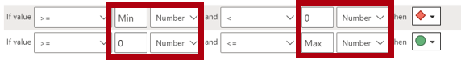

---
lab:
  title: Mejora de los diseños de informes de Power BI
  module: Enhance Power BI report designs for the user experience
---

# Mejora del diseño de informes de Power BI

## Caso de laboratorio

En este laboratorio, mejorarás el informe de _Análisis de ventas_ con características de diseño avanzadas.

En este laboratorio, aprenderá a:

- Crear una página de obtención de detalles.
- Aplicar formato condicional.
- Crear y usar marcadores y botones.

**Este laboratorio debe durar unos 45 minutos**.

## Introducción

Para completar este ejercicio, abra primero un explorador web y escriba la siguiente URL para descargar el archivo ZIP:

`https://github.com/MicrosoftLearning/PL-300-Microsoft-Power-BI-Data-Analyst/raw/Main/Allfiles/Labs/09-enhance-power-bi-reports/09-enhanced-report.zip`

Extraiga el archivo en la carpeta **C:\Users\Student\Downloads\09-enhanced-report**.

Abra el archivo **09-Starter-Sales Analysis.pbix**.

> _**Nota**: Puede ignorar el inicio de sesión si selecciona **Cancelar**. Cierre todas las ventanas informativas que se abran. Si se le pide aplicar los cambios, seleccione **Aplicar más tarde**._

## Configuración de una página de obtención de detalles

En este ejercicio, creará una página y la configurará como una página de obtención de detalles. Cuando haya completado el diseño, la página tendrá un aspecto similar al siguiente:

1. Cree una nueva página y cámbiele el nombre como _Detalles del producto_.

1. Haga clic con el botón derecho en la pestaña de la página **Detalles del producto** y después seleccione **Ocultar página**.

    > _Los usuarios del informe no podrán ir directamente a la página de obtención de detalles. En su lugar, accederán a ellos desde objetos visuales en otras páginas. En el ejercicio final de este laboratorio aprenderá a obtener detalles de la página._

1. Debajo del panel **Visualizaciones**, en la sección **Obtener detalles**, agregue el campo `Product | Category`al cuadro **Agregue los campos de obtención de detalles aquí**.

    > _Los laboratorios usan una notación abreviada para hacer referencia a un campo. Tendrá este aspecto: `Product | Category`. En este ejemplo, `Product` es el nombre de la tabla y `Category` es el nombre del campo._

    

1. Para probar la página de obtención de detalles, en la tarjeta de filtro de obtención de detalles, seleccione _Bikes_ (Bicicletas).

    

1. En la parte superior izquierda de la página del informe, observe el botón de flecha.

    > _El diseñador de informes agrega automáticamente un botón de flecha cuando se agrega un campo al área de obtención de detalles. Permite a los usuarios del informe retroceder a la página desde la que han obtenido detalles._

1. Agregue un objeto visual **Tarjeta** a la página y, después, cambie el tamaño y colóquelo para ubicarlo a la derecha del botón y rellenar el ancho restante de la página.

    

    

1. Arrastre el campo `Product | Category` al objeto visual de tarjeta.

1. Configure las opciones de formato para el objeto visual para establecer la propiedad **Etiqueta de categoría** en **Desactivar**.

    

1. En la pestaña **General**, en la sección **Efectos**, establezca la propiedad color de fondo en un color gris claro (como _Blanco, 10% Oscuro_) para proporcionar contraste.

    

1. Agregue un objeto visual **Tabla** a la página y, después, cambie el tamaño y colóquelo para ubicarlo debajo del objeto visual de tarjeta y rellenar el espacio restante de la página.

    

    

1. Agregue los campos siguientes al objeto visual:

    - `Product | Subcategory`
    - `Product | Color`
    - `Sales | Quantity`
    - `Sales | Sales`
    - `Sales | Profit Margin`

1. Para configurar las opciones de formato del objeto visual, en la sección **Cuadrícula**, establezca la propiedad **tamaño de fuente global** en **20pt**.

    > _El diseño de la página de obtención de detalles está casi terminado. En el siguiente ejercicio mejorará la página con formato condicional._

## Adición de formato condicional

En este ejercicio, mejorará la página de obtención de detalles con formato condicional. Cuando haya completado el diseño, la página tendrá un aspecto similar al siguiente:

1. Seleccione el objeto visual de tabla. En **Columnas**, seleccione la flecha abajo en el campo **Margen de beneficio** y, a continuación, seleccione **Formato condicional > Iconos**.

    

1. En la ventana **Iconos: Margen de beneficio**, en la lista desplegable **Diseño de los iconos**, seleccione **A la derecha de los datos**.

    

1. Para eliminar la regla intermedia, a la derecha del triángulo amarillo, seleccione la **X**.

    

1. Configure la primera regla (el rombo de color rojo) de esta manera:

    - En el segundo control, quite el valor
    - En el tercer control, seleccione **Número**
    - En el quinto control, escriba **0**
    - En el sexto control, seleccione **Número**

1. Configure la segunda regla (el círculo de color verde) de esta manera:

    - En el segundo control, escriba **0**
    - En el tercer control, seleccione **Número**
    - En el quinto control, quite el valor
    - En el sexto control, seleccione **Número**

    

    > _Las reglas se pueden interpretar de la siguiente manera: mostrar un rombo de color rojo si el valor de margen de beneficio es menor que 0; de lo contrario, si el valor es mayor o igual a cero, mostrar un círculo de color verde._

1. En la ventana **Iconos – Margen de beneficio**, en la lista desplegable **Aplicar a**, seleccione **Valores y totales**.

    

1. Seleccione **Aceptar**.

1. En el objeto visual de tabla, compruebe que se muestran los iconos correctos.

    

1. Configure el formato condicional de color de fondo para el campo **Color**.

1. En la ventana **Color de fondo: Color**, en la lista desplegable **Estilo de formato**, seleccione **Valor de campo**.

    

1. En la lista desplegable **¿En qué campo deberíamos basar esto?** en el grupo _Todos los datos_, seleccione el campo `Product | Formatting | Background Color Format`.

    

1. Repita los pasos anteriores para configurar el formato condicional de color de fuente para el campo **Color**, mediante el campo `Product | Formatting | Font Color Format`.

 > _Puede que recuerde que los colores de fondo y fuente se crearon a partir del archivo **ColorFormats.csv** en el laboratorio **Preparación de datos de Power BI Desktop** y, después, se integraron en la consulta **Producto** en el laboratorio **Carga de datos en Power BI Desktop**._

## Adición de marcadores y botones

En este ejercicio, mejorará la página _Mi rendimiento_ con botones, lo que permite al usuario del informe seleccionar el tipo de objeto visual que se va a mostrar. Cuando haya completado el diseño, la página tendrá un aspecto similar al siguiente:

1. Vaya a la página _Mi rendimiento_.

1. En la ficha de cinta **Ver**, desde el grupo **Mostrar paneles**, seleccione **Marcadores**.

    

1. En la ficha de cinta **Ver**, desde el grupo **Mostrar paneles**, seleccione **Selección**.

    

1. En el panel **Selección**, situado junto a uno de los elementos _Ventas y destino por mes_, seleccione el icono de ojo para ocultar el objeto visual.

    

1. En el panel **Marcadores**, haga clic en **Agregar**.

    

    > _Sugerencia: Para cambiar el nombre del marcador, haga doble clic en él._

1. Si el gráfico visible es el gráfico de barras, cambie el nombre del marcador por _Gráfico de barras ACTIVADO_, de lo contrario cámbielo por _Gráfico de columnas ACTIVADO_.

1. Para editar el marcador, en el panel **Marcadores**, desplace el cursor sobre el marcador, seleccione los puntos suspensivos y, a continuación, seleccione **Datos**.

    > _Deshabilitar la opción **Datos** significa que el marcador no usará el estado de filtro actual. Esto es importante porque, de lo contrario, el marcador se bloqueará permanentemente en el filtro aplicado actualmente por la segmentación Año._

    

1. Para actualizar el marcador, seleccione los puntos suspensivos de nuevo y, a continuación, seleccione **Actualizar**.

    > _En los pasos siguientes, creará y configurará un segundo marcador para mostrar el segundo objeto visual._

1. En el panel **Selección**, alterne la visibilidad de los dos elementos _Ventas y destino por mes_.

    > _En otras palabras, oculte el objeto visual visible y haga visible el objeto visual oculto._

    

1. Cree un segundo marcador y asígnele el nombre apropiado (_Gráfico de columnas ACTIVADO_ o _Gráfico de barras ACTIVADO)_.

    

1. Configure el segundo marcador para omitir los filtros (opción **Datos** desactivada) y actualizar el marcador.

1. En el panel **Selección**, para que los dos objetos visuales sean visibles, basta con mostrar el objeto visual oculto.

1. Cambie el tamaño y la posición de los dos objetos visuales para que rellenen la página debajo del objeto visual de tarjeta de varias filas y se superpongan por completo.

    > _Para seleccionar el objeto visual que está oculto, selecciónelo en el panel **Selección**._

    

1. En el panel **Marcadores**, seleccione cada uno de los marcadores y observe que solo uno de los objetos visuales es visible.

    > _La siguiente fase de diseño es agregar dos botones a la página. Estos botones permitirán al usuario del informe seleccionar los marcadores._

1. En la cinta **Insertar**, desde el grupo **Elementos**, seleccione **Botón** y, después, seleccione **En blanco**.

    

1. Coloque el botón directamente debajo de la segmentación _Año_.

1. Seleccione el botón y, después, en el panel de **botón Formato**, expanda la sección **Estilo** y, a continuación, establezca la sección **Texto** en **Activado**.

    

1. En la sección **Texto**, en el cuadro **Texto**, escriba _Gráfico de barras_.

1. Establezca la sección **Relleno** en **Activado** y, a continuación, establezca un color mediante un color complementario.

1. Establezca la sección **Acción** en **Activado** y, a continuación, establezca la propiedad **Type** en **Bookmark**.

1. Seleccione **Botón** y establezca la propiedad **Acción** en **Activado**.

1. Expanda la sección **Acción** y, después, establezca la lista desplegable **Tipo** en **Marcador**.

1. En la lista desplegable **Marcador**, seleccione **Gráfico de barras ACTIVADO**.

    

1. Cree una copia del botón mediante copiar y pegar y, después, configure el botón nuevo de la siguiente manera:

    > _Sugerencia: Los comandos de acceso directo para copiar y pegar son **Ctrl+C** seguido de **Ctrl+V**._

    - Establezca el texto del botón en _Gráfico de columnas_.
    - Establezca el marcador de acción en **Gráfico de columnas ACTIVADO**.

    > _Ahora se ha completado el diseño del informe Sales Analysis._

## Publicación y exploración del informe

En este ejercicio, publicarás el informe en el servicio Power BI y explorarás el comportamiento del informe publicado.

> _**Nota**: Necesitará al menos una licencia **gratuita de Power BI** para publicar el informe. Abra el explorador Microsoft Edge e inicie sesión en `https://app.powerbi.com`. Cuando se le pida que resuelva un rompecabezas o que inicie una evaluación gratuita de Fabric, puede omitirlo y cerrar el explorador.

> _**Nota**: Puede revisar el resto del ejercicio, incluso si no tiene acceso al servicio Power BI para realizar las tareas directamente._

1. Seleccione la página _Información general_.

1. En la segmentación _Año_, seleccione **FY2020**.

1. En la segmentación _Región_, asegúrese de que no haya ninguna región seleccionada.

1. Guarde el archivo de Power BI Desktop.

1. En la pestaña de la cinta **Inicio**, en el grupo **Compartir**, seleccione **Publicar**.

    > _Si aún no ha iniciado sesión en Power BI Desktop, primero deberá iniciar sesión antes de publicar el informe._

    

1. En la ventana **Publicar en Power BI**, observe que _Mi área de trabajo_ esté seleccionado.

1. Para publicar el informe, elija **Seleccionar**. Espere hasta que finalice la publicación.

1. Cuando la publicación se realice correctamente, seleccione **Entendido**.

1. Cierre Power BI Desktop.

1. Abra el explorador Microsoft Edge y, a continuación, inicie sesión en `https://app.powerbi.com` (o use una sesión de explorador existente).

1. En la ventana del explorador, en el panel **Navegación** del servicio Power BI (situado a la izquierda, podría estar contraído), seleccione **Mi área de trabajo**.

1. Para explorar el informe, seleccione el informe _09-Starter-Sales Analysis_.

1. Para probar la característica de obtención de detalles, en la página _Información general_, en el objeto visual _Suma de cantidad por categoría_, haga clic con el botón derecho en la barra _Clothing_ (Ropa) y seleccione **Obtención de detalles | Detalles del producto**.

    

1. Observe que la página _Detalles del producto_ filtra los objetos visuales para _Clothing_.

1. Para volver a la página de origen, seleccione el botón de flecha en la esquina superior izquierda de la página.

1. Vaya a la página _Mi rendimiento_.

1. Seleccione cada uno de los botones y, después, observe que se muestra otro objeto visual.

## Laboratorio completado
