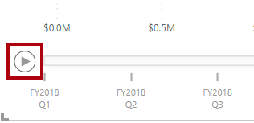

---
lab:
  title: "Realización de análisis en Power\_BI"
  module: Perform analytics in Power BI
---

# Realización de análisis en Power BI

## Caso de laboratorio

En este laboratorio, creará el informe **Exploración de ventas**.

En este laboratorio, aprenderá a:

- Crear gráficos de dispersión animados
- Usar un objeto visual para pronosticar valores

**Este laboratorio debe durar unos 30 minutos**.

## Introducción

Para completar este ejercicio, abre primero un explorador web e introduce la siguiente URL para descargar la carpeta zip:

`https://github.com/MicrosoftLearning/PL-300-Microsoft-Power-BI-Data-Analyst/raw/Main/Allfiles/Labs/10-perform-analytics-power-bi/10-perform-analytics.zip`

Extraiga la carpeta en la carpeta **C:\Users\Student\Downloads\10-perform-analytics**.

1. Abre el archivo **10-Starter-Sales Analysis.pbix**.

> ***Nota**: Puedes ignorar el inicio de sesión al seleccionar **Cancelar**. Cierra todas las ventanas informativas que se abran. Si se te pide que apliques los cambios, selecciona **Aplicar más tarde**.*

## Creación de un gráfico de dispersión animado

En esta tarea, creará un gráfico de dispersión que se puede animar.

1. Crea una página nueva y asígnale el nombre **Scatter Chart**.

1. Agregue un objeto visual **Gráfico de dispersión** a la página del informe y, después, cambie su tamaño y colóquelo para que ocupe toda la página.

    > *El gráfico se puede animar cuando se agrega un campo al apartado o área **Eje de reproducción**.*

     

     

1. Agregue los campos siguientes a los apartados o áreas del objeto visual:

    > *Los laboratorios utilizan una notación abreviada para hacer referencia a un campo, con este formato: **Reseller** **\|** **Business Type**. En este ejemplo, **Reseller** es el nombre de la tabla y **Business Type** es el nombre del campo.*

     - Eje X: **Ventas \| Ventas**
     - Eje Y: **Ventas \| Margen de beneficio**
     - Leyenda: **Revendedor \| Tipo de negocio**
     - Tamaño: **Ventas \| Cantidad**
     - Eje de reproducción: **Fecha \| Trimestre**

1. En el panel **Filtros**, agregue el campo **Producto \| Categoría** al apartado o área **Filtros** de esta página.

1. En la tarjeta de filtro, filtre por **Bicicletas**.

1. Para animar el gráfico, en la esquina inferior izquierda, seleccione **Reproducir**.

    

1. Vea todo el ciclo de animación desde **FY2018 Q1** hasta **FY2020 Q4**.

    > *El gráfico de dispersión permite comprender los valores de medida de manera simultánea: en este caso, cantidad de pedido, ingresos de ventas y margen de beneficios.*
    > 
    > *Cada burbuja representa un tipo de negocio de revendedor. Los cambios en el tamaño de la burbuja reflejan las cantidades de pedido mayores o menores. Los movimientos horizontales representan aumentos o disminuciones de los ingresos de ventas, y los movimientos verticales, aumentos o disminuciones de la rentabilidad.*

1. Cuando se detenga la animación, seleccione una de las burbujas para ver su seguimiento a lo largo del tiempo.

1. Mantenga el cursor sobre cualquier burbuja para mostrar una información sobre herramientas en la que se describen los valores de medida para el tipo de distribuidor en ese momento dado.

1. En el panel **Filtros**, filtre solo por **Clothing** (Ropa) y observe que genera un resultado muy diferente.

1. Guarde el archivo de Power BI Desktop.

## Creación de una previsión

En esta tarea creará una previsión para determinar los posibles ingresos de ventas futuros.

1. Agregue una nueva página y, después, cambie el nombre de la página por **Previsión**.

1. Agregue un objeto visual **Gráfico de líneas** a la página del informe y, después, cambie su tamaño y colóquelo para que ocupe toda la página.

     

     

1. Agregue los campos siguientes a los apartados o áreas del objeto visual:

     - Eje X: **Fecha \| Fecha**
     - Eje Y: **Ventas \| Ventas**

1. En el panel **Filtros**, agregue el campo **Fecha \| Año** al apartado o área **Filtros de esta página**.

1. En la tarjeta de filtro, filtre por dos años: **FY2019** y **FY2020**.

    > *Al realizar la previsión sobre una línea temporal, necesitará al menos dos ciclos (años) de datos para generar una previsión precisa y estable.*

1. Agregue también el campo **Producto \| Categoría** al apartado o área **Filtros de esta página** y filtre por **Bikes**.

1. Para agregar una previsión, debajo del panel **Visualizaciones**, seleccione el panel **Analytics** (Análisis).

     

1. Expanda la sección **Previsión**.

    > *Si la sección **Previsión** no está disponible, probablemente se deba a que el objeto visual no se ha configurado correctamente. La previsión solo está disponible cuando se cumplen dos condiciones: el eje tiene un único campo de tipo fecha y solo hay un campo de valor.*

1. **Active** la opción **Previsión**.

1. Configure las siguientes propiedades de previsión y elija **Aplicar**:

    - Unidades: **Meses**
    - **Predecir duración**: 1 mes
    - Estacionalidad: **365**
    - Intervalo de confianza: **80 %**

    

1. En el objeto visual de línea, observe que la previsión se ha ampliado un mes más allá de los datos del historial.

    > *El área de color gris representa la confianza. Cuanto mayor sea la confianza, menos estable y, por tanto, menos precisa será la previsión.*
    >
    > *Cuando conozca la duración del ciclo, en este caso anual, debe especificar los puntos de estacionalidad. A veces podría ser semanal (7) o mensual (30).*

1. En el panel **Filtros**, filtre solo por **Ropa** y observe que genera un resultado diferente.

## Laboratorio completado
