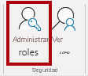
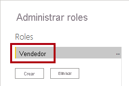
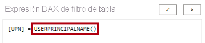
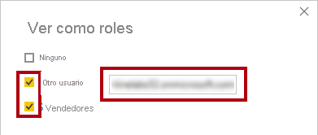
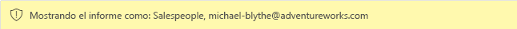
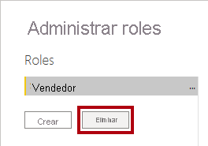

---
lab:
  course: PL-300
  title: Aplicación de seguridad de nivel de fila
  module: Enforce Row-Level Security
---

# **Aplicación de seguridad de nivel de fila**

## **Caso de laboratorio**

En este laboratorio, aplicará la seguridad de nivel de fila para asegurarse de que un vendedor solo pueda analizar los datos de ventas de las regiones que tenga asignadas.

En este laboratorio, aprenderá a:

- Aplicar seguridad de nivel de fila
- Elección entre métodos dinámicos y estáticos

**Este laboratorio debe durar unos 20 minutos**.

## **Introducción**

En esta tarea configurará el entorno para el laboratorio.

*Importante: Si ha realizado el laboratorio anterior (y lo ha completado correctamente) no realice esta tarea, continúe a partir de la siguiente.*

1. Abra Power BI Desktop.

    

    *Sugerencia: De forma predeterminada, se abre el cuadro de diálogo Introducción delante de Power BI Desktop. **Inicie sesión** y cierre la ventana emergente.*

1. Para abrir el archivo de inicio de Power BI Desktop, seleccione **Archivo > Abrir informe > Examinar informes**.

1. En la ventana **Abrir**, vaya a la carpeta **D:\Allfiles\Labs\10-create-power-bi-dashboard\Starter** y abra el archivo **Análisis de ventas**.

1. Cierre todas las ventanas informativas que se abran.

1. Fíjese en el mensaje de advertencia debajo de la cinta. *Este mensaje le avisa de que no se han aplicado consultas para cargar el archivo como tablas de modelo. Aplicará consultas más adelante en este laboratorio.*
    
    *Para descartar el mensaje de advertencia, seleccione la **X** situada a la derecha del mensaje de advertencia.*

1. Para crear una copia del archivo, vaya a **Archivo > Guardar como** y guárdelo en la carpeta **D:\Allfiles\MySolution**.

1. Si se le pide que aplique los cambios, seleccione **Aplicar más tarde**.

## **Aplicar seguridad de nivel de fila**

En esta tarea, aplicará seguridad de nivel de fila para asegurarse de que los vendedores solo puedan ver las ventas realizadas en sus regiones asignadas.

1. Cambie a la vista de datos.

   

1. En el panel **Campos**, seleccione la tabla **Vendedor (Rendimiento)** .

1. Revise los datos y verá que Michael Blythe (EmployeeKey 281) tiene un valor de UPN de **michael-blythe@adventureworks.com** .
    
    *Puede recordar que Michael Blythe está asignado a tres regiones de ventas: Noreste de EE. UU., Centro de EE. UU. y Sudeste de EE. UU.*

1. En la ficha de cinta **Modelado**, en el grupo **Seguridad**, seleccione **Administrar roles**.

    

1. En la ventana **Administrar roles**, seleccione **Crear**.

1. En el cuadro, reemplace el texto seleccionado por el nombre del rol: **Salespeople** y, después, presione **Entrar**.

   

1. A fin de asignar un filtro para la tabla **Vendedor (rendimiento)** , seleccione los puntos suspensivos (...) y, después, seleccione **Agregar filtro \| [UPN]** .

   

1. En el cuadro **Expresión DAX de filtro de tabla**, modifique la expresión reemplazando **Value** por **USERPRINCIPALNAME()** y, a continuación, seleccione **Guardar**.
    
    *USERPRINCIPALNAME() es una función de expresiones de análisis de datos (DAX) que devuelve el nombre del usuario autenticado. Significa que la tabla **Salesperson (Performance)** filtrará por el nombre principal de usuario (UPN) del usuario que realiza la consulta del modelo.*

   

1. Para probar el rol de seguridad, en la ficha de cinta **Modelado**, en el grupo **Seguridad**, seleccione **Ver como**.

   

1. En la ventana **Ver como roles**, compruebe el elemento **Otro usuario** y, después, en el cuadro correspondiente, escriba **michael-blythe@adventureworks.com** .

1. Compruebe el rol **Vendedor** y, a continuación, seleccione **Aceptar**.
    
    *Esta configuración da como resultado el uso del rol **Salespeople** y la suplantación del usuario con el nombre Michael Blythe.*

   

1. Fíjese en el mensaje emergente amarillo, encima de la página del informe, que describe el contexto de seguridad de la prueba.

   

1. En el objeto visual de tabla, observe que solo aparece el vendedor **Michael Blythe**.

   

1. Para detener las pruebas, en el lado derecho del mensaje emergente amarillo, seleccione **Detener visualización**.

   

1. Para eliminar el rol **Vendedor**, en la ficha de cinta **Modelado**, en el grupo **Seguridad**, seleccione **Administrar roles**.

   

1. En la ventana **Administrar roles**, seleccione **Eliminar**. Cuando se le pida que confirme la eliminación, seleccione **Sí, eliminar**.

   

### **Finalización**

En esta tarea, completará el laboratorio.

1. Seleccione **Guardar** y guarde el archivo de Power BI Desktop para finalizar el laboratorio.

*Nota: Cuando el archivo de Power BI Desktop se publique en el servicio Power BI, deberá completar una tarea posterior a la publicación para asignar las entidades de seguridad al rol **Vendedor**. No lo haremos en este laboratorio.*
