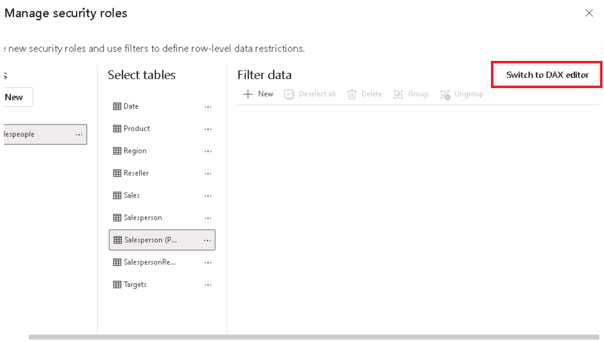
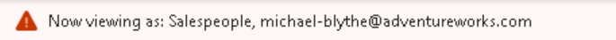
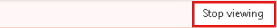
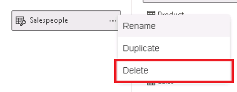

---
lab:
  title: Acceso seguro a los datos en Power BI
  module: Secure data access in Power BI
---

# Acceso seguro a los datos en Power BI

## Caso de laboratorio

En este laboratorio, aplicará la seguridad de nivel de fila para asegurarse de que un vendedor solo pueda analizar los datos de ventas de las regiones que tenga asignadas. Aplicará la seguridad de nivel de fila mediante el método dinámico.

**Este laboratorio debe durar unos 20 minutos**.

## Introducción

Para completar este ejercicio, abre primero un explorador web e introduce la siguiente URL para descargar la carpeta zip:

`https://github.com/MicrosoftLearning/PL-300-Microsoft-Power-BI-Data-Analyst/raw/Main/Allfiles/Labs/11-secure-data-access/11-secure-data.zip`

Extraiga la carpeta en la carpeta**C:\Users\Student\Downloads\11-secure-data**.

Abra el archivo**11-Starter-Sales Analysis.pbix**.

> _**Nota**: Es posible que vea un cuadro de diálogo de inicio de sesión a medida que se carga el archivo. Seleccione**Cancelar** para descartar el cuadro de diálogo de inicio de sesión. Cierre todas las ventanas informativas que se abran. Si se le pide aplicar los cambios, seleccione**Aplicar más tarde**._

## Aplicar seguridad de nivel de fila

En esta tarea, aplicará seguridad de nivel de fila para asegurarse de que los vendedores solo puedan ver las ventas realizadas en sus regiones asignadas.

1. Cambia a la**vista Tabla**.

   

1. En el panel**Campos**, seleccione la tabla**Vendedor (Rendimiento)** .

1. Revise los datos y verá que Michael Blythe (EmployeeKey 281) tiene un valor de UPN de**`michael-blythe@adventureworks.com`** .
    
    > *Puede recordar que Michael Blythe está asignado a tres regiones de ventas: Noreste de EE. UU., Centro de EE. UU. y Sudeste de EE. UU.*

1. En la ficha de cinta**Inicio**, en el grupo**Seguridad**, selecciona**Administrar roles**.

    

1. En la ventana**Administrar roles de seguridad**, en la sección**Roles**, selecciona**Nuevo**.

1. En el cuadro, reemplace el texto seleccionado por el nombre del rol:**Salespeople** y, después, presione**Entrar**.

   

1. Para asignar un filtro, selecciona la tabla**Comercial (Rendimiento)** y, a continuación, selecciona**Cambiar al editor de DAX** en la sección**Filtrar datos** .

   

1. En el editor de DAX, escribe la siguiente expresión:

    ```DAX
    [UPN] = USERPRINCIPALNAME()
    ```

   

    > *USERPRINCIPALNAME() es una función de expresiones de análisis de datos (DAX) que devuelve el nombre del usuario autenticado. Significa que la tabla**Salesperson (Performance)** filtrará por el nombre principal de usuario (UPN) del usuario que realiza la consulta del modelo.*

1. Selecciona**Guardar** y**Cerrar**.

1. Para probar el rol de seguridad, en la ficha de cinta**Inicio** del grupo**Seguridad**, selecciona**Ver como**.

   

1. En la ventana**Ver como roles**, compruebe el elemento**Otro usuario** y, después, en el cuadro correspondiente, escriba**`michael-blythe@adventureworks.com`** .

1. Compruebe el rol**Vendedor** y, a continuación, seleccione**Aceptar**.
    
    > *Esta configuración da como resultado el uso del rol**Salespeople** y la suplantación del usuario con el nombre Michael Blythe.*

   

1. Fíjese en el mensaje emergente amarillo, encima de la página del informe, que describe el contexto de seguridad de la prueba.

   

1. En el objeto visual de tabla, observe que solo aparece el vendedor**Michael Blythe**.

   

1. Para detener las pruebas, en el lado derecho del mensaje emergente amarillo, seleccione**Detener visualización**.

   

1. Para eliminar el rol**Comerciales**, en la ficha de cinta**Inicio**, en el grupo**Seguridad**, selecciona**Administrar roles**.

   

1. En la ventana**Administrar roles de seguridad**, selecciona los puntos suspensivos (...) en el rol**Comerciales** y selecciona**Eliminar**. Cuando se le pida que confirme la eliminación, seleccione**Sí, eliminar**.

   

*Nota: Cuando el archivo de Power BI Desktop se publique en el servicio Power BI, deberá completar una tarea posterior a la publicación para asignar las entidades de seguridad al rol**Vendedor**. No lo haremos en este laboratorio.*

## Laboratorio completado

Puede optar por guardar el informe de Power BI, aunque no es necesario para este laboratorio. 

1. Cierre la ventana del explorador de Microsoft Edge.
1. En Power BI Desktop, vaya al menú **"Archivo"** en la esquina superior izquierda y seleccione **"Guardar como"**. 
1. Seleccione**Examinar este dispositivo**.
1. Seleccione la carpeta donde desea guardar el archivo y asígnele un nombre descriptivo. 
1. Seleccione el botón**Guardar** para guardar el informe como un archivo .pbix. 
1. Si aparece un cuadro de diálogo en el que se le pide que aplique los cambios pendientes en la consulta, seleccione**Aplicar**.
1. Cierre Power BI Desktop.
